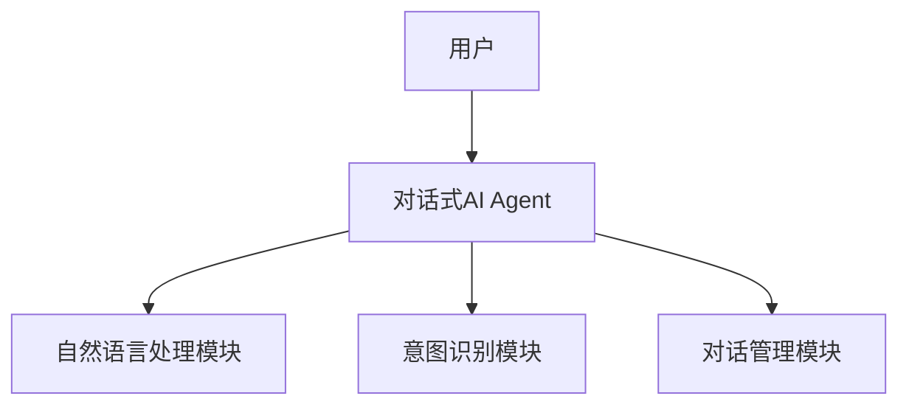
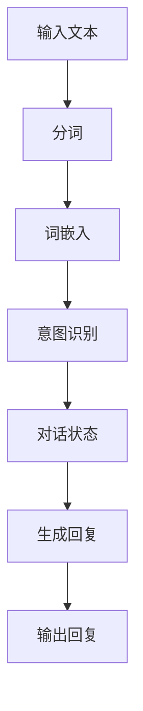
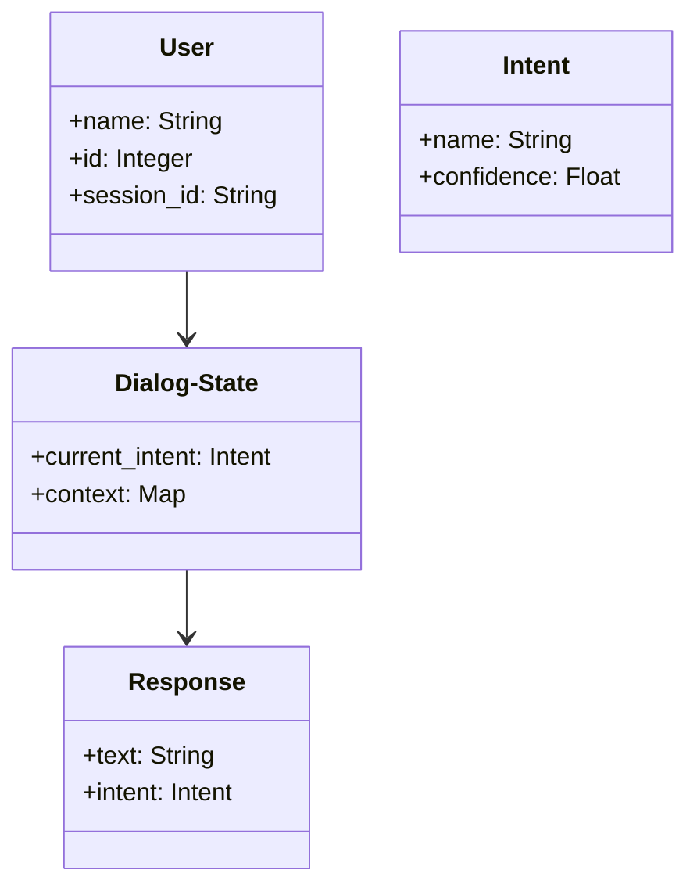
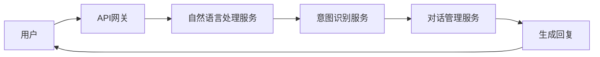
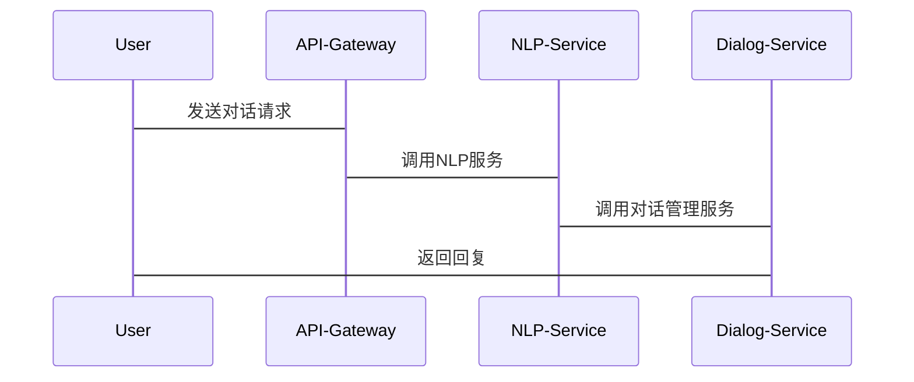

                 


# 对话式AI Agent：提升用户交互体验

## 关键词：对话式AI，自然语言处理，用户体验优化，人机交互，机器学习

## 摘要：对话式AI Agent作为人机交互的重要形式，通过自然语言处理技术，能够显著提升用户的交互体验。本文将从对话式AI Agent的核心概念、算法原理、系统架构到项目实战，全面解析如何设计和优化对话式AI Agent，以实现更自然、智能、高效的用户交互体验。

---

## 第一部分: 对话式AI Agent基础

## 第1章: 对话式AI Agent概述

### 1.1 对话式AI Agent的定义与背景

#### 1.1.1 对话式AI Agent的定义
对话式AI Agent（Conversational AI Agent）是一种能够理解和生成自然语言的智能系统，通过文本或语音与用户进行交互，提供信息查询、任务执行、情感陪伴等服务。它结合了自然语言处理（NLP）、机器学习和对话管理等技术，能够实现类似人类的对话体验。

#### 1.1.2 对话式AI Agent的发展背景
随着人工智能技术的快速发展，对话式AI Agent逐渐从简单的关键词匹配向深度理解和生成转变。现代对话式AI Agent能够处理复杂的上下文关系、意图识别和多轮对话，广泛应用于智能音箱、智能手机、客户服务系统等领域。

#### 1.1.3 对话式AI Agent的应用场景
- 智能助手（如Siri、Alexa）
- 客户服务机器人
- 智能教育辅助系统
- 健康咨询助手
- 娱乐互动机器人

### 1.2 对话式AI Agent的核心概念

#### 1.2.1 对话式AI Agent的交互模型
对话式AI Agent的交互模型包括输入处理、意图识别、对话生成和反馈优化四个主要阶段。

#### 1.2.2 对话式AI Agent的意图识别
意图识别是通过分析用户输入的文本或语音，确定用户的意图或需求。常见的意图识别方法包括基于规则的方法、统计模型和深度学习模型。

#### 1.2.3 对话式AI Agent的对话上下文管理
对话上下文管理是指系统在对话过程中维护当前对话的状态，包括用户的历史输入、系统生成的回复以及对话的主题等。良好的上下文管理能够提高对话的连贯性和用户体验。

---

## 第2章: 对话式AI Agent的核心概念与联系

### 2.1 对话式AI Agent的核心原理

#### 2.1.1 对话式AI Agent的交互模型
对话式AI Agent的交互模型包括以下几个关键步骤：
1. 用户输入：用户通过文本或语音向系统发送请求。
2. 输入处理：系统对用户输入进行预处理，包括分词、词性标注等。
3. 意图识别：系统分析用户的输入，识别出用户的意图或需求。
4. 对话生成：系统根据用户的意图和上下文生成回复。
5. 反馈优化：系统根据用户的反馈优化对话过程。

#### 2.1.2 对话式AI Agent的意图识别
意图识别是对话式AI Agent的核心任务之一。通过分析用户的输入，系统能够确定用户的意图，例如“查询天气”、“预订机票”等。

#### 2.1.3 对话式AI Agent的自然语言理解
自然语言理解是对话式AI Agent实现意图识别和对话生成的基础。通过自然语言处理技术，系统能够理解和解析用户的输入，生成符合用户需求的回复。

### 2.2 对话式AI Agent的实体关系图



### 2.3 对话式AI Agent的算法流程图



---

## 第3章: 对话式AI Agent的算法原理

### 3.1 自然语言处理基础

#### 3.1.1 词嵌入与文本表示
词嵌入是一种将词语映射到低维连续向量空间的技术。常用的词嵌入方法包括Word2Vec、GloVe和FastText。

#### 3.1.2 语言模型与序列模型
语言模型通过概率分布的方式预测下一个词，常用的序列模型包括循环神经网络（RNN）和长短期记忆网络（LSTM）。

#### 3.1.3 注意力机制与Transformer模型
注意力机制是一种用于关注输入序列中重要部分的技术。Transformer模型通过自注意力机制实现了高效的并行计算。

### 3.2 对话式AI Agent的数学模型

#### 3.2.1 概率语言模型
$$ P(w_1, w_2, ..., w_n) = \prod_{i=1}^n P(w_i | w_{i-1}) $$

#### 3.2.2 Transformer模型的解码器
$$ \text{Decoder}(x) = \text{Self-attention}(x) \rightarrow \text{FFN}(x) $$

---

## 第4章: 对话式AI Agent的系统架构设计

### 4.1 问题场景介绍
对话式AI Agent的系统架构设计需要考虑高可用性、可扩展性和安全性。系统需要能够支持大量的并发用户，并且能够快速响应用户的请求。

### 4.2 系统功能设计

#### 4.2.1 领域模型设计


#### 4.2.2 系统架构设计


### 4.3 系统接口设计
- 用户输入接口：`POST /api/v1/dialog`
- 意图识别接口：`POST /api/v1/intent`
- 对话管理接口：`POST /api/v1/dialog-state`

### 4.4 系统交互设计


---

## 第5章: 对话式AI Agent的项目实战

### 5.1 环境安装

```bash
pip install transformers torch numpy
```

### 5.2 系统核心实现源代码

```python
import torch
from transformers import AutoTokenizer, AutoModelForSequenceClassification

class Dialog-Agent:
    def __init__(self):
        self.tokenizer = AutoTokenizer.from_pretrained('bert-base-uncased')
        self.model = AutoModelForSequenceClassification.from_pretrained('bert-base-uncased')

    def process_input(self, input_text):
        inputs = self.tokenizer.encode_plus(input_text, return_tensors='pt', padding=True, truncation=True)
        with torch.no_grad():
            outputs = self.model(**inputs)
        return outputs

    def generate_response(self, input_text):
        # 实现意图识别和对话生成逻辑
        pass
```

### 5.3 案例分析与详细解读
以客服对话系统为例，展示对话式AI Agent如何通过意图识别和对话管理，实现高效的用户支持。

### 5.4 项目小结
通过本章的项目实战，读者能够理解对话式AI Agent的实现过程，并掌握从环境安装到代码实现的完整流程。

---

## 第6章: 对话式AI Agent的最佳实践

### 6.1 小结
对话式AI Agent的设计与优化需要结合自然语言处理、机器学习和系统架构等多种技术。

### 6.2 注意事项
- 对话式AI Agent的设计需要考虑用户体验，确保回复的准确性和及时性。
- 系统架构设计需要考虑高可用性和可扩展性。
- 对话式AI Agent的训练数据需要多样化，以提高模型的泛化能力。

### 6.3 拓展阅读
- 《Deep Learning》（Ian Goodfellow）
- 《自然语言处理入门》（张辉）
- 《对话式AI Agent实战》（李俊）

---

## 作者：AI天才研究院 & 禅与计算机程序设计艺术

---

通过本文的系统讲解，读者可以全面理解对话式AI Agent的设计与优化，并能够实际应用这些技术提升用户的交互体验。

