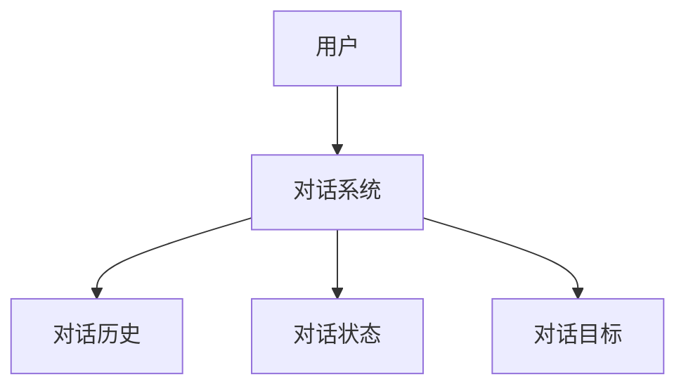
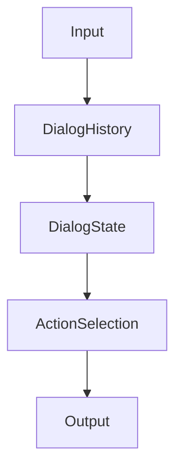
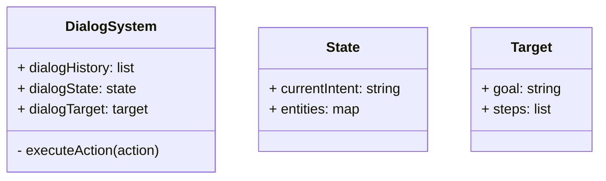
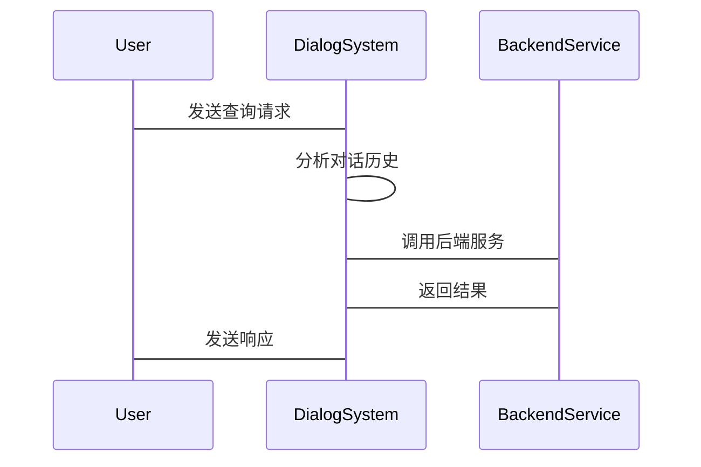

                 


# 对话管理：设计流畅的人机交互体验

> 关键词：对话管理，人机交互，自然语言处理，用户体验，系统设计，算法优化

> 摘要：对话管理是实现流畅人机交互的核心技术，本文从基础概念到算法实现，系统性地探讨对话管理的设计与优化，包括对话状态、历史、目标的管理，基于规则、统计和深度学习的对话管理算法，以及系统架构设计与项目实战，帮助读者掌握设计流畅人机交互体验的关键方法。

---

## 第一部分: 对话管理基础与背景

### 第1章: 对话管理概述

#### 1.1 对话管理的定义与背景

##### 1.1.1 对话管理的定义
对话管理（Dialogue Management）是指在人机交互过程中，系统根据当前对话状态、历史信息和用户需求，生成合适的响应并控制对话流程的过程。它是自然语言处理（NLP）和人工智能（AI）领域的重要技术，广泛应用于智能客服、语音助手、聊天机器人等场景。

##### 1.1.2 对话管理的应用领域
对话管理技术在多个领域有广泛应用：
- **智能客服**：通过对话系统解决用户问题，提升服务效率。
- **语音助手**：如Siri、Alexa等，通过语音交互提供服务。
- **聊天机器人**：如微信机器人、在线客服等，提供实时交互体验。
- **教育科技**：智能辅导系统通过对话与学生互动，提供个性化教学。

##### 1.1.3 对话管理的技术发展
对话管理技术经历了三个主要阶段：
1. **基于规则的对话管理**：通过预定义的规则和脚本控制对话流程，适用于简单的场景。
2. **基于统计的对话管理**：利用概率模型（如马尔可夫链）分析对话历史，预测下一步动作。
3. **基于深度学习的对话管理**：通过神经网络模型（如循环神经网络RNN、Transformer）学习对话模式，生成更自然的响应。

#### 1.2 对话管理的核心问题

##### 1.2.1 用户需求的识别与解析
对话管理的第一步是准确理解用户的需求。这包括：
- **意图识别**：确定用户的对话目标，如“查询天气”、“预订机票”等。
- **实体识别**：提取对话中的关键信息，如时间、地点、人物等。

##### 1.2.2 对话流程的规划与控制
对话管理需要规划对话流程，并根据实时反馈调整对话策略。这包括：
- **对话状态跟踪**：记录当前对话的状态，如用户的需求、已提供的信息等。
- **对话历史记录**：保存之前的对话内容，用于后续的上下文理解。
- **对话目标设定**：明确对话的最终目标，并制定实现目标的步骤。

##### 1.2.3 对话系统的优化与评估
对话系统的优化与评估是确保用户体验的关键。这包括：
- **性能优化**：通过改进算法或调整参数提升对话系统的响应速度和准确性。
- **用户满意度评估**：通过收集用户反馈，分析对话系统的用户体验，如满意度、效率等。

### 第2章: 对话管理的核心概念与联系

#### 2.1 对话管理的核心原理

##### 2.1.1 对话状态的表示与更新
对话状态是对话管理的核心要素，通常用状态向量表示。状态向量包含当前对话的相关信息，如用户意图、已提供的信息等。状态的更新基于用户的输入和对话历史。

##### 2.1.2 对话历史的记录与分析
对话历史是对话管理的重要资源，用于上下文理解。通过分析对话历史，系统可以更好地理解用户的当前需求，并生成合适的响应。

##### 2.1.3 对话目标的设定与实现
对话目标是对话管理的最终目标，如解决问题、提供信息等。对话系统的策略生成依赖于对话目标的设定。

#### 2.2 对话管理模型的分类与对比

##### 2.2.1 基于规则的对话管理模型
基于规则的模型通过预定义的规则和脚本控制对话流程。优点是简单易懂，适用于规则明确的场景。缺点是灵活性较差，难以应对复杂场景。

##### 2.2.2 基于统计的对话管理模型
基于统计的模型利用概率模型分析对话历史，预测下一步动作。优点是能够处理一定复杂性，缺点是依赖于历史数据的质量和数量。

##### 2.2.3 基于深度学习的对话管理模型
基于深度学习的模型通过神经网络学习对话模式，生成更自然的响应。优点是能够处理复杂的对话场景，缺点是需要大量数据和计算资源。

#### 2.3 对话管理的实体关系图



---

## 第三部分: 对话管理的算法与实现

### 第3章: 对话管理算法原理

#### 3.1 对话管理的算法分类

##### 3.1.1 基于规则的对话管理算法
基于规则的算法通过预定义的规则生成对话响应。例如，当用户输入“我想预订机票”，系统根据规则生成相应的查询请求。

##### 3.1.2 基于统计的对话管理算法
基于统计的算法利用概率模型预测对话下一步动作。例如，使用马尔可夫链模型预测用户下一步可能输入的内容。

##### 3.1.3 基于深度学习的对话管理算法
基于深度学习的算法通过神经网络学习对话模式。例如，使用Transformer模型生成对话响应。

#### 3.2 基于深度学习的对话管理算法

##### 3.2.1 模型输入与输出
模型输入包括对话历史和当前输入，输出是对话响应。

##### 3.2.2 对话策略的优化
对话策略的优化通过强化学习实现，系统通过与环境互动，不断调整策略以提高奖励。

##### 3.2.3 基于强化学习的对话管理
强化学习通过奖励机制优化对话策略。例如，当用户对响应满意时，系统获得正向奖励，反之则获得负向奖励。

#### 3.3 对话管理算法的实现流程



---

### 第4章: 对话管理的数学模型与公式

#### 4.1 对话状态表示的数学模型
状态向量表示为：
$$ S = [s_1, s_2, ..., s_n] $$
其中，$s_i$ 表示第i个状态特征。

#### 4.2 对话动作选择的优化模型
动作选择的优化目标是最大化奖励：
$$ \theta = \arg \max \mathbb{E}[R] $$
其中，$\theta$ 是模型参数，$R$ 是奖励函数。

#### 4.3 基于概率的对话管理模型
对话历史的概率表示为：
$$ P(h_t| h_{t-1}, a_{t-1}) $$

---

## 第四部分: 系统分析与架构设计

### 第5章: 系统分析与架构设计方案

#### 5.1 问题场景介绍
以智能客服系统为例，用户通过对话系统查询订单状态，系统需要理解用户需求，调用后端服务获取信息，并生成响应。

#### 5.2 领域模型设计



#### 5.3 系统架构设计


#### 5.4 系统接口设计
系统接口包括：
- `get_dialog_history()`: 获取对话历史
- `update_dialog_state()`: 更新对话状态
- `generate_response()`: 生成对话响应

#### 5.5 系统交互流程



---

## 第五部分: 项目实战

### 第6章: 智能客服系统对话管理实现

#### 6.1 环境安装
安装所需的库：
```bash
pip install numpy matplotlib scikit-learn
```

#### 6.2 核心代码实现

```python
class DialogManager:
    def __init__(self):
        self.dialog_history = []
        self.dialog_state = {}

    def update_dialog_history(self, utterance):
        self.dialog_history.append(utterance)

    def update_dialog_state(self, state):
        self.dialog_state.update(state)

    def generate_response(self):
        # 简单示例：基于规则生成响应
        last_utterance = self.dialog_history[-1]
        if "查询订单" in last_utterance:
            return "您的订单号是12345，状态为已发货。"
        else:
            return "抱歉，我未能理解您的请求。"
```

#### 6.3 功能分析与案例讲解
通过代码实现对话管理的核心功能，包括对话历史记录、对话状态更新和响应生成。

#### 6.4 项目总结
对话管理的实现需要结合算法和系统设计，确保用户体验流畅。

---

## 第六部分: 最佳实践与扩展阅读

### 第7章: 对话管理最佳实践

#### 7.1 小结
对话管理是实现流畅人机交互的核心技术，需要结合算法和系统设计。

#### 7.2 注意事项
- 确保对话系统的可解释性
- 处理对话中的不确定性
- 提供良好的错误处理机制

#### 7.3 拓展阅读
推荐阅读《自然语言处理入门》和《深度学习入门》。

---

## 作者：AI天才研究院/AI Genius Institute & 禅与计算机程序设计艺术/Zen And The Art of Computer Programming

