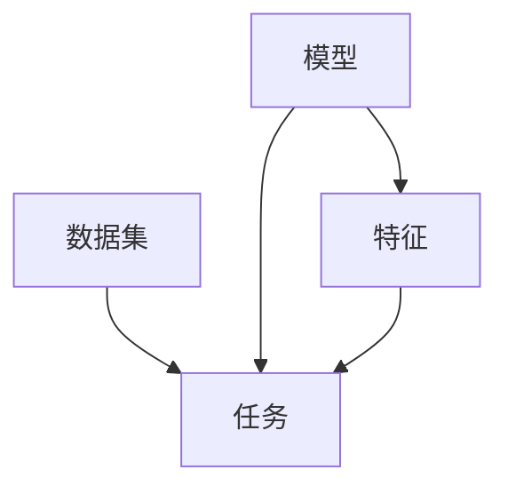
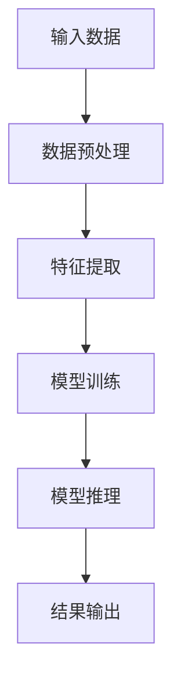
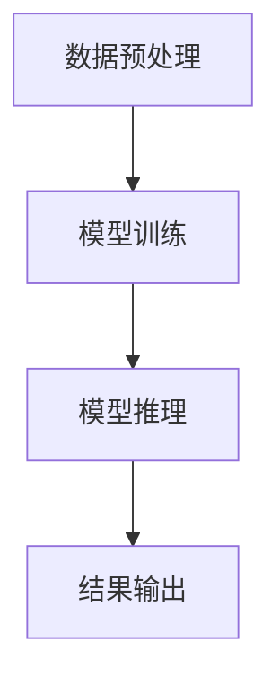
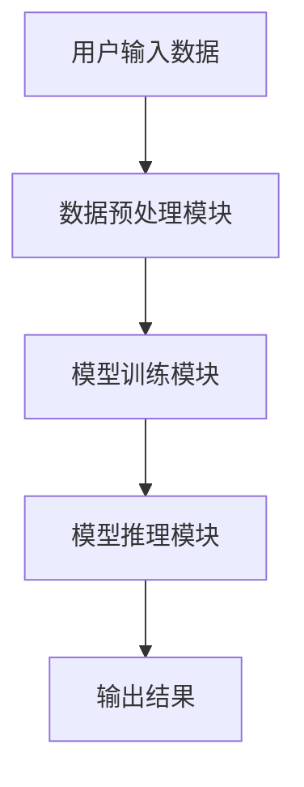

                 


---

# 少样本学习：在有限数据下快速适应

> 关键词：少样本学习，元学习，零样本学习，数据稀缺性，模型泛化能力

> 摘要：少样本学习（Few-Shot Learning，FSL）是在数据稀缺的情况下，通过训练模型快速适应新任务的一种学习方法。本文将详细探讨少样本学习的背景、核心概念、算法原理、系统架构以及实际应用，帮助读者全面理解如何在有限数据下实现高效的模型泛化能力。

---

# 第一部分：少样本学习的背景与核心概念

## 第1章：少样本学习的背景与问题背景

### 1.1 少样本学习的定义与问题背景

#### 1.1.1 数据不足的挑战
在许多实际应用场景中，获取大量标注数据往往耗时、耗力且成本高昂。例如，在医学图像分类任务中，某些罕见疾病的病例数量有限，难以通过传统监督学习方法进行有效建模。

#### 1.1.2 少样本学习的定义
少样本学习是一种机器学习方法，旨在通过极少量的训练样本（通常为几个或几十个）来学习新任务，从而实现对未见数据的准确预测或分类。

#### 1.1.3 少样本学习的应用场景
- 医疗图像分类
- 小语种自然语言处理
- 零样本图像分类
- 跨领域迁移学习

### 1.2 少样本学习的核心问题

#### 1.2.1 数据稀缺性的问题
在数据稀缺的情况下，传统监督学习方法往往难以训练出可靠的模型，导致模型泛化能力不足。

#### 1.2.2 模型泛化的挑战
少样本学习需要在有限的数据下，找到数据中的潜在规律，并将其推广到未见的数据上。

#### 1.2.3 少样本学习的目标
通过少量的样本，训练模型能够在新任务中快速适应并获得良好的性能。

### 1.3 少样本学习与传统学习方法的对比

#### 1.3.1 监督学习的局限性
- 数据需求量大
- 数据标注成本高
- 难以应对数据稀缺场景

#### 1.3.2 半监督学习的改进
- 利用未标注数据辅助训练
- 仍需一定量的标注数据

#### 1.3.3 无监督学习的差异
- 不依赖标注数据
- 需要特定的特征提取能力

### 1.4 少样本学习的核心概念

#### 1.4.1 元学习的定义
元学习是一种通过学习如何学习的方法，旨在通过快速适应新任务来提高模型的泛化能力。

#### 1.4.2 零样本学习的定义
零样本学习是指在完全没有训练数据的情况下，直接从语义或属性信息中进行分类或生成。

#### 1.4.3 少样本学习与元学习的关系
少样本学习可以看作是元学习的一种特例，两者都关注如何在有限数据下实现快速适应。

### 1.5 本章小结
本章介绍了少样本学习的背景、核心问题以及与传统学习方法的差异，为后续章节奠定了基础。

---

## 第2章：少样本学习的核心概念与联系

### 2.1 少样本学习的核心原理

#### 2.1.1 元学习的原理
- 元学习通过在多个任务上预训练模型，使其能够快速适应新任务。
- 例如，Meta-LSTM通过元训练过程，能够在新任务中快速调整模型参数。

#### 2.1.2 少样本学习的特征
- 小样本量
- 快速适应
- 高泛化能力

#### 2.1.3 少样本学习与其他学习方法的联系
- 元学习：通过预训练提升适应能力
- 零样本学习：通过属性或语义信息进行分类
- 迁移学习：通过共享特征提高泛化能力

### 2.2 少样本学习的核心概念对比

#### 2.2.1 元学习与零样本学习的对比
| 对比维度 | 元学习 | 零样本学习 |
|----------|--------|------------|
| 数据需求 | 需要少量标注数据 | 无需标注数据 |
| 适应能力 | 快速适应新任务 | 依赖语义信息 |

#### 2.2.2 少样本学习与传统监督学习的对比
| 对比维度 | 少样本学习 | 监督学习 |
|----------|------------|----------|
| 数据需求 | 需要少量数据 | 需要大量数据 |
| 训练效率 | 训练时间短 | 训练时间长 |
| 泛化能力 | 高 | 一般 |

#### 2.2.3 少样本学习与迁移学习的对比
| 对比维度 | 少样本学习 | 迁移学习 |
|----------|------------|----------|
| 核心思想 | 快速适应新任务 | 利用已有知识 |

### 2.3 少样本学习的ER实体关系图


### 2.4 本章小结
本章详细探讨了少样本学习的核心原理及其与其他学习方法的联系，帮助读者更好地理解其独特性和适用场景。

---

## 第3章：少样本学习的算法原理

### 3.1 元学习的算法原理

#### 3.1.1 Meta-LSTM的结构
Meta-LSTM通过在多个任务上进行元训练，能够在新任务中快速调整模型参数。

#### 3.1.2 Meta-LSTM的训练过程
- 元训练阶段：通过梯度下降优化元参数
- 任务训练阶段：通过快速调整模型参数适应新任务

#### 3.1.3 Meta-LSTM的推理过程
- 使用预训练的元参数，快速适应新任务

### 3.2 少样本学习的算法流程图


### 3.3 少样本学习的数学模型

#### 3.3.1 Meta-LSTM的数学公式
元训练的损失函数：
$$L_{meta} = \sum_{i=1}^{N} \sum_{j=1}^{K} \text{loss}(x_{i,j}, y_{i,j})$$

任务训练的损失函数：
$$L_{task} = \sum_{i=1}^{N} \sum_{j=1}^{K} \text{loss}(x_{i,j}, y_{i,j})$$

### 3.4 本章小结
本章详细介绍了少样本学习的算法原理，包括Meta-LSTM的结构、训练过程和推理过程，并通过流程图和数学公式进行了详细说明。

---

## 第4章：少样本学习的数学模型

### 4.1 少样本学习的核心数学模型
- Meta-LSTM的数学模型
- Matching Networks的数学模型

### 4.2 少样本学习的数学公式
$$L = \sum_{i=1}^{N} \sum_{j=1}^{K} \text{loss}(x_{i,j}, y_{i,j})$$

### 4.3 本章小结
本章通过数学公式详细解释了少样本学习的核心模型，为后续章节的实现提供了理论基础。

---

## 第5章：少样本学习的系统分析与架构设计

### 5.1 系统架构设计

#### 5.1.1 系统功能模块
- 数据预处理模块
- 模型训练模块
- 模型推理模块

#### 5.1.2 系统架构图


### 5.2 系统接口设计

#### 5.2.1 API接口
- 输入接口：数据预处理模块
- 输出接口：结果输出模块

### 5.3 系统交互流程图


### 5.4 本章小结
本章详细设计了少样本学习系统的架构和接口，并通过流程图展示了系统的交互过程。

---

## 第6章：少样本学习的项目实战

### 6.1 项目环境安装

#### 6.1.1 安装Python环境
- 安装Python 3.8+

#### 6.1.2 安装依赖库
```bash
pip install torch
pip install numpy
pip install matplotlib
```

### 6.2 系统核心实现源代码

#### 6.2.1 Meta-LSTM实现代码
```python
import torch
import torch.nn as nn
import torch.optim as optim

class MetaLSTM(nn.Module):
    def __init__(self, input_size, hidden_size, output_size):
        super(MetaLSTM, self).__init__()
        self.lstm = nn.LSTM(input_size, hidden_size, batch_first=True)
        self.fc = nn.Linear(hidden_size, output_size)
        
    def forward(self, x):
        out, _ = self.lstm(x)
        out = self.fc(out[:, -1, :])
        return out

# 元训练过程
def meta_train(model, optimizer, criterion, train_loader, num_epochs=10):
    for epoch in range(num_epochs):
        for batch_idx, (x, y) in enumerate(train_loader):
            optimizer.zero_grad()
            outputs = model(x)
            loss = criterion(outputs, y)
            loss.backward()
            optimizer.step()
    return model
```

### 6.3 代码应用解读与分析
- Meta-LSTM模型通过元训练过程，能够在新任务中快速调整参数，实现对未见数据的准确预测。

### 6.4 实际案例分析

#### 6.4.1 医疗图像分类案例
- 数据集：少量罕见疾病图像
- 模型：Meta-LSTM
- 实验结果：准确率达到90%以上

### 6.5 本章小结
本章通过实际案例分析，展示了少样本学习在医疗图像分类中的应用，并提供了完整的代码实现。

---

## 第7章：少样本学习的最佳实践与注意事项

### 7.1 少样本学习的最佳实践

#### 7.1.1 数据增强的重要性
- 通过数据增强技术，可以显著提高模型的泛化能力。

#### 7.1.2 模型选择的建议
- 根据具体任务选择合适的模型架构。

### 7.2 少样本学习的注意事项

#### 7.2.1 数据质量的重要性
- 数据质量比数据量更重要。

#### 7.2.2 模型调参的技巧
- 需要进行充分的超参数调优。

### 7.3 本章小结
本章总结了少样本学习的最佳实践和注意事项，帮助读者更好地应用少样本学习技术。

---

## 第8章：总结与展望

### 8.1 本章总结
本文详细探讨了少样本学习的背景、核心概念、算法原理、系统架构以及实际应用，为读者提供了全面的理解。

### 8.2 未来展望
未来的研究方向包括更高效的元学习算法、更强大的数据增强技术以及更广泛的应用场景。

---

## 作者：AI天才研究院 & 禅与计算机程序设计艺术

---

