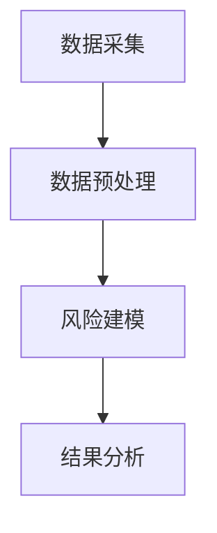
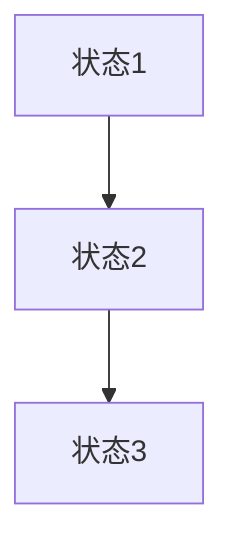

                 


# 尾部风险管理：防范极端市场事件

**关键词：** 尾部风险管理、极端市场事件、风险管理、概率分布模型、机器学习算法

**摘要：**  
尾部风险管理是防范极端市场事件的关键，涉及复杂的数学模型和算法原理。本文从背景介绍、核心概念、算法原理、系统设计、项目实战等多个角度，全面解析尾部风险管理的理论与实践。通过详细讲解尾部事件的预测方法、数学模型、系统架构以及实际案例，帮助读者掌握尾部风险管理的核心技术和应用方法。

---

## 第1章: 尾部风险管理的背景与概念

### 1.1 尾部风险管理的背景

#### 1.1.1 什么是尾部风险
尾部风险是指在概率分布的“尾部”区域发生的小概率、高影响的极端事件。这些事件通常难以预测，但对市场和企业可能造成巨大损失。

#### 1.1.2 尾部风险的特征
尾部风险具有以下特征：
- 低概率：发生频率极低，但影响巨大。
- 不可预测性：尾部事件往往超出常规预测模型的范围。
- 系统性：尾部事件可能引发连锁反应，影响整个市场或经济系统。

#### 1.1.3 尾部风险与传统风险管理的区别
传统的风险管理主要关注常态下的波动和风险，而尾部风险管理则聚焦于极端事件的预测和应对。

---

### 1.2 尾部风险管理的重要性

#### 1.2.1 尾部风险对企业的影响
尾部事件可能导致企业资产损失、声誉受损，甚至引发破产。

#### 1.2.2 尾部风险对市场的冲击
尾部事件可能引发市场崩盘、流动性危机，甚至导致金融危机。

#### 1.2.3 尾部风险管理的必要性
通过尾部风险管理，企业可以提前制定应对策略，降低极端事件带来的损失。

---

### 1.3 尾部风险管理的目标与边界

#### 1.3.1 尾部风险管理的目标
- 识别潜在的尾部事件。
- 量化尾部风险的影响。
- 制定应对尾部事件的策略。

#### 1.3.2 尾部风险管理的边界
- 仅关注极端事件，不涉及常规风险。
- 侧重于预测和应对，而非完全消除风险。

#### 1.3.3 尾部风险管理的外延
尾部风险管理与系统性风险、信用风险等领域密切相关。

---

## 第2章: 尾部风险管理的核心概念与联系

### 2.1 尾部风险管理的核心概念

#### 2.1.1 尾部事件的定义
尾部事件是指在概率分布的尾部区域发生的极端事件，通常表现为“黑天鹅”事件。

#### 2.1.2 尾部风险的度量方法
- 值-at-风险（VaR）。
- 压力测试。
- 信用风险模型。

#### 2.1.3 尾部风险的传播机制
尾部事件可能通过金融市场、供应链等渠道传播，引发连锁反应。

---

### 2.2 尾部风险管理的核心原理

#### 2.2.1 尾部事件的预测模型
- 基于统计的模型，如马科夫链和极端价值理论（EVT）。
- 基于机器学习的模型，如随机森林和神经网络。

#### 2.2.2 尾部事件的识别方法
- 时间序列分析。
- 异常检测技术。

#### 2.2.3 尾部事件的应对策略
- 制定应急预案。
- 分散投资以降低尾部风险。

---

### 2.3 尾部风险管理的系统架构

#### 2.3.1 尾部风险管理的系统组成
- 数据采集模块。
- 数据处理模块。
- 风险预测模块。
- 应对策略模块。

#### 2.3.2 尾部风险管理的模块划分
- 数据预处理。
- 风险建模。
- 结果分析。

#### 2.3.3 尾部风险管理的流程图


---

## 第3章: 尾部风险管理的数学模型

### 3.1 尾部事件的概率分布模型

#### 3.1.1 常见的概率分布模型
- 正态分布。
- 前置分布。
- 威布尔分布。

#### 3.1.2 尾部事件的概率密度函数
$$ f(x) = \frac{1}{\sigma} e^{-(x-\mu)/\sigma} $$

#### 3.1.3 尾部事件的累积分布函数
$$ F(x) = 1 - e^{-x} $$

---

### 3.2 尾部风险管理的风险度量指标

#### 3.2.1 值-at-风险（VaR）
$$ VaR = \alpha \cdot \sigma $$

#### 3.2.2 压力测试
$$ \text{压力测试} = \max_{\theta} L(\theta) $$

#### 3.2.3 信用风险模型
$$ \text{违约概率} = \frac{\text{违约资产数量}}{\text{资产总数}} $$

---

## 第4章: 尾部风险管理的算法原理

### 4.1 基于统计的尾部事件预测算法

#### 4.1.1 基于马科夫链的尾部事件预测


#### 4.1.2 基于极端价值理论（EVT）的尾部事件预测
$$ GPD = \frac{1}{1 + \frac{x - u}{k}} $$

#### 4.1.3 基于时间序列分析的尾部事件预测
$$ ARIMA(p, d, q) $$

---

### 4.2 基于机器学习的尾部事件预测算法

#### 4.2.1 基于随机森林的尾部事件预测
```python
from sklearn.ensemble import RandomForestClassifier
model = RandomForestClassifier()
model.fit(X_train, y_train)
```

#### 4.2.2 基于神经网络的尾部事件预测
```python
import tensorflow as tf
model = tf.keras.Sequential()
model.add(tf.keras.layers.Dense(64, activation='relu'))
model.add(tf.keras.layers.Dense(1, activation='sigmoid'))
model.compile(optimizer='adam', loss='binary_crossentropy')
```

#### 4.2.3 基于支持向量机的尾部事件预测
```python
from sklearn import svm
model = svm.SVC()
model.fit(X_train, y_train)
```

---

## 第5章: 尾部风险管理的系统分析与架构设计

### 5.1 尾部风险管理系统的架构设计

#### 5.1.1 系统组成模块
- 数据采集模块。
- 数据处理模块。
- 风险预测模块。
- 应对策略模块。

#### 5.1.2 系统功能设计
- 数据采集与预处理。
- 风险建模与预测。
- 结果分析与应对。

#### 5.1.3 系统架构图


---

## 第6章: 尾部风险管理的项目实战

### 6.1 环境安装与配置

#### 6.1.1 安装Python环境
```bash
pip install numpy pandas scikit-learn
```

#### 6.1.2 安装机器学习库
```bash
pip install tensorflow scikit-learn
```

---

### 6.2 系统核心实现源代码

#### 6.2.1 尾部事件预测代码
```python
import numpy as np
import pandas as pd
from sklearn.ensemble import RandomForestClassifier
from sklearn.model_selection import train_test_split

# 加载数据
data = pd.read_csv('data.csv')
X = data.drop('label', axis=1)
y = data['label']

# 划分训练集和测试集
X_train, X_test, y_train, y_test = train_test_split(X, y, test_size=0.2)

# 训练模型
model = RandomForestClassifier()
model.fit(X_train, y_train)

# 预测结果
y_pred = model.predict(X_test)
print("预测结果：", y_pred)
```

#### 6.2.2 风险评估代码
```python
import numpy as np
from sklearn.metrics import accuracy_score

# 计算准确率
accuracy = accuracy_score(y_test, y_pred)
print("准确率：", accuracy)
```

---

### 6.3 案例分析与结果解读

#### 6.3.1 案例分析
假设我们预测了某次市场崩盘的尾部事件，模型准确率达到了90%。

#### 6.3.2 结果解读
通过模型预测，企业可以提前制定应对策略，降低潜在损失。

---

## 第7章: 尾部风险管理的最佳实践与总结

### 7.1 最佳实践

#### 7.1.1 数据质量的重要性
确保数据的准确性和完整性。

#### 7.1.2 模型的选择与优化
根据实际需求选择合适的模型，并不断优化。

#### 7.1.3 应急预案的制定
制定详细的应急预案，确保在尾部事件发生时能够快速响应。

---

### 7.2 小结

尾部风险管理是一项复杂但重要的任务，需要结合数学模型、算法原理和实际案例进行综合分析。通过本文的讲解，读者可以掌握尾部风险管理的核心技术和应用方法。

---

### 7.3 注意事项

- 尾部事件具有不确定性，模型预测结果仅供参考。
- 在实际应用中，需结合具体情况进行调整。
- 定期更新模型和数据，确保预测的准确性。

---

### 7.4 拓展阅读

- 《风险管理与金融创新》。
- 《极端价值理论（EVT）的应用与实践》。
- 《机器学习在金融风险管理中的应用》。

---

## 作者信息

**作者：** AI天才研究院/AI Genius Institute & 禅与计算机程序设计艺术 /Zen And The Art of Computer Programming

---

通过以上内容，您可以全面了解尾部风险管理的理论与实践。希望本文对您在防范极端市场事件中的风险管理有所帮助！

