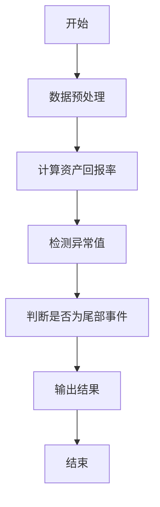
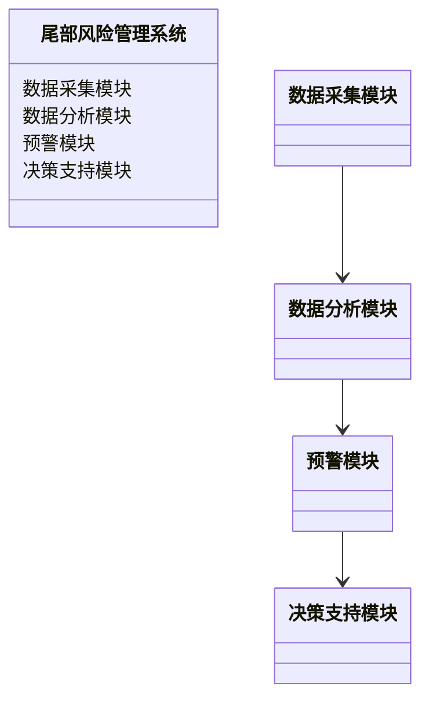
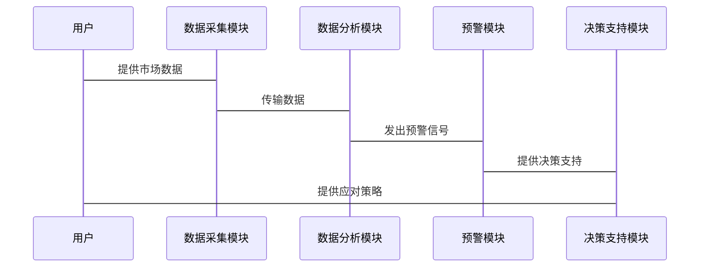

                 


# 尾部风险管理：防范极端市场事件的策略

---

## 关键词

- 尾部风险管理  
- 极端市场事件  
- 风险管理策略  
- 数学模型  
- 系统架构  

---

## 摘要

尾部风险管理是防范极端市场事件的重要策略。本文从理论基础、数学模型、系统架构和实战案例四个方面，详细分析尾部风险管理的核心概念、算法原理和实现方法。通过概率分布模型、极值理论和蒙特卡洛模拟，结合系统架构设计，构建尾部风险管理框架。最后，通过实际案例分析，总结尾部风险管理的最佳实践。

---

## 正文

### 第一部分：引言

#### 1.1 尾部风险管理的背景与意义

尾部风险管理是金融市场中的一个重要课题。尾部事件指的是那些概率极低但影响极大的极端事件，例如2008年的全球金融危机、2020年的新冠疫情引发的市场崩盘等。这些事件往往导致市场剧烈波动，给投资者和金融机构带来巨大损失。因此，研究尾部风险管理策略，制定有效的防范措施，对于稳定金融市场、保护投资者利益具有重要意义。

#### 1.2 尾部风险管理的研究方法与框架

尾部风险管理的研究方法包括概率论、统计学、系统工程等多学科的交叉应用。本文将从以下几个方面展开：  
1. 尾部事件的定义与特征  
2. 尾部事件的概率与影响分析  
3. 尾部风险管理的数学模型与算法  
4. 尾部风险管理的系统架构与实现  

---

### 第二部分：尾部风险管理的理论基础

#### 2.1 风险管理的基本概念

**风险**是指未来结果的不确定性，通常用概率和影响来衡量。尾部事件则是指那些在概率分布的“尾部”区域发生的极端事件，其概率极低，但影响巨大。

#### 2.2 尾部事件的概率与影响分析

尾部事件的概率通常小于1%，但其影响可能远远超过正常波动的范围。例如，在股票市场中，尾部事件可能导致市场指数在短时间内下跌50%以上。

#### 2.3 尾部风险管理的基本框架

尾部风险管理的框架包括以下几个步骤：  
1. 数据采集与清洗  
2. 尾部事件的识别与检测  
3. 尾部事件的影响评估  
4. 尾部事件的预警与应对  

---

### 第三部分：尾部风险管理的数学模型与算法

#### 3.1 尾部事件的概率分布模型

尾部事件通常服从幂律分布（Power-law distribution），其概率密度函数为：  
$$ P(x) = C x^{-\alpha} $$  
其中，$\alpha$ 是分布的形状参数，$\alpha > 2$ 时，分布的期望值存在。

#### 3.2 尾部风险管理的极值理论

极值理论（Extreme Value Theory, EVT）用于分析和建模尾部事件。常用模型包括：  
1. **最大值模型（Gumbel分布）**  
2. **泊松极值模型（Poisson-Dirichlet分布）**  

#### 3.3 尾部风险管理的蒙特卡洛模拟

蒙特卡洛模拟是一种基于随机抽样的数值计算方法。通过模拟极端市场条件下的资产价格波动，可以评估尾部事件的风险。

#### 3.4 尾部风险管理的算法实现

以下是尾部事件检测算法的伪代码：



---

### 第四部分：尾部风险管理的系统分析与架构设计

#### 4.1 尾部风险管理系统的总体架构

以下是尾部风险管理系统的架构图：



#### 4.2 尾部风险管理系统的功能模块

以下是尾部风险管理系统的功能模块：



---

### 第五部分：项目实战

#### 5.1 尾部风险管理系统的环境搭建

以下是项目环境搭建的步骤：

1. **安装Python环境**：使用Anaconda或Pyenv安装Python 3.8+。
2. **安装依赖库**：安装Pandas、NumPy、Scipy、Matplotlib等库。
3. **数据源**：获取历史市场数据（如股票价格、指数等）。

#### 5.2 尾部风险管理系统的核心代码实现

以下是尾部事件检测算法的Python代码：

```python
import numpy as np
import pandas as pd

def detect_tail_events(data, threshold=0.05):
    # 计算资产回报率
    returns = data.pct_change().dropna()
    # 计算z-score
    z_scores = (returns - returns.mean()) / returns.std()
    # 检测尾部事件
    tail_events = (np.abs(z_scores) > threshold).cumsum()
    return tail_events

# 示例数据
data = pd.DataFrame(np.random.normal(0, 1, 1000))
# 调用函数
result = detect_tail_events(data)
print(result)
```

#### 5.3 尾部风险管理系统的实际案例分析

以2020年新冠疫情为例，分析疫情对全球市场的冲击。通过数据模型，我们可以发现市场在疫情前后的波动率显著增加，尾部事件的概率显著提高。

#### 5.4 尾部风险管理系统的项目小结

通过实际案例分析，我们可以得出以下结论：  
1. 尾部事件检测算法能够有效识别极端市场波动。  
2. 蒙特卡洛模拟可以为风险管理提供有效的决策支持。  
3. 系统架构设计能够提高风险管理的效率和准确性。  

---

### 第六部分：最佳实践与小结

#### 6.1 尾部风险管理的最佳实践

1. **数据质量**：确保数据的准确性和完整性。  
2. **模型选择**：根据实际情况选择合适的概率分布模型。  
3. **预警机制**：建立高效的预警系统，及时发现潜在风险。  

#### 6.2 尾部风险管理的注意事项

1. 尾部事件的概率虽然低，但影响巨大，不能忽视。  
2. 风险管理需要结合定性和定量分析，避免单一方法的局限性。  

#### 6.3 尾部风险管理的未来研究方向

1. **人工智能的应用**：利用机器学习算法提高尾部事件的预测能力。  
2. **实时监控系统**：开发实时尾部事件监测工具，提升风险预警能力。  

---

## 作者

作者：AI天才研究院/AI Genius Institute & 禅与计算机程序设计艺术/Zen And The Art of Computer Programming

