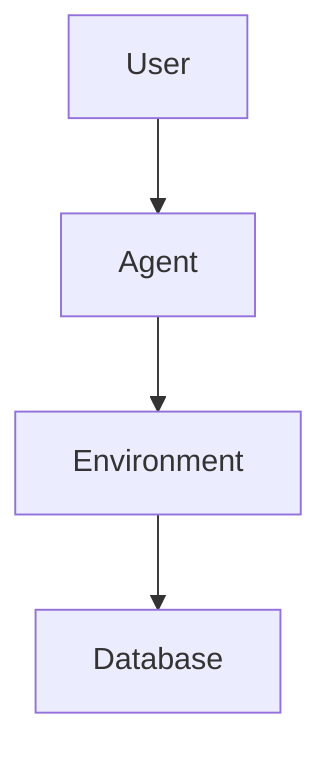
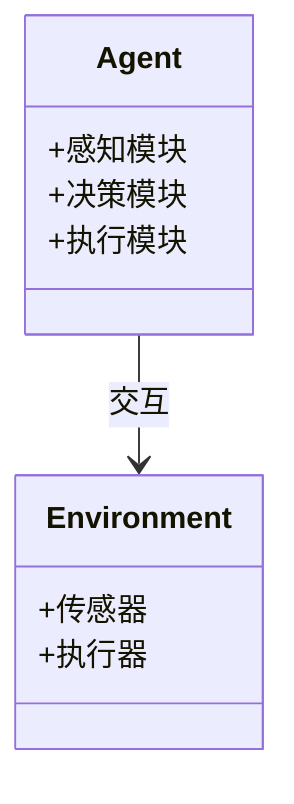
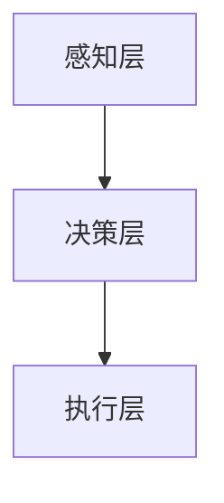
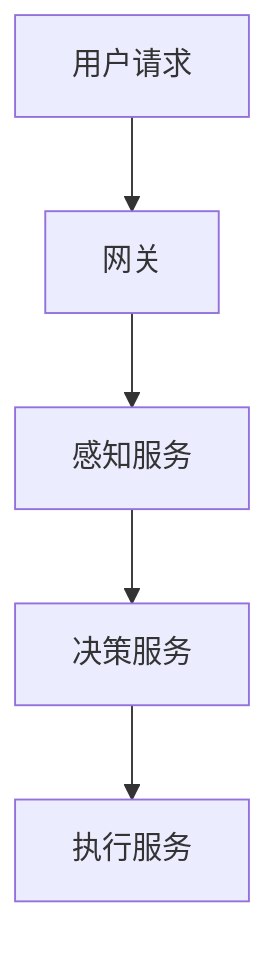
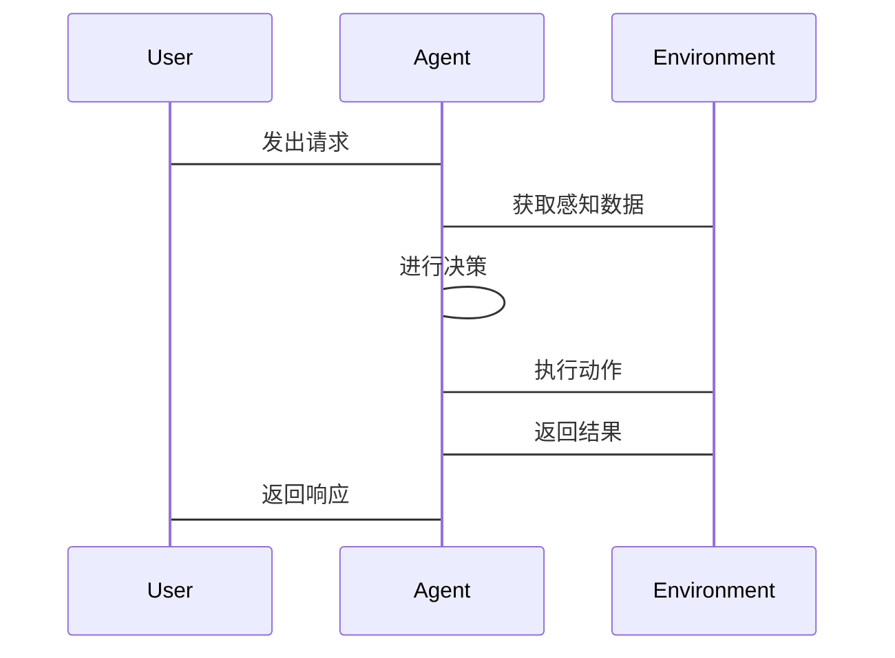

                 


# 展望未来：AI Agent技术发展趋势与机遇

---

## 关键词：
AI Agent, 人工智能, 强化学习, 自然语言处理, 系统架构, 技术趋势

---

## 摘要：
本文将深入探讨AI Agent技术的发展趋势与机遇。从AI Agent的基本概念到其核心技术，从算法原理到系统架构，再到项目实战，最后展望未来趋势，本文将全面分析AI Agent的潜力与发展方向。通过详细的技术解析和实际案例分析，本文旨在为读者提供一个清晰的视角，理解AI Agent如何在未来的智能化社会中发挥重要作用。

---

## 第一部分：AI Agent技术背景与概述

### 第1章：AI Agent的基本概念与背景

#### 1.1 AI Agent的定义与核心概念

##### 1.1.1 AI Agent的定义
AI Agent（人工智能代理）是指能够感知环境、自主决策并执行任务的智能实体。它通过传感器获取信息，利用算法进行分析，并通过执行器与环境互动。

##### 1.1.2 AI Agent的核心要素
- **感知能力**：通过传感器或API获取环境数据。
- **决策能力**：基于数据进行推理和决策。
- **执行能力**：通过执行器或API影响环境。

##### 1.1.3 AI Agent的分类与应用场景
- **按智能水平**：
  - 单智能体：独立运行，如智能音箱。
  - 多智能体：协作运行，如自动驾驶车队。
- **按应用场景**：
  - 服务类：智能客服、智能家居。
  - 工业类：工业机器人、自动化控制。
  - 娱乐类：虚拟助手、游戏AI。

#### 1.2 AI Agent的发展背景

##### 1.2.1 AI技术的演进历程
- **第一代**：规则驱动的AI（1950s-1980s）。
- **第二代**：专家系统（1990s）。
- **第三代**：机器学习与深度学习（2010s至今）。

##### 1.2.2 当前AI Agent技术的发展现状
- **技术成熟度**：
  - 感知能力：图像识别、自然语言处理技术成熟。
  - 决策能力：强化学习、深度学习算法不断进步。
- **应用领域**：
  - 服务业：智能客服、虚拟助手。
  - 制造业：工业机器人、智能工厂。
  - 交通：自动驾驶、智能交通系统。

##### 1.2.3 AI Agent与人类社会的交互关系
- **人机交互**：AI Agent通过自然语言处理与人类互动。
- **协作共生**：AI Agent辅助人类完成复杂任务，提升效率。

#### 1.3 AI Agent的未来展望

##### 1.3.1 技术趋势分析
- **智能化**：从单任务智能体向通用智能体发展。
- **协作化**：多智能体协作将成为主流。
- **个性化**：根据用户需求定制化服务。

##### 1.3.2 应用领域的扩展
- **医疗健康**：智能诊断辅助、个性化治疗方案。
- **金融领域**：智能投资顾问、风险管理。
- **教育领域**：智能教学助手、个性化学习方案。

##### 1.3.3 机遇与挑战
- **机遇**：
  - 技术进步：深度学习、强化学习算法的突破。
  - 产业需求：企业智能化转型的需求增加。
- **挑战**：
  - 技术瓶颈：通用智能体的实现难度。
  - 数据隐私：数据安全和隐私保护问题。
  - 伦理道德：AI Agent的行为规范和责任归属。

---

## 第二部分：AI Agent的核心技术与原理

### 第2章：AI Agent的核心技术基础

#### 2.1 AI Agent的感知能力

##### 2.1.1 数据采集与处理
- **数据源**：传感器数据、API接口、用户输入。
- **数据预处理**：去噪、标准化、特征提取。

##### 2.1.2 自然语言处理（NLP）技术
- **关键词提取**：识别用户输入中的关键信息。
- **情感分析**：判断用户情绪倾向。
- **对话生成**：基于预训练模型生成回复。

##### 2.1.3 计算机视觉（CV）技术
- **图像识别**：识别环境中的物体和场景。
- **目标跟踪**：跟踪特定目标的运动轨迹。
- **视频分析**：分析视频流中的行为和事件。

#### 2.2 AI Agent的决策能力

##### 2.2.1 强化学习（Reinforcement Learning）
- **定义**：通过与环境互动，学习最优策略。
- **核心算法**：
  - Q-Learning：基于状态和动作的奖励机制。
  - Deep Q-Network（DQN）：深度神经网络替代传统Q表。
- **应用场景**：
  - 游戏AI：如AlphaGo。
  - 机器人控制：路径规划、动作选择。

##### 2.2.2 监督学习（Supervised Learning）
- **定义**：基于标记数据进行分类或回归。
- **核心算法**：
  - 线性回归：预测连续值。
  - 支持向量机（SVM）：分类任务。
  - 神经网络：复杂模式识别。
- **应用场景**：
  - 风险评估：预测贷款违约概率。
  - 疾病诊断：基于症状和检测结果分类疾病。

##### 2.2.3 深度学习（Deep Learning）在决策中的应用
- **神经网络结构**：
  - 卷积神经网络（CNN）：处理图像数据。
  - 循环神经网络（RNN）：处理序列数据。
  - Transformer架构：广泛应用于NLP任务。
- **应用场景**：
  - 自然语言理解：如BERT模型。
  - 图像分割：如U-Net架构。

#### 2.3 AI Agent的执行能力

##### 2.3.1 动作规划与执行
- **路径规划**：基于地图数据规划最优路径。
- **动作执行**：通过API调用或物理执行器完成动作。
- **异常处理**：检测执行过程中的异常并进行容错。

##### 2.3.2 任务分配与协作
- **多智能体系统**：
  - 任务分配：基于智能体的能力和环境状态分配任务。
  - 协作机制：通过通信模块进行信息共享和协同决策。
- **分布式系统**：
  - 分布式计算：任务分解和并行处理。
  - 一致性保证：确保系统状态的一致性。

##### 2.3.3 系统集成与接口设计
- **API设计**：
  - 输入接口：接收感知数据和用户指令。
  - 输出接口：发送决策结果和执行命令。
- **模块化设计**：
  - 模块划分：感知模块、决策模块、执行模块。
  - 模块通信：通过消息队列或 RPC 实现模块间通信。

---

## 第三部分：AI Agent的算法原理与数学模型

### 第3章：AI Agent的算法原理

#### 3.1 强化学习算法

##### 3.1.1 Q-Learning算法
- **算法流程**：
  1. 初始化Q表。
  2. 环境反馈状态。
  3. 选择动作并执行。
  4. 更新Q值。
  5. 重复直到终止。
- **数学模型**：
  $$ Q(s, a) = Q(s, a) + \alpha (r + \gamma \max Q(s', a') - Q(s, a)) $$
  其中，$\alpha$ 是学习率，$\gamma$ 是折扣因子。

##### 3.1.2 Deep Q-Network（DQN）
- **算法流程**：
  1. 环境反馈状态。
  2. 神经网络生成动作。
  3. 执行动作并接收奖励。
  4. 更新神经网络参数。
  5. 重复直到终止。
- **数学模型**：
  $$ \text{损失函数} = \mathbb{E}_{(s, a, r) \sim \text{经验回放}} [ (r + \gamma \max Q(s', a') - Q(s, a))^2 ] $$

##### 3.1.3 应用场景
- **游戏AI**：如DeepMind的Alpha系列。
- **机器人控制**：路径规划和动作选择。

#### 3.2 监督学习算法

##### 3.2.1 线性回归
- **数学模型**：
  $$ y = \beta x + \epsilon $$
  其中，$\beta$ 是回归系数，$\epsilon$ 是误差项。

##### 3.2.2 支持向量机（SVM）
- **数学模型**：
  $$ \text{目标函数} = \sum_{i=1}^n \xi_i + \frac{1}{2} \sum_{i=1}^n \alpha_i^2 $$
  $$ \text{约束条件}： y_i (w \cdot x_i + b) \geq 1 - \xi_i $$
  其中，$w$ 是权重向量，$b$ 是偏置项，$\xi_i$ 是松弛变量。

##### 3.2.3 神经网络
- **数学模型**：
  $$ a^{(l+1)} = \sigma(w^{(l)} a^{(l)} + b^{(l)}) $$
  其中，$a^{(l)}$ 是第$l$层的激活值，$\sigma$ 是激活函数，$w^{(l)}$ 是权重矩阵，$b^{(l)}$ 是偏置向量。

#### 3.3 深度学习算法

##### 3.3.1 卷积神经网络（CNN）
- **数学模型**：
  $$ f(x) = \max(0, x) $$
  其中，$x$ 是输入特征，$f(x)$ 是激活输出。

##### 3.3.2 Transformer架构
- **数学模型**：
  $$ \text{Self-attention}(Q, K, V) = \text{softmax}\left(\frac{QK^T}{\sqrt{d_k}}\right)V $$
  其中，$Q$ 是查询向量，$K$ 是键向量，$V$ 是值向量，$d_k$ 是维度。

##### 3.3.3 应用场景
- **自然语言处理**：如BERT模型。
- **图像处理**：如ResNet架构。

---

## 第四部分：AI Agent的系统架构与设计

### 第4章：AI Agent的系统架构

#### 4.1 领域模型设计

##### 4.1.1 实体关系图


##### 4.1.2 类图设计


#### 4.2 系统架构设计

##### 4.2.1 分层架构


##### 4.2.2 微服务架构


#### 4.3 接口设计与交互流程

##### 4.3.1 API接口设计
- **输入接口**：
  - `POST /api/sense`：接收感知数据。
  - `POST /api/decision`：接收决策请求。
- **输出接口**：
  - `POST /api/action`：发送执行命令。

##### 4.3.2 交互流程


---

## 第五部分：AI Agent的项目实战

### 第5章：AI Agent的项目实现

#### 5.1 项目背景与目标
- **项目背景**：实现一个智能客服系统。
- **项目目标**：提供自动化的客户服务支持。

#### 5.2 环境配置
- **开发工具**：Python 3.8+，TensorFlow 2.0+，Flask 2.0+。
- **依赖安装**：
  ```bash
  pip install tensorflow numpy flask
  ```

#### 5.3 核心代码实现

##### 5.3.1 感知模块
```python
def感知模块：
    接收用户输入，解析请求。
```

##### 5.3.2 决策模块
```python
def决策模块：
    基于预训练模型生成响应。
```

##### 5.3.3 执行模块
```python
def执行模块：
    发送响应，记录日志。
```

#### 5.4 功能实现与解读
- **功能模块**：
  - 用户身份验证：基于输入的用户信息进行身份验证。
  - 问题分类：基于NLP技术对用户问题进行分类。
  - 自动回复：基于预训练的模型生成回复内容。
- **功能解读**：
  - 用户身份验证确保安全性。
  - 问题分类提高回复的准确性。
  - 自动回复实现高效的客户支持。

#### 5.5 项目小结
- **代码实现**：
  ```python
  from flask import Flask, request, jsonify
  import tensorflow as tf

  app = Flask(__name__)
  model = tf.keras.load_model('model.h5')

  @app.route('/api/query', methods=['POST'])
  def handle_query():
      data = request.json
      query = data['query']
      response = model.predict(query)
      return jsonify({'response': response})

  if __name__ == '__main__':
      app.run(debug=True)
  ```

---

## 第六部分：AI Agent的未来趋势与最佳实践

### 第6章：AI Agent的未来趋势

#### 6.1 技术发展趋势
- **智能化**：向通用智能体发展。
- **协作化**：多智能体协作成为主流。
- **个性化**：提供定制化服务。

#### 6.2 应用领域的扩展
- **医疗健康**：智能诊断辅助。
- **金融领域**：智能投资顾问。
- **教育领域**：个性化学习方案。

#### 6.3 机遇与挑战
- **机遇**：
  - 技术进步：深度学习、强化学习算法的突破。
  - 产业需求：企业智能化转型的需求增加。
- **挑战**：
  - 技术瓶颈：通用智能体的实现难度。
  - 数据隐私：数据安全和隐私保护问题。
  - 伦理道德：AI Agent的行为规范和责任归属。

#### 6.4 最佳实践
- **持续学习**：保持对新技术的关注和学习。
- **团队协作**：加强多学科团队的协作。
- **合规性**：确保符合相关法律法规和伦理规范。

---

## 第七部分：总结

### 第7章：总结

#### 7.1 核心内容回顾
- AI Agent的基本概念与背景。
- 核心技术与算法原理。
- 系统架构与设计。
- 项目实战与实现。
- 未来趋势与最佳实践。

#### 7.2 展望未来
AI Agent技术将继续快速发展，应用场景将更加广泛。随着技术的进步，AI Agent将变得更加智能、协作和个性化，为人类社会带来更多的便利和机遇。

---

## 作者

作者：AI天才研究院/AI Genius Institute & 禅与计算机程序设计艺术/Zen And The Art of Computer Programming

