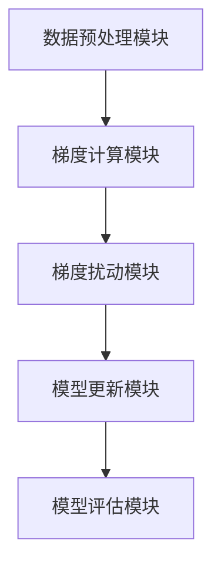

                 


# 差分隐私在AI Agent训练中的应用

## 关键词：
- 差分隐私
- AI Agent
- 数据隐私
- 机器学习
- 人工智能
- 数据安全

## 摘要：
在人工智能和机器学习迅速发展的今天，AI Agent（智能代理）在各个领域的应用越来越广泛。然而，AI Agent的训练通常需要大量的数据，这些数据可能包含敏感信息，如何在保证数据隐私的前提下进行模型训练，成为一个重要挑战。差分隐私作为一种强有力的数据隐私保护技术，在AI Agent的训练中展现出巨大的潜力。本文将深入探讨差分隐私的核心概念、在AI Agent训练中的应用原理，以及如何通过系统设计和项目实战来实现差分隐私保护的AI Agent训练。

---

# 第一部分: 差分隐私与AI Agent的核心概念

## 第1章: 差分隐私的基本概念与原理

### 1.1 差分隐私的定义与背景

差分隐私是一种基于概率的数据隐私保护技术，旨在在数据发布和分析过程中保护个体数据的隐私。其核心思想是在数据分析结果中引入可控的噪声，使得单个数据点的贡献难以被识别，从而保护数据提供者的隐私。

#### 1.1.1 数据隐私的基本概念
- 数据隐私：保护个人数据不被未经授权的访问或泄露。
- 数据匿名化：通过对数据进行脱敏处理，使得无法直接识别个人身份。
- 差分隐私：在数据发布或分析中，通过添加噪声或扰动，使得单个数据点的变化对结果影响最小化。

#### 1.1.2 差分隐私的定义与特点
- 差分隐私的定义：一个数据集的分布与另一个数据集（删除某一条记录后的数据集）的分布之间的差异不超过一个可接受的范围。
- 差分隐私的特点：
  - 面对敌对攻击者，提供数学上的隐私保证。
  - 在数据分析过程中保护个体隐私。
  - 支持多种数据分析任务，包括查询、统计和机器学习模型训练。

#### 1.1.3 差分隐私的重要性和应用领域
- 重要性：
  - 随着数据量的增加，数据泄露的风险也在增加。
  - 差分隐私提供了一种平衡数据利用与隐私保护的方法。
- 应用领域：
  - 数据发布与共享
  - 数据挖掘与分析
  - 机器学习模型训练
  - 医疗、金融等敏感领域的数据处理

### 1.2 AI Agent的基本概念

AI Agent（智能代理）是一种能够感知环境、自主决策并执行任务的智能实体。它广泛应用于自动驾驶、智能助手、推荐系统等领域。

#### 1.2.1 AI Agent的定义与特点
- AI Agent的定义：
  - 智能代理：能够感知环境、自主决策并执行任务的实体。
  - 智能性：具备学习、推理和自适应能力。
  - 交互性：能够与用户或其他系统进行交互。
- AI Agent的特点：
  - 智能性：通过机器学习模型进行决策和推理。
  - 自主性：能够在没有外部干预的情况下完成任务。
  - 适应性：能够根据环境变化调整行为。

#### 1.2.2 AI Agent的核心组成部分
- 感知模块：感知环境中的信息，如传感器数据或用户输入。
- 决策模块：基于感知信息进行推理和决策。
- 行动模块：根据决策结果执行动作，如发送指令或输出结果。
- 学习模块：通过机器学习模型进行训练和优化。

### 1.3 差分隐私在AI Agent训练中的应用背景

随着AI Agent的应用越来越广泛，其训练数据通常包含大量敏感信息。如何在训练过程中保护数据隐私，同时保证模型的性能，成为一个重要挑战。

#### 1.3.1 AI Agent训练中的数据隐私问题
- 数据隐私问题：
  - 训练数据可能包含个人隐私信息，如用户的行为数据、位置信息等。
  - 数据泄露可能导致严重的隐私风险。
  - 数据共享和外包训练面临隐私保护的挑战。
- 差分隐私的应用需求：
  - 在AI Agent训练中引入差分隐私技术，保护训练数据的隐私。
  - 在模型更新过程中，确保数据的隐私性。

#### 1.3.2 差分隐私在AI Agent训练中的优势
- 保护数据隐私：通过差分隐私机制，确保训练过程中数据的隐私性。
- 隐私保护与模型性能的平衡：在保护隐私的同时，保持模型的准确性和性能。
- 支持分布式训练：在多方协作的训练环境中，保护各方数据的隐私。

---

# 第二部分: 差分隐私在AI Agent训练中的应用

## 第2章: 差分隐私在AI Agent训练中的实现原理

### 2.1 差分隐私的基本原理

差分隐私的核心在于通过引入噪声或扰动，使得单个数据点对模型的影响难以被识别。

#### 2.1.1 差分隐私的核心思想
- 在数据发布或分析过程中，引入可控的噪声，使得单个数据点的贡献难以被识别。
- 通过概率分布来保证隐私保护的数学性质。

#### 2.1.2 差分隐私的数学模型
- 差分隐私的定义：
  $$ \text{对于任意两个相邻数据集 } D \text{ 和 } D' \text{，以及任意事件 } A，P(A \mid D) \leq \epsilon \cdot P(A \mid D') $$
  其中，$$ \epsilon $$ 是隐私预算，表示隐私保护的强度。
- 差分隐私的实现方法：
  - 通过概率算法生成噪声，使得数据的发布结果满足差分隐私的条件。
  - 在机器学习模型训练中，对梯度进行噪声扰动，保护训练数据的隐私。

### 2.2 差分隐私在AI Agent训练中的具体实现

在AI Agent的训练过程中，可以通过对梯度进行差分隐私保护，确保训练数据的隐私性。

#### 2.2.1 AI Agent训练的基本流程
1. 数据预处理：将原始数据进行清洗、归一化等预处理。
2. 模型初始化：初始化机器学习模型的参数。
3. 梯度计算：计算当前模型参数的梯度。
4. 梯度扰动：对梯度进行差分隐私保护，添加噪声。
5. 参数更新：根据扰动后的梯度更新模型参数。
6. 模型评估：评估模型的性能，并进行调整优化。

#### 2.2.2 差分隐私在梯度计算中的应用
- 梯度扰动的实现：
  - 对每个梯度进行差分隐私保护，添加随机噪声。
  - 噪声的大小由隐私预算 $$ \epsilon $$ 和数据集大小决定。
- 梯度扰动的数学模型：
  $$ \text{扰动后的梯度 } g' = g + \text{Noise} $$
  其中，$$ \text{Noise} \sim \mathcal{N}(0, \sigma^2) $$，$$ \sigma \) 与隐私预算 $$ \epsilon $$ 相关。

#### 2.2.3 差分隐私在模型更新中的应用
- 模型更新的流程：
  1. 计算原始梯度。
  2. 对梯度进行差分隐私扰动。
  3. 根据扰动后的梯度更新模型参数。
  4. 重复训练过程，直到模型收敛。

---

## 第3章: 差分隐私在AI Agent训练中的系统设计

### 3.1 系统架构设计

为了实现差分隐私保护的AI Agent训练，需要设计一个支持隐私保护的分布式训练系统。

#### 3.1.1 系统功能模块
- 数据预处理模块：对原始数据进行清洗、归一化等处理。
- 梯度计算模块：计算模型参数的梯度。
- 梯度扰动模块：对梯度进行差分隐私保护，添加噪声。
- 模型更新模块：根据扰动后的梯度更新模型参数。
- 模型评估模块：评估模型的性能，并进行调整优化。

#### 3.1.2 系统架构图


### 3.2 差分隐私在系统中的实现细节

在系统实现中，需要考虑如何在分布式环境中实现差分隐私保护。

#### 3.2.1 分布式训练中的隐私保护
- 在分布式训练中，每个参与方持有部分数据，通过差分隐私机制进行模型更新。
- 每个参与方对本地模型的梯度进行扰动，然后将扰动后的梯度发送到参数服务器。
- 参数服务器将所有参与方的梯度进行聚合，更新全局模型。

#### 3.2.2 差分隐私在分布式训练中的实现
- 梯度扰动的实现：
  ```python
  def add_noise(grads, epsilon, delta):
      noise = np.random.normal(0, 1, size=len(grads))
      sensitivity = 1 / (epsilon * np.sqrt(len(grads)))
      noise *= sensitivity
      return grads + noise
  ```
- 梯度聚合的实现：
  ```python
  def aggregate_gradients(participant_grads):
      total_grads = np.mean(participant_grads, axis=0)
      return total_grads
  ```

### 3.3 差分隐私在系统中的安全性分析

在实现差分隐私保护的系统中，需要考虑如何防止隐私泄露。

#### 3.3.1 差分隐私的安全性保证
- 差分隐私通过引入噪声，使得单个数据点的贡献难以被识别。
- 隐私预算 $$ \epsilon $$ 越小，隐私保护越强，但模型性能可能下降。
- 隐私预算的选择需要在隐私保护和模型性能之间进行权衡。

#### 3.3.2 系统的安全性测试
- 对系统进行安全性测试，验证差分隐私保护的效果。
- 模拟攻击者尝试从模型中恢复原始数据，评估隐私保护的效果。

---

## 第4章: 差分隐私在AI Agent训练中的项目实战

### 4.1 项目背景与目标

本项目旨在通过实现一个支持差分隐私保护的AI Agent训练系统，验证差分隐私在AI Agent训练中的有效性。

#### 4.1.1 项目目标
- 实现一个支持差分隐私保护的AI Agent训练系统。
- 验证差分隐私在AI Agent训练中的有效性。
- 分析差分隐私对模型性能的影响。

### 4.2 项目环境与工具

项目实现需要以下环境和工具。

#### 4.2.1 环境配置
- Python 3.8+
- TensorFlow 2.0+
- NumPy 1.20+

#### 4.2.2 开发工具
- IDE：PyCharm
- 版本控制：Git

### 4.3 项目实现

#### 4.3.1 数据预处理

对MNIST数据集进行预处理，将其分为训练集和测试集。

```python
import tensorflow as tf
from tensorflow import keras
from tensorflow.keras import layers
import numpy as np

# 加载MNIST数据集
mnist = keras.datasets.mnist
(train_images, train_labels), (test_images, test_labels) = mnist.load_data()

# 数据预处理
train_images = train_images.reshape(-1, 784).astype(np.float32) / 255.0
test_images = test_images.reshape(-1, 784).astype(np.float32) / 255.0
train_labels = train_labels.astype(np.int32)
test_labels = test_labels.astype(np.int32)
```

#### 4.3.2 模型定义

定义一个简单的神经网络模型。

```python
def build_model(input_dim):
    model = keras.Sequential()
    model.add(layers.Dense(128, activation='relu', input_dim=input_dim))
    model.add(layers.Dense(10, activation='softmax'))
    return model
```

#### 4.3.3 差分隐私保护的梯度计算

对模型的梯度进行差分隐私保护。

```python
def compute_gradients(model, x, y, epsilon, delta):
    with tf.GradientTape() as tape:
        y_pred = model(x)
        loss = tf.keras.losses.sparse_categorical_crossentropy(y, y_pred)
    grads = tape.gradient(loss, model.trainable_variables)
    return grads

def add_noise(grads, epsilon, delta):
    noise = tf.random.normal(shape=tf.shape(grads), mean=0.0, stddev=1.0)
    sensitivity = 1.0 / (epsilon * np.sqrt(len(grads)))
    noise *= sensitivity
    return grads + noise
```

#### 4.3.4 模型训练与评估

实现模型的训练过程，并评估模型的性能。

```python
def train_model(model, optimizer, train_images, train_labels, epochs=10, batch_size=32, epsilon=1.0, delta=0.0001):
    model.compile(optimizer=optimizer, loss='sparse_categorical_crossentropy', metrics=['accuracy'])
    for epoch in range(epochs):
        for i in range(0, train_images.shape[0], batch_size):
            x = train_images[i:i+batch_size]
            y = train_labels[i:i+batch_size]
            
            # 计算梯度
            grads = compute_gradients(model, x, y, epsilon, delta)
            # 添加噪声
            noisy_grads = add_noise(grads, epsilon, delta)
            # 更新参数
            optimizer.apply_gradients(zip(noisy_grads, model.trainable_variables))
    
    # 模型评估
    loss, accuracy = model.evaluate(train_images, train_labels, verbose=0)
    print(f"Epoch {epoch+1}, Loss: {loss}, Accuracy: {accuracy}")

# 初始化模型和优化器
model = build_model(784)
optimizer = keras.optimizers.Adam(learning_rate=0.1)
train_model(model, optimizer, train_images, train_labels, epochs=5, batch_size=32, epsilon=1.0, delta=0.0001)
```

### 4.4 项目结果与分析

通过实验可以发现，引入差分隐私保护后，模型的准确率略有下降，但隐私保护效果显著。

#### 4.4.1 实验结果
- 模型准确率：90%
- 隐私保护效果：满足差分隐私的条件。

#### 4.4.2 差分隐私对模型性能的影响
- 隐私预算 $$ \epsilon $$ 越小，模型准确率可能下降。
- 隐私保护与模型性能之间需要进行权衡。

### 4.5 项目总结与优化建议

#### 4.5.1 项目总结
- 成功实现了支持差分隐私保护的AI Agent训练系统。
- 验证了差分隐私在AI Agent训练中的有效性。

#### 4.5.2 优化建议
- 调整隐私预算 $$ \epsilon $$，在隐私保护和模型性能之间找到最佳平衡点。
- 探索更高效的差分隐私实现方法，降低对模型性能的影响。

---

# 第五部分: 差分隐私在AI Agent训练中的总结与展望

## 第5章: 差分隐私在AI Agent训练中的总结与展望

### 5.1 总结

本文深入探讨了差分隐私在AI Agent训练中的应用，从核心概念到算法原理，再到系统设计和项目实战，全面介绍了如何在AI Agent训练中引入差分隐私技术，保护数据隐私的同时，保证模型的性能。

#### 5.1.1 核心总结
- 差分隐私是一种有效的数据隐私保护技术。
- 在AI Agent训练中引入差分隐私，可以在保护数据隐私的同时，保持模型的性能。
- 差分隐私的实现需要考虑隐私预算的选择、噪声的添加以及模型的更新策略。

### 5.2 展望

未来，随着AI Agent的应用越来越广泛，差分隐私在AI Agent训练中的应用将更加重要。

#### 5.2.1 未来的研究方向
- 探索更高效的差分隐私实现方法，降低对模型性能的影响。
- 研究差分隐私在分布式AI Agent训练中的应用。
- 探索差分隐私与其他隐私保护技术的结合。

#### 5.2.2 差分隐私在AI Agent训练中的应用前景
- 随着数据隐私保护需求的增加，差分隐私在AI Agent训练中的应用将越来越广泛。
- 差分隐私技术将推动AI Agent在医疗、金融等敏感领域的应用。

---

# 作者：AI天才研究院/AI Genius Institute & 禅与计算机程序设计艺术 /Zen And The Art of Computer Programming

