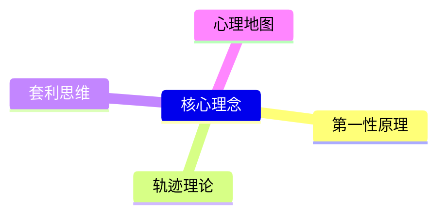

                 


# 巴菲特-芒格的元宇宙投资观：虚拟经济的潜力与风险

## 关键词：巴菲特, 芒格, 元宇宙, 虚拟经济, 投资策略, 风险管理, 经济模型

## 摘要：
本文探讨巴菲特和芒格的投资理念在元宇宙虚拟经济中的应用，分析其潜力与风险。通过虚拟货币、NFT等核心元素的分析，结合数学模型和系统架构设计，提出投资策略和风险管理方法，强调谨慎投资和未来发展趋势。

---

# 1. 虚拟经济的背景与现状

## 1.1 元宇宙的定义与技术基础

- **元宇宙的定义**：元宇宙是虚拟现实的延伸，结合区块链、AR/VR、AI等技术，构建一个虚拟经济体系。
- **技术基础**：
  - 区块链：确保虚拟资产的唯一性和安全性。
  - AR/VR：提供沉浸式体验。
  - AI：优化用户交互和内容生成。

## 1.2 虚拟经济的核心要素

- **虚拟货币**：如比特币、以太坊，用于虚拟交易。
- **NFT**：非同质化代币，代表虚拟资产的所有权。

### 图表：虚拟经济核心要素的ER图

```mermaid
erDiagram
    user {
        +id: integer
        +name: string
        +balance: integer
    }
    asset {
        +id: integer
        +name: string
        +owner_id: integer
        +type: string
    }
    transaction {
        +id: integer
        +sender_id: integer
        +receiver_id: integer
        +asset_id: integer
        +timestamp: datetime
    }
    user --> transaction :发起
    transaction --> asset :转移
```

---

# 2. 巴菲特和芒格的投资哲学

## 2.1 巴菲特的价值投资

- **价值投资理念**：寻找被低估的资产，长期持有。
- **安全边际**：购买价格远低于内在价值。

## 2.2 芒格的多元思维模型

- **跨学科思维**：将不同领域的知识结合起来，做出更明智的投资决策。

### 图表：芒格的多元思维模型



---

# 3. 元宇宙虚拟经济中的投资分析

## 3.1 虚拟货币的评估模型

- **评估公式**：
  $$ V = \frac{D}{k} $$
  其中，D是货币发行总量，k是流通速度。

## 3.2 NFT的价值评估

- **价值影响因素**：创作者声誉、社区支持、稀缺性。

### 图表：NFT价值影响因素的层次结构

```mermaid
hchart
    category: 创作者声誉, 重要性: 高
    category: 社区支持, 重要性: 中
    category: 稀缺性, 重要性: 高
```

---

# 4. 投资策略与风险管理

## 4.1 投资组合构建

- **分散投资**：将资金分配到不同类型的虚拟资产，降低风险。

## 4.2 风险管理模型

- **风险评估公式**：
  $$ R = \sum_{i=1}^{n} (P_i \times S_i) $$
  其中，P_i是风险概率，S_i是风险影响。

### 图表：风险管理流程图


---

# 5. 项目实战与案例分析

## 5.1 虚拟货币投资实战

- **案例**：投资比特币和以太坊，定期评估和调整。

## 5.2 NFT投资策略

- **策略**：选择知名创作者的NFT，关注社区动态。

---

# 6. 总结与展望

## 6.1 总结

- 巴菲特和芒格的投资理念为元宇宙虚拟经济提供了宝贵的指导。
- 需谨慎评估虚拟资产，结合数学模型和风险管理策略。

## 6.2 未来展望

- 元宇宙虚拟经济将继续发展，技术进步将带来更多投资机会。

---

# 作者

作者：AI天才研究院/AI Genius Institute & 禅与计算机程序设计艺术/Zen And The Art of Computer Programming

---

通过以上结构，文章详细分析了巴菲特和芒格的投资理念在元宇宙中的应用，结合虚拟经济的核心要素，提出了有效的投资策略和风险管理方法。读者可以从中获得系统的知识和实际操作的指导。

