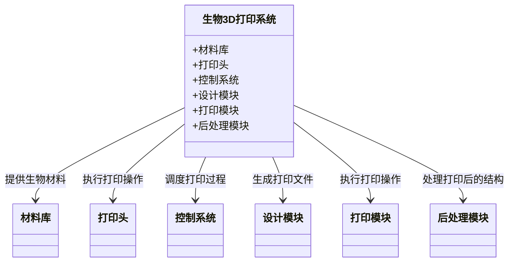
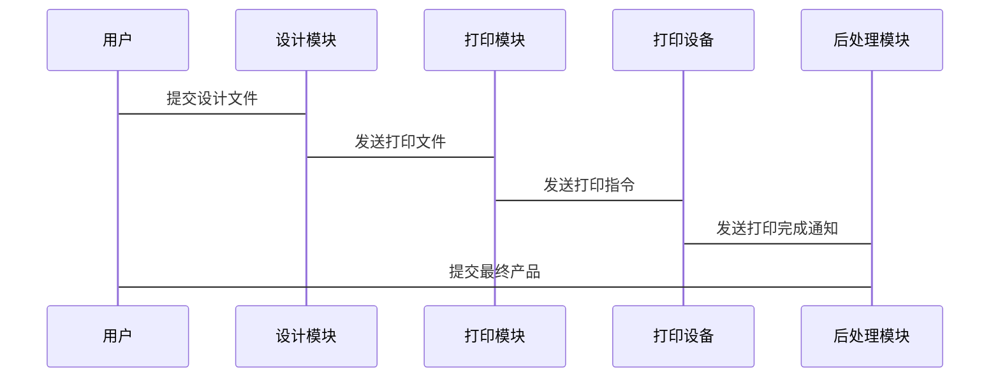

                 


# 巴菲特-芒格的生物3D打印投资：医疗和制造业的革新

**关键词**：巴菲特，芒格，生物3D打印，投资策略，医疗创新，制造业革新

**摘要**：本文探讨了巴菲特和芒格的投资理念与生物3D打印技术的结合，分析了该技术在医疗和制造领域的应用潜力。通过详细的技术背景、投资策略、系统架构和项目实战分析，揭示了生物3D打印如何革新传统行业，并为投资者提供了新的价值发现机会。

---

## 第1章 巴菲特-芒格投资理念概述

### 1.1 巴菲特-芒格投资理念的核心思想

#### 1.1.1 巴菲特的价值投资理论
巴菲特的价值投资理论强调长期投资、安全边际和寻找具有持续竞争优势的企业。他注重企业的基本面分析，寻找那些具有强大护城河和稳定现金流的企业。

#### 1.1.2 芒格的多元思维模型
芒格的多元思维模型强调跨学科思考，通过多个角度分析问题，寻找复杂问题的简单解决方案。他主张投资者应具备广泛的知识储备，以便更好地识别投资机会。

#### 1.1.3 投资理念与生物3D打印技术的结合
将巴菲特和芒格的投资理念应用于生物3D打印技术，需要结合技术的创新性和市场的潜力，寻找那些具有技术壁垒和商业模式优势的企业。

### 1.2 巴菲特-芒格投资策略的特点

#### 1.2.1 长期投资与价值发现
巴菲特和芒格的投资策略注重长期价值，而非短期波动。他们寻找那些能够持续创造价值的企业，而不是被市场短期情绪左右的股票。

#### 1.2.2 风险控制与安全边际
他们强调风险控制，避免过度冒险。安全边际是确保投资决策稳健的重要因素，尤其是在技术领域，需要考虑技术的可行性和市场的接受度。

#### 1.2.3 跨学科思维在投资中的应用
芒格的多元思维模型在技术投资中尤为重要。通过跨学科分析，投资者可以更全面地评估技术的潜力和风险，避免单一视角的局限性。

### 1.3 巴菲特-芒格投资理念的现代意义

#### 1.3.1 技术驱动投资的未来趋势
随着技术的快速发展，投资领域正在发生深刻变化。生物3D打印等创新技术为投资者提供了新的价值发现机会。

#### 1.3.2 创新技术与传统投资策略的融合
传统投资策略需要与技术创新相结合，才能在未来的竞争中占据优势。生物3D打印技术的出现，为投资者提供了新的思考维度。

#### 1.3.3 生物3D打印技术的投资潜力
生物3D打印技术在医疗和制造领域的广泛应用，使其成为未来投资的重要方向。投资者需要具备技术敏感性，才能抓住这些机会。

---

## 第2章 生物3D打印技术的背景与现状

### 2.1 生物3D打印技术的定义与原理

#### 2.1.1 生物3D打印的定义
生物3D打印是一种利用生物材料通过3D打印技术制造生物结构的技术，可以用于制造人工组织、器官或医疗设备。

#### 2.1.2 生物3D打印的核心原理
生物3D打印的核心原理是通过逐层制造生物材料，构建出具有特定功能的生物结构。与传统制造技术相比，生物3D打印具有更高的精度和定制化能力。

#### 2.1.3 生物3D打印的关键技术与设备
生物3D打印的关键技术包括材料制备、打印设备和软件控制。材料制备是生物3D打印的核心，需要选择合适的生物材料以确保打印结构的生物相容性和功能性。

### 2.2 生物3D打印技术的应用领域

#### 2.2.1 医疗领域：个性化医疗与组织工程
在医疗领域，生物3D打印技术可以用于制造个性化的医疗设备、人工组织和器官。这为患者提供了更精准的治疗方案，提高了治疗效果和生活质量。

#### 2.2.2 制造业：复杂结构件的快速制造
在制造业中，生物3D打印技术可以用于生产复杂形状的零件，尤其是在医疗设备和航空航天领域。这种技术可以大幅缩短生产周期，降低成本。

#### 2.2.3 其他潜在应用领域
除了医疗和制造领域，生物3D打印技术还可以应用于环境修复、食品制造等领域。随着技术的不断发展，其应用范围将更加广泛。

### 2.3 生物3D打印技术的现状与挑战

#### 2.3.1 当前技术瓶颈
目前，生物3D打印技术仍面临一些技术瓶颈，如材料的生物相容性、打印精度和速度等问题。这些技术难题需要进一步突破。

#### 2.3.2 成本与效率问题
生物3D打印技术的高成本和低效率是制约其大规模应用的主要因素。如何降低生产成本、提高打印效率是技术发展的关键。

#### 2.3.3 技术与市场的匹配度
尽管生物3D打印技术具有广阔的市场前景，但其技术与市场需求之间仍存在一定的匹配度问题。如何更好地满足市场需求是技术推广的重要挑战。

---

## 第3章 巴菲特-芒格投资理念与生物3D打印技术的结合

### 3.1 巴菲特-芒格投资理念的核心要素

#### 3.1.1 价值创造与长期投资
巴菲特和芒格的投资理念强调长期价值创造，这与生物3D打印技术的长期发展潜力相契合。他们寻找那些能够持续创造价值的企业，而不仅仅是短期收益。

#### 3.1.2 跨学科思维模型的应用
芒格的多元思维模型在生物3D打印技术的投资中尤为重要。通过跨学科分析，投资者可以更全面地评估技术的潜力和风险，避免单一视角的局限性。

#### 3.1.3 风险控制与安全边际
巴菲特和芒格强调风险控制和安全边际，这在技术投资中尤为重要。生物3D打印技术虽然潜力巨大，但其技术和市场风险也需要充分考虑。

### 3.2 生物3D打印技术的投资价值分析

#### 3.2.1 技术创新的市场潜力
生物3D打印技术在医疗和制造领域的广泛应用，使其具有巨大的市场潜力。随着技术的不断进步，其应用范围和市场规模将逐步扩大。

#### 3.2.2 行业发展趋势与投资机会
生物3D打印技术正在快速发展，行业趋势表明其市场需求将快速增长。投资者需要关注行业发展趋势，抓住投资机会。

#### 3.2.3 技术壁垒与竞争优势
生物3D打印技术的壁垒较高，具有技术优势的企业将在竞争中占据优势地位。投资者需要关注企业的技术壁垒和竞争优势。

### 3.3 巴菲特-芒格投资理念在生物3D打印领域的具体应用

#### 3.3.1 从价值发现到技术投资
巴菲特和芒格的投资理念强调价值发现，这在生物3D打印技术的投资中尤为重要。投资者需要识别那些具有技术壁垒和市场潜力的企业。

#### 3.3.2 跨学科思维在技术评估中的应用
芒格的多元思维模型在技术评估中尤为重要。通过跨学科分析，投资者可以更全面地评估技术的潜力和风险，避免单一视角的局限性。

#### 3.3.3 长期投资策略与技术创新周期的匹配
生物3D打印技术的发展需要长期投入，与巴菲特和芒格的长期投资策略相契合。投资者需要耐心等待技术的成熟和市场的认可。

---

## 第4章 生物3D打印技术的系统分析与架构设计

### 4.1 问题场景介绍
生物3D打印技术的应用场景包括医疗和制造领域。在医疗领域，它可以用于制造人工组织和器官；在制造领域，它可以用于生产复杂形状的零件。

### 4.2 系统功能设计

#### 4.2.1 领域模型（mermaid类图）


### 4.3 系统架构设计

#### 4.3.1 系统架构（mermaid架构图）
```mermaid
docker
    service 生物3D打印系统 {
        publish 80: web界面
        deploy 3副本
    }
    service 材料库 {
        publish 5432: 数据库
        deploy 1副本
    }
    service 打印设备 {
        publish 22: SSH访问
        deploy 2副本
    }
```

### 4.4 系统接口设计

#### 4.4.1 接口描述
- **设计模块接口**：接收设计文件并生成打印文件。
- **打印模块接口**：接收打印文件并执行打印操作。
- **后处理模块接口**：接收打印完成的结构并进行后处理。

### 4.5 系统交互设计

#### 4.5.1 系统交互流程（mermaid序列图）


---

## 第5章 项目实战：生物3D打印技术的应用案例

### 5.1 环境安装

#### 5.1.1 系统要求
- 操作系统：Linux/Windows/MacOS
- 开发工具：Python、Git、IDE
- 打印设备：支持生物3D打印的设备

#### 5.1.2 安装步骤
```bash
# 安装必要的软件包
pip install numpy matplotlib scikit-learn
# 克隆项目代码库
git clone https://github.com/bioprinting-project/main.git
cd main
# 安装依赖
pip install -r requirements.txt
```

### 5.2 系统核心实现源代码

#### 5.2.1 设计模块实现
```python
import numpy as np

def generate_print_file(layers):
    # 生成打印文件
    print("Generating print file with {} layers...".format(layers))
    return "print_file.stl"

# 示例调用
generate_print_file(10)
```

#### 5.2.2 打印模块实现
```python
def execute_print_job(print_file):
    # 执行打印任务
    print("Starting print job with file: {}...".format(print_file))
    return "Print completed successfully."

# 示例调用
execute_print_job("print_file.stl")
```

### 5.3 代码应用解读与分析
代码示例展示了设计模块和打印模块的核心功能。设计模块负责生成打印文件，打印模块负责执行打印任务。通过模块化设计，可以更好地管理和维护系统功能。

### 5.4 实际案例分析
以医疗领域为例，生物3D打印技术可以用于制造人工骨骼。通过个性化设计和打印，可以为患者提供更精准的治疗方案，提高治疗效果。

### 5.5 项目小结
通过项目实战，我们深入理解了生物3D打印技术的应用过程。从环境安装到代码实现，再到实际案例分析，整个过程展示了技术的潜力和挑战。

---

## 第6章 最佳实践与投资策略

### 6.1 投资策略 tips
- **关注技术壁垒**：选择具有技术优势的企业。
- **评估市场需求**：考虑技术的市场潜力和应用前景。
- **长期投资**：耐心等待技术成熟和市场认可。

### 6.2 系统架构设计 tips
- **模块化设计**：便于功能扩展和维护。
- **高效通信**：确保系统各部分之间的高效协作。
- **安全性考虑**：保护生物材料和数据的安全。

### 6.3 项目实战 tips
- **选择合适的工具**：根据项目需求选择合适的开发工具和库。
- **注重代码质量**：保持代码的可读性和可维护性。
- **持续优化**：根据反馈和实际应用情况不断优化系统。

### 6.4 本章小结
通过本文的分析和实战，我们得出了一些最佳实践和投资策略，为读者提供了有价值的指导和建议。

---

## 作者信息

作者：AI天才研究院/AI Genius Institute & 禅与计算机程序设计艺术/Zen And The Art of Computer Programming

---

通过以上思考和撰写，我希望能够为读者提供一篇内容丰富、结构清晰的技术博客文章，深入探讨巴菲特和芒格的投资理念与生物3D打印技术的结合，为投资和技术领域提供新的视角和见解。

