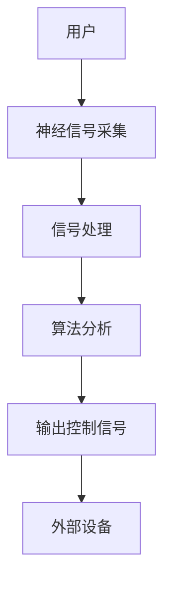
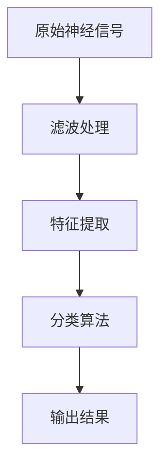
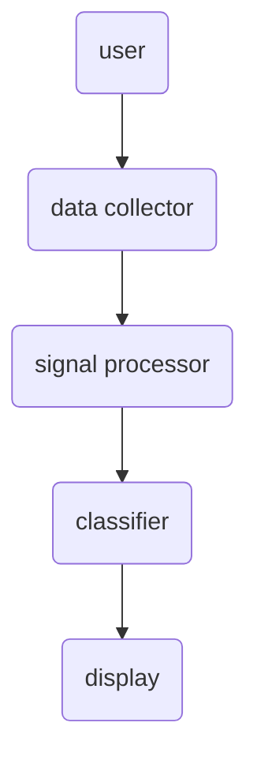
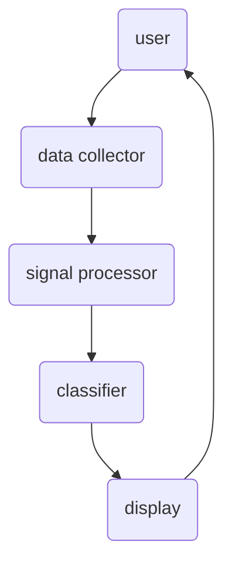

                 


# 巴菲特-芒格的脑机接口教育平台投资：认知增强的学习革命

## 关键词：
- 巴菲特、芒格、脑机接口、教育平台、认知增强、投资分析、教育科技

## 摘要：
本文探讨了巴菲特和芒格如何投资于脑机接口技术在教育领域的应用，分析了脑机接口技术的核心原理及其在教育中的潜力，结合投资策略和教育平台的设计实现，展望了未来的发展趋势。文章通过详细的技术分析和投资案例，展示了认知增强技术在教育领域的革命性影响。

---

# 第一部分: 脑机接口教育平台的背景与概念

## 第1章: 脑机接口技术概述

### 1.1 脑机接口的基本概念
#### 1.1.1 脑机接口的定义与核心原理
脑机接口（BCI）是一种将人脑与计算机直接连接的技术，通过采集和解析神经信号，实现人脑与机器之间的信息交互。其核心原理在于将脑电活动转化为可被计算机识别的信号，从而控制外部设备或接收反馈信息。

**mermaid图：脑机接口的基本工作流程**


#### 1.1.2 脑机接口的历史发展与现状
脑机接口技术起源于20世纪70年代，经历了从实验室研究到实际应用的漫长过程。近年来，随着人工智能和神经科学的进步，脑机接口技术在医疗、娱乐和教育等领域得到了广泛应用。

#### 1.1.3 脑机接口在教育领域的潜力
脑机接口技术可以通过实时监测学生的学习状态，提供个性化的教学策略，从而提高学习效率。例如，通过监测学生的注意力水平，系统可以自动调整教学内容的难度。

---

## 第2章: 教育平台的智能化革命

### 2.1 教育领域的技术变革
#### 2.1.1 传统教育模式的局限性
传统教育模式依赖教师的讲解和学生的自主学习，难以满足个性化学习的需求。学生的学习进度和能力差异较大，传统模式难以实现精准教学。

#### 2.1.2 智能化教育的兴起
智能化教育利用人工智能、大数据和脑机接口等技术，实现个性化学习、实时反馈和自适应教学。这些技术能够根据学生的学习状态调整教学策略，提高学习效果。

#### 2.1.3 脑机接口在教育中的应用前景
脑机接口技术可以实时监测学生的学习状态，分析其注意力、情绪和认知负荷，从而为教师提供科学的教学建议，帮助学生克服学习障碍。

---

## 第3章: 巴菲特与芒格的投资理念

### 3.1 巴菲特与芒格的投资哲学
#### 3.1.1 巴菲特的价值投资理论
巴菲特的价值投资理论强调长期投资、基本面分析和安全边际。他认为，投资的本质是寻找那些具有持续竞争优势和良好管理的公司。

#### 3.1.2 芒格的多元思维模型
芒格的多元思维模型强调跨学科思考，将不同领域的知识结合起来，寻找投资机会。他认为，投资者应该具备广泛的知识储备，以更好地识别投资机会。

#### 3.1.3 投资中的长期主义
巴菲特和芒格都强调长期投资的重要性。他们认为，短期市场的波动不应影响长期的投资决策，应该关注企业的长期价值。

---

## 第4章: 巴菲特与芒格对技术创新的关注

### 4.1 技术创新在投资中的重要性
技术创新是推动企业长期发展的核心动力。巴菲特和芒格认为，具有技术创新能力的公司更有可能在未来市场中占据优势。

#### 4.1.1 技术创新与竞争优势
技术创新可以为企业创造独特的竞争优势，尤其是在教育科技领域，脑机接口技术可以带来颠覆性的教学模式。

#### 4.1.2 教育科技领域的投资机会
随着技术的进步，教育科技领域涌现出许多创新企业。巴菲特和芒格认为，这些企业有可能通过技术创新改变传统的教育模式。

---

# 第二部分: 脑机接口技术的核心原理

## 第5章: 脑机接口的神经科学基础

### 5.1 神经信号的采集与处理
#### 5.1.1 神经信号的类型与特点
神经信号包括脑电波（EEG）、肌电图（EMG）和眼动追踪等多种类型。每种信号都有其独特的特征，例如EEG信号反映了大脑的电活动。

#### 5.1.2 神经信号的采集方法
神经信号的采集方法包括头皮电极、植入式电极和光学采集等。不同的采集方法适用于不同的应用场景。

#### 5.1.3 神经信号的处理算法
神经信号的处理算法包括滤波、特征提取和分类等步骤。例如，使用傅里叶变换对EEG信号进行频谱分析，提取特定频段的特征。

**mermaid图：神经信号处理流程**


#### 5.1.4 神经网络与机器学习
神经网络和机器学习算法被广泛应用于神经信号的处理和分析。例如，使用深度学习模型对EEG信号进行分类，识别不同的脑活动状态。

---

## 第6章: 脑机接口系统的架构设计

### 6.1 系统架构的组成与功能
#### 6.1.1 数据采集模块
数据采集模块负责采集用户的神经信号，例如EEG信号。

#### 6.1.2 信号处理模块
信号处理模块对采集到的神经信号进行预处理，例如滤波和降噪。

#### 6.1.3 算法实现模块
算法实现模块使用机器学习算法对信号进行分析，识别用户的意图或情绪状态。

#### 6.1.4 用户交互模块
用户交互模块负责将系统的输出反馈给用户，例如通过显示器或声音提示。

### 6.2 系统架构的优化与实现
#### 6.2.1 系统设计的模块化
系统设计采用模块化方法，便于功能扩展和维护。

#### 6.2.2 系统实现的代码框架
以下是脑机接口系统的Python代码框架：

```python
import numpy as np
from sklearn import svm

def preprocess_signal(signal):
    # 数据预处理
    processed_signal = signal.filter(bandpass=[80, 20])  # 带通滤波
    return processed_signal

def train_classifier(processed_signal):
    # 训练分类器
    classifier = svm.SVC()
    classifier.fit(processed_signal, labels)
    return classifier

def predict_intent(classifier, new_signal):
    # 预测意图
    processed_new_signal = preprocess_signal(new_signal)
    prediction = classifier.predict(processed_new_signal)
    return prediction
```

---

## 第7章: 脑机接口技术的数学模型

### 7.1 神经信号的频谱分析
神经信号的频谱分析是通过傅里叶变换实现的，公式如下：
$$ X(f) = \sum_{n=0}^{N-1} x[n] \cdot e^{-j2\pi fn/N} $$

### 7.2 机器学习算法
机器学习算法中的支持向量机（SVM）是一种常用的分类算法，其目标函数为：
$$ \min_{\theta, \alpha} \frac{1}{2}\sum_{i=1}^N \alpha_i^2 + C\sum_{i=1}^N \alpha_i y_i (1 - \hat{y}_i) $$

---

## 第8章: 脑机接口系统的系统架构

### 8.1 系统架构的实体关系图
以下是系统架构的ER图：



---

## 第9章: 脑机接口系统的交互设计

### 9.1 用户交互流程
用户通过脑机接口系统进行学习，系统实时监测用户的注意力水平，并根据结果调整教学内容。

**mermaid图：用户交互流程**


---

# 第三部分: 脑机接口教育平台的投资分析

## 第10章: 教育科技市场的投资机会

### 10.1 教育科技市场的现状
教育科技市场的规模正在快速增长，脑机接口技术的应用将推动市场进一步扩大。

### 10.2 脑机接口技术的市场潜力
脑机接口技术在教育领域的应用前景广阔，特别是在个性化学习和认知增强方面。

---

## 第11章: 投资策略与风险评估

### 11.1 巴菲特与芒格的投资策略
巴菲特和芒格的投资策略注重长期价值和技术创新能力。

### 11.2 投资风险与风险管理
投资者需要关注技术风险、市场风险和政策风险，制定合理的风险管理策略。

---

## 第12章: 投资案例分析

### 12.1 典型投资案例
分析巴菲特和芒格在教育科技领域的典型投资案例，总结成功的经验。

### 12.2 投资回报分析
通过财务数据分析，评估脑机接口教育平台的投资回报率。

---

# 第四部分: 脑机接口教育平台的设计与实现

## 第13章: 系统架构设计

### 13.1 系统功能设计
系统功能包括神经信号采集、处理、分析和反馈。

### 13.2 系统架构实现
系统架构采用模块化设计，包括数据采集、信号处理和用户反馈模块。

---

## 第14章: 用户体验优化

### 14.1 用户界面设计
用户界面设计注重简洁性和易用性，确保用户体验良好。

### 14.2 交互设计优化
通过优化交互流程，提高系统的响应速度和准确性。

---

## 第15章: 教学模式创新

### 15.1 个性化学习策略
个性化学习策略根据学生的学习状态调整教学内容。

### 15.2 实时反馈机制
实时反馈机制帮助学生及时了解学习进展，提高学习效率。

---

# 第五部分: 脑机接口教育平台的未来展望

## 第16章: 未来发展趋势

### 16.1 技术进步
脑机接口技术的进一步发展将推动教育平台的功能创新。

### 16.2 市场扩展
随着技术的成熟，脑机接口教育平台的应用场景将不断扩展。

---

## 第17章: 伦理与社会影响

### 17.1 伦理问题
脑机接口技术的应用可能引发隐私和伦理问题，需要引起重视。

### 17.2 社会影响
脑机接口技术可能对教育公平性和社会结构产生深远影响。

---

## 第18章: 投资机会

### 18.1 新兴领域
新兴领域如人工智能和脑机接口技术将继续吸引投资者的关注。

### 18.2 投资策略调整
投资者需要根据市场变化及时调整投资策略，抓住新的投资机会。

---

# 第六部分: 附录

## 第19章: 技术资料

### 19.1 脑机接口技术的详细参数
详细列出脑机接口系统的各项技术参数，包括数据采集频率、信号处理算法等。

### 19.2 系统架构的代码实现
提供脑机接口系统的Python代码实现，包括数据采集、处理和分析模块。

---

## 第20章: 投资工具

### 20.1 股票分析工具
介绍几种常用的股票分析工具，帮助投资者进行基本面分析。

### 20.2 投资组合管理
提供投资组合管理的策略和工具，帮助投资者优化资产配置。

---

## 第21章: 参考文献

### 21.1 主要参考文献
列出本文中引用的主要参考文献，包括书籍、期刊论文和网络资源。

---

作者：AI天才研究院/AI Genius Institute & 禅与计算机程序设计艺术 /Zen And The Art of Computer Programming

