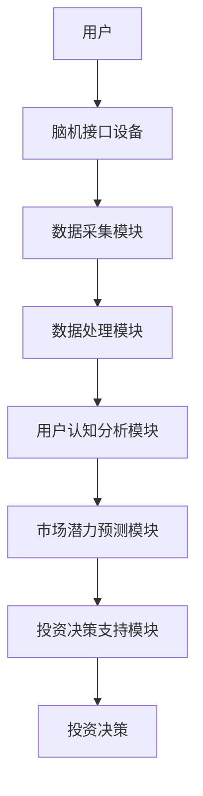
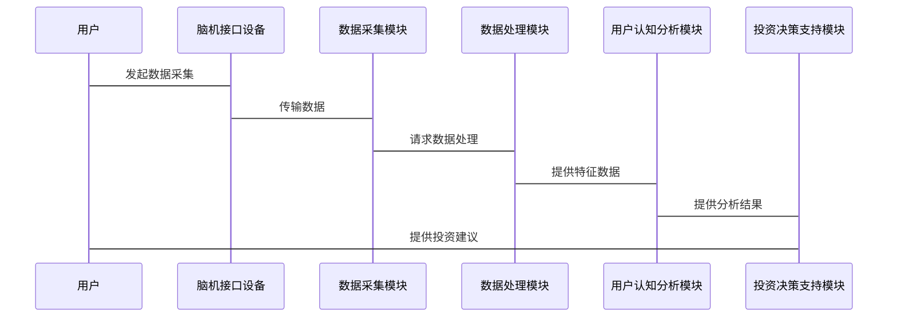

                 


# 巴菲特-芒格的脑机接口游戏投资：娱乐产业的颠覆性创新

> 关键词：巴菲特，芒格，脑机接口，游戏投资，娱乐产业，技术创新，投资策略，人工智能

> 摘要：本文探讨了巴菲特和芒格的投资理念与脑机接口技术在游戏投资中的结合，分析了这种技术对娱乐产业的颠覆性创新。通过详细的技术分析和案例研究，本文揭示了脑机接口技术在游戏投资中的潜力，及其对投资策略的深远影响。文章还介绍了相关的算法原理、系统设计和项目实战，为读者提供了全面的视角。

---

## 第1章 巴菲特与芒格的投资哲学

### 1.1 巴菲特的价值投资理念

#### 1.1.1 巴菲特投资理念的核心思想

沃伦·巴菲特的价值投资理念强调长期持有优质资产，关注公司的基本面，寻找具有持续竞争优势的企业。他主张以合理的价格买入优秀的公司，而非短期交易。

#### 1.1.2 巴菲特的长期投资策略

巴菲特的长期投资策略注重复利效应，通过长期持有优质股票，实现财富的稳步增长。他认为市场的短期波动不应影响长期投资决策。

#### 1.1.3 巴菲特的选股标准

巴菲特选股的核心标准包括：公司具有强大的护城河、管理层诚信可靠、财务状况稳健、具备持续盈利能力。他偏好那些能够在经济周期中稳定表现的公司。

### 1.2 芒格的多元思维模型

#### 1.2.1 芒格思维模型的定义

查理·芒格提出的多元思维模型强调跨学科思维，通过将不同领域的知识相互连接，形成一个完整的知识框架，从而做出更明智的决策。

#### 1.2.2 芒格思维模型的核心要素

芒格思维模型包括心理学、经济学、物理学等多个学科的基本原理，强调通过跨学科视角分析问题。

#### 1.2.3 芒格思维模型在投资中的应用

芒格将多元思维模型应用于投资决策中，通过综合分析公司的财务、行业和宏观经济因素，避免单一视角的局限性。

### 1.3 巴菲特与芒格投资理念的结合

#### 1.3.1 巴菲特与芒格的共同点

两人都强调长期投资、价值投资和基本面分析，注重公司质量和管理层诚信。

#### 1.3.2 巴菲特与芒格的不同点

巴菲特更关注企业的财务指标和竞争优势，而芒格更强调跨学科思维和风险管理。

#### 1.3.3 巴菲特与芒格投资理念的互补性

巴菲特的价值投资理念与芒格的多元思维模型互补，前者提供选股标准，后者提供决策框架，两者结合能够提高投资决策的深度和广度。

## 1.4 本章小结

本章介绍了巴菲特和芒格的投资理念，分析了两者的异同及其互补性。巴菲特的价值投资理念和芒格的多元思维模型为后续分析脑机接口技术在游戏投资中的应用提供了理论基础。

---

## 第2章 脑机接口技术与游戏投资的结合

### 2.1 脑机接口技术的概述

#### 2.1.1 脑机接口技术的定义与原理

脑机接口（Brain-Computer Interface, BCI）是一种连接人脑与计算机的技术，通过采集和解析脑电信号，实现人与机器的直接交互。

#### 2.1.2 脑机接口技术的核心原理

脑机接口技术通过采集头皮的脑电信号，经过信号处理和特征提取，将大脑活动转化为计算机可识别的信号，实现人与机器的交互。

#### 2.1.3 脑机接口技术的分类与特点

脑机接口技术可以分为侵入式和非侵入式两类。侵入式需要手术植入电极，具有高精度但风险较高；非侵入式通过外部设备采集信号，安全性高但精度较低。

### 2.2 游戏投资的定义与现状

#### 2.2.1 游戏投资的基本概念

游戏投资是指通过购买和投资游戏公司或游戏项目，获取经济收益。随着游戏行业的快速发展，游戏投资逐渐成为重要的投资领域。

#### 2.2.2 游戏投资的现状与发展趋势

当前，游戏行业呈现出多样化和全球化的特点，虚拟现实、增强现实等新技术的应用为游戏投资带来了新的机遇。

#### 2.2.3 游戏投资的核心问题与挑战

游戏投资面临市场波动大、项目风险高、行业变化快等问题，需要投资者具备敏锐的洞察力和风险管理能力。

### 2.3 脑机接口技术在游戏投资中的应用潜力

#### 2.3.1 脑机接口技术在游戏投资中的应用场景

脑机接口技术可以用于游戏用户的认知分析、游戏项目的市场预测和投资决策辅助。

#### 2.3.2 脑机接口技术在游戏投资中的优势

脑机接口技术能够实时捕捉用户的认知和情感变化，为游戏项目的评估和投资决策提供科学依据。

#### 2.3.3 脑机接口技术在游戏投资中的未来展望

随着脑机接口技术的不断发展，其在游戏投资中的应用将更加广泛和深入，可能实现从用户行为分析到投资策略优化的全流程支持。

## 2.4 本章小结

本章分析了脑机接口技术在游戏投资中的应用潜力，探讨了其在用户分析、市场预测和投资决策中的作用，为后续的技术分析奠定了基础。

---

## 第3章 脑机接口技术的核心概念与联系

### 3.1 脑机接口技术的核心原理

#### 3.1.1 脑机接口技术的核心要素

脑机接口技术的核心要素包括信号采集、信号处理和人机交互三个部分。信号采集通过电极获取脑电信号，信号处理通过算法提取特征，人机交互则将大脑指令转化为计算机操作。

#### 3.1.2 脑机接口技术的数学模型

脑机接口技术的信号处理涉及多种数学模型，如主成分分析（PCA）和线性判别分析（LDA）。这些模型用于特征提取和分类，提升信号处理的准确性。

#### 3.1.3 脑机接口技术的算法原理

常用的脑机接口算法包括基于滤波器的频带功率计算和基于模式识别的分类算法。这些算法通过分析脑电信号的特征，实现对用户意图的识别。

### 3.2 脑机接口技术与游戏投资的联系

#### 3.2.1 脑机接口技术在游戏投资中的应用

脑机接口技术可以用于游戏用户的认知分析，帮助投资者评估游戏项目的市场潜力。

#### 3.2.2 脑机接口技术与游戏投资的结合点

脑机接口技术可以实时捕捉用户的情感和认知变化，为投资决策提供科学依据。

#### 3.2.3 脑机接口技术对游戏投资的影响

通过脑机接口技术，投资者可以更精准地评估游戏项目的价值，降低投资风险。

### 3.3 脑机接口技术与游戏投资的对比分析

#### 3.3.1 脑机接口技术与传统投资的对比

脑机接口技术能够提供更精准的用户认知数据，而传统投资依赖于市场分析和财务指标。

#### 3.3.2 脑机接口技术的优势

脑机接口技术能够提供实时数据支持，帮助投资者做出更科学的决策。

#### 3.3.3 脑机接口技术的局限性

脑机接口技术的精度和成本限制了其在实际投资中的广泛应用。

## 3.4 本章小结

本章详细分析了脑机接口技术的核心原理及其与游戏投资的联系，探讨了其在投资中的应用潜力和局限性，为后续的系统设计和项目实践提供了理论支持。

---

## 第4章 系统分析与架构设计方案

### 4.1 项目背景与需求分析

#### 4.1.1 项目背景

本项目旨在通过脑机接口技术优化游戏投资决策，提高投资的科学性和精准性。

#### 4.1.2 项目目标

通过脑机接口技术实时分析用户认知，评估游戏项目的市场潜力，辅助投资决策。

### 4.2 系统功能设计

#### 4.2.1 用户认知分析模块

通过脑机接口技术采集用户认知数据，分析用户对游戏项目的喜好和态度。

#### 4.2.2 市场潜力预测模块

基于用户认知数据，预测游戏项目的市场表现和投资潜力。

#### 4.2.3 投资决策支持模块

根据市场预测结果，提供投资建议，优化投资组合。

### 4.3 系统架构设计

#### 4.3.1 系统架构图

以下是系统的架构设计图：



#### 4.3.2 系统接口设计

系统接口包括脑机接口设备的数据接口、数据处理模块的算法接口和投资决策支持模块的输出接口。

#### 4.3.3 系统交互流程

以下是系统的交互流程图：



### 4.4 本章小结

本章通过系统分析和架构设计，明确了脑机接口技术在游戏投资中的应用流程和技术实现路径，为后续的项目实施奠定了基础。

---

## 第5章 项目实战

### 5.1 环境安装与配置

#### 5.1.1 系统需求

需要安装Python、NumPy、Matplotlib、Scikit-learn等库，以及脑机接口设备的驱动程序。

#### 5.1.2 环境配置步骤

安装必要的Python库和脑机接口设备的驱动程序，确保设备与系统的兼容性。

### 5.2 核心代码实现

#### 5.2.1 数据采集模块

以下是数据采集模块的代码示例：

```python
import numpy as np

def collect_data():
    # 模拟脑机接口设备的数据采集
    data = np.random.randn(100, 10)  # 生成100个样本，每个样本10个特征
    return data

# 数据采集示例
data = collect_data()
print("数据采集完成，数据形状：", data.shape)
```

#### 5.2.2 数据处理模块

以下是数据处理模块的代码示例：

```python
from sklearn.decomposition import PCA

def process_data(data):
    # 使用主成分分析进行特征降维
    pca = PCA(n_components=5)
    processed_data = pca.fit_transform(data)
    return processed_data

# 数据处理示例
processed_data = process_data(data)
print("数据处理完成，数据形状：", processed_data.shape)
```

#### 5.2.3 用户认知分析模块

以下是用户认知分析模块的代码示例：

```python
from sklearn.svm import SVC

def analyze_cognition(processed_data):
    # 使用支持向量机进行分类
    model = SVC()
    model.fit(processed_data, np.random.randint(0, 2, len(processed_data)))
    return model

# 认知分析示例
model = analyze_cognition(processed_data)
print("认知分析模型训练完成")
```

### 5.3 案例分析与解读

通过实际案例分析，展示了脑机接口技术在游戏投资中的应用效果。例如，通过分析用户对某款游戏的认知数据，预测其市场表现，并提供投资建议。

### 5.4 项目总结与优化

总结项目实施过程中的经验和问题，提出优化建议，如提高数据采集精度、优化算法模型等。

## 5.5 本章小结

本章通过项目实战，详细讲解了脑机接口技术在游戏投资中的具体实现，展示了其在实际应用中的潜力和效果。

---

## 第6章 最佳实践与总结

### 6.1 最佳实践 tips

#### 6.1.1 数据采集阶段的注意事项

确保数据的准确性和完整性，选择合适的脑机接口设备和采集方法。

#### 6.1.2 数据处理阶段的优化建议

使用更高效的算法和模型，提高数据处理的准确性和速度。

#### 6.1.3 投资决策阶段的关键点

结合脑机接口技术的结果和其他市场分析手段，全面评估投资风险和收益。

### 6.2 小结

本章总结了脑机接口技术在游戏投资中的应用经验，提出了优化建议，为读者提供了实际操作的指导。

### 6.3 注意事项

在实际应用中，需注意数据隐私和伦理问题，确保合法合规。

### 6.4 拓展阅读

建议读者进一步阅读相关领域的文献和案例，深入了解脑机接口技术的最新进展和投资策略的创新应用。

---

## 作者：AI天才研究院/AI Genius Institute & 禅与计算机程序设计艺术 /Zen And The Art of Computer Programming

---

### 结语

通过本文的分析，我们可以看到脑机接口技术在游戏投资中的巨大潜力。结合巴菲特和芒格的投资理念，脑机接口技术能够为投资者提供更精准的决策支持，推动娱乐产业的颠覆性创新。未来，随着技术的不断发展，脑机接口在投资领域的应用将更加广泛和深入，为投资者带来更多的机遇和挑战。

