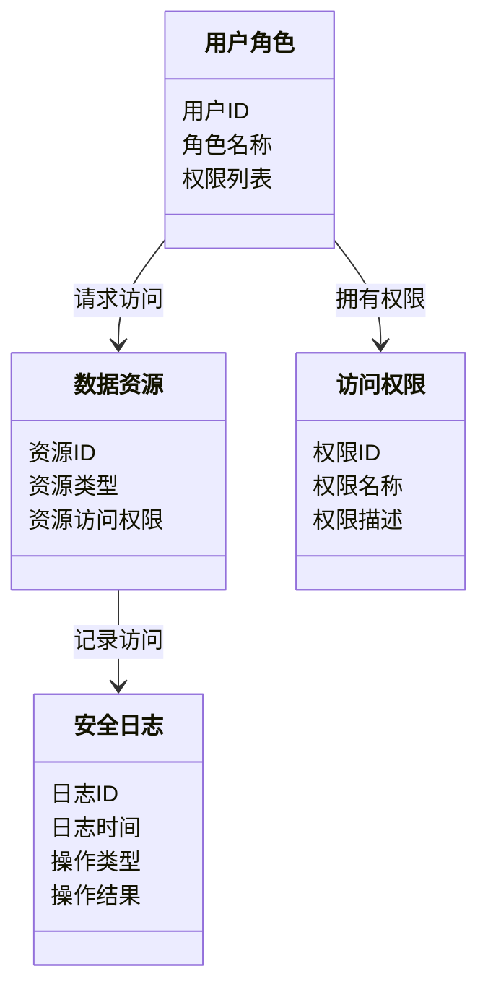
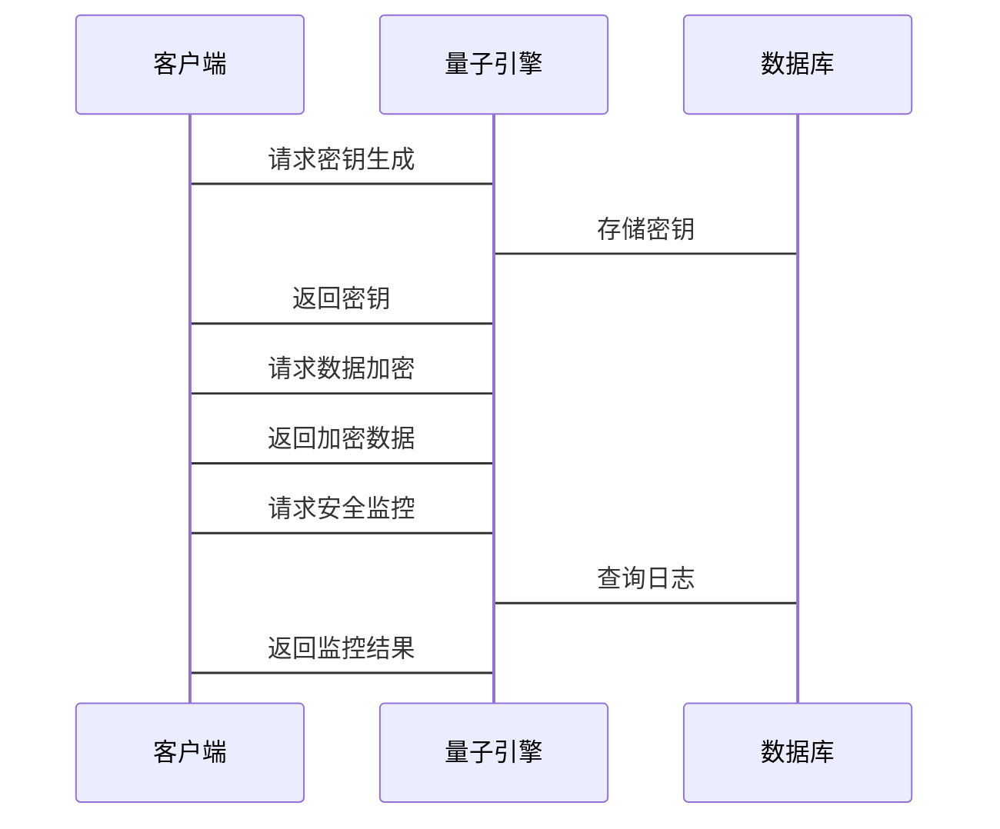

                 


# 巴菲特-芒格的量子云安全服务投资：数据保护的终极解决方案

> 关键词：巴菲特，芒格，量子云安全，数据保护，投资策略，量子计算，云安全服务

> 摘要：本文深入分析了巴菲特和芒格在量子云安全服务领域的投资策略，探讨了量子云安全服务的核心原理、系统架构设计以及实际项目中的应用。通过结合巴菲特的价值投资理念和芒格的多元思维模型，本文为读者提供了从理论到实践的全面指导，展示了如何利用量子云安全服务实现数据保护的终极解决方案。

---

## 第一部分: 巴菲特-芒格的量子云安全服务投资概述

### 第1章: 量子云安全服务与投资概述

#### 1.1 量子云安全服务的基本概念
量子云安全服务是一种结合了量子计算和云计算技术的安全解决方案，旨在通过量子计算的超强计算能力，提供更高效、更安全的数据保护服务。量子云安全服务的核心在于利用量子计算的特性，解决传统加密算法在面对量子计算攻击时的脆弱性问题。

#### 1.2 巴菲特与芒格的投资理念
巴菲特的价值投资策略强调长期稳健的投资回报，注重企业的基本面和内在价值。芒格的多元思维模型则强调从多个角度分析问题，注重知识的广度和深度。两人投资理念的结合，使得他们在选择投资标的时，能够全面评估技术和市场的双重因素。

#### 1.3 量子云安全服务的投资价值
量子云安全服务的投资价值主要体现在其技术优势和市场潜力上。随着数据保护需求的不断增加，量子云安全服务能够提供更高效、更安全的数据加密和解密服务，市场需求巨大。同时，量子计算的技术优势也使得这类服务在未来的竞争中具有更强的护城河。

---

## 第二部分: 量子云安全服务的核心原理

### 第2章: 量子计算在安全中的应用

#### 2.1 量子计算的基本原理
量子计算利用量子叠加和量子纠缠的特性，能够在某些特定问题上实现远超经典计算机的计算能力。量子计算的核心在于其量子位（qubit）的并行计算能力，能够在处理复杂数学问题时表现出显著的优势。

#### 2.2 量子加密算法的实现
量子加密算法，如量子密钥分发（QKD）和量子签名，利用量子力学的特性实现信息的高效加密和解密。量子密钥分发通过量子态的不可克隆性，确保了密钥的安全传输，从而实现无条件安全的加密通信。

#### 2.3 量子计算对传统加密的挑战
传统加密算法，如RSA和AES，依赖于大数分解和非线性代数问题的难度。然而，量子计算机在解决这些问题时具有显著优势，可能会对现有的加密体系构成威胁。因此，量子云安全服务的出现，正是为了应对这一挑战。

### 第3章: 云安全服务的关键技术

#### 3.1 数据加密与解密
数据加密是云安全服务的核心技术之一。量子云安全服务通过量子加密算法，实现了数据在传输和存储过程中的无条件安全加密。同时，解密过程需要依赖量子密钥分发技术，确保数据的准确还原。

#### 3.2 访问控制机制
访问控制是云安全服务的另一项关键技术。量子云安全服务通过基于角色的访问控制（RBAC）和多因素认证（MFA），确保只有授权用户能够访问敏感数据。同时，访问日志的记录和分析，也为安全审计提供了有力支持。

#### 3.3 威胁检测与防护
量子云安全服务通过结合人工智能技术，实现了对网络流量的实时监控和威胁检测。基于机器学习的异常行为分析，能够有效识别潜在的安全威胁，并通过自动化响应机制，快速采取防护措施。

### 第4章: 量子云安全服务的架构分析

#### 4.1 问题场景介绍
量子云安全服务的典型应用场景包括企业数据加密、金融交易安全、医疗数据保护等。在这些场景中，数据的机密性和完整性要求极高，传统的加密算法和安全防护措施已经难以满足需求。

#### 4.2 系统架构设计
量子云安全服务的系统架构通常包括量子计算引擎、云存储服务、加密通信模块和安全监控模块。这些模块协同工作，确保数据在各个环节的安全性。

#### 4.3 接口设计和交互流程
量子云安全服务通过标准的API接口，与其他系统实现无缝对接。交互流程包括密钥生成、数据加密、传输和解密等步骤，确保数据在各个环节的安全性。

---

## 第三部分: 巴菲特与芒格投资策略的数学模型

### 第5章: 巴菲特的价值投资模型

#### 5.1 市盈率与市净率分析
市盈率（P/E）和市净率（P/B）是衡量企业价值的重要指标。巴菲特的价值投资模型强调选择市盈率和市净率合理的公司，同时关注企业的盈利能力和发展潜力。

#### 5.2 财务指标的权重分配
巴菲特在选择投资标的时，通常会综合考虑企业的收入、利润、现金流等财务指标，并根据行业特点和企业具体情况，对各项指标赋予不同的权重。

#### 5.3 投资组合优化的数学公式
通过马科维茨的现代投资组合理论，巴菲特的投资组合优化模型可以通过以下公式进行描述：
$$
\text{目标函数：} \min_w \frac{1}{2}w^T\Sigma w \\
\text{约束条件：} w^T\mu = r, \sum_{i=1}^n w_i = 1
$$
其中，\( w \) 是投资权重向量，\( \Sigma \) 是协方差矩阵，\( \mu \) 是预期收益向量，\( r \) 是目标收益。

### 第6章: 芒格的多元思维模型

#### 6.1 多元思维的数学表示
芒格的多元思维模型可以表示为一个复杂的知识网络，其中每个节点代表一个知识领域，节点之间的边表示知识之间的关联性。通过构建和优化这个网络，芒格能够从多个角度分析问题，提高决策的准确性。

#### 6.2 知识网络的构建与优化
知识网络的构建可以通过图论中的边权值和节点度数进行优化。通过持续的学习和知识更新，芒格的知识网络能够不断进化，提高对复杂问题的应对能力。

#### 6.3 多元思维在投资决策中的应用
芒格的多元思维模型在投资决策中的应用，可以通过以下步骤实现：
1. 识别投资标的的关键特征；
2. 构建知识网络，分析各特征之间的关系；
3. 通过网络优化，找到最优投资组合。

### 第7章: 量子云安全服务投资的数学模型

#### 7.1 投资回报率的计算公式
量子云安全服务的投资回报率（ROI）可以通过以下公式计算：
$$
ROI = \frac{\text{投资收益} - \text{初始投资}}{\text{初始投资}} \times 100\%
$$
其中，投资收益包括收入增长和成本节约。

#### 7.2 风险评估的数学模型
量子云安全服务的风险评估可以通过概率论和统计学方法进行建模。常见的风险评估模型包括VaR（在险价值）和CVaR（条件在险价值），其中：
$$
VaR = \text{损失超过某一置信水平的最大损失}
$$
$$
CVaR = \text{在VaR水平上的平均损失}
$$

#### 7.3 投资组合的优化策略
通过结合巴菲特的价值投资模型和芒格的多元思维模型，量子云安全服务的投资组合优化可以通过以下步骤实现：
1. 确定投资目标和风险承受能力；
2. 选择具有高成长性和高安全性的量子云安全服务公司；
3. 优化投资组合，分散风险；
4. 定期评估和调整投资组合。

---

## 第四部分: 量子云安全服务的系统架构设计

### 第8章: 问题场景介绍

#### 8.1 问题场景介绍
在量子云安全服务的实际应用中，常见的问题场景包括数据泄露、网络攻击、身份盗用等。这些问题需要通过高效的加密算法和安全防护措施来解决。

### 第9章: 系统功能设计

#### 9.1 领域模型设计
领域模型是量子云安全服务系统设计的核心，主要包括用户角色、数据资源、访问权限和安全日志等实体。领域模型可以通过以下Mermaid类图表示：



#### 9.2 系统架构设计
量子云安全服务的系统架构通常采用分层架构，主要包括数据层、业务逻辑层和表现层。系统的架构可以通过以下Mermaid架构图表示：

```mermaid
archi
    title 量子云安全服务架构
    client --> API Gateway: HTTP 请求
    API Gateway --> Quantum Engine: 请求处理
    Quantum Engine --> Database: 数据存储
    Database --> Monitor: 日志记录
    Monitor --> Alarm System: 报警触发
    Alarm System --> DevOps: 响应处理
```

#### 9.3 系统接口设计
系统接口设计是量子云安全服务实现的关键。主要的接口包括密钥生成接口、数据加密接口和安全监控接口。接口设计可以通过以下Mermaid序列图表示：



---

## 第五部分: 项目实战

### 第10章: 量子云安全服务项目实战

#### 10.1 环境安装
量子云安全服务的环境安装需要以下步骤：
1. 安装量子计算引擎；
2. 配置云存储服务；
3. 部署安全监控系统；
4. 配置API接口。

#### 10.2 核心代码实现
量子云安全服务的核心代码实现包括密钥生成、数据加密和安全监控功能。以下是一个Python实现示例：

```python
import hashlib
import量子引擎

def generate_key():
    key = 量子引擎.quantum_key_distribution()
    return key

def encrypt_data(data, key):
    encrypted_data = hashlib.sha256(data.encode() + key.encode()).hexdigest()
    return encrypted_data

def decrypt_data(encrypted_data, key):
    decrypted_data = 量子引擎.quantum_decryption(encrypted_data, key)
    return decrypted_data

def monitor_security():
    log = 量子引擎.security_monitor()
    return log
```

#### 10.3 代码功能解读
密钥生成函数通过量子密钥分发技术生成安全的加密密钥。数据加密函数利用哈希算法实现数据的加密存储。数据解密函数则通过量子解密引擎实现数据的还原。安全监控函数通过量子安全引擎实现对系统安全状态的实时监控。

#### 10.4 实际案例分析
以金融行业的数据保护为例，通过量子云安全服务实现客户交易数据的加密存储和安全传输。通过实际案例分析，验证量子云安全服务在数据保护中的有效性。

#### 10.5 项目小结
通过量子云安全服务的项目实战，读者可以掌握从环境搭建到代码实现再到系统部署的完整流程，为实际应用打下坚实基础。

---

## 第六部分: 总结与展望

### 第11章: 总结与展望

#### 11.1 最佳实践 tips
- 投资量子云安全服务需要关注企业的技术实力和市场前景。
- 数据保护需要结合量子计算和人工智能技术，实现智能化的安全防护。
- 定期评估和优化投资组合，确保投资回报的最大化。

#### 11.2 小结
通过本文的分析，读者可以全面了解巴菲特和芒格在量子云安全服务投资中的策略和方法。量子云安全服务作为数据保护的终极解决方案，具有广阔的应用前景和投资潜力。

#### 11.3 注意事项
- 数据保护需要遵循相关法律法规，确保合规性。
- 量子云安全服务的技术实现需要结合企业的实际情况，选择合适的方案。
- 投资决策需要综合考虑技术、市场和财务等多方面因素。

#### 11.4 拓展阅读
- 《巴菲特投资思想的现代启示录》
- 《芒格的多元思维模型：从认知到实践》
- 《量子计算与云安全：技术与应用》

---

## 作者

作者：AI天才研究院/AI Genius Institute & 禅与计算机程序设计艺术/Zen And The Art of Computer Programming

