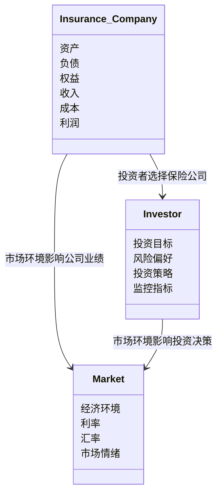
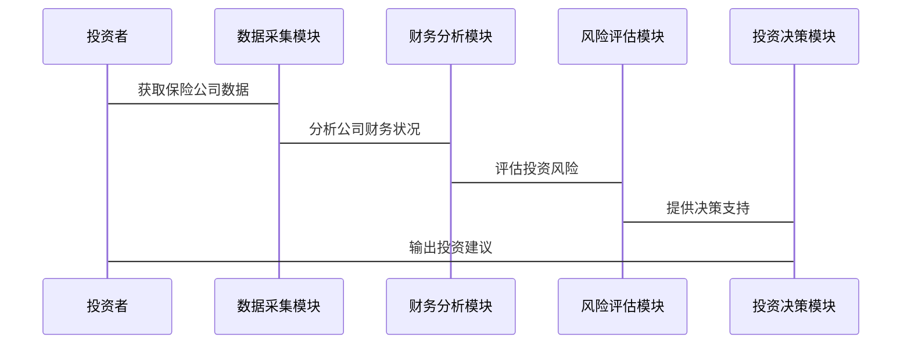

                 


# 巴菲特的保险业投资策略

## 关键词：巴菲特，保险业，投资策略，价值投资，风险管理，安全边际

## 摘要：本文深入探讨了巴菲特在保险业投资的策略和方法，分析了他的价值投资理念如何在保险业中得以应用，以及他如何通过安全边际和风险管理来确保投资的长期稳健回报。文章结合经典案例，详细解析了巴菲特的投资逻辑和实际操作中的关键步骤。

---

# 第1章 巴菲特投资理念与保险业的结合

## 1.1 巴菲特投资理念的核心要素

### 1.1.1 价值投资的定义与核心原则

- 价值投资的定义：寻找市场价格低于其内在价值的股票进行投资。
- 核心原则：注重企业的基本面分析，寻找具有持续竞争优势和良好管理团队的企业。
- 安全边际的概念：在价格远低于内在价值时买入，以降低投资风险。

### 1.1.2 巴菲特对保险业的独特见解

- 保险业的特殊性：保险公司是负债驱动型企业，承保业务和投资业务的协同效应。
- 保险行业的周期性：通过长期投资和稳健管理，熨平周期波动。
- 保险企业的内在价值：关注ROE（净资产收益率）和管理层能力。

### 1.1.3 保险业在巴菲特投资组合中的地位

- 保险业作为长期投资的重要组成部分。
- 保险业务提供稳定的现金流和风险分散能力。

## 1.2 保险业的基本概念与行业特点

### 1.2.1 保险业的定义与分类

- 保险的定义：以合同形式转移风险的经济行为。
- 保险的分类：寿险、健康险、财险等。
- 保险公司的类型：财产险公司、人寿保险公司、再保险公司。

### 1.2.2 保险公司的财务结构与风险特征

- 资产负债表分析：资产（投资资产）、负债（保费收入）、权益（股东权益）。
- 风险特征：信用风险、流动性风险、市场风险。
- 资本充足性：资本充足率的计算与意义。

### 1.2.3 保险业的周期性与波动性分析

- 保险业的周期性：受宏观经济波动影响较大。
- 股价波动性：短期波动大，长期趋势稳健。

## 1.3 巴菲特投资保险业的背景与动机

### 1.3.1 巴菲特早期投资经历与保险业的关联

- 早期投资经验：集中于保险和金融行业。
- 对保险行业的熟悉与信任：通过长期观察和实践积累的经验。

### 1.3.2 保险业作为长期投资工具的优势

- 稳定的现金流：保险业务提供稳定的保费收入。
- 资产负债匹配：通过投资实现资产与负债的期限匹配。
- 高ROE潜力：优质保险公司具备较高的净资产收益率。

### 1.3.3 巴菲特对保险业的长期看好与战略布局

- 保险行业的长期增长潜力：随着经济发展，保险需求增加。
- 股东价值最大化：通过控股保险公司实现长期价值增长。

---

# 第2章 保险公司的财务结构与巴菲特的评估标准

## 2.1 保险公司的财务结构分析

### 2.1.1 资产负债表的核心要素

- 资产：投资资产（股票、债券、房地产等）、应收保费等。
- 负债：未付理赔、保费收入等。
- 权益：股东权益，包括巴菲特的伯克希尔公司。

### 2.1.2 利润表与现金流分析

- 利润表：营业收入、营业成本、净利润。
- 现金流：经营活动现金流、投资活动现金流、筹资活动现金流。

### 2.1.3 股东权益变动与分红政策

- 股东权益：资本公积、盈余公积、未分配利润。
- 分红政策：稳定分红与股东回报。

## 2.2 巴菲特对保险公司的估值方法

### 2.2.1 股权资本成本与内在价值计算

- 内在价值公式：DCF（现金流折现模型）。
- 股权资本成本：CAPM模型的应用。

### 2.2.2 市盈率与市净率的适用性分析

- 市盈率：适用于成长型企业，但保险业更注重ROE。
- 市净率：适用于资产密集型行业，保险业适用性有限。

### 2.2.3 现金流折现模型在保险业的应用

- 自由现金流的计算：扣除再投资需求后的现金流。
- 折现率的选择：基于资本成本和风险溢价。

## 2.3 巴菲特对管理层的信任与考核

### 2.3.1 管理层能力评估标准

- 诚信与正直：管理层的道德水平。
- 专业能力：投资能力和风险管理能力。
- 长期愿景：是否致力于股东价值最大化。

### 2.3.2 长期激励机制与股东利益保护

- 股票期权：激励管理层与股东利益一致。
- 管理层薪酬结构：平衡短期与长期激励。

### 2.3.3 管理层决策对股价的影响

- 重大决策：如并购、投资项目的决策。
- 决策透明度：信息对称与投资者信任。

---

# 第3章 巴菲特保险投资策略的核心要素

## 3.1 安全边际的概念与应用

### 3.1.1 安全边际的定义与计算方法

- 安全边际：市场价格低于内在价值的部分。
- 计算公式：内在价值 - 市场价格。

### 3.1.2 安全边际在保险业投资中的具体应用

- 选择具有较高安全边际的保险公司。
- 避免过度杠杆和高风险投资。

### 3.1.3 安全边际与风险控制的关系

- 风险控制：通过安全边际降低投资风险。
- 投资组合分散：通过多样化的投资降低特定风险。

## 3.2 保险公司的承保能力与投资能力

### 3.2.1 承保业务的风险评估与定价

- 风险评估：分析承保业务的赔付率和费用率。
- 定价策略：基于精算模型确定保费。

### 3.2.2 投资业务的资产配置与风险分散

- 资产配置：固定收益类、权益类资产的配置比例。
- 风险分散：通过多元化投资降低市场风险。

### 3.2.3 承保与投资的协同效应

- 资金运用：承保业务提供稳定的资金来源。
- 风险控制：承保与投资业务的风险相互抵消。

## 3.3 巴菲特对保险业的长期投资策略

### 3.3.1 长期投资与复利效应

- 复利公式：A = P(1 + r)^n。
- 长期投资的优势：复利效应最大化。

### 3.3.2 保险业的周期性与巴菲特的应对策略

- 周期性分析：保险业的周期性波动。
- 投资策略：逆周期投资，买入优质保险公司股票。

### 3.3.3 股东价值最大化与公司治理

- 股东价值最大化：通过长期投资实现。
- 公司治理：监督管理层，确保股东利益。

---

# 第4章 巴菲特保险投资的经典案例分析

## 4.1 富国银行的收购与整合

### 4.1.1 富国银行的基本情况与投资价值

- 富国银行的业务模式：零售银行、信用卡业务。
- 投资价值：低估值、高ROE。

### 4.1.2 并购过程中的风险控制与整合策略

- 并购过程：收购条件、尽职调查。
- 整合策略：保持管理层稳定，优化业务流程。

### 4.1.3 并购后的业绩表现与股东回报

- 并购后的业绩：净利润增长、股价上涨。
- 股东回报：分红与股价增值。

## 4.2 伯克希尔 Hathaway 的保险帝国建设

### 4.2.1 伯克希尔 Hathaway 的发展历程

- 初创时期：纺织厂收购。
- 发展阶段：逐步收购保险公司、铁路公司等。

### 4.2.2 保险业务的多元化与协同效应

- 多元化的保险业务：财产险、责任险、再保险。
- 协同效应：承保与投资业务的互补。

### 4.2.3 伯克希尔 Hathaway 的投资策略

- 投资组合：股票、债券、房地产等多种资产。
- 投资理念：价值投资、长期持有。

---

# 第5章 巴菲特保险投资策略的系统分析与架构设计

## 5.1 问题场景介绍

- 投资者如何在保险业中应用巴菲特的投资策略。
- 如何评估保险公司的内在价值。

## 5.2 系统功能设计（领域模型）



## 5.3 系统架构设计


## 5.4 系统接口设计

- 数据接口：从市场获取保险公司的财务数据。
- 决策接口：输出投资建议和风险预警。

## 5.5 系统交互设计



---

# 第6章 项目实战：巴菲特投资策略的应用

## 6.1 环境安装

- 数据来源：Yahoo Finance、公司财报。
- 工具：Excel、Python（Pandas、NumPy）。

## 6.2 核心实现源代码

```python
import pandas as pd
import numpy as np

def calculate_intrinsic_value(enterprise_value, net_profit):
    return enterprise_value * (1 + net_profit/100)

# 示例数据
enterprise_value = 1000000
net_profit = 15

intrinsic_value = calculate_intrinsic_value(enterprise_value, net_profit)
print(f"内在价值: {intrinsic_value}")
```

## 6.3 代码应用解读与分析

- 计算内在价值：使用DCF模型或简化模型。
- 安全边际计算：内在价值减去市场价格。

## 6.4 实际案例分析

- 案例：可口可乐的收购与投资。
- 分析：巴菲特如何通过长期持有实现收益。

## 6.5 项目小结

- 投资策略的有效性：长期视角的重要性。
- 风险控制的关键性：安全边际的应用。

---

# 第7章 总结与最佳实践

## 7.1 小结

- 巴菲特的投资理念：价值投资、长期持有。
- 保险业的特殊性：财务结构与风险特征。

## 7.2 注意事项

- 风险控制：避免过度杠杆和高风险投资。
- 选择管理层：信任与能力并重。

## 7.3 拓展阅读

- 《巴菲特的智慧》
- 《投资最重要的ことは何か》

---

# 作者：AI天才研究院/AI Genius Institute & 禅与计算机程序设计艺术 /Zen And The Art of Computer Programming

