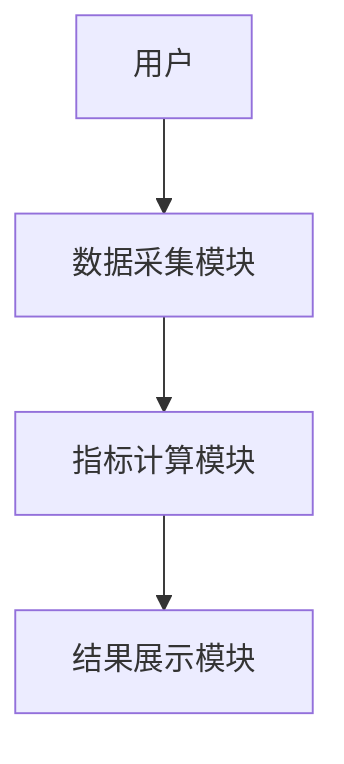

                 


# 巴菲特的创新能力评估：如何在快速变化的市场中保持领先

> 关键词：创新能力评估，巴菲特，投资策略，市场变化，技术创新，企业竞争力

> 摘要：本文将详细探讨巴菲特创新能力评估的核心理念，分析其在快速变化市场中的应用，通过系统化的模型和算法，结合实际案例，为企业提供在现代市场中保持领先的具体方法。

---

# 第1章: 巴菲特创新能力评估的背景与核心概念

## 1.1 巴菲特创新理念的演变

### 1.1.1 巴菲特早期投资策略
巴菲特早期的投资策略以价值投资为核心，注重企业的基本面分析和长期稳健的增长。他通过对企业财务状况、管理层能力和行业地位的深入研究，寻找那些具有持续竞争优势的企业进行投资。

### 1.1.2 巴菲特价值投资的核心理念
价值投资的核心是寻找市场低估的企业，通过长期持有这些企业，获得稳定的收益。巴菲特强调安全边际的重要性，即以低于内在价值的价格买入优质资产。

### 1.1.3 巴菲特创新理念的提出背景
随着市场的快速变化和技术的飞速发展，传统的企业评估方法逐渐暴露出局限性。巴菲特的创新理念是在原有价值投资基础上，结合现代企业的创新能力和市场适应能力，提出了新的评估体系。

## 1.2 创新能力评估的定义与内涵

### 1.2.1 创新能力的定义
创新能力是指企业在市场中不断推出新产品、改进服务、优化管理等方面的能力。它是企业在竞争中保持优势的核心竞争力。

### 1.2.2 创新能力的核心要素
创新能力的评估可以从以下几个方面进行：
- **技术创新能力**：企业是否能够持续推出新技术或产品。
- **管理创新能力**：企业是否能够优化管理模式，提高效率。
- **市场适应能力**：企业是否能够快速响应市场变化，调整战略。

### 1.2.3 创新能力评估的边界与外延
创新能力评估不仅关注企业的技术创新，还包括管理、市场、商业模式等多个方面。其外延包括企业内部创新能力的提升和外部环境对企业创新的支持。

## 1.3 巴菲特创新理念与现代市场的结合

### 1.3.1 现代市场变化对企业创新的要求
现代市场变化迅速，技术迭代快，企业必须具备快速创新能力才能在激烈的竞争中生存。

### 1.3.2 巴菲特创新理念的现代应用
巴菲特的创新理念强调企业不仅要有内在价值，还要有持续创新能力，以适应市场的变化。

### 1.3.3 创新能力评估在企业中的重要性
创新能力评估是企业在现代市场中保持竞争力的关键因素，也是投资者评估企业长期价值的重要依据。

## 1.4 本章小结
本章主要介绍了巴菲特创新能力评估的背景和核心概念，强调了创新能力在现代市场中的重要性。

---

# 第2章: 巴菲特创新能力评估的核心模型

## 2.1 创新能力评估的模型构建

### 2.1.1 模型构建的基本思路
创新能力评估模型需要综合考虑企业的技术创新、管理创新和市场适应能力等多个方面。

### 2.1.2 模型的核心要素与关系
创新能力评估模型的核心要素包括技术创新能力、管理创新能力、市场适应能力等，各要素之间相互作用，共同影响企业的创新能力。

### 2.1.3 模型的适用范围与限制
该模型适用于所有行业的企业，但对技术密集型和创新驱动型企业更为适用。

## 2.2 创新能力评估的数学模型

### 2.2.1 创新能力指数模型
$$ \text{创新能力指数} = \frac{\text{创新得分}}{\text{基准得分}} \times 100 $$

### 2.2.2 创新能力评分系统
$$ \text{评分} = \sum_{i=1}^{n} w_i \times s_i $$

其中，$w_i$ 是第 $i$ 个创新要素的权重，$s_i$ 是第 $i$ 个创新要素的得分。

### 2.2.3 创新能力评估的权重分配
| 创新要素       | 权重 |
|----------------|------|
| 技术创新能力     | 40% |
| 管理创新能力     | 30% |
| 市场适应能力     | 30% |

## 2.3 模型的验证与优化

### 2.3.1 模型的验证方法
通过历史数据分析和实际案例验证模型的有效性。

### 2.3.2 模型的优化策略
根据实际应用结果，逐步优化各创新要素的权重和评估标准。

## 2.4 本章小结
本章详细介绍了创新能力评估的核心模型，包括模型的构建、数学表达式和验证优化方法。

---

# 第3章: 巴菲特创新能力评估的算法实现

## 3.1 算法原理概述

### 3.1.1 算法的基本原理
通过对企业各项创新指标的量化评估，综合计算出创新能力指数。

### 3.1.2 算法的核心步骤
1. 收集企业的创新指标数据。
2. 根据权重分配对各指标进行评分。
3. 计算创新能力指数。
4. 输出评估结果。

## 3.2 创新能力评估的数学模型

### 3.2.1 创新能力指数计算公式
$$ \text{创新能力指数} = \sum_{i=1}^{n} w_i \times s_i $$

其中，$w_i$ 是第 $i$ 个创新指标的权重，$s_i$ 是第 $i$ 个创新指标的得分。

### 3.2.2 创新能力评分系统的实现
1. 确定各创新指标的权重。
2. 根据企业实际数据计算各指标得分。
3. 按权重计算创新能力指数。

## 3.3 算法的实现代码

```python
def calculate_innovation_index(criteria_scores, weights):
    innovation_index = sum(w * s for w, s in zip(weights, criteria_scores))
    return innovation_index

# 示例数据
criteria_scores = [85, 70, 90]
weights = [0.4, 0.3, 0.3]

index = calculate_innovation_index(criteria_scores, weights)
print(f"创新能力指数: {index}")
```

## 3.4 本章小结
本章详细介绍了创新能力评估的算法实现，包括算法原理、数学模型和具体代码实现。

---

# 第4章: 巴菲特创新能力评估的系统分析与架构设计

## 4.1 系统功能设计

### 4.1.1 系统功能模块
1. 数据采集模块。
2. 指标计算模块。
3. 结果展示模块。

### 4.1.2 系统功能流程
1. 数据采集：收集企业的各项创新指标数据。
2. 指标计算：根据权重计算创新能力指数。
3. 结果展示：生成可视化报告。

## 4.2 系统架构设计

### 4.2.1 系统架构图


### 4.2.2 系统接口设计
1. 数据采集接口：用于接收企业创新指标数据。
2. 计算接口：用于计算创新能力指数。
3. 展示接口：用于输出评估结果。

## 4.3 本章小结
本章详细介绍了创新能力评估系统的功能设计和架构设计，为实际应用提供了参考。

---

# 第5章: 巴菲特创新能力评估的项目实战

## 5.1 项目背景与目标

### 5.1.1 项目背景
某科技企业希望对其创新能力进行评估，以优化企业战略。

### 5.1.2 项目目标
通过创新能力评估模型，帮助企业识别自身的竞争优势和改进方向。

## 5.2 项目实施步骤

### 5.2.1 数据收集
收集企业的技术创新、管理创新和市场适应能力指标。

### 5.2.2 指标计算
根据权重计算创新能力指数。

### 5.2.3 结果分析
根据评估结果制定改进策略。

## 5.3 实施案例分析

### 5.3.1 案例数据
| 创新指标       | 得分 | 权重 |
|----------------|------|------|
| 技术创新能力     | 85   | 0.4  |
| 管理创新能力     | 70   | 0.3  |
| 市场适应能力     | 90   | 0.3  |

### 5.3.2 计算结果
$$ \text{创新能力指数} = 85 \times 0.4 + 70 \times 0.3 + 90 \times 0.3 = 83 $$

### 5.3.3 分析解读
该企业的创新能力指数为83，属于较高水平，但在管理创新方面需要进一步优化。

## 5.4 本章小结
本章通过实际案例展示了创新能力评估模型的应用，为企业提供了参考。

---

# 第6章: 巴菲特创新能力评估的最佳实践

## 6.1 小结与总结

### 6.1.1 核心观点总结
创新能力是企业在现代市场中保持竞争力的关键因素，巴菲特创新能力评估模型为企业提供了一套科学的评估方法。

## 6.2 注意事项与风险提示

### 6.2.1 数据质量的重要性
评估结果的准确性依赖于数据的准确性和完整性。

### 6.2.2 模型适用性
不同行业和企业可能需要调整模型的权重和评估标准。

## 6.3 拓展阅读与学习资源

### 6.3.1 推荐书籍
1. 《巴菲特传》
2. 《创新者的窘境》

### 6.3.2 在线资源
1. 巴菲特投资理念的相关网站。
2. 创新管理的学术论文。

## 6.4 本章小结
本章总结了创新能力评估的重要性和应用中的注意事项，为读者提供了进一步学习的方向。

---

# 作者：AI天才研究院 & 禅与计算机程序设计艺术

---

以上是《巴菲特的创新能力评估：如何在快速变化的市场中保持领先》的技术博客文章的完整目录和内容框架。通过系统化的模型、算法和实际案例分析，本文为企业在现代市场中保持创新能力提供了科学的指导和实践参考。

