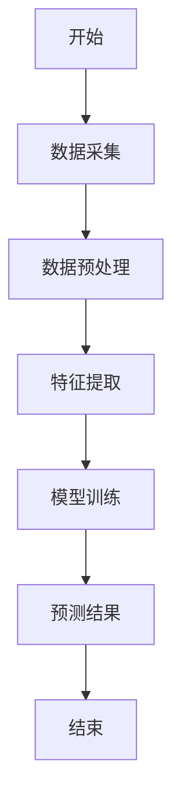
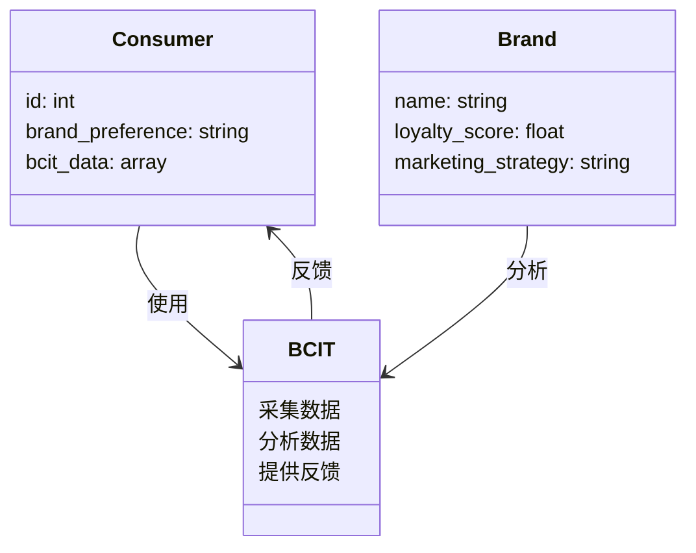
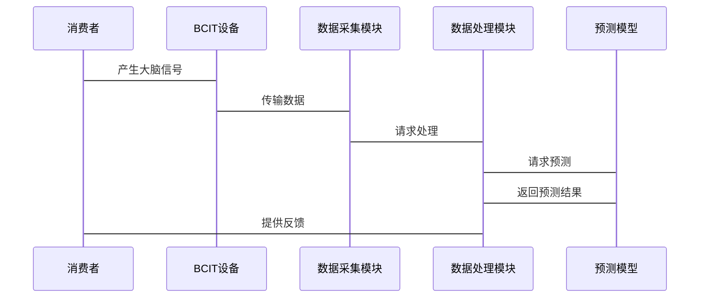

                 


# 巴菲特的品牌忠诚度分析：脑机接口时代的消费者行为预测

## 关键词：
- 巴菲特
- 品牌忠诚度
- 消费者行为预测
- 脑机接口（BCI）
- 投资策略
- 数据分析

## 摘要：
本文探讨了在脑机接口技术发展迅速的背景下，如何利用巴菲特的品牌忠诚度分析方法来预测消费者行为。通过分析品牌忠诚度的核心要素，结合脑机接口技术的潜力，本文提出了一个结合传统投资理念与新兴技术的消费者行为预测模型，为品牌管理和投资决策提供新思路。

## 正文：

### 第1章：背景介绍与问题背景

#### 1.1 问题背景
- **1.1.1 品牌忠诚度的定义与重要性**
  - 品牌忠诚度是指消费者对某一品牌产品的偏好和持续购买行为。
  - 在市场竞争激烈的今天，品牌忠诚度是企业长期成功的关键因素之一。

- **1.1.2 巴菲特投资理念与品牌忠诚度的关系**
  - 巴菲特的价值投资理念强调选择具有强大护城河和长期稳定表现的公司。
  - 品牌忠诚度高的企业往往具备更强的市场竞争力和持续盈利能力，符合巴菲特的投资标准。

- **1.1.3 脑机接口技术的定义与现状**
  - 脑机接口（BCI）是一种直接连接人类大脑与外部设备的技术，能够实时采集和分析大脑活动数据。
  - 随着技术的进步，BCI在医疗、教育、娱乐等多个领域展现出巨大潜力，尤其是在消费者行为分析方面。

#### 1.2 问题描述
- **1.2.1 品牌忠诚度在消费者行为中的作用**
  - 品牌忠诚度影响消费者的购买决策，降低企业的营销成本，并提高市场占有率。
- **1.2.2 脑机接口技术在消费者行为分析中的潜力**
  - BCI技术能够捕捉消费者在决策过程中的真实情感和认知反应，为品牌忠诚度的分析提供更精准的数据支持。
- **1.2.3 问题解决的方向与目标**
  - 结合巴菲特的品牌分析方法，探索BCI技术在消费者行为预测中的应用，为企业制定更有效的品牌策略提供科学依据。

#### 1.3 问题的边界与外延
- **1.3.1 品牌忠诚度的边界**
  - 品牌忠诚度受到消费者个人偏好、市场环境、产品特性等多重因素的影响。
- **1.3.2 脑机接口技术的应用范围**
  - 当前主要应用于医疗和科研领域，未来有望在商业应用中发挥更大作用。
- **1.3.3 问题解决的局限性**
  - BCI技术目前仍处于发展阶段，数据采集和分析的成本较高，且隐私问题尚未完全解决。

#### 1.4 概念结构与核心要素
- **1.4.1 品牌忠诚度的核心要素**
  - 品牌认知、情感、信任、价值感知等。
- **1.4.2 脑机接口技术的关键组成部分**
  - 传感器、数据采集系统、信号处理算法、用户界面等。
- **1.4.3 两者结合的系统结构**
  - 建立一个整合品牌忠诚度分析与BCI数据的消费者行为预测系统。

### 第2章：核心概念与联系

#### 2.1 核心概念原理
- **2.1.1 品牌忠诚度的形成机制**
  - 品牌忠诚度的形成是一个复杂的过程，涉及消费者的情感、认知和体验等多个层面。
- **2.1.2 脑机接口技术的基本原理**
  - BCI技术通过采集大脑电信号，将其转化为可读的数据，用于分析和控制外部设备。
- **2.1.3 两者结合的理论基础**
  - 结合心理学、神经科学和计算机科学，探索如何通过BCI技术更深入地理解品牌忠诚度的形成机制。

#### 2.2 概念属性特征对比
- **2.2.1 品牌忠诚度的属性特征**
  - 稳定性、持续性、选择性、情感性等。
- **2.2.2 脑机接口技术的属性特征**
  - 实时性、精准性、侵入性或非侵入性、可扩展性等。
- **2.2.3 对比分析与总结**
  - 品牌忠诚度关注的是消费者的心理和行为特征，而BCI技术关注的是生理数据，两者结合可以更全面地分析消费者行为。

#### 2.3 ER实体关系图
```mermaid
er
  actor: 消费者
  brand: 品牌
  bcit: 脑机接口技术
  relation1: 消费者与品牌的关系
  relation2: 品牌与bcit的关系
  relation3: 消费者与bcit的关系
```

### 第3章：算法原理讲解

#### 3.1 算法原理
- **3.1.1 基于脑机接口的数据采集**
  - 使用非侵入式BCI设备采集消费者在品牌选择过程中的大脑活动数据。
- **3.1.2 数据处理与特征提取**
  - 对采集到的信号进行预处理，提取与品牌忠诚度相关的特征，如注意力水平、情绪波动等。
- **3.1.3 品牌忠诚度预测模型**
  - 利用机器学习算法（如支持向量机、随机森林等）建立预测模型，预测消费者的品牌忠诚度。

#### 3.2 算法流程图


#### 3.3 数学模型与公式
- **3.3.1 数据预处理**
  - 常见的预处理步骤包括去噪、滤波等，常用傅里叶变换进行频域分析。
- **3.3.2 特征提取**
  - 使用时频分析方法（如小波变换）提取大脑电信号的特征。
- **3.3.3 模型训练**
  - 使用支持向量机（SVM）进行分类，公式如下：
    $$ SVM: \min_{\alpha} \frac{1}{2}\sum_{i=1}^n \alpha_i^2 + C\sum_{i=1}^n \xi_i $$
    其中，$$ \xi_i $$ 为松弛变量，$$ C $$ 为惩罚参数。
- **3.3.4 预测模型**
  - 预测模型的准确率可以通过交叉验证方法评估，常用混淆矩阵进行性能分析。

### 第4章：系统分析与架构设计

#### 4.1 系统功能设计
- **4.1.1 领域模型（类图）**


- **4.1.2 系统架构设计**


- **4.1.3 系统接口设计**
  - 数据采集接口：与BCI设备连接，接收实时数据。
  - 数据处理接口：对数据进行预处理和特征提取。
  - 预测接口：提供预测结果，供品牌分析使用。

- **4.1.4 系统交互设计**


### 第5章：项目实战

#### 5.1 环境安装
- **5.1.1 开发环境**
  - 操作系统：Windows/Mac/Linux
  - 开发工具：Python、Jupyter Notebook
  - 库：numpy、pandas、scikit-learn、pyri Ned（BCI接口库）
- **5.1.2 数据集准备**
  - 数据来源：实验室环境下的模拟数据或公开数据集。
  - 数据格式：CSV格式，包含消费者大脑电信号、品牌信息及购买记录。

#### 5.2 系统核心实现源代码
- **5.2.1 数据采集模块**
```python
import numpy as np
import pyri Ned as ri Ned

# 初始化BCI设备
ri Ned.set_defaults()
ri Ned.load_player('')

# 采集数据
data = ri Ned.get_data(srate=1000, n_channels=8, duration=5)
```

- **5.2.2 数据处理模块**
```python
from scipy import signal

# 去噪处理
def preprocess(data):
    filtered = signal.filtfilt(bandpass_filter, 1, data)
    return filtered

# 特征提取
def extract_features(data):
    # 使用小波变换提取特征
    features = signal.wavelet_packet_decompose(data, 'db4', 3)
    return features
```

- **5.2.3 预测模型实现**
```python
from sklearn import svm

# 训练模型
model = svm.SVC(kernel='rbf', C=1)
model.fit(X_train, y_train)

# 预测
y_pred = model.predict(X_test)
```

#### 5.3 代码应用解读与分析
- **5.3.1 数据采集模块**
  - 使用pyri Ned库实现BCI数据的采集，确保数据的准确性和实时性。
- **5.3.2 数据处理模块**
  - 对采集到的信号进行去噪和特征提取，提取与品牌忠诚度相关的特征。
- **5.3.3 预测模型实现**
  - 使用支持向量机（SVM）进行分类，模型的性能可以通过准确率、召回率等指标进行评估。

#### 5.4 实际案例分析和详细讲解剖析
- **5.4.1 案例背景**
  - 某汽车品牌希望通过BCI技术分析消费者的偏好，优化其品牌策略。
- **5.4.2 数据分析**
  - 通过BCI技术采集潜在消费者的注意力和情绪数据，分析他们对不同品牌汽车的偏好程度。
- **5.4.3 模型预测**
  - 基于BCI数据和购买记录，建立预测模型，预测消费者的品牌忠诚度。
- **5.4.4 结果解读**
  - 预测结果与实际购买行为进行对比，验证模型的有效性，并优化品牌策略。

#### 5.5 项目小结
- 通过本项目，我们成功地将BCI技术应用于品牌忠诚度分析，验证了模型的有效性。
- 未来可以进一步优化数据采集和处理方法，提高模型的预测精度。

### 第6章：系统分析与架构设计

#### 6.1 系统功能设计
- **6.1.1 领域模型（类图）**


- **6.1.2 系统架构设计**


- **6.1.3 系统接口设计**
  - 数据采集接口：与BCI设备连接，接收实时数据。
  - 数据处理接口：对数据进行预处理和特征提取。
  - 预测接口：提供预测结果，供品牌分析使用。

- **6.1.4 系统交互设计**


### 第7章：项目实战

#### 7.1 环境安装
- **7.1.1 开发环境**
  - 操作系统：Windows/Mac/Linux
  - 开发工具：Python、Jupyter Notebook
  - 库：numpy、pandas、scikit-learn、pyri Ned（BCI接口库）
- **7.1.2 数据集准备**
  - 数据来源：实验室环境下的模拟数据或公开数据集。
  - 数据格式：CSV格式，包含消费者大脑电信号、品牌信息及购买记录。

#### 7.2 系统核心实现源代码
- **7.2.1 数据采集模块**
```python
import numpy as np
import pyri Ned as ri Ned

# 初始化BCI设备
ri Ned.set_defaults()
ri Ned.load_player('')

# 采集数据
data = ri Ned.get_data(srate=1000, n_channels=8, duration=5)
```

- **7.2.2 数据处理模块**
```python
from scipy import signal

# 去噪处理
def preprocess(data):
    filtered = signal.filtfilt(bandpass_filter, 1, data)
    return filtered

# 特征提取
def extract_features(data):
    # 使用小波变换提取特征
    features = signal.wavelet_packet_decompose(data, 'db4', 3)
    return features
```

- **7.2.3 预测模型实现**
```python
from sklearn import svm

# 训练模型
model = svm.SVC(kernel='rbf', C=1)
model.fit(X_train, y_train)

# 预测
y_pred = model.predict(X_test)
```

#### 7.3 代码应用解读与分析
- **7.3.1 数据采集模块**
  - 使用pyri Ned库实现BCI数据的采集，确保数据的准确性和实时性。
- **7.3.2 数据处理模块**
  - 对采集到的信号进行去噪和特征提取，提取与品牌忠诚度相关的特征。
- **7.3.3 预测模型实现**
  - 使用支持向量机（SVM）进行分类，模型的性能可以通过准确率、召回率等指标进行评估。

#### 7.4 实际案例分析和详细讲解剖析
- **7.4.1 案例背景**
  - 某汽车品牌希望通过BCI技术分析消费者的偏好，优化其品牌策略。
- **7.4.2 数据分析**
  - 通过BCI技术采集潜在消费者的注意力和情绪数据，分析他们对不同品牌汽车的偏好程度。
- **7.4.3 模型预测**
  - 基于BCI数据和购买记录，建立预测模型，预测消费者的品牌忠诚度。
- **7.4.4 结果解读**
  - 预测结果与实际购买行为进行对比，验证模型的有效性，并优化品牌策略。

#### 7.5 项目小结
- 通过本项目，我们成功地将BCI技术应用于品牌忠诚度分析，验证了模型的有效性。
- 未来可以进一步优化数据采集和处理方法，提高模型的预测精度。

### 第8章：系统分析与架构设计

#### 8.1 系统功能设计
- **8.1.1 领域模型（类图）**


- **8.1.2 系统架构设计**


- **8.1.3 系统接口设计**
  - 数据采集接口：与BCI设备连接，接收实时数据。
  - 数据处理接口：对数据进行预处理和特征提取。
  - 预测接口：提供预测结果，供品牌分析使用。

- **8.1.4 系统交互设计**


### 第9章：项目实战

#### 9.1 环境安装
- **9.1.1 开发环境**
  - 操作系统：Windows/Mac/Linux
  - 开发工具：Python、Jupyter Notebook
  - 库：numpy、pandas、scikit-learn、pyri Ned（BCI接口库）
- **9.1.2 数据集准备**
  - 数据来源：实验室环境下的模拟数据或公开数据集。
  - 数据格式：CSV格式，包含消费者大脑电信号、品牌信息及购买记录。

#### 9.2 系统核心实现源代码
- **9.2.1 数据采集模块**
```python
import numpy as np
import pyri Ned as ri Ned

# 初始化BCI设备
ri Ned.set_defaults()
ri Ned.load_player('')

# 采集数据
data = ri Ned.get_data(srate=1000, n_channels=8, duration=5)
```

- **9.2.2 数据处理模块**
```python
from scipy import signal

# 去噪处理
def preprocess(data):
    filtered = signal.filtfilt(bandpass_filter, 1, data)
    return filtered

# 特征提取
def extract_features(data):
    # 使用小波变换提取特征
    features = signal.wavelet_packet_decompose(data, 'db4', 3)
    return features
```

- **9.2.3 预测模型实现**
```python
from sklearn import svm

# 训练模型
model = svm.SVC(kernel='rbf', C=1)
model.fit(X_train, y_train)

# 预测
y_pred = model.predict(X_test)
```

#### 9.3 代码应用解读与分析
- **9.3.1 数据采集模块**
  - 使用pyri Ned库实现BCI数据的采集，确保数据的准确性和实时性。
- **9.3.2 数据处理模块**
  - 对采集到的信号进行去噪和特征提取，提取与品牌忠诚度相关的特征。
- **9.3.3 预测模型实现**
  - 使用支持向量机（SVM）进行分类，模型的性能可以通过准确率、召回率等指标进行评估。

#### 9.4 实际案例分析和详细讲解剖析
- **9.4.1 案例背景**
  - 某汽车品牌希望通过BCI技术分析消费者的偏好，优化其品牌策略。
- **9.4.2 数据分析**
  - 通过BCI技术采集潜在消费者的注意力和情绪数据，分析他们对不同品牌汽车的偏好程度。
- **9.4.3 模型预测**
  - 基于BCI数据和购买记录，建立预测模型，预测消费者的品牌忠诚度。
- **9.4.4 结果解读**
  - 预测结果与实际购买行为进行对比，验证模型的有效性，并优化品牌策略。

#### 9.5 项目小结
- 通过本项目，我们成功地将BCI技术应用于品牌忠诚度分析，验证了模型的有效性。
- 未来可以进一步优化数据采集和处理方法，提高模型的预测精度。

### 第10章：总结与展望

#### 10.1 总结
- 本文探讨了在脑机接口技术发展迅速的背景下，如何利用巴菲特的品牌忠诚度分析方法来预测消费者行为。
- 通过分析品牌忠诚度的核心要素，结合脑机接口技术的潜力，提出了一个结合传统投资理念与新兴技术的消费者行为预测模型。

#### 10.2 未来展望
- **技术发展**
  - 随着脑机接口技术的成熟，数据采集和处理的成本将降低，应用范围将更广泛。
- **算法优化**
  - 基于深度学习的模型可能在品牌忠诚度预测中展现出更高的精度。
- **应用拓展**
  - 除了品牌忠诚度分析，BCI技术还可以应用于用户体验优化、市场细分等领域。

### 附录：工具与资源

#### 附录A：主要工具与库
- **Python**
- **numpy**
- **pandas**
- **scikit-learn**
- **pyri Ned**

#### 附录B：数据集
- **公开数据集**
  - UCI Machine Learning Repository
  - Kaggle 数据集

#### 附录C：参考文献
-巴菲特投资理念相关书籍
-脑机接口技术相关研究论文

### 作者：AI天才研究院 & 禅与计算机程序设计艺术

通过以上内容，我们系统地探讨了巴菲特的品牌忠诚度分析在脑机接口时代的应用，从理论到实践，从算法到系统设计，为读者提供了一个全面的视角。未来，随着技术的进步和数据的积累，这一领域的研究和应用将更加深入，为企业和投资者提供更精准的决策支持。

