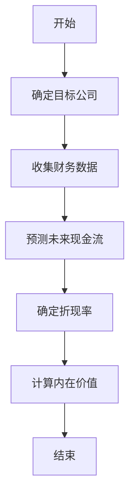
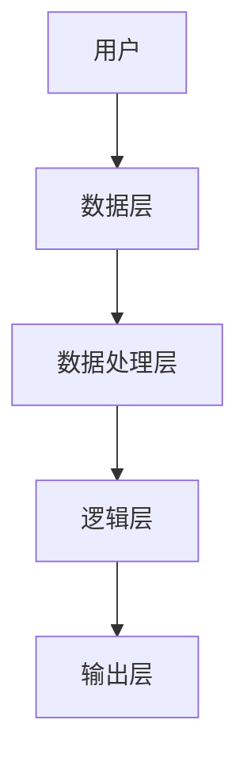

                 


# 巴菲特的市场泡沫识别：如何在繁荣中保持清醒

**关键词**：巴菲特、市场泡沫、价值投资、内在价值、投资策略、风险管理

**摘要**：本文深入探讨了巴菲特如何识别市场泡沫，并在繁荣时期保持投资冷静。通过分析巴菲特的核心投资理念、估值方法、市场情绪分析和行业基本面研究，结合实际案例和系统设计，为投资者提供实用的策略和工具，帮助他们在市场繁荣中做出明智的投资决策。

---

## 第一部分：背景介绍

### #1: 市场泡沫的定义与特征

#### 1.1 问题背景
市场泡沫是金融市场中的常见现象，指资产价格远高于其实际价值的情况。泡沫的存在使得投资者在繁荣时期容易盲目乐观，忽视潜在风险。

#### 1.2 问题描述
市场泡沫通常由过度投机和市场情绪驱动，可能导致资产价格剧烈波动。投资者在泡沫中往往难以保持冷静，容易做出错误决策。

#### 1.3 问题解决
巴菲特通过价值投资、内在价值计算和安全边际等方法，有效识别和应对市场泡沫。他的策略强调长期投资和理性分析，帮助投资者在繁荣中保持清醒。

#### 1.4 边界与外延
市场泡沫识别不仅涉及股票市场，还包括房地产和其他资产。巴菲特的方法适用于不同市场环境，但需结合具体情况进行调整。

#### 1.5 概念结构与核心要素
- **核心概念**：价值投资、内在价值、安全边际
- **关联要素**：市场情绪、行业分析、公司基本面

---

### #2: 巴菲特投资策略的核心理念

#### 2.1 价值投资理念
巴菲特强调购买低于内在价值的资产，长期持有，等待市场回归理性。这一理念帮助他在泡沫中避免高估资产。

#### 2.2 安全边际
通过购买价格远低于内在价值的资产，巴菲特确保即使市场波动，也能获得长期收益。安全边际是其投资策略的关键要素。

#### 2.3 长期投资策略
巴菲特专注于长期价值，避免短期市场波动的干扰。他选择那些具有持续竞争优势和稳定现金流的公司。

---

## 第二部分：核心概念与联系

### #3: 巴菲特的估值方法

#### 3.1 内在价值计算公式
$$ 内在价值 = \sum_{t=1}^{n} \frac{CF_t}{(1+r)^t} $$
其中，CF_t是第t年的现金流，r是折现率。

#### 3.2 市场价与内在价值的对比
巴菲特认为，当市场价远高于内在价值时，市场可能存在泡沫。他通过对比两者判断投资机会。

#### 3.3 内在价值计算的步骤
1. 评估公司的未来现金流。
2. 确定合适的折现率。
3. 计算现值，得出内在价值。

---

### #4: 巴菲特的市场情绪分析

#### 4.1 市场情绪的定义与分类
市场情绪指投资者的心理状态，分为乐观、中性和悲观。巴菲特认为情绪波动是市场泡沫的重要驱动因素。

#### 4.2 通过情绪判断泡沫
巴菲特观察市场情绪变化，避免在情绪高涨时盲目投资，而是在情绪低落时寻找低估资产。

#### 4.3 情绪与投资决策的关系
情绪影响投资者决策，巴菲特强调理性分析，避免被市场情绪左右。

---

## 第三部分：算法原理讲解

### #5: 巴菲特的内在价值计算模型

#### 5.1 内在价值计算的流程图


#### 5.2 Python代码实现
```python
def calculate_intrinsic_value(cash_flows, discount_rate):
    present_value = 0
    for t, cf in enumerate(cash_flows):
        present_value += cf / (1 + discount_rate) ** t
    return present_value

# 示例
cash_flows = [100, 150, 200, 250]
discount_rate = 0.1
iv = calculate_intrinsic_value(cash_flows, discount_rate)
print(f"内在价值为：{iv}")
```

#### 5.3 数学模型与公式
$$ 内在价值 = \sum_{t=1}^{n} \frac{CF_t}{(1+r)^t} $$
其中，CF_t是现金流，r是折现率。

---

### #6: 巴菲特的行业分析方法

#### 6.1 行业生命周期理论
行业分为导入期、成长期、成熟期和衰退期。巴菲特偏好成熟期的行业，因为它们具有稳定的现金流和可预测的前景。

#### 6.2 选择行业的方法
- 分析行业的市场规模和增长潜力。
- 评估行业的竞争结构和进入壁垒。
- 考虑行业的监管环境和政策影响。

---

## 第四部分：系统分析与架构设计

### #7: 市场泡沫监测系统

#### 7.1 系统功能设计
- 数据收集：获取市场数据和公司基本面信息。
- 情绪分析：评估市场情绪。
- 内在价值计算：对比市场价与内在价值。
- 投资决策：提供投资建议。

#### 7.2 系统架构设计


#### 7.3 系统接口设计
- 输入接口：市场数据和公司信息。
- 输出接口：投资建议和风险提示。

---

## 第五部分：项目实战

### #8: 实际案例分析

#### 8.1 2000年互联网泡沫
巴菲特避免投资高估的互联网公司，专注于传统行业，如可口可乐和石油公司。

#### 8.2 代码实现与分析
通过计算内在价值，巴菲特识别互联网公司的高估，避免泡沫破裂后的损失。

---

## 第六部分：最佳实践

### #9: 小结与注意事项

#### 9.1 小结
巴菲特通过价值投资、内在价值计算和安全边际，有效识别和应对市场泡沫。

#### 9.2 注意事项
- 保持理性，避免情绪化决策。
- 持续学习，更新投资知识。
- 结合实际，灵活调整策略。

---

## 作者信息

作者：AI天才研究院/AI Genius Institute & 禅与计算机程序设计艺术 /Zen And The Art of Computer Programming

---

希望这篇文章能够为投资者提供实用的策略和工具，帮助他们在市场繁荣中保持清醒，避免泡沫破裂带来的损失。

