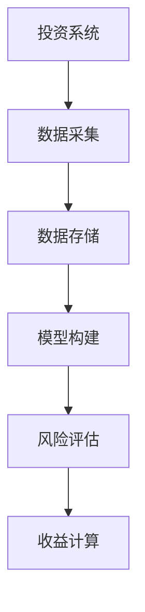
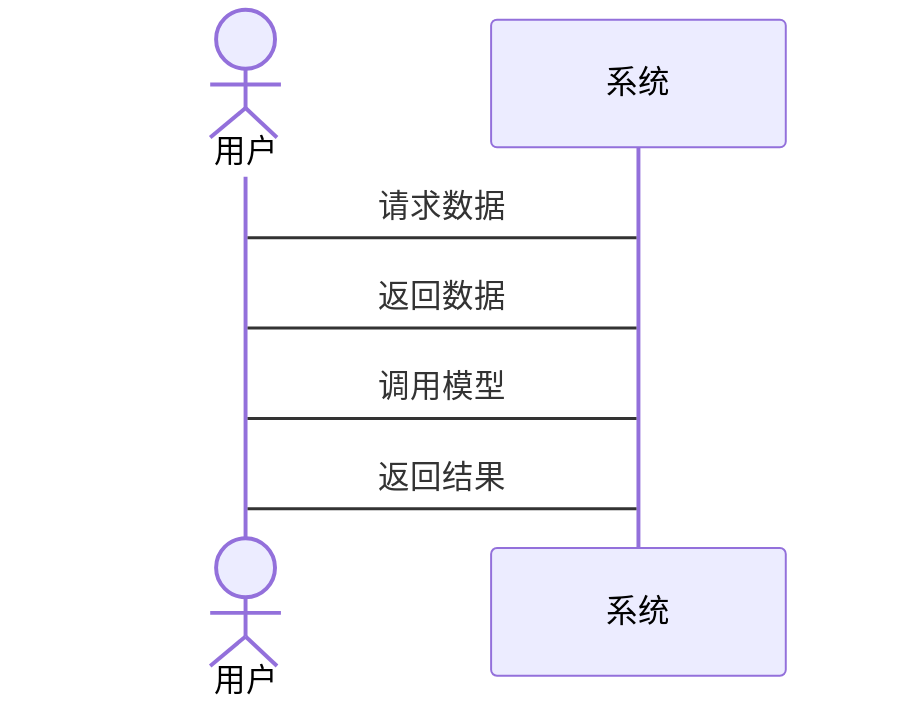

                 


# 巴菲特的股息增长策略：量子金融衍生品的收益来源

> 关键词：巴菲特, 股息增长策略, 量子金融衍生品, 收益来源, 投资策略, 金融模型

> 摘要：本文深入探讨巴菲特的股息增长策略，分析其在量子金融衍生品中的应用，揭示收益来源的数学模型与系统架构。通过背景介绍、核心概念、算法原理、系统架构、项目实战等部分，系统性地解析股息增长策略与量子金融衍生品的结合，帮助读者理解其背后的逻辑与实现方式。

---

## 第一部分: 股息增长策略的背景与核心概念

### 第1章: 股息增长策略的背景介绍

#### 1.1 股息增长策略的定义与核心要素
- **股息增长策略**：投资者通过投资于股息稳定增长的公司，获得长期稳定的收益。
- **核心要素**：
  - 股息率：股息与股价的比率。
  - 股息增长率：股息增长的速度。
  - 公司基本面：盈利能力、财务状况、行业地位。

#### 1.2 股息增长策略的背景与现状
- **背景**：股息增长策略起源于巴菲特的价值投资理念，强调长期持有优质资产。
- **现状**：随着市场的波动，股息增长策略在不同经济周期中的表现各异。

#### 1.3 股息增长策略的核心优势
- **稳定收益**：股息提供稳定的现金流。
- **长期增值**：股息增长反映了公司盈利能力的提升。
- **风险分散**：通过选择优质公司，降低投资风险。

### 第2章: 股息增长策略的核心概念

#### 2.1 股息率的计算与分析
- **股息率公式**：股息率 = 股息/股价 × 100%。
- **分析指标**：
  - 高股息率：提供稳定的现金流。
  - 低股息率：可能处于成长期。

#### 2.2 股息增长率的评估
- **股息增长率公式**：股息增长率 = (当前股息 - 上期股息)/上期股息 × 100%。
- **影响因素**：公司盈利能力、分红政策、行业竞争状况。

#### 2.3 股息增长策略的筛选标准
- **财务指标**：ROE（净资产收益率）、净利润增长率。
- **行业地位**：龙头企业具备竞争优势。
- **管理层质量**：管理层的分红意愿和能力。

---

## 第二部分: 量子金融衍生品的基本概念

### 第3章: 量子金融衍生品的定义与分类

#### 3.1 量子金融衍生品的定义
- **量子金融衍生品**：基于量子力学原理设计的金融工具，具有非线性收益特征。

#### 3.2 量子金融衍生品的分类
- **按标的资产**：股票、债券、指数等。
- **按执行方式**：期权、期货、互换等。

### 第4章: 量子金融衍生品的定价与风险管理

#### 4.1 量子金融衍生品的定价模型
- **Black-Scholes模型**：用于期权定价。
- **蒙特卡洛模拟**：用于复杂金融工具的定价。

#### 4.2 量子金融衍生品的风险管理
- **VaR（在险价值）**：衡量潜在损失。
- ** Greeks（delta、gamma、theta）**：量化价格波动风险。

---

## 第三部分: 股息增长策略与量子金融衍生品的结合

### 第5章: 股息增长策略在量子金融衍生品中的应用

#### 5.1 股息增长策略与期权的结合
- **策略**：买入股息增长股票的看涨期权，利用杠杆效应放大收益。

#### 5.2 股息增长策略与期货的结合
- **策略**：利用股息增长股票的期货合约，对冲价格波动风险。

### 第6章: 股息增长策略与量子金融衍生品的收益来源

#### 6.1 股息增长策略的数学模型
- **股息增长模型**：D1 = D0 × (1 + g)，其中g为股息增长率。

#### 6.2 量子金融衍生品的收益来源
- **波动性收益**：通过杠杆效应捕捉价格波动。
- **时间价值收益**：期权的时间价值随到期日临近而减少。

---

## 第四部分: 系统架构与项目实战

### 第7章: 投资系统的架构设计

#### 7.1 系统功能设计
- **数据采集**：收集股息增长率、股价数据。
- **模型构建**：建立股息增长模型和量子金融衍生品定价模型。
- **风险评估**：计算VaR和Greeks。

#### 7.2 系统架构图


#### 7.3 接口设计
- **API接口**：用于数据采集和模型调用。

#### 7.4 交互流程图


---

## 第五部分: 项目实战与总结

### 第8章: 项目实战

#### 8.1 环境安装
- **工具**：Python、NumPy、Pandas、Matplotlib。

#### 8.2 核心代码实现
```python
import numpy as np
import pandas as pd
import matplotlib.pyplot as plt

def calculate_dividend_growth(dividends, years):
    growth_rates = []
    for i in range(1, years):
        growth = (dividends[i] - dividends[i-1])/dividends[i-1]
        growth_rates.append(growth)
    return np.mean(growth_rates)

# 示例数据
dividends = [1, 1.05, 1.10, 1.15]
years = len(dividends)
growth_rate = calculate_dividend_growth(dividends, years)
print(f"股息增长率：{growth_rate:.2f}")
```

#### 8.3 案例分析
- **案例**：分析某公司股息增长情况，构建股息增长模型。

#### 8.4 项目总结
- **总结**：股息增长策略与量子金融衍生品的结合，能够有效提高收益，但需注意风险控制。

---

## 第六部分: 最佳实践与扩展阅读

### 第9章: 最佳实践

#### 9.1 小结
- 股息增长策略与量子金融衍生品的结合，提供了多样化的收益来源。

#### 9.2 注意事项
- 风险管理是投资成功的关键。
- 需要持续关注市场变化和公司基本面。

#### 9.3 拓展阅读
- 推荐书籍：《巴菲特传》、《量子金融》。
- 推荐课程：量子金融衍生品定价与风险管理。

---

## 作者信息

作者：AI天才研究院/AI Genius Institute & 禅与计算机程序设计艺术 /Zen And The Art of Computer Programming

---

通过以上结构，文章从股息增长策略的背景、核心概念，到量子金融衍生品的定义与分类，再到两者的结合与系统架构，最后到项目实战与总结，层层递进，帮助读者全面理解巴菲特的股息增长策略在量子金融衍生品中的应用。

