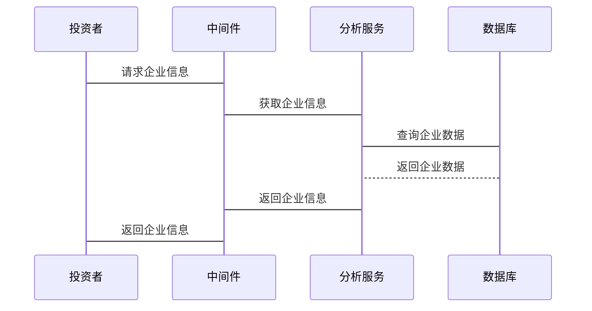

                 


```markdown
# 巴菲特的行业选择标准：聚焦稳定性和可预测性

## 第1章：背景介绍：巴菲特的投资理念

### 1.1 巴菲特的投资哲学

#### 1.1.1 价值投资的定义与核心理念
价值投资是一种投资策略，强调以低于公平价值的价格购买优质股票。巴菲特的哲学核心在于寻找具有持续竞争优势、良好管理和财务健康的公司，并长期持有这些股票，等待其内在价值的实现。这种投资策略强调安全边际，即购买价格远低于内在价值，以降低风险并确保长期收益。

#### 1.1.2 巴菲特的成功投资案例
巴菲特的投资成功案例包括可口可乐、IBM和苹果等。例如，可口可乐在巴菲特投资时已经是一个拥有强大品牌和分销网络的企业，具备稳定的现金流和持续的增长潜力。巴菲特的长期持有策略使他能够从这些企业的持续增长中获益。

#### 1.1.3 稳定性和可预测性的重要性
稳定性指的是企业在市场波动中保持稳定收益和现金流的能力，而可预测性则指企业的未来财务表现能够被合理预测。巴菲特倾向于选择那些业务模式稳定、财务状况健康的企业，因为这些企业能够在经济周期中维持稳定的收益，从而为投资者提供长期的回报。

### 1.2 巴菲特的投资策略

#### 1.2.1 长期投资与价值发现
巴菲特强调长期投资而非短期交易。他认为市场短期波动无法预测，但优质企业的长期价值是可以通过基本面分析确定的。长期投资允许投资者避免短期市场波动的干扰，专注于企业的内在价值增长。

#### 1.2.2 避免短期市场波动的影响
市场短期波动往往由情绪和市场参与者的短期行为驱动，巴菲特认为这些波动无法预测且对长期投资者无关紧要。通过忽略短期波动，投资者可以专注于企业的长期表现，避免因短期市场变化而做出错误的决策。

#### 1.2.3 聚焦于具有持续竞争优势的企业
持续竞争优势（即护城河）是指企业能够长期保持高于行业平均水平的利润率的能力。这种优势可以是专利、品牌、成本优势、网络效应或其他因素。巴菲特寻找那些拥有强大护城河的企业，因为这些企业能够在竞争中保持领先地位，为股东创造持续价值。

## 第2章：巴菲特的核心投资标准

### 2.1 企业护城河

#### 2.1.1 护城河的定义与类型
护城河是指企业能够长期保持竞争优势的机制。常见的护城河类型包括：
1. **成本优势**：如规模化生产带来的成本优势。
2. **品牌优势**：强大的品牌可以帮助企业获得更高的市场份额。
3. **网络效应**：产品或服务的价值随着用户数量的增加而增加。
4. **专利和知识产权**：拥有独特的技术或专利可以防止竞争对手进入市场。

#### 2.1.2 不同行业中的护城河分析
以可口可乐为例，其品牌价值和全球分销网络构成了强大的护城河。即使在激烈的饮料市场竞争中，可口可乐依然能够保持其市场份额和盈利能力。

#### 2.1.3 护城河对企业长期价值的影响
护城河的存在使得企业在面对竞争时更具防御性，能够保持稳定的收益和市场份额。强大的护城河意味着企业能够持续产生现金流，从而为投资者提供稳定的回报。

### 2.2 管理团队的重要性

#### 2.2.1 管理团队的诚信与能力
一个值得信赖的管理团队能够将企业带向正确的方向，做出明智的决策，并在市场波动中保持稳定性。巴菲特强调管理层的诚信和能力，因为这些因素直接影响企业的长期表现。

#### 2.2.2 团队稳定性对企业发展的影响
稳定的管理团队能够为企业制定长期战略，并在面对挑战时保持一致性和稳定性。团队的稳定性有助于企业在复杂多变的环境中保持方向，避免因管理层变动而影响企业的稳定发展。

#### 2.2.3 如何评估管理团队的质量
评估管理团队的质量需要考虑其过往业绩、管理风格、决策能力和诚信记录。一个优秀的管理团队通常能够展现出清晰的愿景、良好的沟通能力和对股东利益的高度重视。

### 2.3 财务健康状况

#### 2.3.1 财务指标分析
关键的财务指标包括：
- **净利润**：企业的盈利能力。
- **现金流**：企业的资金流动情况，尤其是经营活动现金流。
- **资产负债表**：企业的资产、负债和所有者权益情况。

#### 2.3.2 净利润、现金流与负债的评估
净利润是衡量企业盈利能力的关键指标，而现金流则反映了企业的实际资金情况。健康的财务状况通常表现为稳定的现金流和合理的负债水平，这表明企业能够维持正常的运营并具备偿还债务的能力。

#### 2.3.3 财务健康对长期投资的影响
财务健康的企业通常能够提供稳定的股息回报和股价增长。健康的财务状况也是企业抵御经济波动的重要保障，能够在市场低迷时为企业提供缓冲空间。

## 第3章：稳定性与可预测性的行业分析

### 3.1 稳定性与可预测性的定义

#### 3.1.1 稳定性的概念
稳定性指企业在市场波动、经济周期变化和行业竞争中保持稳定的收入和利润的能力。稳定的企业通常在市场需求波动较小的行业，如公用事业、消费品和医疗保健等。

#### 3.1.2 可预测性的概念
可预测性指企业的未来财务表现可以被合理预测和量化。这通常基于企业的历史数据、行业趋势和市场环境等因素。可预测性高的行业通常具有稳定的市场需求和明确的市场定位。

#### 3.1.3 两者对企业价值的影响
稳定性和可预测性高的企业通常具有较低的波动性和较高的可预测性，这使得它们成为长期投资者的首选目标。这些企业能够提供稳定的股息回报和股价增长，同时降低了投资风险。

### 3.2 不同行业的稳定性分析

#### 3.2.1 快速消费品行业
快速消费品行业具有稳定的需求和较高的可预测性。消费者对日常用品的需求相对稳定，企业可以通过规模经济和品牌优势保持稳定的市场份额。

#### 3.2.2 公用事业行业
公用事业行业如电力、自来水和天然气供应通常具有稳定的收入来源，因为这些是基本需求。行业进入壁垒较高，具有较强的垄断性，从而保证了稳定的收益。

#### 3.2.3 医疗健康行业
医疗健康行业的需求受人口老龄化和医疗技术进步的推动，具有较强的稳定性。尽管行业内的竞争可能激烈，但稳定的市场需求为企业提供了持续的增长机会。

### 3.3 如何评估行业的稳定性与可预测性

#### 3.3.1 行业生命周期分析
分析行业所处的生命周期阶段可以帮助评估其稳定性。成熟行业通常具有较高的稳定性，而新兴行业则可能面临更大的波动性。

#### 3.3.2 市场需求的稳定性评估
通过分析市场的增长趋势、消费者行为和市场需求波动，可以评估行业的稳定性。需求稳定且增长的行业通常具有较高的投资价值。

#### 3.3.3 政策环境的影响
政策环境对行业的稳定性有重要影响。稳定的政策环境和有利于行业的政策法规能够增强行业的稳定性，而频繁变化或不利的政策可能增加行业的不确定性。

## 第4章：巴菲特的选股方法论

### 4.1 定性分析

#### 4.1.1 企业基本面分析
基本面分析包括对企业财务状况、行业地位、管理团队和竞争优势的全面评估。通过了解企业的基本面，投资者可以判断其长期发展潜力。

#### 4.1.2 管理层的战略规划
管理层的战略规划和执行能力直接影响企业的长期表现。分析企业的战略目标、市场定位和竞争优势，可以帮助投资者评估企业的未来发展前景。

#### 4.1.3 企业文化和价值观
企业文化和价值观是企业长期成功的重要因素。一个积极向上的企业文化能够激发员工的创造力和责任感，从而推动企业实现长期目标。

### 4.2 定量分析

#### 4.2.1 财务比率分析
常见的财务比率包括：
- **市盈率（P/E）**：衡量股票价格相对于每股收益的比率。
- **市净率（P/B）**：衡量股票价格相对于每股净资产的比率。
- **股息率**：衡量股票的股息收益率。

#### 4.2.2 市盈率与市净率分析
市盈率和市净率是衡量股票价值的重要指标。市盈率较低的股票可能具有较高的投资价值，而市净率低于行业平均水平的股票可能被市场低估。

#### 4.2.3 股息率与收益分析
股息率高的股票通常被视为具有吸引力的投资目标。同时，企业的盈利能力也是评估股票价值的重要因素。综合分析股息率和收益，可以帮助投资者找到具有稳定回报的股票。

### 4.3 投资组合的构建

#### 4.3.1 分散投资的重要性
分散投资可以降低投资风险，避免因个别股票的波动而影响整体投资组合的表现。通过投资不同行业和不同公司的股票，投资者可以有效分散风险。

#### 4.3.2 个股权重的分配
在构建投资组合时，应根据各股票的风险、收益和流动性等因素合理分配权重。通常，投资于具有较高稳定性和可预测性的股票可以降低整体投资组合的风险。

## 第5章：实际案例分析

### 5.1 巴菲特的经典投资案例

#### 5.1.1 可口可乐：稳定的现金流与品牌优势
可口可乐拥有强大的品牌和全球分销网络，确保了稳定的现金流和市场份额。巴菲特的投资案例展示了稳定性和可预测性的重要性。

#### 5.1.2 IBM：技术创新与长期增长
IBM作为科技巨头，通过不断创新和技术优势保持了其在行业中的领先地位。巴菲特的投资表明，技术创新和长期增长潜力是重要的投资标准。

#### 5.1.3 苹果：强大的护城河与市场需求
苹果以其创新的产品和强大的品牌影响力，在科技行业中占据领先地位。巴菲特的投资案例显示，强大的护城河和市场需求是成功投资的关键。

### 5.2 投资决策分析

#### 5.2.1 分析企业的护城河和竞争优势
通过分析企业的护城河，如品牌、技术专利和成本优势，可以评估其竞争优势。强大的护城河能够确保企业在竞争中保持领先地位。

#### 5.2.2 财务指标的评估与分析
通过分析企业的财务指标，如净利润、现金流和资产负债表，可以评估其财务健康状况。健康的财务状况是长期投资的重要保障。

#### 5.2.3 管理团队的质量与战略
评估管理团队的诚信与能力，了解其战略规划和市场定位，是投资决策的重要步骤。优秀的管理团队能够引领企业实现长期目标。

## 第6章：系统分析与架构设计方案

### 6.1 问题场景介绍

#### 6.1.1 投资者面临的挑战
投资者在选择行业和企业时，需要考虑市场波动、企业基本面和宏观经济环境等因素。复杂的市场环境和海量的信息使得投资决策变得具有挑战性。

#### 6.1.2 投资者的决策需求
投资者需要一个系统化的工具和方法，帮助他们分析和评估潜在投资标的。通过系统化的分析，投资者可以做出更加科学和理性的决策。

### 6.2 项目介绍

#### 6.2.1 项目目标
本项目旨在构建一个基于巴菲特投资标准的行业和企业分析系统，帮助投资者系统化地评估潜在投资标的。

#### 6.2.2 项目范围
系统将涵盖行业分析、企业基本面分析、财务指标分析和投资组合管理等功能，为投资者提供全面的支持。

### 6.3 系统功能设计

#### 6.3.1 领域模型（Mermaid 类图）
```mermaid
classDiagram
    class 投资者 {
        - 资金：float
        - 风险承受能力：int
        + 投资（企业：Enterprise）：void
    }
    class 企业 {
        - 名称：string
        - 行业：string
        - 财务状况：FinancialStatus
        - 管理团队：ManagementTeam
        - 竞争优势：CompetitiveAdvantage
        + 获取企业信息() : void
    }
    class 财务指标 {
        - 净利润：float
        - 现金流：float
        - 负债：float
        + 计算财务健康度() : int
    }
    class 行业分析 {
        - 行业稳定性：int
        - 行业可预测性：int
        + 评估行业风险() : void
    }
    investor -> 企业 : 选择企业
    企业 -> 财务指标 : 分析财务指标
    企业 -> 行业分析 : 分析行业风险
```

#### 6.3.2 系统架构设计（Mermaid 架构图）


#### 6.3.3 系统接口设计
系统接口包括：
- **获取企业信息**：提供企业基本面信息。
- **计算财务指标**：提供企业的财务状况分析。
- **行业风险评估**：评估行业稳定性和可预测性。

#### 6.3.4 系统交互设计（Mermaid 序列图）


## 第7章：项目实战

### 7.1 环境安装

#### 7.1.1 安装 Python 和必要的库
```bash
pip install numpy pandas matplotlib
```

#### 7.1.2 安装 Jupyter Notebook
```bash
pip install jupyter
```

### 7.2 系统核心实现源代码

#### 7.2.1 行业分析模块
```python
import pandas as pd

def analyze_industry(stability, predictability):
    if stability >= 0.7 and predictability >= 0.7:
        return "high"
    elif stability >= 0.5 and predictability >= 0.5:
        return "medium"
    else:
        return "low"
```

#### 7.2.2 财务指标分析模块
```python
import pandas as pd

def calculate_financial_health(net_profit, cash_flow, liabilities):
    health_score = (net_profit + cash_flow - liabilities) / 3
    if health_score >= 0.7:
        return "healthy"
    elif health_score >= 0.4:
        return "caution"
    else:
        return "unhealthy"
```

### 7.3 代码应用解读与分析

#### 7.3.1 行业分析模块
该模块根据行业的稳定性和可预测性进行评估，返回行业风险等级。这有助于投资者识别稳定且可预测的行业进行投资。

#### 7.3.2 财务指标分析模块
该模块通过计算企业的净利

