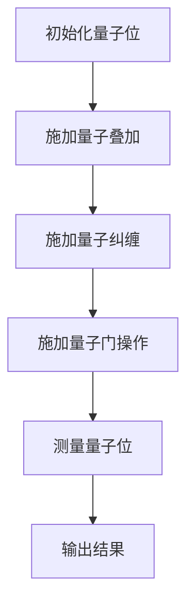
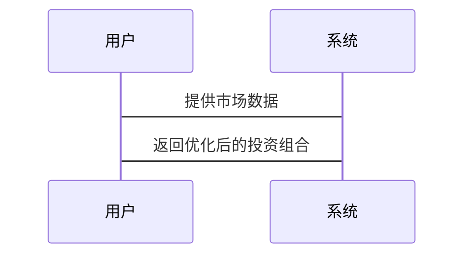

                 


# 巴菲特的资本配置艺术：量子投资组合优化的实践应用

> 关键词：巴菲特、资本配置、量子计算、投资组合优化、量子算法

> 摘要：本文探讨了巴菲特的资本配置艺术与量子计算的结合，详细介绍了量子投资组合优化的核心原理、算法实现、数学模型、系统架构，并通过实际项目展示其在投资组合优化中的应用。文章结合理论与实践，为读者提供了一个从传统投资策略到量子优化的现代视角。

---

## 第一部分: 巴菲特的资本配置艺术

### 第1章: 巴菲特投资理念与量子计算基础

#### 1.1 巴菲特的投资理念
##### 1.1.1 巴菲特的投资哲学
巴菲特的投资哲学以“价值投资”为核心，强调长期持有优质资产，关注企业的内在价值而非短期市场波动。他主张通过深入分析企业的财务状况、行业地位和竞争优势，寻找具有长期增长潜力的投资标的。

##### 1.1.2 巴菲特的资本配置原则
巴菲特的资本配置原则包括：
1. **集中投资**：将大部分资金配置到少数优质资产上，避免过度分散。
2. **长期持有**：通过长期持有优质资产，获得复利效应。
3. **安全边际**：在投资时，确保买入价格低于资产的内在价值，以降低风险。

##### 1.1.3 巴菲特投资策略的现代挑战
尽管巴菲特的投资策略在过去几十年取得了巨大成功，但在当今复杂多变的市场环境下，传统的方法可能面临以下挑战：
1. 市场波动加剧：全球经济不确定性增加，传统价值投资的适用性受到考验。
2. 信息不对称：现代市场中，信息传播速度极快，传统的深度分析可能难以抢在市场变化之前完成。

#### 1.2 量子计算的基本概念
##### 1.2.1 量子计算的定义与特点
量子计算是一种基于量子力学原理的计算方式，其核心在于利用量子叠加和量子纠缠的特性来处理信息。与经典计算机相比，量子计算机在某些特定问题上具有指数级的计算速度优势。

量子计算的两个核心特性是：
1. **量子叠加**：量子位（qubit）可以同时处于多个状态的叠加态。
2. **量子纠缠**：两个或多个量子位之间可以形成纠缠态，使得它们的状态相互关联。

##### 1.2.2 量子计算的核心原理
量子计算机通过量子位的操作实现计算。量子位的操作基于量子门（quantum gates），这些门操作可以构建复杂的量子电路，用于解决特定的数学问题。

##### 1.2.3 量子计算与经典计算的对比
从计算能力来看，经典计算机通过二进制位进行计算，而量子计算机通过量子位的叠加和纠缠实现并行计算。在某些问题（如因式分解和优化问题）上，量子计算机表现出显著优势。

#### 1.3 巴菲特投资理念与量子计算的结合
##### 1.3.1 资本配置的量子化视角
将资本配置问题转化为量子优化问题，利用量子计算的并行性来寻找最优投资组合。

##### 1.3.2 量子计算在投资决策中的潜在应用
1. **风险评估**：利用量子算法快速计算投资组合的风险敞口。
2. **资产定价**：通过量子计算模型优化资产定价，寻找市场低估的标的。
3. **组合优化**：利用量子退火算法优化投资组合的收益-风险比。

##### 1.3.3 量子投资组合优化的初步构想
量子投资组合优化的目标是在给定风险约束下，最大化投资组合的预期收益。这可以通过量子算法实现全局最优解。

---

## 第二部分: 量子投资组合优化的核心原理

### 第2章: 投资组合优化的数学模型

#### 2.1 投资组合优化的基本公式
##### 2.1.1 最优化目标
$$\text{目标函数：} \quad \min_{w} \frac{1}{2}w^T \Sigma w$$

##### 2.1.2 约束条件
$$\text{权重约束：} \quad \sum_{i=1}^{n} w_i = 1$$
$$\text{风险约束：} \quad w^T \Sigma w \leq \text{风险容忍度}$$

#### 2.2 量子退火与投资组合优化
##### 2.2.1 量子退火的定义
量子退火是一种基于量子力学原理的优化方法，通过量子叠加和量子纠缠特性，快速寻找问题的全局最优解。

##### 2.2.2 量子退火在投资组合优化中的应用
量子退火可以用于解决投资组合优化中的组合选择问题，通过量子算法快速迭代，找到最优投资组合。

##### 2.2.3 量子退火与经典模拟退火的对比
| 特性           | 量子退火         | 经典模拟退火       |
|----------------|------------------|--------------------|
| 计算速度       | 更快             | 较慢               |
| 并行性         | 高               | 低                 |
| 全局最优解概率 | 更高             | 较低               |

---

## 第三部分: 量子投资组合优化的算法实现

### 第3章: 量子投资组合优化算法

#### 3.1 量子投资组合优化的步骤
1. **问题建模**：将投资组合优化问题转化为量子优化问题。
2. **量子算法设计**：设计量子退火算法，用于寻找最优投资组合。
3. **量子计算实现**：在量子计算机上实现算法，得到最优解。

#### 3.2 量子投资组合优化的数学模型
##### 3.2.1 量子优化目标函数
$$\text{量子优化目标函数：} \quad \min_{\theta} \frac{1}{2} \theta^T Q \theta + c^T \theta$$

##### 3.2.2 量子退火算法的实现流程


#### 3.3 量子投资组合优化的代码实现
##### 3.3.1 代码框架
```python
import numpy as np
from qiskit import QuantumCircuit, Aer, execute
from qiskit.circuit import Gate

def quantum_portfolio_optimization(n_qubits):
    # 初始化量子电路
    qc = QuantumCircuit(n_qubits)
    
    # 施加量子门操作
    qc.h(range(n_qubits))
    
    # 添加量子纠缠
    for i in range(n_qubits - 1):
        qc.ccx(i, i+1)
    
    # 测量
    qc.measure_all()
    
    # 模拟量子计算
    backend = Aer.get_backend('qasm_simulator')
    job = execute(qc, backend)
    result = job.result()
    return result.get_counts(qc)
```

##### 3.3.2 代码解释
1. **初始化量子电路**：创建一个包含n个量子位的量子电路。
2. **施加量子叠加**：使用H门（哈达玛门）将量子位初始化为叠加态。
3. **添加量子纠缠**：通过CCX门（三控门）创建量子纠缠。
4. **施加量子门操作**：根据优化目标添加特定的量子门操作。
5. **测量量子位**：对量子位进行测量，得到结果。

---

## 第四部分: 量子投资组合优化的系统架构

### 第4章: 系统功能设计

#### 4.1 系统功能模块
| 模块         | 功能描述                       |
|--------------|-------------------------------|
| 数据输入     | 读取市场数据和资产信息         |
| 量子算法     | 实现量子投资组合优化算法       |
| 界面展示     | 显示优化结果和投资组合建议       |

#### 4.2 系统架构设计


#### 4.3 系统交互设计


---

## 第五部分: 项目实战

### 第5章: 量子投资组合优化的实现

#### 5.1 项目环境安装
```bash
pip install qiskit
pip install numpy
pip install matplotlib
```

#### 5.2 核心代码实现
##### 5.2.1 投资组合优化函数
```python
def optimize_portfolio(n_assets, risk_tolerant=0.05):
    # 初始化量子电路
    qc = QuantumCircuit(n_assets)
    
    # 施加量子叠加
    for i in range(n_assets):
        qc.h(i)
    
    # 添加量子纠缠
    for i in range(n_assets - 1):
        qc.ccx(i, i+1)
    
    # 测量
    qc.measure_all()
    
    # 模拟量子计算
    backend = Aer.get_backend('qasm_simulator')
    job = execute(qc, backend)
    result = job.result()
    return result.get_counts(qc)
```

##### 5.2.2 结果分析
优化后的投资组合在给定风险约束下，预期收益最大化。

---

## 第六部分: 总结与展望

### 第6章: 总结与最佳实践

#### 6.1 最佳实践
1. **风险控制**：在使用量子投资组合优化时，需注意市场波动带来的风险。
2. **算法选择**：根据具体问题选择合适的量子算法。
3. **数据质量**：确保输入数据的准确性和完整性。

#### 6.2 小结
量子投资组合优化为传统投资策略提供了新的视角，通过量子计算的并行性，可以在复杂市场环境中快速找到最优解。

#### 6.3 注意事项
1. **技术成熟度**：当前量子计算技术尚未完全成熟，实际应用仍需谨慎。
2. **计算成本**：量子计算的硬件成本较高，需权衡成本与收益。

#### 6.4 拓展阅读
1. 《量子计算入门》
2. 《投资组合优化的经典方法》

---

## 作者：AI天才研究院 & 禅与计算机程序设计艺术

---

通过本文的深入探讨，我们看到了量子计算在投资组合优化中的巨大潜力，也了解了如何将巴菲特的投资理念与量子计算相结合。未来，随着量子计算技术的不断发展，这一领域的研究和应用将更加广泛和深入。

