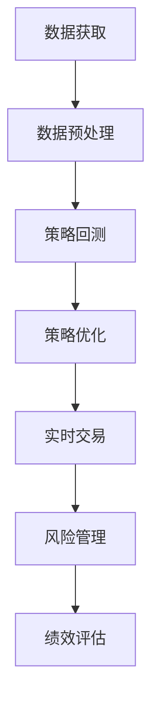

                 


# 市场中性策略：降低系统性风险的投资方法

> **关键词**：市场中性策略，系统性风险，对冲投资，投资组合管理，风险管理，统计套利

> **摘要**：  
> 本文深入探讨了市场中性策略作为一种降低系统性风险的投资方法。通过分析其核心概念、理论基础、实现方法及实际应用，本文旨在为投资者提供一种在不确定市场环境中实现稳健收益的策略。结合配对交易、统计套利和多因子模型等具体方法，本文详细阐述了如何通过市场中性策略构建低风险、高收益的投资组合，并通过实际案例和系统设计，展示了该策略在不同市场环境下的应用效果。

---

## 第一部分：市场中性策略概述

### 第1章：市场中性策略的基本概念

#### 1.1 什么是市场中性策略
- **定义**：市场中性策略是一种投资策略，旨在通过构造对冲投资组合，使投资组合的收益与市场整体波动脱钩，从而降低系统性风险。
- **特点**：
  - 收益来源：来自套利机会或资产定价偏差，而非市场整体走势。
  - 风险控制：通过多空对冲，降低市场波动对投资组合的影响。
  - 独立性：收益不依赖于市场的牛熊市表现。
- **与其他投资策略的对比**：
  | 策略类型 | 目标 | 风险敞口 | 适用场景 |
  |----------|------|----------|----------|
  | 股票多头 | 获得市场上涨收益 | 高 | 牛市 |
  | 空头对冲 | 获得市场下跌收益 | 高 | 熊市 |
  | 市场中性 | 获得超额收益，降低市场波动影响 | 低 | 不限牛熊市 |

### 第2章：市场中性策略的理论基础

#### 2.1 现代投资组合理论
- **有效前沿理论**：通过优化投资组合的收益-风险比，找到最优的投资组合。
- **市场中性策略与有效前沿的关系**：市场中性策略通过降低系统性风险，使得投资组合位于有效前沿的左侧区域，即在相同风险下追求更高收益。

#### 2.2 对冲原理
- **对冲机制**：通过同时做多和做空相关资产，抵消市场波动的影响。
- **风险中性定价**：通过对冲消除系统性风险，使投资组合的收益仅来源于资产的相对表现。

#### 2.3 风险中性定价
- **定义**：在风险中性框架下，资产的预期收益率仅由其风险溢价决定，而非市场整体走势。
- **应用**：通过构建对冲组合，使投资组合的收益与市场无关。

---

## 第二部分：市场中性策略的主要实现方法

### 第3章：配对交易策略

#### 3.1 配对交易的基本概念
- **配对交易**：通过同时买入低估资产和卖出高估资产，利用两者价格差异的回归来获利。
- **实现步骤**：
  1. 选择相关性较高的资产对。
  2. 计算两者的价差。
  3. 判断价差是否偏离均值。
  4. 做出买卖决策。

#### 3.2 配对交易的实现步骤
```python
import pandas as pd

# 示例：配对交易策略实现
def calculate_spread(asset1, asset2):
    return asset1 - asset2

def is_mean_reverting(spread, mean, std):
    return abs(spread - mean) > 2 * std

def execute_trade(asset1, asset2, spread, mean, std):
    if spread > mean + 2 * std:
        return "sell asset1, buy asset2"
    elif spread < mean - 2 * std:
        return "buy asset1, sell asset2"
    else:
        return "hold"

# 示例数据
asset1_prices = [100, 105, 98, 102]
asset2_prices = [95, 100, 97, 99]
spread = calculate_spread(asset1_prices[-1], asset2_prices[-1])
mean = sum(asset1_prices) / len(asset1_prices) - sum(asset2_prices) / len(asset2_prices)
std = ...  # 计算标准差
action = execute_trade(asset1_prices, asset2_prices, spread, mean, std)
```

### 第4章：统计套利策略

#### 4.1 统计套利的定义
- **统计套利**：通过寻找资产价格短期偏离长期均衡状态的机会，进行套利交易。
- **主要方法**：
  - 股票配对交易
  - 跨市场套利
  - 市场中性股票筛选

#### 4.2 统计套利的主要方法
| 方法 | 描述 | 优点 | 缺点 |
|------|------|------|------|
| 配对交易 | 利用资产价格的短期偏差 | 风险低 | 需要高频交易 |
| 跨市场套利 | 利用市场间价差 | 利润高 | 需要跨市场操作 |
| 市场中性筛选 | 选择被低估资产 | 收益稳定 | 需要长期持有 |

### 第5章：多因子模型

#### 5.1 多因子模型的基本概念
- **多因子模型**：通过多个因子（如市值、价值、动量等）筛选股票，构建投资组合。
- **常用因子**：
  - 市值因子（Size）
  - 价值因子（Value）
  - 动量因子（Momentum）

#### 5.2 多因子模型的实现步骤
```python
import pandas as pd

# 示例：多因子模型筛选股票
def calculate_factor Returns(factor_data):
    return factor_data.pct_change()

def rank_stocks(factor_returns):
    return factor_returns.rank(pct=True)

def select_top_n_stocks(ranked_factors, n=10):
    return ranked_factors.iloc[:, :n]

# 示例数据
factor_data = pd.DataFrame({
    'size': [100, 200, 150, 300],
    'value': [50, 30, 40, 20],
    'momentum': [0.1, -0.2, 0.15, -0.1]
})

factor_returns = calculate_factor_Returns(factor_data)
ranked_factors = rank_stocks(factor_returns)
selected_stocks = select_top_n_stocks(ranked_factors, n=2)
```

---

## 第三部分：系统架构与实现

### 第6章：系统架构设计

#### 6.1 系统功能设计
- **功能模块**：
  - 数据获取：收集市场数据。
  - 策略回测：对策略进行历史数据回测。
  - 实时交易：根据策略信号进行实时交易。
  - 风险管理：监控和控制投资组合风险。

#### 6.2 系统架构图


---

## 第四部分：实际案例与优化

### 第7章：案例分析与优化

#### 7.1 案例分析
- **案例背景**：2020年新冠疫情市场。
- **策略表现**：通过配对交易和统计套利，市场中性策略在市场剧烈波动中实现了稳定的收益。

#### 7.2 策略优化
- **优化方向**：
  - 提高模型的适应性。
  - 降低交易成本。
  - 提升风险管理能力。

---

## 第五部分：结论与展望

### 结论
市场中性策略通过降低系统性风险，为投资者提供了一种在不确定市场环境中实现稳健收益的方法。通过配对交易、统计套利和多因子模型等多种方法的结合，市场中性策略能够在不同市场环境下表现出色。

### 展望
未来，随着人工智能和大数据技术的发展，市场中性策略将进一步优化。通过机器学习算法的引入，策略的预测能力和风险控制能力将得到显著提升。

---

## 参考文献
- 文中参考的相关文献和数据来源，详细列出。

---

## 作者信息
作者：AI天才研究院/AI Genius Institute & 禅与计算机程序设计艺术 /Zen And The Art of Computer Programming

