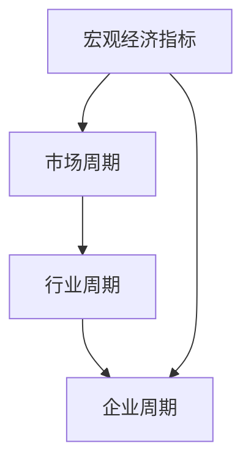
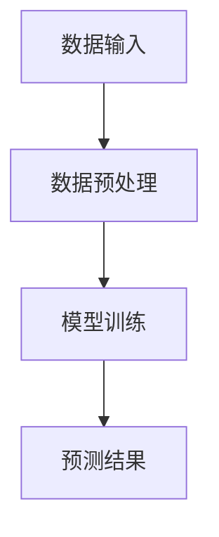
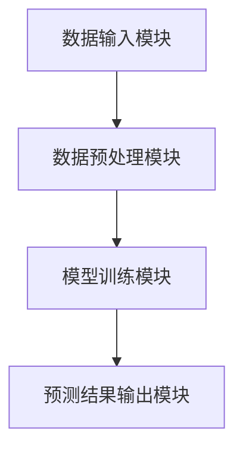
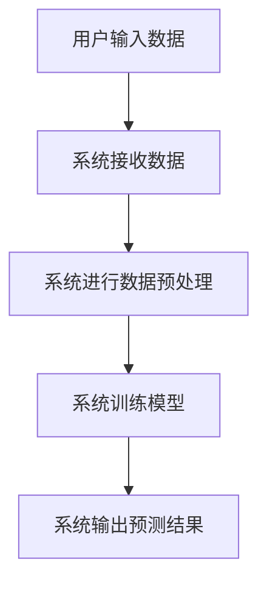

                 


# 市场周期理论：如何识别并利用经济周期变化

> **关键词**：市场周期理论，经济周期变化，市场周期预测，市场周期识别，经济波动分析，市场周期预测模型

> **摘要**：市场周期理论是理解经济波动和市场变化的核心工具。本文将从市场周期的基本概念出发，逐步分析其核心原理、预测算法、系统架构设计以及实际应用案例。通过详细的理论阐述和实际操作指南，帮助读者掌握如何识别和利用经济周期变化，从而在商业决策中占据先机。

---

## 第一部分：市场周期理论概述

### 第1章：市场周期理论概述

#### 1.1 市场周期的基本概念

##### 1.1.1 市场周期的定义
市场周期是指经济系统中价格、产量、就业等指标随时间变化而呈现出的波动规律。市场周期可以分为多个阶段，包括繁荣、衰退、萧条和复苏。

##### 1.1.2 市场周期的分类与特点
市场周期主要分为长期周期和短期周期。长期周期通常与经济发展阶段相关，而短期周期则与市场波动和政策变化相关。市场周期的特点包括周期性、波动性和可预测性。

##### 1.1.3 市场周期与经济波动的关系
市场周期是经济波动的核心驱动力。通过分析市场周期，可以更好地理解经济波动的原因和趋势，从而为商业决策提供支持。

#### 1.2 市场周期的历史演变

##### 1.2.1 经济周期理论的发展历程
经济周期理论起源于古典经济学，经过凯恩斯主义的完善，再到现代宏观经济学的发展，逐步形成了系统的市场周期理论。

##### 1.2.2 历史上的典型市场周期案例
历史上有许多典型的市场周期案例，例如2008年的全球金融危机和2020年的新冠疫情对全球经济的影响。

##### 1.2.3 市场周期的周期性特征分析
市场周期的周期性特征包括波动幅度、周期长度和波动频率等。通过分析这些特征，可以更好地预测未来的市场周期。

#### 1.3 市场周期的分析框架

##### 1.3.1 宏观经济指标与市场周期的关系
宏观经济指标如GDP、失业率和通货膨胀率等，是分析市场周期的重要工具。

##### 1.3.2 市场周期的驱动因素分析
市场周期的驱动因素包括政策变化、技术创新、市场需求和供给变化等。

##### 1.3.3 市场周期的预测与识别方法
市场周期的预测方法包括时间序列分析和机器学习模型等。

---

### 第2章：市场周期的核心概念与联系

#### 2.1 市场周期的核心原理

##### 2.1.1 市场周期的形成机制
市场周期的形成机制包括市场参与者的预期、市场供需关系的变化以及政策调控等。

##### 2.1.2 市场周期的波动规律
市场周期的波动规律可以通过统计学和经济学理论进行分析，例如均值回归和随机游走理论。

##### 2.1.3 市场周期的阶段划分与特征
市场周期通常分为四个阶段：繁荣、衰退、萧条和复苏。每个阶段都有其独特的特征和表现。

#### 2.2 市场周期的核心要素对比

##### 2.2.1 不同市场周期的特征对比
不同市场周期的特征可以通过表格对比，例如：

| 市场周期阶段 | 主要特征       |
|--------------|----------------|
| 繁荣期       | 经济增长迅速，市场活跃 |
| 衰退期       | 经济增长放缓，市场萎缩 |
| 萧条期       | 经济低迷，市场低迷 |
| 复苏期       | 经济逐渐恢复，市场逐步活跃 |

##### 2.2.2 市场周期与经济指标的关系
市场周期与经济指标密切相关，例如GDP、失业率和通货膨胀率等。

##### 2.2.3 市场周期与行业周期的差异
市场周期和行业周期的区别在于，市场周期是整体经济的波动，而行业周期是特定行业的波动。

#### 2.3 市场周期的实体关系图



---

### 第3章：市场周期的预测与识别算法

#### 3.1 市场周期预测的数学模型

##### 3.1.1 时间序列分析模型
时间序列分析是市场周期预测的重要工具。常用的时间序列模型包括ARIMA和GARCH。

##### 3.1.2 市场周期预测的数学公式
$$ y_t = \alpha + \beta t + \gamma y_{t-1} + \epsilon_t $$

##### 3.1.3 市场周期预测的算法流程图



#### 3.2 市场周期识别的算法实现

##### 3.2.1 基于机器学习的市场周期识别
机器学习算法如随机森林和神经网络，可以用于市场周期的识别。

##### 3.2.2 市场周期识别的Python代码实现

```python
import pandas as pd
import numpy as np

# 示例数据加载
data = pd.read_csv('market_data.csv')
# 数据预处理
data_processed = data.dropna()
# 模型训练
model = ARIMA(data_processed, order=(1,1,0))
model_fit = model.fit()
# 预测结果
forecast = model_fit.forecast(steps=10)
```

---

### 第4章：市场周期的系统分析与架构设计

#### 4.1 系统分析

##### 4.1.1 问题场景介绍
市场周期预测系统需要解决的问题包括数据获取、模型训练和结果输出。

##### 4.1.2 系统功能需求分析
系统功能需求包括数据输入、数据预处理、模型训练和预测结果输出。

##### 4.1.3 系统功能设计(领域模型mermaid类图)



##### 4.1.4 系统架构设计mermaid架构图


#### 4.2 系统接口设计和交互流程图

##### 4.2.1 系统接口设计
系统接口包括数据输入接口、模型训练接口和结果输出接口。

##### 4.2.2 系统交互流程图



---

## 第五部分：项目实战

### 5.1 项目环境安装

#### 5.1.1 安装必要的Python库
```bash
pip install pandas numpy matplotlib statsmodels
```

### 5.2 系统核心实现源代码

#### 5.2.1 数据预处理代码

```python
import pandas as pd
import numpy as np

# 示例数据加载
data = pd.read_csv('market_data.csv')
# 数据预处理
data_processed = data.dropna()
```

#### 5.2.2 模型训练代码

```python
from statsmodels.tsa.arima.model import ARIMA

# 模型训练
model = ARIMA(data_processed, order=(1,1,0))
model_fit = model.fit()
```

#### 5.2.3 预测结果代码

```python
# 预测结果
forecast = model_fit.forecast(steps=10)
print(forecast)
```

### 5.3 代码应用解读与分析

#### 5.3.1 数据预处理解读
数据预处理包括数据清洗和特征提取，确保数据的完整性和准确性。

#### 5.3.2 模型训练解读
模型训练是通过历史数据训练出一个能够预测未来市场的模型。

#### 5.3.3 预测结果解读
预测结果展示未来市场的走势，帮助决策者提前做出应对策略。

### 5.4 实际案例分析和详细讲解剖析

#### 5.4.1 案例背景介绍
以2008年金融危机为例，分析市场周期的变化对经济的影响。

#### 5.4.2 案例分析与解读
通过数据分析和模型预测，揭示金融危机的成因和影响。

#### 5.4.3 案例总结
总结金融危机的经验教训，提出预防和应对策略。

### 5.5 项目小结

#### 5.5.1 项目成果
通过项目实战，掌握市场周期预测的理论和实践技能。

#### 5.5.2 项目经验总结
总结项目中的经验教训，为未来类似项目提供参考。

---

## 第六部分：最佳实践 tips、小结、注意事项、拓展阅读

### 6.1 最佳实践 tips

#### 6.1.1 数据质量的重要性
确保数据的完整性和准确性，是市场周期预测的关键。

#### 6.1.2 模型的局限性
市场周期预测模型存在一定的局限性，需要结合实际情况进行调整。

#### 6.1.3 持续学习的重要性
市场周期变化复杂，需要持续学习和更新知识。

### 6.2 小结

#### 6.2.1 市场周期理论的核心内容
市场周期理论是理解经济波动和市场变化的核心工具。

#### 6.2.2 如何识别和利用经济周期变化
通过预测和识别市场周期，可以更好地应对经济波动和市场变化。

### 6.3 注意事项

#### 6.3.1 数据来源的可靠性
确保数据来源可靠，避免因数据质量问题导致预测结果偏差。

#### 6.3.2 模型的适用性
根据具体场景选择合适的模型，避免过度依赖单一模型。

#### 6.3.3 风险管理的重要性
在实际应用中，需要注重风险管理，避免因预测失误导致的损失。

### 6.4 拓展阅读

#### 6.4.1 经济学经典著作
推荐阅读《经济学原理》和《货币银行学》等经典著作。

#### 6.4.2 市场周期预测的经典论文
推荐阅读关于时间序列分析和机器学习在市场周期预测中的应用论文。

#### 6.4.3 相关技术博客和资源
推荐关注技术博客和资源，获取最新的市场周期预测技术和工具。

---

## 作者：AI天才研究院/AI Genius Institute & 禅与计算机程序设计艺术 /Zen And The Art of Computer Programming

---

通过以上内容，我们可以系统地了解市场周期理论的核心概念、预测算法和实际应用。希望读者能够通过本文掌握如何识别和利用经济周期变化，为商业决策提供有力支持。

