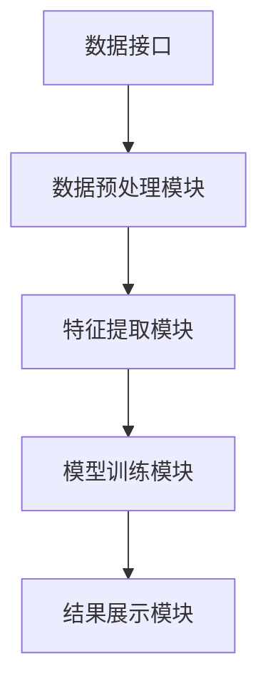

                 


# 市场情绪分析

> 关键词：市场情绪分析，文本挖掘，深度学习，金融大数据，自然语言处理

> 摘要：本文深入探讨了市场情绪分析的核心概念、数据来源、特征提取方法、算法模型以及系统实现。通过分析市场情绪的构成要素、文本预处理技术、主流算法原理及其在金融领域的应用，本文为读者提供了一套完整的市场情绪分析解决方案，帮助投资者和金融机构更好地理解市场动态。

---

## 第一部分: 市场情绪分析的背景与概念

### 第1章: 市场情绪分析的基本概念

#### 1.1 市场情绪分析的定义与背景

市场情绪分析（Market Sentiment Analysis）是一种通过分析文本数据来判断市场参与者情绪状态的技术。它旨在量化市场情绪的乐观或悲观程度，帮助投资者和金融机构做出更明智的决策。随着大数据和人工智能技术的发展，市场情绪分析已成为金融领域的重要研究方向。

#### 1.2 市场情绪分析的背景与重要性

- **背景**：金融市场中，投资者的行为往往受到情绪影响。通过分析新闻、社交媒体、机构报告等文本数据，可以提取市场情绪特征，揭示市场的潜在趋势。
- **重要性**：市场情绪分析能够帮助投资者预测市场波动、评估投资风险，并为交易策略提供数据支持。

#### 1.3 市场情绪分析的应用场景

- **实时监控**：通过实时分析新闻和社交媒体，监控市场情绪的变化。
- **投资决策**：基于市场情绪数据，优化投资组合和交易策略。
- **风险管理**：识别市场情绪的极端波动，提前预警潜在风险。

#### 1.4 市场情绪分析的边界与外延

- **适用范围**：适用于股票、外汇、加密货币等金融市场。
- **局限性**：市场情绪分析无法直接预测市场价格，仅能提供情绪参考。
- **与其他分析方法的区别**：与传统技术分析和基本面分析不同，市场情绪分析侧重于情绪因素对市场行为的影响。

---

### 第2章: 市场情绪分析的核心概念

#### 2.1 市场情绪的构成要素

市场情绪由以下几个要素构成：
- **情感倾向**：文本的情感是积极、消极还是中性。
- **情感强度**：情感的强烈程度。
- **情感来源**：情感的来源是新闻、社交媒体还是机构报告。

#### 2.2 市场情绪的分类与层次

- **分类**：市场情绪可以分为整体情绪和特定资产情绪。
- **层次**：从微观（个体情绪）到宏观（市场整体情绪）。

#### 2.3 市场情绪与市场行为的关系

市场情绪通过影响投资者行为间接影响市场价格。例如，乐观的情绪可能导致价格上涨，悲观的情绪可能导致价格下跌。

---

## 第二部分: 市场情绪分析的数据与特征

### 第3章: 市场情绪分析的数据来源

#### 3.1 新闻媒体数据

- **数据特点**：新闻数据具有时效性强、信息量大等特点。
- **数据获取**：可以通过API接口（如Reuters API）获取新闻数据。

#### 3.2 社交媒体数据

- **数据特点**：社交媒体数据具有实时性、碎片化等特点。
- **数据获取**：可以通过Twitter API、微博API等获取社交媒体数据。

#### 3.3 机构报告与市场评论

- **数据特点**：机构报告通常具有较高的专业性和权威性。
- **数据获取**：可以通过金融数据供应商（如Bloomberg、路透社）获取。

#### 3.4 数据预处理与清洗

- **文本清洗**：去除停用词、标点符号等无用信息。
- **分词处理**：将文本分割成词语或短语。
- **去噪处理**：去除噪声信息，如广告、垃圾信息等。

---

### 第4章: 市场情绪分析的特征提取

#### 4.1 文本特征提取的基本方法

- **词袋模型（Bag of Words）**：将文本表示为词语的集合。
- **词嵌入模型（Word Embedding）**：通过嵌入层将词语映射为低维向量。
- **基于句法和语义的特征提取**：利用句法树和语义网提取文本特征。

#### 4.2 市场情绪特征的特殊性

- **时序特征**：市场情绪具有时间依赖性。
- **波动性与周期性**：市场情绪受市场周期影响，具有波动性。
- **群体特征**：市场情绪是群体行为的反映。

---

## 第三部分: 市场情绪分析的核心算法与模型

### 第5章: 市场情绪分析的分类算法

#### 5.1 基于传统机器学习的分类算法

- **支持向量机（SVM）**：适用于小规模数据，分类效果较好。
- **随机森林（Random Forest）**：适用于特征较多的情况，具有较高的鲁棒性。
- **K-近邻算法（K-Nearest Neighbor）**：适用于小规模数据，分类效果较好。

#### 5.2 基于深度学习的分类算法

- **循环神经网络（RNN）**：适用于处理序列数据，能够捕捉文本的情感倾向。
- **Transformer架构**：适用于长文本，能够捕捉全局信息。
- **图神经网络（GNN）**：适用于处理图结构数据，能够捕捉文本之间的关联性。

---

### 第6章: 市场情绪分析的回归模型

#### 6.1 情绪强度回归模型

- **线性回归模型**：适用于线性关系较强的数据。
- **支持向量回归（SVR）**：适用于非线性关系较强的数据。
- **神经网络回归模型**：适用于复杂非线性关系的数据。

#### 6.2 情绪点位预测模型

- **时间序列预测模型**：适用于预测市场情绪的变化趋势。
- **基于LSTM的情绪点位预测**：适用于捕捉时间序列中的长期依赖关系。
- **基于注意力机制的情绪预测**：适用于捕捉文本中的关键信息。

---

## 第四部分: 市场情绪分析的系统架构与实现

### 第7章: 系统架构设计

#### 7.1 系统功能设计

- **数据接口**：负责与外部数据源对接。
- **模型训练**：负责训练市场情绪分析模型。
- **结果展示**：负责展示市场情绪分析结果。

#### 7.2 系统架构图



---

## 第五部分: 项目实战与案例分析

### 第8章: 项目实战

#### 8.1 环境安装

- **Python环境**：需要安装Python 3.8及以上版本。
- **依赖库安装**：需要安装numpy、pandas、scikit-learn、tensorflow等库。

#### 8.2 核心实现代码

```python
import numpy as np
import pandas as pd
from sklearn.svm import SVC
from sklearn.feature_extraction.text import TfidfVectorizer

# 数据预处理
def preprocess(text):
    # 去除停用词
    stop_words = set(['a', 'an', 'the', 'and', 'is', 'in', 'on', 'at', 'to', 'of', 'for'])
    words = text.split()
    filtered_words = [word for word in words if word not in stop_words]
    return ' '.join(filtered_words)

# 特征提取
vectorizer = TfidfVectorizer(max_features=5000)
X = vectorizer.fit_transform(corpus)

# 模型训练
model = SVC(C=1.0, kernel='rb

