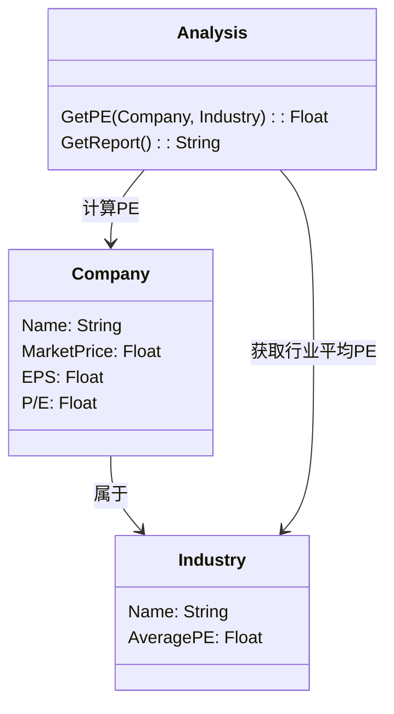
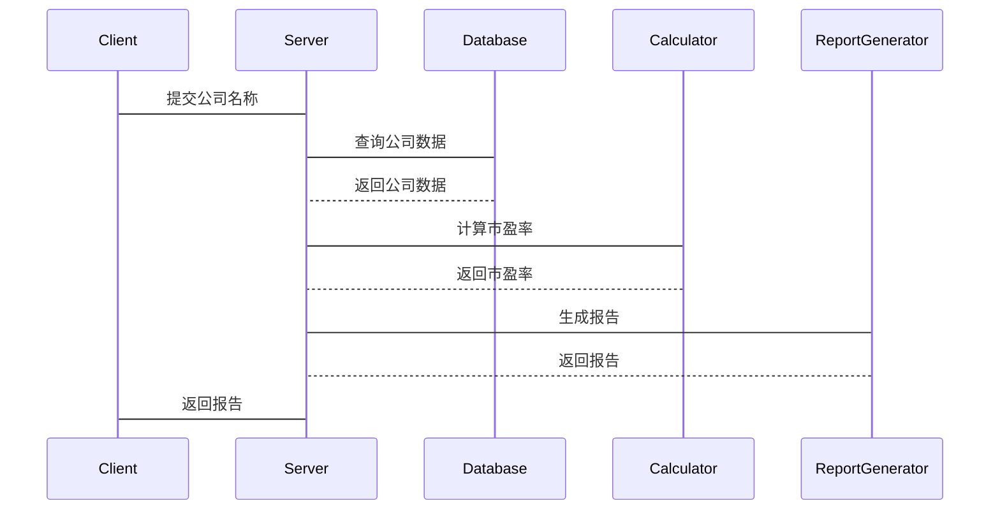

                 


# 市盈率法在企业估值中的应用

**关键词：** 市盈率法, 企业估值, 财务分析, 投资策略, 金融市场

**摘要：** 市盈率法是一种广泛应用的企业估值方法，通过分析企业的市盈率与行业或市场平均市盈率的差异，评估企业的内在价值。本文将从市盈率法的基本概念、核心原理、应用实践、系统架构与实现以及项目实战等多个方面，详细探讨市盈率法在企业估值中的应用，结合数学公式、表格对比和实际案例，帮助读者全面理解市盈率法的原理和应用技巧。

---

## 第1章: 市盈率法的定义与背景

### 1.1 市盈率法的定义

#### 1.1.1 市盈率的基本概念
市盈率（Price-to-Earnings Ratio，简称P/E）是股票市场中常用的估值指标，用于衡量一家公司的股价与其每股收益（EPS）之间的关系。市盈率的计算公式为：

$$ P/E = \frac{Market\,Price}{Earnings\,Per\,Share} $$

其中，$Market\,Price$ 是股票的市场价格，$Earnings\,Per\,Share$ 是每股净利润。

市盈率法的核心思想是通过比较企业的市盈率与行业或市场平均市盈率，评估企业的估值是否合理。

#### 1.1.2 市盈率与企业估值的关系
市盈率法通过市盈率的高低来判断企业股票的估值是否合理。如果企业的市盈率低于行业平均水平，可能意味着企业股票被低估；反之，如果市盈率高于行业平均水平，可能意味着企业股票被高估。

#### 1.1.3 市盈率法的核心要素
市盈率法的核心要素包括：
1. 市场价格：股票的市场价格。
2. 每股收益：企业净利润除以流通股数量。
3. 行业平均市盈率：同行业其他企业的平均市盈率。

### 1.2 市盈率法的背景与演变

#### 1.2.1 传统企业估值方法的局限性
传统的估值方法，如股息折现法和贴现现金流法，虽然精确，但计算复杂，且需要大量假设，难以快速估值。

#### 1.2.2 市盈率法的起源与发展
市盈率法起源于20世纪初，随着股票市场的兴起，投资者开始寻找简单有效的估值方法，市盈率法因其计算简便、直观，逐渐成为广泛应用的估值工具。

#### 1.2.3 市盈率法在现代金融中的地位
市盈率法是现代金融分析中的重要工具之一，广泛应用于投资决策、股票定价和企业价值评估。

### 1.3 市盈率法的应用场景

#### 1.3.1 市盈率法适用的企业类型
市盈率法适用于成长型企业，尤其是那些盈利稳定、行业特征明显的公司。

#### 1.3.2 不同行业市盈率法的适用性
不同行业的市盈率差异较大，例如科技行业通常市盈率较高，而传统制造业市盈率较低。因此，市盈率法在不同行业的应用需要结合行业特点。

#### 1.3.3 市盈率法的局限性与边界
市盈率法的局限性包括：
1. 无法反映企业的财务风险。
2. 市盈率受市场情绪影响较大。
3. 适用于盈利稳定的企业，不适用于亏损企业。

---

## 第2章: 市盈率法的核心原理

### 2.1 市盈率的计算公式

#### 2.1.1 市盈率的定义公式
$$ P/E = \frac{Market\,Price}{Earnings\,Per\,Share} $$

#### 2.1.2 市盈率的变形公式
$$ E = \frac{Market\,Price}{P/E} $$

### 2.2 市盈率法的原理与逻辑

#### 2.2.1 市盈率法的基本假设
市盈率法假设市场是有效的，且企业的盈利能力稳定。

#### 2.2.2 市盈率与企业价值的关系
市盈率越低，企业的估值可能越低；市盈率越高，企业的估值可能越高。

#### 2.2.3 市盈率法的数学模型
市盈率法的数学模型如下：
$$ Market\,Price = P/E \times Earnings\,Per\,Share $$

### 2.3 市盈率法的核心要素对比

| 要素 | 定义 | 影响因素 | 示例 |
|------|------|----------|------|
| 市盈率 | 市场价格与每股收益的比值 | 盈利能力、成长性、行业特点 | $$ P/E = \frac{P}{EPS} $$ |
| 每股收益 | 每股净利润 | 利润能力、成本控制 | $$ EPS = \frac{Net\,Income}{Shares\,Outstanding} $$
| 市场价格 | 股票的市场价格 | 市场供需、投资者情绪 | $$ P = N \times P/E $$ |

### 2.4 本章小结

---

## 第3章: 市盈率法与企业基本面分析

### 3.1 企业基本面分析的概述

#### 3.1.1 企业基本面的核心指标
企业基本面分析的核心指标包括：
1. 每股收益（EPS）。
2. 市盈率（P/E）。
3. 市净率（P/B）。
4. 股息率（Dividend Yield）。

#### 3.1.2 市盈率法与企业基本面的关系
市盈率法通过市盈率与企业基本面指标的结合，评估企业的内在价值。

#### 3.1.3 市盈率法在企业基本面分析中的作用
市盈率法可以帮助投资者快速评估企业的估值是否合理。

### 3.2 市盈率法与企业盈利能力分析

#### 3.2.1 净利润与市盈率的关系
净利润是市盈率计算的重要组成部分，净利润越高，市盈率越低，企业估值越合理。

#### 3.2.2 市盈率与企业成长性的关系
成长性好的企业通常市盈率较高，因为市场预期其未来盈利将增长。

#### 3.2.3 市盈率与行业平均市盈率的对比
通过比较市盈率与行业平均市盈率，可以判断企业的估值是否合理。

### 3.3 市盈率法与企业财务风险分析

#### 3.3.1 财务杠杆与市盈率的关系
高财务杠杆的企业通常市盈率较低，因为市场担忧其偿债能力。

#### 3.3.2 企业流动性与市盈率的关系
流动性好的企业通常市盈率较高，因为市场认为其风险较低。

### 3.4 本章小结

---

## 第4章: 市盈率法的系统架构与实现

### 4.1 问题场景介绍
市盈率法的系统实现需要解决以下问题：
1. 数据采集与处理。
2. 市盈率计算与分析。
3. 数据可视化与报告生成。

### 4.2 系统功能设计

#### 4.2.1 领域模型设计


#### 4.2.2 系统架构设计


### 4.3 系统接口设计

#### 4.3.1 数据接口设计
- 输入接口：公司名称、股价、每股收益。
- 输出接口：市盈率、行业平均市盈率、估值报告。

### 4.4 系统交互设计

#### 4.4.1 交互流程


### 4.5 本章小结

---

## 第5章: 市盈率法的项目实战

### 5.1 环境安装

#### 5.1.1 安装Python
```bash
pip install python3
pip install pandas
pip install numpy
pip install matplotlib
```

### 5.2 系统核心实现

#### 5.2.1 市盈率计算代码
```python
import pandas as pd
import numpy as np

# 示例数据
data = {
    'Company': ['A', 'B', 'C'],
    'MarketPrice': [100, 80, 120],
    'EPS': [20, 25, 30]
}

df = pd.DataFrame(data)

# 计算市盈率
df['PE'] = df['MarketPrice'] / df['EPS']

print(df)
```

#### 5.2.2 市盈率可视化代码
```python
import matplotlib.pyplot as plt

# 示例数据
companies = ['A', 'B', 'C']
prices = [100, 80, 120]
eps = [20, 25, 30]
pe = [100/20, 80/25, 120/30]

# 绘制市盈率柱状图
plt.figure(figsize=(10, 6))
plt.bar(companies, pe, color=['blue', 'green', 'red'])
plt.title('市盈率柱状图')
plt.ylabel('市盈率')
plt.show()
```

### 5.3 案例分析

#### 5.3.1 案例背景
假设我们有三家公司A、B、C，其股价和每股收益如下：
- A公司：股价100，EPS 20
- B公司：股价80，EPS 25
- C公司：股价120，EPS 30

#### 5.3.2 市盈率计算
计算各公司的市盈率：
- A公司：PE = 100/20 = 5
- B公司：PE = 80/25 = 3.2
- C公司：PE = 120/30 = 4

#### 5.3.3 行业平均市盈率
假设行业平均市盈率为4，那么：
- A公司PE = 5 > 4，可能被高估。
- B公司PE = 3.2 < 4，可能被低估。
- C公司PE = 4 = 4，估值合理。

### 5.4 项目总结

#### 5.4.1 项目小结
通过代码实现，我们可以快速计算市盈率，并根据行业平均市盈率判断企业的估值是否合理。

#### 5.4.2 注意事项
1. 市盈率法适用于盈利稳定的企业。
2. 市盈率受市场情绪影响较大。
3. 需结合行业特点进行分析。

---

## 第6章: 总结与展望

### 6.1 全文总结
市盈率法是一种简单有效的企业估值方法，通过计算市盈率并与行业平均市盈率对比，可以帮助投资者快速判断企业的估值是否合理。

### 6.2 未来研究方向
1. 市盈率法在不同行业中的应用。
2. 市盈率法与其它估值方法的结合。
3. 市盈率法在企业风险管理中的应用。

### 6.3 注意事项
1. 市盈率法仅适用于盈利稳定的企业。
2. 市盈率受市场情绪影响较大。
3. 需结合企业基本面进行综合分析。

### 6.4 拓展阅读
1. 《投资学》
2. 《股票估值与分析》
3. 《市盈率法实战指南》

---

## 作者信息

作者：AI天才研究院/AI Genius Institute & 禅与计算机程序设计艺术/Zen And The Art of Computer Programming

---

以上是《市盈率法在企业估值中的应用》的技术博客文章的完整内容，涵盖了市盈率法的定义、原理、应用、系统架构与实现以及项目实战等多个方面，结合了数学公式、表格对比、代码实现和实际案例，帮助读者全面理解市盈率法的原理和应用技巧。

