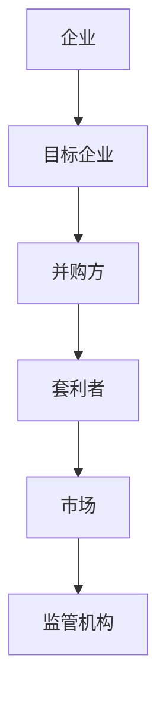
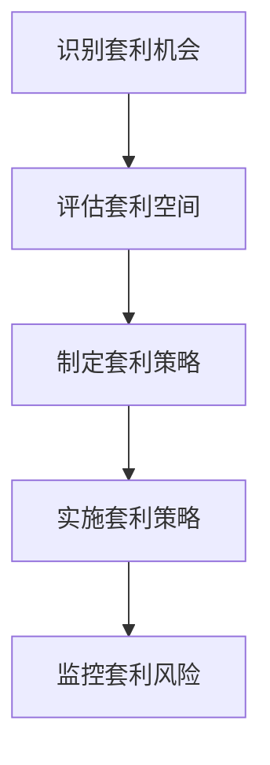

                 


# 并购套利策略：从企业重组中获利

---

## 关键词：
并购套利、企业重组、套利策略、市场异动、财务指标、风险管理

---

## 摘要：
并购套利是一种通过识别企业重组中的价格差异和市场机会，从而获取超额收益的投资策略。本文从并购套利的基本概念出发，深入分析其核心原理、套利机会的识别方法、策略制定与实施过程，并结合实际案例，探讨如何在企业重组中获利。文章还详细介绍了套利空间的评估模型、套利策略的数学公式以及系统架构设计，帮助读者全面理解并购套利的策略与实践。

---

## 第一部分: 背景介绍

### 第1章: 并购套利策略概述

#### 1.1 并购套利的基本概念
- **并购的定义与分类**  
  并购是指一家企业通过购买另一家企业的股权或资产，实现对目标企业的控制。并购可以分为横向并购、纵向并购和混合并购。
- **套利的定义与分类**  
  套利是指利用市场中的价格差异，通过同时买入和卖出相同资产，以获取无风险收益。套利可以分为统计套利、基于模型的套利和基于事件的套利。
- **并购套利的定义与特点**  
  并购套利是指利用企业重组中的价格差异，通过买入低估资产或卖出高估资产，获取超额收益。其特点包括低风险、高收益和短期性。

#### 1.2 并购套利的历史背景
- **并购套利的起源与发展**  
  并购套利起源于20世纪60年代，随着并购市场的兴起而逐渐发展。早期的套利活动主要集中在股票市场，后来扩展到企业重组和并购领域。
- **并购套利在不同经济周期的表现**  
  在经济繁荣时期，企业并购活动活跃，套利机会较多；在经济衰退时期，企业估值可能被低估，套利空间增大。
- **并购套利的现状与趋势**  
  随着市场信息透明度的提高和监管的加强，传统的套利机会逐渐减少，但通过技术手段和大数据分析，套利策略仍具有较大的发展空间。

#### 1.3 并购套利的市场环境
- **并购市场的参与者分析**  
  并购市场的参与者包括企业、投资银行、私募股权基金和机构投资者。不同参与者的行为会影响市场中的套利机会。
- **市场信息不对称与套利机会**  
  信息不对称是套利机会的来源之一。当市场中某些信息未被充分反映时，套利者可以通过提前获取信息或分析市场数据，抓住套利机会。
- **并购套利的法律与监管环境**  
  并购套利需要遵守相关法律法规，包括反垄断法、信息披露规则和证券交易法。监管机构对套利行为的限制也在不断加强。

#### 1.4 并购套利的重要性
- **并购套利在企业重组中的作用**  
  套利者通过参与企业重组，可以帮助市场发现价格，提高市场效率。同时，套利者也可以从企业重组中获利。
- **并购套利对投资者的价值**  
  对于投资者来说，并购套利是一种低风险、高收益的投资策略。通过套利，投资者可以在企业重组中获得超额收益。
- **并购套利对市场的促进作用**  
  套利活动可以促进市场的流动性，降低市场的波动性，并提高市场的整体效率。

### 第2章: 并购套利的核心概念与联系

#### 2.1 并购套利的原理
- **并购套利的基本原理**  
  套利者通过分析企业重组中的价格差异，利用市场的短期波动，进行买入和卖出操作，从而获取无风险收益。
- **并购套利的套利机制**  
  套利机制包括识别套利机会、评估套利空间、制定套利策略和实施套利操作。套利者需要在短时间内完成操作，以避免市场风险。
- **并购套利与企业重组的关系**  
  并购套利与企业重组密切相关。套利者通过参与企业重组，利用市场中的价格差异，实现套利收益。同时，企业重组也可以为套利者提供更多的套利机会。

#### 2.2 并购套利的核心概念对比
- **并购套利与企业重组的对比**  
  并购套利是企业重组的一部分，套利者通过参与企业重组，利用市场中的价格差异，实现套利收益。企业重组则是一个更广泛的概念，包括并购、分立、重组等多种形式。
- **并购套利与其他套利策略的对比**  
  并购套利与其他套利策略（如统计套利、基于模型的套利）相比，具有更强的事件驱动性和更低的风险。套利者需要对企业的重组行为进行深入分析，才能抓住套利机会。
- **并购套利与市场效率的对比**  
  套利活动可以提高市场效率，通过套利者的操作，市场价格能够更快地反映真实价值。然而，市场效率的提高可能会减少套利机会，使得套利者需要寻找新的套利策略。

#### 2.3 并购套利的ER实体关系图


#### 2.4 并购套利的流程图


---

## 第三部分: 并购套利策略的制定与实施

### 第3章: 并购套利机会的识别

#### 3.1 市场异动分析
- **市场异动的定义与特征**  
  市场异动是指市场中的价格、成交量或其他指标的突然变化。套利者需要识别这些异动背后的原因，以抓住套利机会。
- **市场异动的识别方法**  
  套利者可以通过分析市场数据，如股票价格、成交量、波动率等，来识别市场异动。此外，套利者还需要关注企业的公告和新闻，以发现潜在的套利机会。
- **市场异动的案例分析**  
  例如，在某公司宣布被收购后，目标公司的股价可能在短时间内大幅上涨，套利者可以通过买入目标公司股票，卖出并购方的股票，从而获利。

#### 3.2 财务指标分析
- **财务指标的定义与作用**  
  财务指标是衡量企业财务状况的重要工具，包括市盈率、市净率、EV/EBITDA等。套利者需要通过分析这些指标，发现企业的估值差异。
- **财务指标的套利空间分析**  
  通过比较目标企业的财务指标与行业平均水平或并购方的估值，套利者可以识别套利空间。例如，如果目标企业的市盈率低于行业平均水平，可能意味着其股价被低估。
- **财务指标的案例分析**  
  例如，假设目标企业的市盈率为10，而行业平均水平为15，套利者可以通过买入目标企业的股票，卖出并购方的股票，从而获利。

#### 3.3 套利空间的评估
- **套利空间的定义与评估方法**  
  套利空间是指目标企业的实际价值与市场价格之间的差异。套利者需要通过分析企业的基本面和市场估值，评估套利空间的大小。
- **套利空间的量化模型**  
  套利空间可以通过以下公式计算：
  $$\text{套利空间} = \text{目标企业实际价值} - \text{目标企业市场价格}$$
  其中，目标企业实际价值可以通过DCF模型或其他估值方法计算。
- **套利空间的案例分析**  
  例如，假设目标企业的实际价值为100元，而市场价格为80元，套利空间为20元。套利者可以通过买入目标企业的股票，卖出并购方的股票，从而获利20元。

### 第4章: 并购套利策略的制定与实施

#### 4.1 套利策略的制定
- **套利目标的确定**  
  套利者需要明确套利的目标，例如追求绝对收益还是相对收益。在并购套利中，套利者通常追求绝对收益，即通过套利操作实现无风险收益。
- **套利策略的制定步骤**  
  制定套利策略的步骤包括识别套利机会、评估套利空间、选择套利工具和确定套利规模。套利者需要根据市场情况和自身风险承受能力，制定合适的套利策略。
- **套利策略的案例分析**  
  例如，套利者通过分析市场数据，发现某目标企业的股价被低估，决定买入目标企业的股票，同时卖出并购方的股票。套利者需要确保操作的时机和规模，以最大化收益并降低风险。

#### 4.2 套利策略的实施
- **套利策略的实施步骤**  
  实施套利策略的步骤包括下单操作、监控市场变化和及时平仓。套利者需要密切关注市场动态，及时调整操作策略，以应对市场风险。
- **套利策略的实施风险**  
  套利策略的实施风险包括市场风险、流动性风险和操作风险。套利者需要通过分散投资、设置止损和严格遵守交易纪律，来降低实施风险。
- **套利策略的案例分析**  
  例如，套利者在发现目标企业股价被低估后，迅速买入目标企业的股票，同时卖出并购方的股票。套利者需要在短时间内完成操作，以避免市场波动带来的风险。

#### 4.3 套利策略的风险管理
- **风险管理的定义与作用**  
  风险管理是指通过识别、评估和控制风险，以降低套利策略的损失。套利者需要通过合理的风险管理，确保套利策略的稳健性。
- **风险管理的实施方法**  
  套利者可以通过设置止损、分散投资和动态调整策略，来管理风险。例如，套利者可以通过设置止损点，确保在市场出现大幅波动时，及时退出套利操作。
- **风险管理的案例分析**  
  例如，套利者在实施套利策略时，设置止损点，确保在市场出现不利变化时，能够及时平仓，避免更大的损失。

---

## 第四部分: 并购套利的数学模型与系统设计

### 第5章: 并购套利的数学模型

#### 5.1 套利定价模型
- **套利定价模型的定义与作用**  
  套利定价模型（APT）是一种用于估计资产收益的模型，它假设资产的收益可以通过多个因素来解释。套利定价模型可以用于套利策略的定价和风险分析。
- **套利定价模型的数学公式**  
  套利定价模型的公式为：
  $$\text{收益} = \beta_1f_1 + \beta_2f_2 + \dots + \beta_nf_n + \epsilon$$
  其中，$\beta_i$是资产对第i个因素的敏感性，$f_i$是第i个因素的风险溢价，$\epsilon$是随机误差项。
- **套利定价模型的应用**  
  套利定价模型可以用于套利策略的定价和风险分析。套利者可以通过分析资产对不同因素的敏感性，制定合适的套利策略。

#### 5.2 套利空间的量化
- **套利空间的量化公式**  
  套利空间可以通过以下公式量化：
  $$\text{套利空间} = \text{目标企业实际价值} - \text{目标企业市场价格}$$
  其中，目标企业实际价值可以通过DCF模型或其他估值方法计算。
- **套利空间的量化模型**  
  套利空间的量化模型包括市场估值模型和企业价值模型。套利者需要通过分析市场数据和企业基本面，计算套利空间的大小。
- **套利空间的案例分析**  
  例如，假设目标企业的实际价值为100元，市场价格为80元，套利空间为20元。套利者可以通过买入目标企业的股票，卖出并购方的股票，从而获利20元。

#### 5.3 套利收益与风险的评估模型
- **套利收益的评估公式**  
  套利收益可以通过以下公式评估：
  $$\text{套利收益} = \text{目标企业股价上涨幅度} - \text{并购方股价下跌幅度}$$
  套利者需要通过分析市场数据和企业基本面，预测股价的变动幅度。
- **套利风险的评估公式**  
  套利风险可以通过以下公式评估：
  $$\text{套利风险} = \text{市场波动率} \times \text{套利规模}$$
  套利者需要通过控制套利规模和分散投资，降低套利风险。
- **套利收益与风险的案例分析**  
  例如，套利者通过分析市场数据，预测目标企业股价将上涨10%，并购方股价将下跌5%。套利者可以通过买入目标企业股票，卖出并购方股票，预计套利收益为15%。套利者需要通过控制套利规模，降低套利风险。

### 第6章: 并购套利的系统架构设计

#### 6.1 系统功能设计
- **系统功能模块**  
  并购套利系统的功能模块包括数据采集、数据分析、套利策略制定和套利操作执行。套利者需要通过系统实现数据的采集、分析和操作。
- **系统功能设计的流程图**  
  ```mermaid
  graph TD
      A[数据采集] --> B[数据分析]
      B --> C[套利策略制定]
      C --> D[套利操作执行]
  ```
- **系统功能设计的案例分析**  
  例如，套利者通过系统采集市场数据，分析目标企业估值，制定套利策略，并通过系统执行套利操作。

#### 6.2 系统架构设计
- **系统架构的定义与作用**  
  系统架构是指系统各个部分的组成和相互关系。并购套利系统的架构需要包括数据源、数据处理模块、策略制定模块和操作执行模块。
- **系统架构的流程图**  
  ```mermaid
  graph TD
      A[数据源] --> B[数据处理模块]
      B --> C[策略制定模块]
      C --> D[操作执行模块]
  ```
- **系统架构的案例分析**  
  例如，套利者通过系统采集市场数据，分析目标企业估值，制定套利策略，并通过系统执行套利操作。

#### 6.3 系统接口设计
- **系统接口的定义与作用**  
  系统接口是指系统与其他部分的交互界面。并购套利系统的接口需要包括数据输入接口、策略制定接口和操作执行接口。
- **系统接口的流程图**  
  ```mermaid
  graph TD
      A[数据输入接口] --> B[策略制定接口]
      B --> C[操作执行接口]
  ```
- **系统接口的案例分析**  
  例如，套利者通过数据输入接口输入市场数据，通过策略制定接口制定套利策略，并通过操作执行接口执行套利操作。

#### 6.4 系统交互设计
- **系统交互的定义与作用**  
  系统交互是指用户与系统之间的互动。并购套利系统的交互需要包括数据输入、策略制定和操作执行。
- **系统交互的流程图**  
  ```mermaid
  graph TD
      A[用户输入数据] --> B[系统分析数据]
      B --> C[用户制定策略]
      C --> D[系统执行操作]
  ```
- **系统交互的案例分析**  
  例如，套利者通过输入市场数据，系统分析数据，套利者制定套利策略，系统执行操作。

---

## 第五部分: 并购套利的项目实战

### 第7章: 并购套利的项目实战

#### 7.1 项目背景介绍
- **项目背景**  
  假设某公司宣布收购一家目标企业，套利者需要分析市场数据，识别套利机会，并制定套利策略。
- **项目目标**  
  通过分析市场数据，识别套利机会，制定套利策略，并实施套利操作。

#### 7.2 项目核心实现
- **项目核心实现的代码**  
  ```python
  import pandas as pd
  import numpy as np

  def calculate_arbitrage Opportunity(target_value, market_price):
      return target_value - market_price

  data = pd.read_csv('market_data.csv')
  target_value = 100
  market_price = 80
  arbitrage_opportunity = calculate_arbitrage_opportunity(target_value, market_price)
  print(f'套利空间为: {arbitrage_opportunity}')
  ```
- **代码解读**  
  代码通过读取市场数据，计算目标企业的实际价值和市场价格，识别套利机会。套利者可以通过代码实现套利策略的自动化。

#### 7.3 项目实战案例分析
- **案例分析**  
  例如，套利者通过分析市场数据，发现目标企业的股价被低估，决定买入目标企业的股票，同时卖出并购方的股票。套利者需要在短时间内完成操作，以避免市场波动带来的风险。
- **案例总结**  
  通过案例分析，套利者可以验证套利策略的有效性，并总结经验教训，优化套利策略。

#### 7.4 项目小结
- **项目小结**  
  通过项目实战，套利者可以掌握并购套利的核心策略和实施方法。同时，套利者也需要关注市场风险和操作风险，确保套利策略的稳健性。

---

## 第六部分: 最佳实践与注意事项

### 第8章: 并购套利的最佳实践

#### 8.1 风险管理
- **风险管理的重要性**  
  风险管理是套利策略成功的关键。套利者需要通过设置止损、分散投资和动态调整策略，降低套利风险。
- **风险管理的实施方法**  
  套利者可以通过以下方法管理风险：设置止损点、分散投资和动态调整策略。例如，套利者可以通过设置止损点，确保在市场出现不利变化时，能够及时退出套利操作。

#### 8.2 法律与合规
- **法律与合规的重要性**  
  并购套利需要遵守相关法律法规，包括反垄断法、信息披露规则和证券交易法。套利者需要确保套利行为的合规性，避免法律风险。
- **法律与合规的实施方法**  
  套利者需要了解相关法律法规，确保套利行为的合规性。例如，套利者需要遵守信息披露规则，避免内幕交易和操纵市场。

#### 8.3 税务规划
- **税务规划的重要性**  
  税务规划是套利策略的重要组成部分。套利者需要通过合理的税务规划，降低税务负担，提高套利收益。
- **税务规划的实施方法**  
  套利者可以通过以下方法进行税务规划：利用税收优惠政策、优化资产配置和合理避税。例如，套利者可以通过优化资产配置，降低资本利得税的负担。

### 第9章: 并购套利的小结

#### 9.1 并购套利的核心要点
- 并购套利是一种通过识别企业重组中的价格差异，获取超额收益的投资策略。
- 套利者需要通过分析市场数据和企业基本面，识别套利机会，制定套利策略，并实施套利操作。
- 套利者需要关注市场风险、操作风险和法律风险，确保套利策略的稳健性。

#### 9.2 并购套利的未来展望
- 随着市场信息透明度的提高和监管的加强，传统的套利机会逐渐减少，但通过技术手段和大数据分析，套利策略仍具有较大的发展空间。
- 套利者需要不断优化套利策略，提高套利收益，降低套利风险。

---

## 作者信息

作者：AI天才研究院/AI Genius Institute & 禅与计算机程序设计艺术/Zen And The Art of Computer Programming

---

**注意事项**：
- 本文内容仅供参考，不构成投资建议。实际操作中，请结合市场实际情况和专业投资顾问的建议。
- 本文中涉及的代码和案例分析，均为理论示例，实际应用中需结合具体市场环境和数据进行调整。

**拓展阅读**：
- 《并购套利实战指南》
- 《企业重组与价值评估》
- 《金融市场与套利策略》

---

通过以上结构和内容的详细设计，您可以撰写一篇高质量的并购套利策略的技术博客文章。希望这篇文章能够为您提供清晰的思路和详细的指导！

