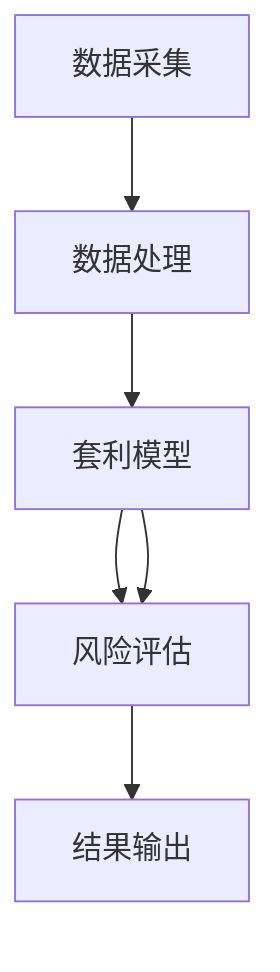
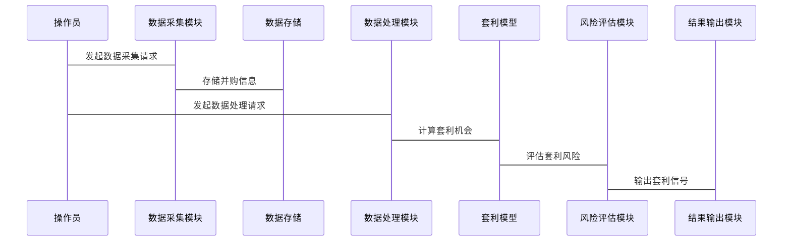
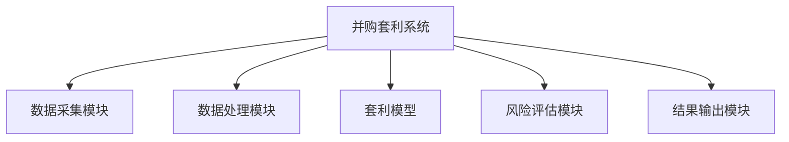
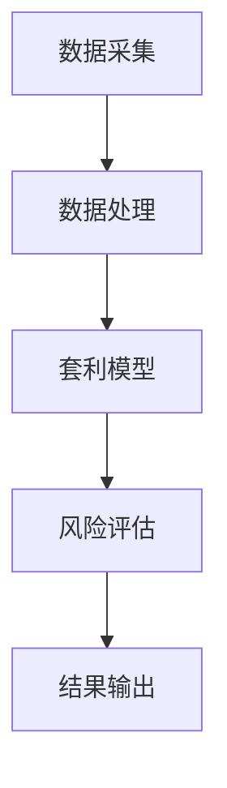

                 


# 并购套利策略：从企业重组中获取收益

> 关键词：并购套利，企业重组，资产注入，套利机会，数学模型

> 摘要：并购套利是一种通过企业重组和资产注入等手段，在市场中利用价格差异和信息不对称来获取收益的策略。本文将详细探讨并购套利的核心概念、数学模型、算法实现以及实际案例，帮助读者全面理解这一策略的原理和应用。

---

## 第一部分: 背景介绍

### 第1章: 并购套利策略概述

#### 1.1 并购套利的定义与背景
##### 1.1.1 什么是并购套利
并购套利是指在企业并购过程中，利用市场信息不对称、价格差异等机会，通过买入低估资产或卖出高估资产，从而在短期内获得收益的一种投资策略。

##### 1.1.2 并购套利的背景与重要性
近年来，企业并购活动频繁，尤其是在经济危机或市场波动时期，企业重组和资产注入成为投资者关注的焦点。并购套利通过捕捉短期价格差异，为投资者提供了快速获利的机会。

##### 1.1.3 并购套利的基本概念与核心要素
- **市场均衡**：并购套利的理论基础是市场非完全均衡，即价格与价值的偏离。
- **信息不对称**：市场参与者掌握信息的不平等，导致价格差异。
- **套利机会**：通过套利行为，市场重新达到均衡。

#### 1.2 并购套利的机会来源
##### 1.2.1 企业重组与资产注入
企业重组可能导致资产价值重新评估，资产注入可能增加公司价值，从而带来套利机会。

##### 1.2.2 并购过程中的价格差异
并购双方的股价可能因信息不对称而出现差异，套利者通过买入低估股票和卖出高估股票获利。

##### 1.2.3 市场信息不对称与套利机会
内部信息与公开信息的时间差可能导致股价波动，套利者利用这一时间差进行交易。

### 第2章: 并购套利的基本原理

#### 2.1 并购套利的核心概念
##### 2.1.1 并购套利的理论基础
套利定价模型（APT）和资本资产定价模型（CAPM）是并购套利的理论基础，用于衡量资产的合理价格。

##### 2.1.2 套利的经济学解释
套利是市场参与者利用价格差异获利的行为，有助于市场均衡的恢复。

##### 2.1.3 并购套利的市场机制
并购套利通过价格差异套利，促进市场信息的传播和资产价格的合理化。

#### 2.2 并购套利的类型
##### 2.2.1 短期套利与长期套利
短期套利利用短期价格波动，长期套利则关注长期资产价值的回归。

##### 2.2.2 股权套利与债权套利
股权套利涉及股票交易，债权套利涉及债券或其他债务工具。

##### 2.2.3 横向套利与纵向套利
横向套利涉及同行业公司，纵向套利涉及上下游企业。

---

## 第二部分: 核心概念与联系

### 第3章: 并购套利的数学模型与公式

#### 3.1 并购套利的数学模型
##### 3.1.1 市场均衡模型
$$ E[return] = R_f + \beta (E[market\ return] - R_f) $$

##### 3.1.2 套利定价模型（APT）
$$ E[return] = \sum \lambda_i x_i $$

##### 3.1.3 资本资产定价模型（CAPM）
$$ E[return] = R_f + \beta (R_m - R_f) $$

#### 3.2 并购套利的公式推导
##### 3.2.1 套利机会的识别公式
$$ price_{target} - price_{acquirer} > value\ gap $$

##### 3.2.2 套利收益的计算公式
$$ profit = (S - B) \times shares $$

##### 3.2.3 套利风险的衡量公式
$$ risk = \sigma^2 = \sum (p_i - E[p])^2 $$

### 第4章: 并购套利的系统分析与架构设计

#### 4.1 并购套利的系统分析
##### 4.1.1 系统功能需求分析
- 数据采集：收集并购信息、股价数据。
- 数据处理：清洗、转换、分析。
- 模型构建：套利模型、风险评估。
- 结果输出：套利信号、收益预测。

##### 4.1.2 系统模块划分与设计


##### 4.1.3 系统交互流程设计


#### 4.2 并购套利的架构设计
##### 4.2.1 系统架构图


##### 4.2.2 模块之间的接口设计
- 数据采集模块与数据处理模块：数据接口。
- 数据处理模块与套利模型：数据接口。
- 套利模型与风险评估模块：数据接口。

##### 4.2.3 系统数据流设计


---

## 第三部分: 算法原理讲解

### 第5章: 并购套利的算法实现

#### 5.1 并购套利算法的原理
##### 5.1.1 算法的基本思想
利用市场价与合理价的差异，通过买入低估资产和卖出高估资产，实现套利收益。

##### 5.1.2 算法的输入输出
- 输入：并购信息、股价数据。
- 输出：套利信号、套利收益预测。

##### 5.1.3 算法的步骤分解
1. 数据清洗：去除异常值。
2. 数据分析：计算股价与合理价的差异。
3. 模型训练：构建套利模型。
4. 模型优化：调整参数。
5. 结果输出：生成套利信号。

#### 5.2 并购套利算法的实现
##### 5.2.1 算法的Python实现
```python
import pandas as pd
import numpy as np

# 数据加载
data = pd.read_csv('并购数据.csv')

# 数据清洗
data.dropna(inplace=True)

# 计算套利信号
def calculate_arbitrage_signal(data):
    # 假设value为资产的合理价值
    value = data['value']
    price = data['price']
    signal = np.where(price < value, 1, -1)
    return signal

signal = calculate_arbitrage_signal(data)

# 模型训练
from sklearn.linear_model import LinearRegression
model = LinearRegression()
model.fit(data[['price', 'value']], data['signal'])

# 模型预测
predicted_signal = model.predict(data[['price', 'value']])
```

##### 5.2.2 算法的优化与改进
- 使用更复杂的模型，如随机森林或神经网络。
- 引入更多的特征变量，如市场情绪、行业趋势。

##### 5.2.3 算法的测试与验证
- 划分训练集和测试集。
- 计算准确率、召回率等指标。
- 验证套利信号的有效性。

### 第6章: 并购套利的案例分析

#### 6.1 并购套利的经典案例
##### 6.1.1 案例一：XXX公司的并购套利
案例分析：某公司并购后，股价出现低估，套利者买入股票，股价上涨后卖出获利。

##### 6.1.2 案例二：YYY公司的并购套利
案例分析：某公司资产注入导致股价低估，套利者买入后股价上涨。

##### 6.1.3 案例三：ZZZ公司的并购套利
案例分析：某公司并购消息泄露，股价提前上涨，套利者卖出高估股票获利。

#### 6.2 案例分析的总结与启示
##### 6.2.1 案例的共同特征
- 并购消息泄露前股价低估。
- 市场信息不对称明显。

##### 6.2.2 案例的成功与失败原因
- 成功：套利者准确捕捉套利机会。
- 失败：市场波动大，套利者未能及时退出。

##### 6.2.3 案例对读者的启示
- 套利机会存在于市场非均衡状态。
- 套利者需关注市场信息和价格差异。

---

## 第四部分: 项目实战

### 第7章: 并购套利的环境与工具

#### 7.1 并购套利的环境配置
##### 7.1.1 系统环境要求
- 操作系统：Windows/Mac/Linux。
- Python版本：3.6以上。
- 数据源：并购数据CSV文件。

##### 7.1.2 开发工具安装
- Python安装：使用Anaconda或virtualenv。
- 依赖库安装：pandas、numpy、scikit-learn。

##### 7.1.3 数据源获取
- 数据来源：公开并购数据、财经网站API。

#### 7.2 并购套利的工具使用
##### 7.2.1 数据分析工具
- Python的pandas和numpy库。
- 数据可视化工具：Matplotlib、Seaborn。

##### 7.2.2 模型构建工具
- 机器学习库：scikit-learn、XGBoost。
- 深度学习库：TensorFlow、Keras。

##### 7.2.3 结果可视化工具
- Matplotlib：绘制套利信号图。
- Seaborn：绘制分布图和热力图。

### 第8章: 并购套利的代码实现

#### 8.1 并购套利代码的核心实现
##### 8.1.1 数据清洗与预处理
```python
import pandas as pd
import numpy as np

# 加载数据
data = pd.read_csv('并购数据.csv')

# 删除缺失值
data.dropna(inplace=True)

# 去除异常值
data = data[(data['price'] > 0) & (data['value'] > 0)]
```

##### 8.1.2 模型训练与优化
```python
from sklearn.linear_model import LinearRegression
from sklearn.metrics import accuracy_score

# 划分训练集和测试集
X_train = data[['price', 'value']]
y_train = data['signal']

model = LinearRegression()
model.fit(X_train, y_train)

# 模型预测
X_test = data[['price', 'value']]
y_pred = model.predict(X_test)
```

##### 8.1.3 结果输出与解释
```python
# 计算准确率
print('准确率:', accuracy_score(y_test, y_pred))
# 可视化结果
import matplotlib.pyplot as plt
plt.scatter(y_test, y_pred)
plt.xlabel('真实值')
plt.ylabel('预测值')
plt.show()
```

#### 8.2 代码实现的详细解读
##### 8.2.1 代码结构分析
- 数据加载、清洗、预处理。
- 模型训练、优化。
- 模型预测、结果输出。

##### 8.2.2 代码功能说明
- 数据清洗：去除异常值和缺失值。
- 模型训练：使用线性回归构建套利模型。
- 模型预测：预测套利信号。
- 结果输出：计算准确率并可视化。

---

## 第五部分: 总结与展望

### 第9章: 并购套利的总结与展望

#### 9.1 并购套利的总结
并购套利是一种有效的投资策略，通过捕捉市场非均衡状态下的价格差异，为投资者提供获利机会。套利行为有助于市场信息的传播和资产价格的合理化。

#### 9.2 并购套利的未来展望
- **技术进步**：人工智能和大数据技术的应用将提高套利的准确性和效率。
- **市场变化**：随着市场的成熟，套利机会将减少，投资者需更加关注长期价值。
- **政策影响**：政策变化可能影响套利行为的合法性和收益。

#### 9.3 并购套利的注意事项
- **市场风险**：套利者需关注市场波动和政策变化。
- **信息风险**：信息不对称可能导致套利失败。
- **操作风险**：交易执行中的问题可能影响套利收益。

---

## 作者

作者：AI天才研究院/AI Genius Institute & 禅与计算机程序设计艺术 /Zen And The Art of Computer Programming

