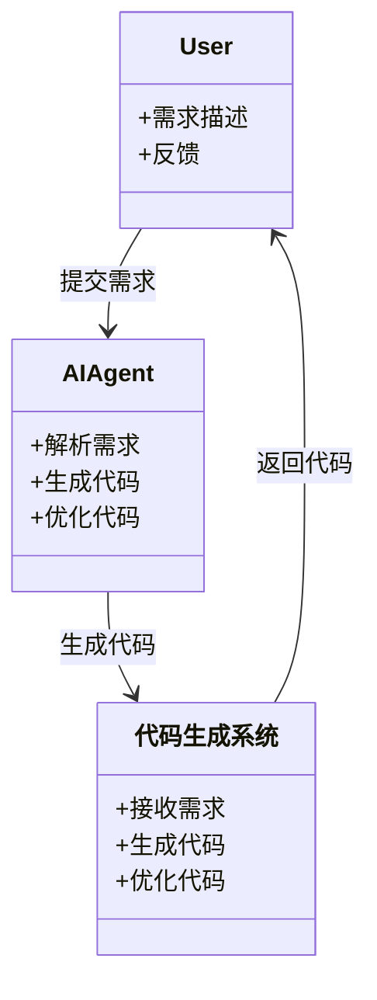
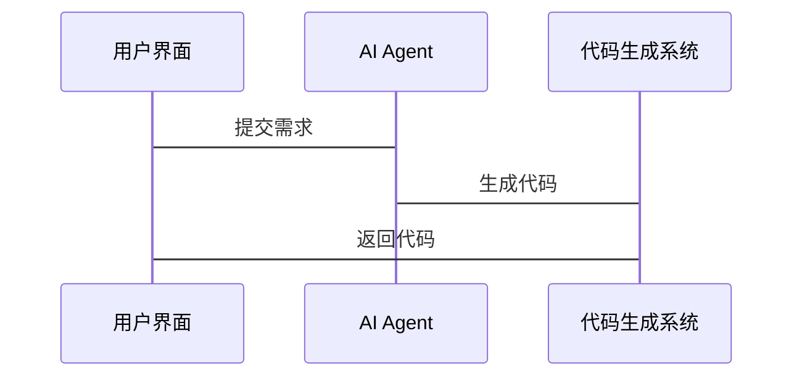

                 


# 开发AI Agent支持的智能代码生成系统

> **关键词：** AI Agent，智能代码生成，自然语言处理，生成式AI，代码优化

> **摘要：**  
本文详细探讨了如何开发一个由AI Agent支持的智能代码生成系统。首先介绍了AI Agent的基本概念及其在代码生成中的应用，接着分析了智能代码生成系统的结构与核心算法，包括基于GPT和Transformer的模型原理。通过系统架构设计与项目实战，展示了如何构建一个高效的智能代码生成系统，并提供了实际案例和最佳实践建议，帮助开发者提升代码生成效率和质量。

---

## 第1章 AI Agent与智能代码生成系统概述

### 1.1 AI Agent的基本概念

AI Agent（人工智能代理）是指能够感知环境、执行任务并做出决策的智能实体。在代码生成领域，AI Agent充当了用户与代码生成系统之间的桥梁，通过理解用户需求，提供定制化的代码生成服务。AI Agent的优势在于其智能化和自适应能力，能够根据上下文调整生成结果，从而显著提升代码生成的效率和准确性。

#### 1.1.1 AI Agent的定义与特点

- **定义：** AI Agent是一个能够接收输入、分析需求、生成输出的智能实体，通常由自然语言处理模型和生成式AI模型构成。
- **特点：** 智能性、自适应性、实时性、可解释性。

#### 1.1.2 AI Agent在代码生成中的作用

- **需求解析：** AI Agent通过自然语言处理理解用户的开发需求，生成代码框架。
- **代码生成：** 利用生成式AI模型生成高质量的代码片段。
- **优化与反馈：** 根据用户反馈优化生成代码，提供改进建议。

### 1.2 智能代码生成系统的定义与特点

智能代码生成系统是一种结合了AI技术的代码生成工具，能够根据用户需求自动生成高质量的代码。其特点包括：

- **智能化：** 通过AI算法理解需求，自动生成代码。
- **高效性：** 显著减少开发时间，提升开发效率。
- **可定制化：** 支持个性化需求，生成符合特定项目风格的代码。

---

## 第2章 AI Agent与智能代码生成系统的核心概念

### 2.1 AI Agent与代码生成的关系

AI Agent在代码生成中的作用可以分为以下几个方面：

#### 2.1.1 AI Agent在代码生成中的角色

- **需求理解：** 通过自然语言处理技术解析用户的开发需求，提取关键信息。
- **代码生成：** 调用生成式AI模型生成代码，提供多种实现方案。
- **优化与反馈：** 根据用户反馈优化生成代码，提供改进建议。

#### 2.1.2 代码生成的流程与AI Agent的结合

以下是代码生成的基本流程：

1. **需求输入：** 用户通过自然语言或结构化输入描述需求。
2. **需求解析：** AI Agent理解需求，提取关键信息。
3. **代码生成：** 调用AI模型生成代码。
4. **反馈优化：** 根据用户反馈优化生成代码。

### 2.2 智能代码生成系统的核心要素

智能代码生成系统由以下几个核心要素组成：

#### 2.2.1 用户需求解析

- **自然语言处理技术：** 用于理解用户的开发需求。
- **意图识别：** 确定用户的需求类型和目标。

#### 2.2.2 AI模型的选择与训练

- **模型选择：** 选择适合的AI模型，如GPT、Transformer等。
- **模型训练：** 根据项目需求训练定制化的AI模型。

#### 2.2.3 代码生成与优化模块

- **生成式AI模型：** 用于生成代码。
- **代码优化工具：** 对生成的代码进行优化，提高代码质量。

---

## 第3章 AI Agent支持的智能代码生成系统算法原理

### 3.1 基于GPT的代码生成算法

#### 3.1.1 GPT模型的结构与原理

GPT（Generative Pre-trained Transformer）是一种基于Transformer架构的生成式模型，通过预训练和微调生成高质量的文本内容。其核心思想是利用上下文信息预测下一个词，从而生成连贯的文本。

#### 3.1.2 基于GPT的代码生成流程

以下是基于GPT的代码生成流程：

1. **输入处理：** 接收用户输入的需求描述。
2. **需求解析：** 分析需求，提取关键信息。
3. **生成代码：** 调用GPT模型生成代码。
4. **代码优化：** 对生成的代码进行优化和调整。

#### 3.1.3 GPT模型在代码生成中的优缺点

- **优点：** 
  - 生成能力强，能够处理复杂的语言结构。
  - 可以生成多样化的代码实现方案。
- **缺点：** 
  - 对代码的语义理解有限，生成代码的质量依赖于模型的训练数据。
  - 计算资源消耗较大，需要高性能硬件支持。

### 3.2 基于Transformer的代码生成算法

#### 3.2.1 Transformer模型的结构与原理

Transformer模型由编码器和解码器两部分组成，编码器负责将输入序列编码为上下文向量，解码器根据编码结果生成输出序列。其核心组件包括自注意力机制和前馈神经网络。

#### 3.2.2 Transformer模型在代码生成中的应用

- **代码生成：** 利用自注意力机制捕捉代码结构中的依赖关系。
- **代码补全：** 在代码编写过程中实时生成建议。

#### 3.2.3 Transformer模型的数学模型

以下是Transformer模型的数学模型：

$$
\text{Encoder} = \text{LayerNorm}(\text{MultiHeadAttention}(x) + x)
$$

$$
\text{Decoder} = \text{LayerNorm}(\text{MultiHeadAttention}(y, x) + \text{MultiHeadAttention}(y) + y)
$$

---

## 第4章 系统分析与架构设计

### 4.1 问题场景介绍

开发者在编写代码时常常面临以下问题：

- **代码冗余：** 需要重复编写相同功能的代码。
- **开发效率低：** 需要手动查找和编写代码。
- **代码质量问题：** 可能存在逻辑错误或代码优化不足。

### 4.2 系统功能设计

#### 4.2.1 领域模型设计

以下是智能代码生成系统的领域模型：



#### 4.2.2 系统架构设计

以下是系统的整体架构图：

```mermaid
architecturalDiagram
    container 前端 {
        component 用户界面
    }
    container 后端 {
        component AI Agent
        component 代码生成系统
    }
    用户界面 --> AI Agent: 提交需求
    AI Agent --> 代码生成系统: 生成代码
    代码生成系统 --> 用户界面: 返回代码
```

#### 4.2.3 系统接口设计

以下是系统的交互序列图：



---

## 第5章 项目实战

### 5.1 环境安装

- **Python版本：** Python 3.8+
- **依赖库安装：** `transformers`, `torch`

### 5.2 核心代码实现

以下是基于GPT的代码生成系统的实现代码：

```python
from transformers import GPT2LMHeadModel, GPT2Tokenizer

# 初始化模型和分词器
model_name = "gpt2"
tokenizer = GPT2Tokenizer.from_pretrained(model_name)
model = GPT2LMHeadModel.from_pretrained(model_name)

# 定义生成函数
def generate_code(prefix, max_length=50):
    inputs = tokenizer(prefix, return_tensors="pt")
    outputs = model.generate(**inputs, max_length=max_length)
    code = tokenizer.decode(outputs[0], skip_special_tokens=True)
    return code

# 示例
prefix = "实现一个计算斐波那契数列的函数"
generated_code = generate_code(prefix)
print(generated_code)
```

### 5.3 代码解读与分析

- **输入处理：** 接收用户输入的需求描述。
- **需求解析：** 通过自然语言处理技术理解需求。
- **代码生成：** 调用GPT模型生成代码。
- **代码优化：** 对生成的代码进行优化和调整。

### 5.4 实际案例分析

以下是一个实际案例的分析：

```python
# 示例需求：生成一个计算斐波那契数列的函数
prefix = "实现一个计算斐波那契数列的函数"
generated_code = generate_code(prefix)
print(generated_code)
```

生成的代码可能如下：

```python
def fibonacci(n):
    if n <= 0:
        return 0
    elif n == 1:
        return 1
    else:
        return fibonacci(n-1) + fibonacci(n-2)
```

---

## 第6章 最佳实践与注意事项

### 6.1 最佳实践

- **选择合适的AI模型：** 根据具体需求选择合适的AI模型，如GPT、Transformer等。
- **优化代码生成流程：** 定期优化代码生成流程，提升生成效率和质量。
- **提供反馈机制：** 建立用户反馈机制，优化AI模型的生成效果。

### 6.2 小结

通过本文的介绍，我们详细探讨了开发AI Agent支持的智能代码生成系统的核心概念、算法原理、系统架构设计和项目实战。AI Agent在代码生成中的应用将显著提升开发效率和代码质量，为开发者提供强有力的支持。

### 6.3 注意事项

- **数据安全：** 确保生成代码的数据安全，避免敏感信息泄露。
- **代码质量：** 定期检查生成代码的质量，确保其符合项目规范。
- **模型优化：** 不断优化AI模型，提升生成代码的准确性和效率。

### 6.4 拓展阅读

- **相关书籍：** 《生成式AI：原理与应用》
- **技术博客：** [AI Agent与智能代码生成系统](https://example.com)

---

**作者：AI天才研究院/AI Genius Institute & 禅与计算机程序设计艺术 /Zen And The Art of Computer Programming**

