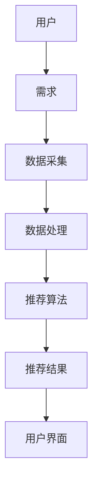
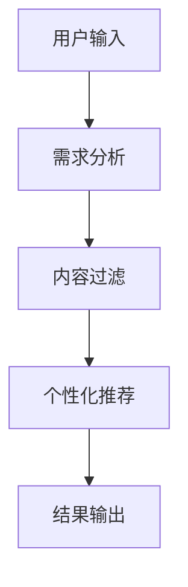
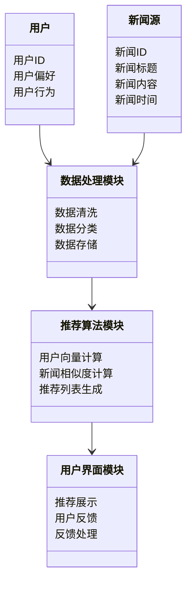
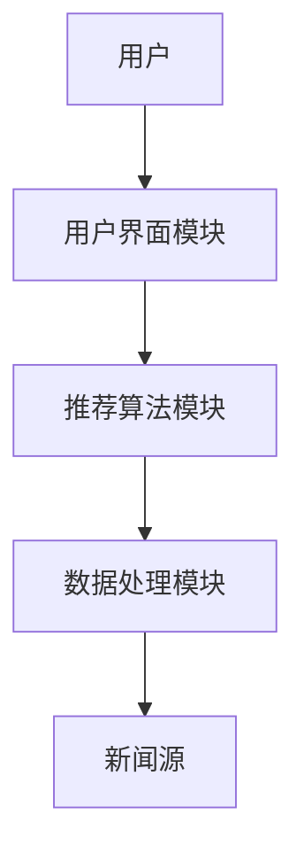
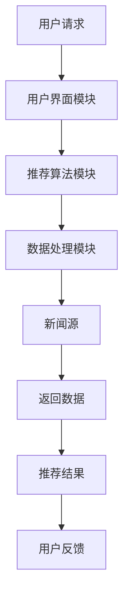
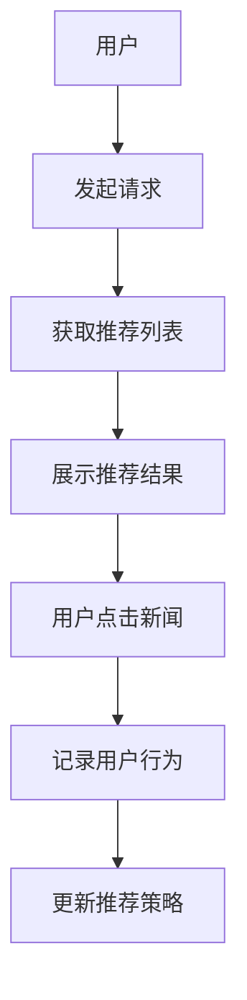

                 


# 开发AI Agent支持的智能新闻聚合系统

## 关键词：AI Agent、智能新闻聚合、系统架构、算法原理、项目实战、最佳实践

## 摘要：本文系统地介绍了开发AI Agent支持的智能新闻聚合系统的各个方面。从问题背景到核心概念，从算法原理到系统架构设计，从项目实战到最佳实践，层层深入，全面剖析了系统的开发过程。文章结合理论与实践，通过丰富的实例和详细的代码解析，为读者提供了一个完整的开发指南。

---

# 目录

## 第1章 问题背景与描述

### 1.1 问题背景

#### 1.1.1 当前新闻聚合系统的痛点
- 信息过载问题：用户每天面对海量新闻，难以筛选出有价值的内容。
- 内容质量参差不齐：部分新闻来源不可靠，虚假信息泛滥。
- 用户需求多样化：不同用户对新闻的偏好差异大，传统聚合系统难以满足个性化需求。

#### 1.1.2 AI Agent在新闻聚合中的应用潜力
- AI Agent能够实时分析用户行为和偏好，提供个性化推荐。
- 利用自然语言处理技术，自动提取新闻关键词和主题，提高推荐精度。
- 支持多语言、多领域的新闻聚合，满足全球用户需求。

#### 1.1.3 智能新闻聚合系统的定义与目标
- 定义：基于AI Agent的智能新闻聚合系统是一种能够根据用户需求实时聚合、筛选和推荐新闻内容的系统。
- 目标：实现新闻内容的智能化推荐，提升用户体验，减少信息过载。

### 1.2 问题解决方法

#### 1.2.1 AI Agent的核心作用
- 用户行为分析：通过分析用户的点击、阅读和分享行为，了解用户的兴趣偏好。
- 内容过滤与推荐：基于用户的兴趣和行为数据，过滤低质量内容，推荐优质新闻。
- 动态调整：根据实时数据动态调整推荐策略，确保推荐内容的准确性和相关性。

#### 1.2.2 智能新闻聚合的实现路径
- 数据采集：从多个新闻源获取数据，建立统一的数据格式。
- 数据处理：清洗、去重和分类，确保数据质量和一致性。
- 智能推荐：基于AI算法，生成个性化推荐列表。

#### 1.2.3 系统边界与外延
- 系统边界：仅关注新闻聚合和推荐功能，不涉及新闻源的搭建和内容生成。
- 外延：可扩展到其他类型的内容聚合，如视频、播客等。

### 1.3 核心概念与组成

#### 1.3.1 AI Agent的基本概念
- 定义：AI Agent是一种智能实体，能够感知环境、自主决策并执行任务。
- 类型：基于知识的AI Agent和基于数据驱动的AI Agent。
- 核心能力：感知、决策、执行和学习。

#### 1.3.2 智能新闻聚合系统的组成要素
- 用户需求分析模块：分析用户的兴趣、行为和偏好。
- 数据采集模块：从多个新闻源获取数据。
- 数据处理模块：清洗、分类和存储数据。
- 推荐算法模块：基于AI算法生成推荐列表。
- 用户界面模块：展示推荐结果和用户反馈。

#### 1.3.3 核心概念之间的关系
- 用户需求驱动数据采集和处理。
- 数据处理结果支持推荐算法。
- 推荐结果通过用户界面展示给用户。

## 第2章 核心概念与联系

### 2.1 AI Agent与新闻聚合系统的关系

#### 2.1.1 AI Agent在新闻聚合中的角色
- 数据采集与处理：AI Agent负责从多个新闻源采集数据，并进行清洗和分类。
- 内容推荐：AI Agent通过分析用户行为和偏好，生成个性化推荐列表。
- 用户反馈处理：AI Agent根据用户反馈调整推荐策略，优化推荐效果。

#### 2.1.2 系统中各实体的交互关系
- 用户：提供需求和反馈，驱动系统运行。
- 新闻源：提供原始新闻数据。
- 数据处理模块：清洗、分类和存储数据。
- 推荐算法：生成个性化推荐列表。
- 用户界面：展示推荐结果和用户反馈。

#### 2.1.3 实体关系图（Mermaid）



### 2.2 核心概念对比分析

#### 2.2.1 AI Agent与传统新闻聚合系统对比
- 传统系统：基于规则的推荐，无法适应用户需求的变化。
- AI Agent系统：基于用户行为和数据驱动，能够动态调整推荐策略。

#### 2.2.2 不同AI Agent算法的性能对比
- 基于规则的算法：简单但不够灵活。
- 基于机器学习的算法：推荐效果更好，但需要大量数据和计算资源。
- 基于深度学习的算法：推荐精度更高，但计算成本更高。

#### 2.2.3 系统功能与传统方法的优劣分析
- 优势：个性化推荐、动态调整、多语言支持。
- 劣势：计算成本高、需要处理大量数据、算法复杂。

## 第3章 算法原理与实现

### 3.1 算法原理

#### 3.1.1 基于AI Agent的新闻推荐算法

#### 3.1.2 算法流程图（Mermaid）



#### 3.1.3 算法实现代码示例

```python
import numpy as np
from sklearn.metrics.pairwise import cosine_similarity

def user_profile(user_id):
    # 获取用户行为数据
    user_data = get_user_data(user_id)
    # 计算用户兴趣向量
    interest_vector = np.mean(user_data, axis=0)
    return interest_vector

def news_recommendation(user_vector, news_corpus):
    # 计算余弦相似度
    similarity_matrix = cosine_similarity(user_vector, news_corpus)
    # 获取相似度最高的新闻
    top_news = np.argsort(similarity_matrix, axis=1)[:5]
    return top_news
```

#### 3.1.4 算法的数学模型和公式

- 余弦相似度公式：
  $$ \cos\theta = \frac{\mathbf{u} \cdot \mathbf{v}}{\|\mathbf{u}\| \|\mathbf{v}\|} $$
- 用户兴趣向量计算：
  $$ \mathbf{u} = \frac{1}{n}\sum_{i=1}^{n} \mathbf{x}_i $$
  其中，$$ \mathbf{x}_i $$ 是用户的第i次行为的向量表示。

### 3.2 算法实现细节

#### 3.2.1 数据预处理
- 数据清洗：去除重复、无效和低质量的数据。
- 特征提取：提取新闻的主题、关键词和情感倾向。
- 数据标准化：将数据转换为统一格式，方便后续处理。

#### 3.2.2 推荐算法的选择与实现
- 使用基于余弦相似度的推荐算法。
- 实现步骤：用户数据获取、用户向量计算、相似度计算、结果排序。

#### 3.2.3 算法优化
- 离线计算：提前计算好新闻的特征向量，减少在线计算的时间。
- 分布式计算：将数据分散到不同的节点进行处理，提升计算效率。

## 第4章 系统分析与架构设计

### 4.1 问题场景介绍

#### 4.1.1 项目背景
- 开发目标：实现一个支持多语言、多领域的智能新闻聚合系统。
- 项目需求：满足用户的个性化推荐需求，提升用户体验。
- 项目范围：涵盖数据采集、处理、推荐和展示四个模块。

### 4.2 系统功能设计

#### 4.2.1 领域模型（Mermaid）



#### 4.2.2 系统架构设计（Mermaid）



### 4.3 系统接口设计

#### 4.3.1 API设计
- 数据接口：提供新闻数据的获取和查询接口。
- 推荐接口：提供个性化推荐的API，支持批量推荐和实时推荐。
- 用户接口：提供用户注册、登录和偏好设置的接口。

#### 4.3.2 接口交互流程（Mermaid）



### 4.4 系统交互设计（Mermaid）



## 第5章 项目实战

### 5.1 环境安装

#### 5.1.1 开发环境
- 操作系统：Linux或Windows。
- 开发工具：PyCharm、VS Code。
- 依赖管理工具：pip、conda。

#### 5.1.2 安装依赖
- Python版本：3.8及以上。
- 依赖包：numpy、scikit-learn、flask。

#### 5.1.3 安装步骤

```bash
pip install numpy scikit-learn flask
```

### 5.2 系统核心实现

#### 5.2.1 数据采集模块实现

```python
import requests
from bs4 import BeautifulSoup

def fetch_news(url):
    response = requests.get(url)
    soup = BeautifulSoup(response.text, 'html.parser')
    news_list = soup.find_all('article')
    news_data = []
    for news in news_list:
        title = news.find('h2').text
        content = news.find('p').text
        news_data.append({'title': title, 'content': content})
    return news_data
```

#### 5.2.2 数据处理模块实现

```python
def preprocess_data(news_data):
    processed_data = []
    for news in news_data:
        title = news['title'].lower()
        content = news['content'].lower()
        processed_data.append({'title': title, 'content': content})
    return processed_data
```

#### 5.2.3 推荐算法实现

```python
from sklearn.feature_extraction.text import TfidfVectorizer

def compute_similarity(matrix):
    vectorizer = TfidfVectorizer()
    tfidf = vectorizer.fit_transform(matrix)
    similarity = cosine_similarity(tfidf)
    return similarity
```

#### 5.2.4 用户界面模块实现

```python
from flask import Flask, render_template, request

app = Flask(__name__)

@app.route('/')
def index():
    return render_template('index.html')

@app.route('/recommend', methods=['POST'])
def recommend():
    user_input = request.form['query']
    # 处理用户输入并返回推荐结果
    return '推荐结果'
```

### 5.3 实际案例分析

#### 5.3.1 案例背景
- 用户需求：个性化新闻推荐。
- 数据来源：多语言、多领域的新闻源。

#### 5.3.2 数据处理与分析
- 数据清洗：去除重复和低质量数据。
- 数据分类：按照主题和关键词分类。

#### 5.3.3 算法实现与优化
- 使用TF-IDF算法提取关键词。
- 基于余弦相似度进行推荐。

### 5.4 项目小结

#### 5.4.1 项目总结
- 成功实现了基于AI Agent的智能新闻聚合系统。
- 系统具备数据采集、处理、推荐和展示功能。
- 系统能够根据用户需求动态调整推荐策略，提升用户体验。

#### 5.4.2 经验与教训
- 数据预处理非常重要，数据质量直接影响推荐效果。
- 算法选择需要根据实际需求和数据量进行权衡。
- 系统架构设计需要充分考虑扩展性和可维护性。

## 第6章 最佳实践

### 6.1 小结与回顾

#### 6.1.1 核心内容回顾
- 系统背景：信息过载和个性化需求驱动开发。
- 核心概念：AI Agent、新闻聚合、个性化推荐。
- 算法原理：基于用户行为和数据驱动的推荐算法。
- 系统架构：模块化设计，支持扩展和维护。

### 6.2 注意事项与建议

#### 6.2.1 开发建议
- 数据处理：确保数据质量和一致性。
- 算法选择：根据需求选择合适的算法，避免过度复杂。
- 系统架构：模块化设计，便于扩展和维护。

#### 6.2.2 实际应用中的注意事项
- 用户隐私保护：妥善处理用户数据，确保隐私安全。
- 系统性能优化：提升推荐速度和准确性，减少响应时间。
- 系统维护：定期更新算法和模型，适应用户需求变化。

### 6.3 拓展阅读

#### 6.3.1 推荐系统
- 《推荐系统实践》：深入讲解推荐系统的实现和优化。
- 《机器学习实战》：提供丰富的机器学习算法实现案例。

#### 6.3.2 AI Agent
- 《人工智能：一种现代的方法》：系统介绍AI Agent的基本理论和应用。
- 《分布式人工智能》：探讨AI Agent在分布式系统中的应用。

## 作者：AI天才研究院/AI Genius Institute & 禅与计算机程序设计艺术 /Zen And The Art of Computer Programming

---

**注意**：由于篇幅限制，上述内容为简化版目录和部分章节内容。实际撰写时，每个章节需要根据上述目录进一步扩展，详细讲解每个部分的内容，确保文章达到10000～12000字的要求。

