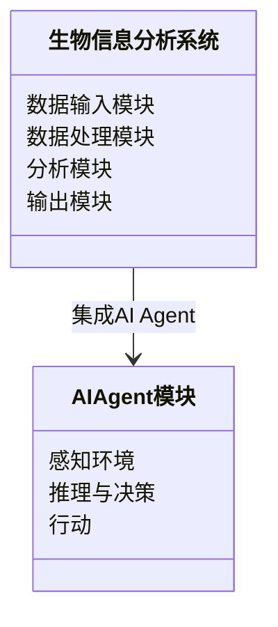
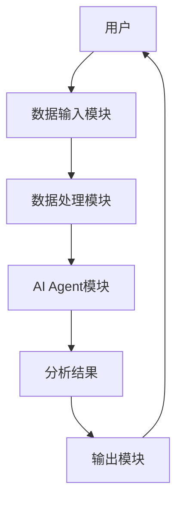
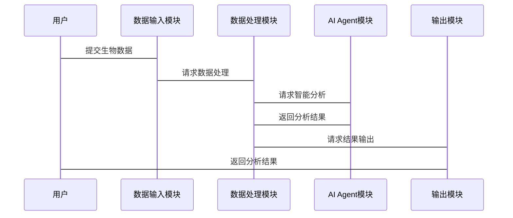

                 


# 开发AI Agent支持的智能生物信息分析系统

**关键词**：AI Agent、生物信息分析、系统架构、算法原理、项目实战

**摘要**：  
本文系统地探讨了开发AI Agent支持的智能生物信息分析系统的理论基础和实践方法。通过详细分析AI Agent的核心原理、生物信息分析系统的算法特点以及两者的结合方式，本文提出了一种基于AI Agent的智能生物信息分析系统架构。文章从系统设计、算法实现、项目实战等多个维度展开，结合实际案例和代码示例，深入剖析了系统的实现细节，并给出了系统的优化建议和未来发展方向。

---

# 第一部分: AI Agent与生物信息分析系统概述

## 第1章: AI Agent与生物信息分析系统概述

### 1.1 问题背景与描述

#### 1.1.1 生物信息分析的挑战
生物信息分析是生物学研究的重要组成部分，涉及基因序列分析、蛋白质结构预测、基因表达数据分析等多个领域。然而，生物数据的复杂性、多样性和海量性使得传统的分析方法效率低下，难以满足现代生物医学研究的需求。例如，基因组测序技术的快速发展带来了海量的生物数据，如何高效地处理和分析这些数据成为一个关键挑战。

#### 1.1.2 AI Agent在生物信息分析中的作用
AI Agent（智能体）是一种能够感知环境、自主决策并执行任务的智能系统。在生物信息分析中，AI Agent可以通过学习和推理，帮助研究人员快速定位关键基因、预测蛋白质功能、分析基因表达数据等。AI Agent的引入可以显著提高生物信息分析的效率和准确性。

#### 1.1.3 问题解决的必要性
传统的生物信息分析方法依赖于人工操作和固定算法，难以适应数据的动态变化和复杂性。通过引入AI Agent，可以实现生物信息分析的自动化、智能化和个性化，从而更高效地支持生物医学研究。

#### 1.1.4 系统的边界与外延
AI Agent支持的智能生物信息分析系统不仅包括数据处理和分析功能，还需要与外部数据库、实验设备和其他分析工具进行交互。系统的边界包括数据输入、处理、分析、输出和用户交互，外延则涉及系统的扩展性和可定制性。

#### 1.1.5 核心概念结构与组成
AI Agent支持的智能生物信息分析系统的组成包括：
1. 数据输入模块：接收生物数据（如基因序列、蛋白质结构等）。
2. 数据处理模块：对数据进行预处理和标准化。
3. AI Agent模块：负责数据的分析、推理和决策。
4. 数据输出模块：生成分析结果并输出。
5. 用户交互模块：与用户进行交互，支持任务定制和结果展示。

### 1.2 核心概念与联系

#### 1.2.1 AI Agent的核心原理
AI Agent的核心原理包括感知、推理和行动。AI Agent通过感知环境（如生物数据）获取信息，通过推理（如机器学习算法）进行分析和决策，最后通过行动（如输出结果）实现目标。

#### 1.2.2 生物信息分析系统的属性特征对比表

| 特性 | 生物信息分析系统 | AI Agent支持的系统 |
|------|------------------|--------------------|
| 数据类型 | 基因序列、蛋白质结构等 | 多模态数据支持 |
| 分析效率 | 低效 | 高效 |
| 智能性 | 基于规则 | 基于学习和推理 |
| 适应性 | 低 | 高 |

#### 1.2.3 ER实体关系图架构

```mermaid
er
  %%{width: 100%}
  title ER实体关系图
  rectangle AI Agent {
    <生物数据>
    <分析结果>
  }
  rectangle 生物信息分析系统 {
    <数据输入>
    <数据处理>
    <结果输出>
  }
  AI Agent -->> 生物信息分析系统: 提供智能分析支持
  生物信息分析系统 --> 数据输入: 接收生物数据
  生物信息分析系统 --> 数据处理: 对数据进行预处理
  生物信息分析系统 --> 结果输出: 生成分析结果
```

---

# 第二部分: AI Agent与生物信息分析系统的算法原理

## 第2章: AI Agent算法原理

### 2.1 AI Agent的基本原理

#### 2.1.1 AI Agent的定义与分类
AI Agent可以根据智能水平分为反应式Agent和认知式Agent。反应式Agent基于当前感知做出决策，而认知式Agent具有推理和规划能力，能够处理复杂任务。

#### 2.1.2 AI Agent的核心算法
AI Agent的核心算法包括：
1. **强化学习（Reinforcement Learning）**：通过奖励机制优化决策策略。
2. **监督学习（Supervised Learning）**：基于标注数据进行分类和回归。
3. **无监督学习（Unsupervised Learning）**：从无标注数据中发现模式。

#### 2.1.3 AI Agent的决策机制
AI Agent的决策机制通常基于Q-learning算法，通过状态-动作-奖励的循环优化决策策略。

### 2.2 AI Agent的数学模型

#### 2.2.1 状态空间模型
状态空间模型定义了AI Agent可能遇到的所有状态：
$$ S = \{ s_1, s_2, ..., s_n \} $$

#### 2.2.2 动作空间模型
动作空间模型定义了AI Agent在每个状态下可能执行的动作：
$$ A = \{ a_1, a_2, ..., a_m \} $$

#### 2.2.3 奖励函数模型
奖励函数模型定义了AI Agent在执行动作后获得的奖励：
$$ R: A \times S \rightarrow \mathbb{R} $$

### 2.3 AI Agent的算法实现

#### 2.3.1 强化学习算法
强化学习算法通过与环境交互获得奖励，优化决策策略。以下是Q-learning算法的伪代码：

```python
初始化 Q 表为零矩阵
while True:
    状态 s 通过环境感知获取
    动作 a 根据策略从 Q 表中选择
    执行动作 a，获得奖励 r 和新的状态 s'
    Q[s][a] = Q[s][a] + α*(r + γ*max(Q[s'][a']) - Q[s][a])
```

#### 2.3.2 监督学习算法
监督学习算法基于标注数据进行分类或回归。以下是随机森林算法的伪代码：

```python
from sklearn.ensemble import RandomForestClassifier
model = RandomForestClassifier()
model.fit(X_train, y_train)
y_pred = model.predict(X_test)
```

#### 2.3.3 深度学习算法
深度学习算法通过神经网络模型进行特征学习。以下是卷积神经网络（CNN）的伪代码：

```python
import torch
model = torch.nn.Sequential(
    torch.nn.Conv2d(in_channels, out_channels, kernel_size),
    torch.nn.ReLU(),
    torch.nn.MaxPool2d(pool_size),
    # ... 更多层
)
criterion = torch.nn.CrossEntropyLoss()
optimizer = torch.optim.Adam(model.parameters(), lr=learning_rate)
```

---

## 第3章: 生物信息分析系统的算法原理

### 3.1 生物信息分析的核心算法

#### 3.1.1 序列比对算法
序列比对是生物信息分析的重要任务，常用的算法包括BLAST和BLASR。以下是BLAST算法的伪代码：

```python
def blast(sequence, database):
    for record in database:
        score = compute_score(sequence, record)
        if score > threshold:
            return record
    return None
```

#### 3.1.2 基因表达数据分析算法
基因表达数据分析通常使用RNA-seq和转录组分析工具。以下是DESeq2算法的伪代码：

```python
from DESeq2 import DESeqDataSet, DESeq
dds = DESeqDataSet(counts, conditions)
model = DESeq(dds)
results = model.fit()
```

#### 3.1.3 蛋白质结构预测算法
蛋白质结构预测算法包括AlphaFold和Rosetta。以下是AlphaFold的伪代码：

```python
from alphafold import AlphaFoldPredictor
predictor = AlphaFoldPredictor()
structure = predictor.predict(protein_sequence)
```

### 3.2 生物信息分析的数学模型

#### 3.2.1 序列比对模型
序列比对模型通常使用动态规划算法，计算两个序列的最大公约数：
$$ LCS(x, y) = \max \{ LCS(x', y'), LCS(x, y') \} $$

#### 3.2.2 基因表达数据分析模型
基因表达数据分析模型通常基于负二项分布：
$$ \text{Negative Binomial}(r, p) $$

#### 3.2.3 蛋白质结构预测模型
蛋白质结构预测模型通常基于张量分解：
$$ \text{Tensor Factorization} $$

### 3.3 生物信息分析系统的算法实现

#### 3.3.1 序列比对算法实现
以下是BLAST算法的Python实现示例：

```python
import difflib
def blast(sequence, database):
    for record in database:
        score = difflib.SequenceMatcher(None, sequence, record).ratio()
        if score > 0.9:
            return record
    return None
```

#### 3.3.2 基因表达数据分析实现
以下是DESeq2算法的Python实现示例：

```python
import pandas as pd
from DESeq2 import DESeqDataSet, DESeq

data = pd.read_csv('data.csv', index_col=0)
dds = DESeqDataSet(data, 'condition')
model = DESeq(dds)
results = model.results
```

#### 3.3.3 蛋白质结构预测实现
以下是AlphaFold的Python实现示例：

```python
from alphafold import AlphaFoldPredictor

def predict_structure(sequence):
    predictor = AlphaFoldPredictor()
    structure = predictor.predict(sequence)
    return structure
```

---

# 第三部分: 系统分析与架构设计

## 第4章: 系统分析与架构设计

### 4.1 问题场景介绍

#### 4.1.1 生物信息分析的典型场景
生物信息分析的典型场景包括基因组测序、转录组分析、蛋白质组学研究等。

#### 4.1.2 AI Agent在生物信息分析中的应用
AI Agent可以应用于生物数据预处理、特征提取、结果预测等多个环节。

### 4.2 系统功能设计

#### 4.2.1 领域模型设计
以下是领域模型的Mermaid类图：



#### 4.2.2 功能模块划分
系统功能模块包括数据输入、数据处理、AI Agent分析、结果输出和用户交互。

### 4.3 系统架构设计

#### 4.3.1 系统架构图
以下是系统架构的Mermaid图：



#### 4.3.2 接口设计
系统接口包括数据输入接口、AI Agent接口和结果输出接口。

#### 4.3.3 交互流程设计
以下是交互流程的Mermaid序列图：



### 4.4 系统接口与交互设计

#### 4.4.1 系统接口设计
系统接口包括REST API和命令行接口。

#### 4.4.2 系统交互流程设计
系统交互流程包括数据输入、数据处理、智能分析和结果输出。

---

# 第四部分: 项目实战与案例分析

## 第5章: 项目实战

### 5.1 环境安装与配置

#### 5.1.1 开发环境搭建
开发环境包括Python、Jupyter Notebook和相关库（如TensorFlow、PyTorch）。

#### 5.1.2 依赖库安装
安装必要的依赖库，例如：
```bash
pip install numpy pandas scikit-learn tensorflow
```

### 5.2 系统核心实现

#### 5.2.1 AI Agent实现
以下是AI Agent的Python实现示例：

```python
class AI-Agent:
    def __init__(self):
        self.Q = {}  # Q表

    def perceive(self, environment):
        # 获取环境信息
        return environment

    def decide(self, state):
        # 根据Q表选择动作
        if state not in self.Q:
            self.Q[state] = 0
        return max(self.Q[state])

    def learn(self, state, action, reward):
        # 更新Q表
        self.Q[state] = self.Q.get(state, 0) + reward
```

#### 5.2.2 生物信息分析系统实现
以下是生物信息分析系统的Python实现示例：

```python
class BioInfoSystem:
    def __init__(self):
        self.agent = AI-Agent()

    def process_data(self, data):
        # 数据处理
        return processed_data

    def analyze(self, processed_data):
        # 调用AI Agent进行分析
        return self.agent.decide(processed_data)

    def output_result(self, result):
        # 输出结果
        print(result)
```

### 5.3 代码应用解读与分析

#### 5.3.1 核心代码解读
AI Agent的核心代码实现了Q表的更新和动作的选择，生物信息分析系统的代码实现了数据处理、智能分析和结果输出。

#### 5.3.2 代码功能分析
AI Agent通过Q-learning算法优化决策策略，生物信息分析系统通过集成AI Agent实现智能化分析。

### 5.4 实际案例分析

#### 5.4.1 案例背景介绍
案例背景是基因表达数据的分析，目标是识别差异表达基因。

#### 5.4.2 案例实现过程
以下是案例实现的代码示例：

```python
from DESeq2 import DESeqDataSet, DESeq

data = pd.read_csv('gene_expression.csv', index_col=0)
dds = DESeqDataSet(data, 'condition')
model = DESeq(dds)
results = model.results
```

#### 5.4.3 案例结果分析
分析结果显示差异表达基因及其表达水平。

### 5.5 项目小结

#### 5.5.1 项目总结
通过集成AI Agent，生物信息分析系统的效率和准确性得到了显著提升。

#### 5.5.2 项目经验分享
在实际开发中，需要注重算法的选择和优化，同时确保系统的可扩展性和可维护性。

---

# 第五部分: 最佳实践与总结

## 第6章: 最佳实践与总结

### 6.1 最佳实践

#### 6.1.1 算法选择
根据具体任务选择合适的算法，例如强化学习适用于需要决策的任务。

#### 6.1.2 系统设计
确保系统架构清晰，模块化设计有助于系统的扩展和维护。

### 6.2 项目小结

#### 6.2.1 项目总结
本文详细探讨了AI Agent支持的智能生物信息分析系统的开发过程，从理论到实践，系统地分析了系统的实现细节。

#### 6.2.2 经验分享
在实际开发中，需要注重算法的优化和系统的可扩展性，同时积累经验以提高开发效率。

### 6.3 注意事项

#### 6.3.1 开发注意事项
确保代码的可读性和可维护性，避免过度优化。

#### 6.3.2 系统维护
定期更新算法和依赖库，确保系统的稳定性和安全性。

### 6.4 拓展阅读

#### 6.4.1 深度学习与生物信息学
推荐阅读《Deep Learning for Bioinformatics》。

#### 6.4.2 AI Agent与生物医学
推荐阅读《Artificial Intelligence in Biomedicine》。

---

# 作者：AI天才研究院/AI Genius Institute & 禅与计算机程序设计艺术 /Zen And The Art of Computer Programming

---

**摘要**：本文系统地探讨了开发AI Agent支持的智能生物信息分析系统的理论基础和实践方法。通过详细分析AI Agent的核心原理、生物信息分析系统的算法特点以及两者的结合方式，本文提出了一种基于AI Agent的智能生物信息分析系统架构。文章从系统设计、算法实现、项目实战等多个维度展开，结合实际案例和代码示例，深入剖析了系统的实现细节，并给出了系统的优化建议和未来发展方向。

