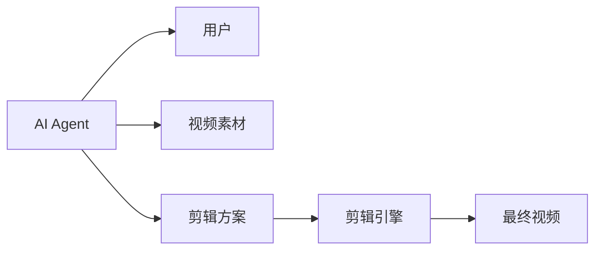
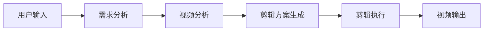
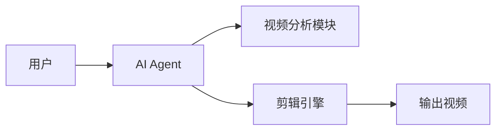
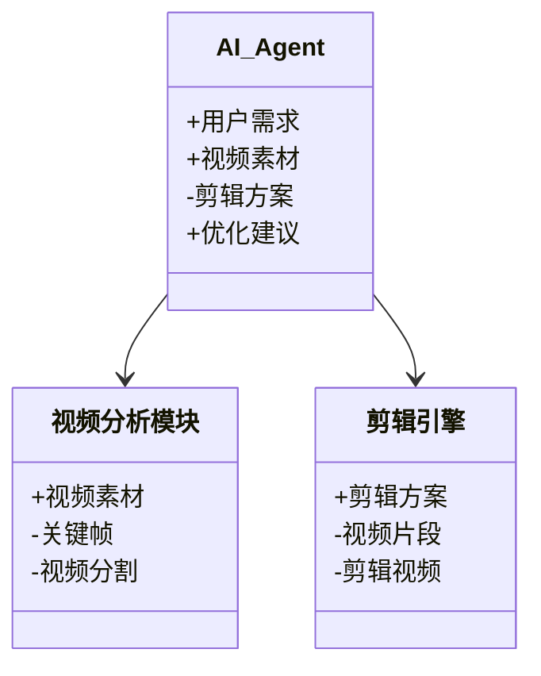
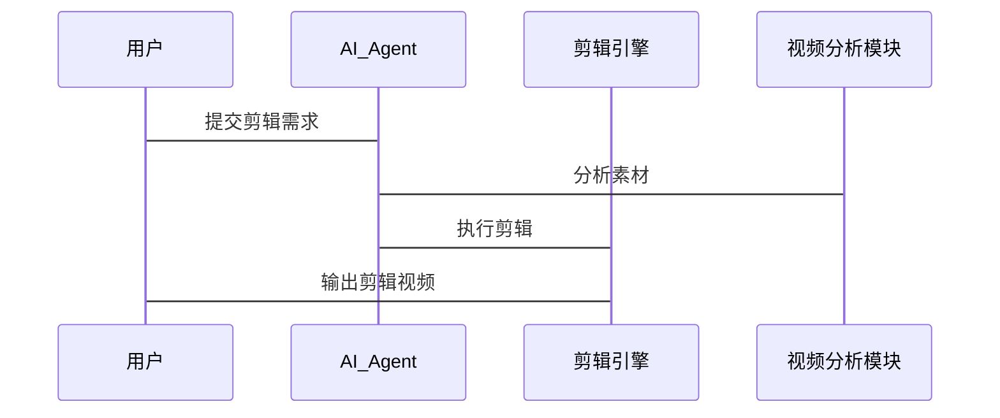
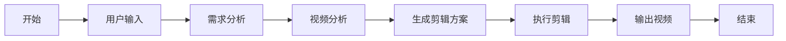
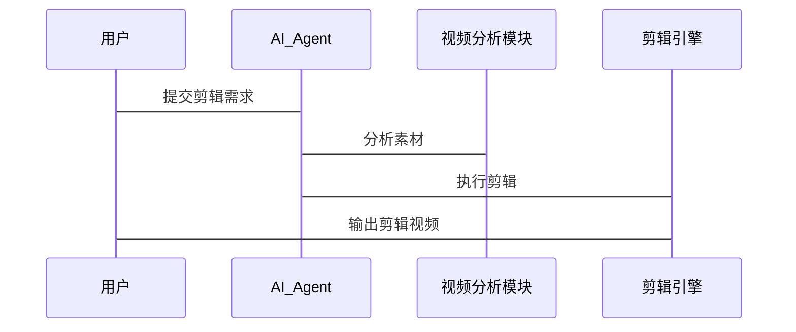

                 


# 开发AI Agent支持的智能视频剪辑系统

## 关键词：AI Agent, 视频剪辑系统, 智能视频剪辑, 算法原理, 系统架构设计, 项目实战

## 摘要：本文系统地介绍开发AI Agent支持的智能视频剪辑系统的背景、核心概念、算法原理、系统架构设计以及项目实战。通过对AI Agent在视频剪辑中的应用价值和实现方法的深入分析，结合实际案例，探讨如何利用AI技术提升视频剪辑的效率和智能化水平。文章内容涵盖从理论到实践的各个方面，为读者提供全面的技术指导。

---

# 第1章: AI Agent与智能视频剪辑系统背景介绍

## 1.1 问题背景与问题描述
### 1.1.1 传统视频剪辑的痛点
传统视频剪辑依赖人工操作，效率低、耗时长，且需要专业技能。内容创作者和企业难以快速生成高质量视频内容，尤其是在处理大量素材时，人工剪辑的效率瓶颈明显。

### 1.1.2 AI Agent在视频剪辑中的应用价值
AI Agent（智能体）能够通过自然语言处理、计算机视觉和机器学习等技术，实现视频剪辑的自动化和智能化。AI Agent可以理解用户需求，自动生成剪辑方案，并优化视频质量，显著提升效率。

### 1.1.3 智能视频剪辑系统的定义与目标
智能视频剪辑系统是指利用AI技术辅助或完全替代人工进行视频剪辑的系统。其目标是实现视频剪辑的自动化、智能化和高效化，降低门槛，提高内容创作效率。

## 1.2 问题解决与边界定义
### 1.2.1 AI Agent如何解决视频剪辑问题
AI Agent通过自然语言处理理解用户需求，结合视频分析技术提取素材关键信息，自动生成剪辑方案，并优化视频质量。

### 1.2.2 系统的边界与外延
智能视频剪辑系统的边界包括素材输入、剪辑目标输出，以及AI Agent的交互界面。外延包括视频生成、特效添加和内容分发等扩展功能。

### 1.2.3 核心概念与组成要素
智能视频剪辑系统由AI Agent、视频分析模块、剪辑引擎和用户交互界面组成。AI Agent负责需求理解与决策，视频分析模块处理素材，剪辑引擎实现自动化剪辑，用户交互界面提供操作入口。

## 1.3 核心概念与联系
### 1.3.1 AI Agent与视频剪辑的关系
AI Agent作为智能视频剪辑的核心，通过自然语言理解和视频分析，实现剪辑的自动化和智能化。

### 1.3.2 核心概念属性特征对比表
| 核心概念 | 属性 | 特征 |
|----------|------|------|
| AI Agent | 输入 | 自然语言描述、视频素材 |
|          | 输出 | 剪辑方案、优化建议 |
| 剪辑引擎 | 输入 | 视频素材、剪辑方案 |
|          | 输出 | 自动化剪辑视频 |

### 1.3.3 ER实体关系图（Mermaid流程图）


---

# 第2章: AI Agent与智能视频剪辑系统的核心概念

## 2.1 AI Agent的基本原理
### 2.1.1 AI Agent的定义与分类
AI Agent是一种能够感知环境、执行任务的智能体，分为简单反射Agent和基于模型的反射Agent。简单反射Agent基于规则执行任务，而基于模型的反射Agent具备学习能力。

### 2.1.2 AI Agent的核心原理
AI Agent通过感知环境、分析需求、制定计划、执行操作和反馈优化，实现任务目标。

### 2.1.3 AI Agent与传统算法的区别
AI Agent具备自主性和适应性，能够根据环境变化调整策略，而传统算法依赖预设规则，无法自主决策。

## 2.2 智能视频剪辑系统的算法原理
### 2.2.1 视频剪辑的关键算法
视频剪辑的关键算法包括视频分割、关键帧提取和视频拼接。AI Agent通过这些算法实现自动化剪辑。

### 2.2.2 AI Agent在算法中的作用
AI Agent通过自然语言理解和视频分析技术，优化视频剪辑的流程和质量。

### 2.2.3 算法流程图（Mermaid）


## 2.3 系统架构与设计
### 2.3.1 系统架构设计（Mermaid）


### 2.3.2 领域模型类图（Mermaid）


### 2.3.3 系统接口与交互设计（Mermaid）


---

# 第3章: AI Agent支持的智能视频剪辑系统算法实现

## 3.1 算法原理与数学模型
### 3.1.1 视频剪辑的数学模型
$$
f(x) = \begin{cases}
    x_1 & \text{如果 } x \text{ 是视频素材} \\
    x_2 & \text{如果 } x \text{ 是剪辑方案}
\end{cases}
$$

### 3.1.2 AI Agent的算法流程图（Mermaid）


### 3.1.3 算法实现的Python代码示例
```python
def video_edition(ai_agent, video_material):
    # 分析视频素材
    analysis_result = ai_agent.analyze(video_material)
    # 生成剪辑方案
    edit_plan = ai_agent.plan(analysis_result)
    # 执行剪辑
    edited_video = ai_agent.edit(video_material, edit_plan)
    return edited_video

# 示例使用
ai_agent = AI-Agent()
video_material = "input.mp4"
result = video_edition(ai_agent, video_material)
print("视频剪辑完成！")
```

## 3.2 算法实现与代码解读
### 3.2.1 环境安装与配置
需要安装Python和相关库，如OpenCV、FFmpeg、自然语言处理库等。

### 3.2.2 核心算法实现代码
```python
import cv2
import numpy as np

def extract_key_frames(video_path):
    cap = cv2.VideoCapture(video_path)
    key_frames = []
    while cap.isOpened():
        ret, frame = cap.read()
        if not ret:
            break
        key_frames.append(frame)
        # 提取关键帧的逻辑
    cap.release()
    return key_frames
```

### 3.2.3 代码的功能与逻辑分析
代码实现视频关键帧提取，通过OpenCV库读取视频流，提取关键帧，用于后续剪辑处理。

---

# 第4章: 系统分析与架构设计方案

## 4.1 系统功能设计
### 4.1.1 系统功能模块划分
系统功能模块包括用户输入、AI Agent处理、视频分析、剪辑引擎和输出模块。

### 4.1.2 功能模块之间的关系
各模块协同工作，AI Agent负责需求处理和策略制定，视频分析模块负责素材处理，剪辑引擎负责实际剪辑操作。

## 4.2 系统架构设计
### 4.2.1 系统架构图（Mermaid）


### 4.2.2 模块之间的交互关系
用户向AI Agent提交需求，AI Agent分析后驱动视频分析模块和剪辑引擎完成任务。

### 4.2.3 架构设计的优缺点分析
优点：模块化设计便于维护和扩展。缺点：各模块之间依赖性强，需要高效的通信机制。

## 4.3 系统接口与交互设计
### 4.3.1 系统接口设计
系统接口包括用户输入接口、AI Agent接口、视频分析模块接口和剪辑引擎接口。

### 4.3.2 用户与系统交互流程图（Mermaid）


---

# 第5章: 项目实战与案例分析

## 5.1 项目实战环境搭建
### 5.1.1 开发环境安装与配置
安装Python、OpenCV、自然语言处理库等。

### 5.1.2 依赖库的安装与管理
使用pip安装所需依赖库，如：
```
pip install opencv-python numpy tensorflow
```

## 5.2 核心代码实现
### 5.2.1 AI Agent模块实现
```python
class AI_Agent:
    def __init__(self):
        self.nlp_model = NLP_Model()
        self.video_analyzer = VideoAnalyzer()

    def analyze(self, video_material):
        return self.video_analyzer.analyze(video_material)
```

### 5.2.2 视频剪辑模块实现
```python
class Video_Editor:
    def __init__(self):
        self.video_processor = VideoProcessor()

    def edit(self, video_material, edit_plan):
        return self.video_processor.process(video_material, edit_plan)
```

### 5.2.3 系统接口实现
```python
class System_Interface:
    def __init__(self):
        self.ai_agent = AI_Agent()
        self.video_editor = Video_Editor()

    def process_request(self, request):
        plan = self.ai_agent.plan(request)
        result = self.video_editor.edit(request, plan)
        return result
```

## 5.3 项目案例分析与解读
### 5.3.1 案例背景与需求分析
案例需求是通过AI Agent自动剪辑一段采访视频，生成一个简洁的宣传视频。

### 5.3.2 系统实现过程与结果展示
系统通过AI Agent分析视频素材，自动生成剪辑方案，并输出最终视频。

### 5.3.3 项目小结
项目成功实现了AI Agent支持的智能视频剪辑系统，验证了系统的可行性和有效性。

---

# 第6章: 最佳实践、总结与展望

## 6.1 开发经验总结
在开发过程中，注重模块化设计和代码复用，确保系统的可维护性和可扩展性。

## 6.2 开发中的注意事项
确保AI Agent的算法准确性和视频分析模块的效率，避免资源消耗过大。

## 6.3 未来改进与展望
未来可以进一步优化AI Agent的自然语言理解和视频分析能力，提升系统的智能化水平。

---

作者：AI天才研究院 & 禅与计算机程序设计艺术

---

以上是《开发AI Agent支持的智能视频剪辑系统》的完整目录大纲和内容概述，涵盖了从理论到实践的各个方面，为读者提供了全面的技术指导。

