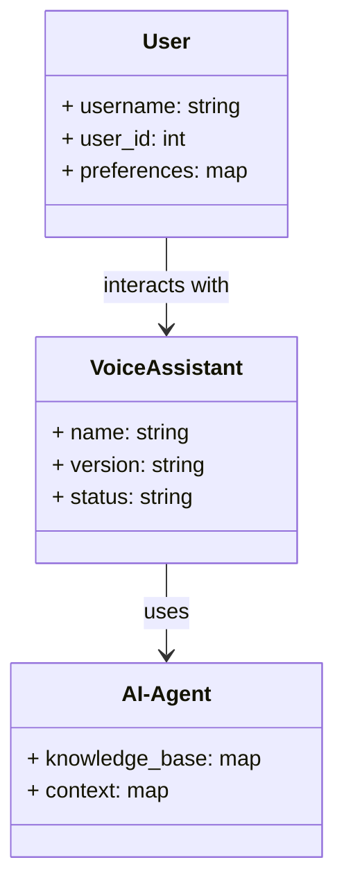

                 


# 开发AI Agent支持的智能语音助手

**关键词**：AI Agent, 智能语音助手, 自然语言处理, 语音识别, 机器学习

**摘要**：随着人工智能技术的迅速发展，AI Agent与智能语音助手的结合为用户交互带来了更智能、更便捷的体验。本文详细探讨了AI Agent在智能语音助手中的应用，从背景介绍、核心原理到系统设计和项目实战，逐步解析如何开发一个高效的AI Agent支持的智能语音助手。

---

## 第一部分：背景介绍

### 第1章：AI Agent与智能语音助手概述

#### 1.1 问题背景
随着智能设备的普及，人机交互方式正在从传统的图形界面转向更自然的语音交互。AI Agent（人工智能代理）作为一种能够理解用户意图、执行任务的智能实体，与语音助手的结合为用户提供了更高效的交互体验。

#### 1.2 问题描述
智能语音助手通过语音识别和自然语言处理技术，能够理解用户的指令并执行相应的操作。然而，单纯依靠语音识别和NLP技术的语音助手在处理复杂任务时显得力不从心，缺乏深度的智能决策能力。AI Agent的引入，能够弥补这一不足，通过上下文理解和任务执行，提升语音助手的智能水平。

#### 1.3 问题解决
AI Agent通过分析用户的指令和上下文信息，能够主动理解和决策，从而增强语音助手的能力。例如，AI Agent可以分析用户的历史行为，预测用户的下一步需求，并提供更精准的服务。

#### 1.4 边界与外延
智能语音助手的边界主要在于其功能的实现范围，而AI Agent的边界则在于其任务处理能力。二者的结合不仅限于单一设备，还可以扩展到智能家居、车联网等领域，形成更广泛的应用场景。

---

## 第二部分：核心概念与联系

### 第2章：AI Agent的核心原理

#### 2.1 AI Agent的基本原理
AI Agent是一种能够感知环境、自主决策并执行任务的智能实体。它通常包括感知、推理、规划和执行四个模块。AI Agent的核心在于其智能决策能力，能够根据环境信息动态调整行为。

#### 2.2 智能语音助手的核心原理
智能语音助手主要依赖语音识别和自然语言处理技术。语音识别将用户的语音转换为文本，NLP技术则分析文本的语义，生成相应的响应。通过这些技术，语音助手能够理解和执行用户的指令。

#### 2.3 AI Agent与智能语音助手的联系
AI Agent与智能语音助手的结合，使得语音助手能够不仅仅执行简单的命令，还能理解上下文，进行复杂任务的处理。例如，AI Agent可以分析用户的行程安排，自动调整语音助手的日历提醒。

---

## 第三部分：算法原理讲解

### 第3章：AI Agent的算法原理

#### 3.1 AI Agent的核心算法
AI Agent的核心算法包括感知、推理、规划和执行。感知阶段通过传感器获取环境信息，推理阶段利用知识库进行分析，规划阶段制定行动方案，执行阶段通过执行机构完成任务。

#### 3.2 自然语言处理算法
自然语言处理（NLP）是AI Agent与用户交互的关键技术。常用的NLP算法包括词袋模型、TF-IDF、神经网络等。这些算法帮助AI Agent理解用户的意图。

#### 3.3 语音识别算法
语音识别是智能语音助手的基础。常用算法包括隐马尔可夫模型（HMM）和深度神经网络（DNN）。这些算法能够将用户的语音转换为准确的文本。

---

## 第四部分：系统分析与架构设计方案

### 第4章：系统分析与架构设计

#### 4.1 项目背景
开发一个AI Agent支持的智能语音助手，旨在提升用户体验，使其能够处理更复杂的需求，如日程管理、信息查询等。

#### 4.2 系统功能设计
系统功能包括语音识别、自然语言理解、任务执行和反馈交互。通过Mermaid类图展示领域模型。



#### 4.3 系统架构设计
通过Mermaid架构图展示系统的分层结构，包括用户层、业务逻辑层和数据层。


---

## 第五部分：项目实战

### 第5章：开发AI Agent支持的智能语音助手

#### 5.1 环境安装
开发环境需要安装Python、TensorFlow、Keras、SpeechRecognition等库。

```bash
pip install python
pip install tensorflow
pip install keras
pip install SpeechRecognition
```

#### 5.2 核心代码实现
以下是AI Agent的核心代码示例：

```python
import speech_recognition as sr
from tensorflow.keras.models import load_model

class AIAssistant:
    def __init__(self):
        self.recognizer = sr.Recognizer()
        self.model = load_model('ai_agent_model.h5')

    def recognize_speech(self, audio_file):
        with sr.AudioFile(audio_file) as source:
            audio = self.recognizer.record(source)
            text = self.recognizer.recognize(audio)
        return text

    def process_request(self, text):
        # 使用模型进行预测
        prediction = self.model.predict(text)
        return prediction

    def execute_task(self, task):
        # 根据任务执行操作
        pass
```

#### 5.3 代码解读与分析
上述代码展示了AI Agent的基本功能，包括语音识别、任务处理和执行。通过训练模型，AI Agent能够识别用户的意图并执行相应的任务。

---

## 第六部分：总结与展望

### 第6章：总结与展望

#### 6.1 最佳实践
在开发过程中，建议采用模块化设计，确保系统的可扩展性和维护性。同时，注重用户体验，提供反馈机制，及时调整系统行为。

#### 6.2 小结
本文详细探讨了AI Agent支持的智能语音助手的开发过程，从背景到实现，为读者提供了全面的技术指导。

#### 6.3 注意事项
在实际开发中，需要注意数据隐私和模型训练的数据质量，确保系统的稳定性和安全性。

#### 6.4 拓展阅读
推荐读者深入学习自然语言处理和深度学习的相关知识，以进一步提升AI Agent的能力。

---

## 作者：AI天才研究院 & 禅与计算机程序设计艺术

---

以上是《开发AI Agent支持的智能语音助手》的技术博客文章，希望对读者有所帮助。

