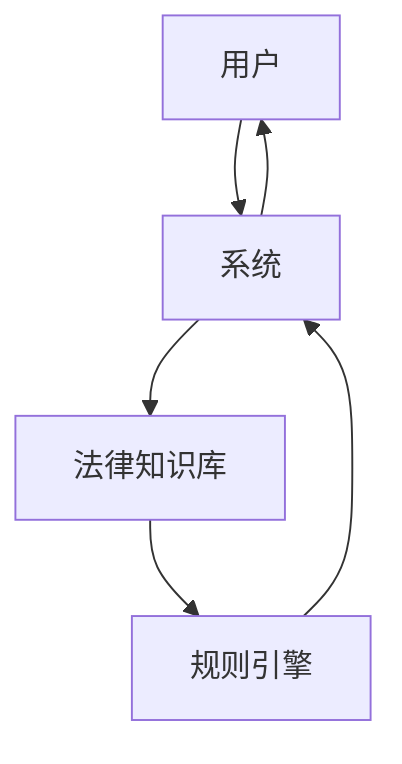

                 


# 开发AI Agent支持的法律咨询系统

> 关键词：AI Agent，法律咨询系统，人工智能，法律知识库，人机交互

> 摘要：本文详细探讨了如何开发一个基于AI Agent的法律咨询系统。首先介绍了AI Agent和法律咨询系统的基本概念和背景，接着分析了AI Agent在法律咨询中的核心作用，包括知识表示、规则推理和机器学习算法的应用。然后详细讲解了系统的架构设计、接口设计和交互流程，最后通过实际案例展示了系统的实现和优化过程。本文旨在为开发智能化的法律咨询系统提供理论和实践指导。

---

# 第一部分: AI Agent与法律咨询系统概述

## 第1章: AI Agent与法律咨询系统背景介绍

### 1.1 AI Agent的基本概念

#### 1.1.1 AI Agent的定义

AI Agent（人工智能代理）是指能够感知环境并采取行动以实现目标的智能体。与传统的软件程序不同，AI Agent具备自主性、反应性、目标导向性和社交能力等特征。例如，智能助手Siri可以理解用户的语音指令并执行相应的操作，就是一个典型的AI Agent。

#### 1.1.2 AI Agent的核心属性

- **自主性**：AI Agent能够自主决策，无需人工干预。
- **反应性**：能够实时感知环境并做出反应。
- **目标导向性**：具有明确的目标，并采取行动以实现目标。
- **社交能力**：能够与其他智能体或人类进行交互和协作。

#### 1.1.3 AI Agent与传统软件的区别

| 特性          | AI Agent                 | 传统软件                  |
|---------------|--------------------------|---------------------------|
| 自主性         | 高                       | 低                       |
| 反应性         | 高                       | 低                       |
| 目标导向性      | 高                       | 低                       |
| 学习能力       | 高                       | 低                       |

### 1.2 法律咨询系统的需求分析

#### 1.2.1 法律咨询系统的定义

法律咨询系统是一种能够为用户提供法律建议和解答的系统，通常包括法律知识库、规则引擎和用户交互界面。

#### 1.2.2 法律咨询系统的核心功能

- **知识检索**：快速查找相关法律条文和案例。
- **规则推理**：根据输入的问题，运用法律规则进行推理。
- **智能问答**：通过自然语言处理技术理解用户的问题并生成回答。

#### 1.2.3 法律咨询系统的需求特点

| 需求类型       | 描述                          |
|----------------|------------------------------|
| 功能需求       | 提供准确的法律咨询             |
| 性能需求       | 快速响应用户请求               |
| 可用性需求       | 7×24小时可用                  |
| 安全性需求       | 保护用户隐私                  |

### 1.3 AI Agent在法律咨询系统中的应用前景

#### 1.3.1 法律咨询系统智能化的必要性

随着法律咨询需求的不断增加，传统的依赖人工的法律咨询系统已无法满足用户的实时性和准确性需求。AI Agent能够通过智能化技术提高法律咨询的效率和准确性。

#### 1.3.2 AI Agent在法律咨询中的优势

- **高效性**：AI Agent可以快速检索和分析大量法律数据。
- **准确性**：基于预先训练的法律知识库，AI Agent能够提供准确的法律建议。
- **可扩展性**：AI Agent可以轻松扩展到更多的法律领域。

#### 1.3.3 法律咨询系统智能化的挑战与机遇

- **挑战**：法律知识的复杂性、用户需求的多样性、数据隐私和安全问题。
- **机遇**：AI技术的快速发展为法律咨询系统的智能化提供了可能。

---

# 第二部分: AI Agent与法律咨询系统的理论基础

## 第2章: AI Agent的核心概念与原理

### 2.1 AI Agent的分类与特点

#### 2.1.1 单智能体与多智能体系统

- **单智能体**：适用于简单场景，如天气预报应用查看天气情况。
- **多智能体**：适用于复杂场景，如交通管理系统，多个智能体协同工作。

#### 2.1.2 基于规则的AI Agent

基于规则的AI Agent通过预定义的规则进行推理和决策。例如，在法律咨询系统中，可以定义规则“如果合同中包含欺诈条款，则需要建议用户谨慎签署”。

#### 2.1.3 基于模型的AI Agent

基于模型的AI Agent通过构建领域模型进行推理和决策。例如，在医疗诊断系统中，基于患者的症状和病史构建诊断模型。

### 2.2 法律咨询系统中的知识表示

#### 2.2.1 知识表示的定义与特点

知识表示是将法律知识以计算机可理解的形式表示的过程。常见的知识表示方法包括语义网络、框架表示和逻辑推理。

#### 2.2.2 常用的知识表示方法

| 方法          | 描述                          |
|---------------|------------------------------|
| 语义网络       | 通过节点和边表示概念及其关系    |
| 框架表示       | 通过属性-值对表示概念           |
| 逻辑推理       | 通过逻辑规则表示概念之间的关系 |

#### 2.2.3 法律知识库的构建

法律知识库是法律咨询系统的核心部分，通常包括法律条文、案例库、法律术语表等。

### 2.3 AI Agent与法律咨询系统的交互模型

#### 2.3.1 用户需求的识别与解析

AI Agent需要能够准确理解用户的问题，并将其转化为系统可以处理的请求。

#### 2.3.2 系统响应的生成与优化

AI Agent根据用户的问题，结合法律知识库和推理引擎生成响应，并不断优化响应的准确性和流畅性。

#### 2.3.3 人机交互的反馈机制

通过用户的反馈，AI Agent可以不断改进自身的理解和响应能力。

---

# 第三部分: AI Agent支持的法律咨询系统算法原理

## 第3章: 基于规则的法律咨询系统算法

### 3.1 基于规则的AI Agent算法原理

#### 3.1.1 规则的定义与表示

规则是基于规则的AI Agent的核心。例如，规则可以表示为“如果用户的问题涉及合同违约，则建议用户咨询专业律师”。

#### 3.1.2 规则的匹配与推理

AI Agent通过匹配用户的问题与预定义的规则，生成相应的响应。例如，用户询问“如何起草一份合同？”系统匹配到合同起草规则，并生成相应的回答。

#### 3.1.3 规则的冲突解决

当多个规则同时匹配时，需要通过优先级或其他机制解决冲突。

### 3.2 基于机器学习的法律咨询系统算法

#### 3.2.1 机器学习在法律咨询中的应用

机器学习可以用于法律文档分类、情感分析、法律案例预测等任务。

#### 3.2.2 常用的机器学习算法

- **支持向量机（SVM）**：用于分类任务。
- **随机森林（Random Forest）**：用于分类和回归任务。
- **深度学习模型（如BERT）**：用于自然语言处理任务。

#### 3.2.3 法律咨询系统的训练与优化

通过标注的数据训练机器学习模型，并通过不断迭代优化模型的性能。

### 3.3 算法的比较与选择

#### 3.3.1 基于规则与基于机器学习的对比

| 特性          | 基于规则                 | 基于机器学习           |
|---------------|--------------------------|------------------------|
| 精确性         | 高                       | 中                       |
| 可解释性       | 高                       | 低                       |
| 灵活性         | 低                       | 高                       |

#### 3.3.2 法律咨询系统的算法选择策略

根据具体需求选择合适的算法。例如，对于规则明确的法律领域，基于规则的算法可能更适合；而对于需要处理复杂文本的领域，机器学习算法可能更合适。

---

## 第4章: 系统架构设计与实现

### 4.1 系统功能设计

#### 4.1.1 法律知识库

法律知识库是系统的核心，包含各种法律条文、案例和术语。

#### 4.1.2 用户交互界面

用户可以通过自然语言或结构化查询与系统交互。

#### 4.1.3 规则引擎

规则引擎负责根据用户的问题匹配相应的规则并生成响应。

### 4.2 系统架构设计

#### 4.2.1 分层架构

- **数据层**：存储法律知识库。
- **逻辑层**：实现规则推理和机器学习模型的调用。
- **界面层**：展示用户交互界面。

#### 4.2.2 组件协作流程

1. 用户提出问题。
2. 系统解析问题并匹配规则。
3. 规则引擎生成响应。
4. 系统返回响应给用户。

### 4.3 接口设计

#### 4.3.1 API接口

提供RESTful API接口，方便其他系统调用。

#### 4.3.2 接口文档

详细描述接口的输入、输出和错误处理。

### 4.4 交互流程图



---

## 第5章: 项目实战与优化

### 5.1 环境安装

#### 5.1.1 安装Python

```bash
python --version
```

#### 5.1.2 安装依赖库

```bash
pip install requests
pip install beautifulsoup4
pip install transformers
```

### 5.2 核心代码实现

#### 5.2.1 法律知识库的构建

```python
class LegalKnowledgeBase:
    def __init__(self):
        self.data = {}

    def add_rule(self, rule_id, rule):
        self.data[rule_id] = rule

    def get_rule(self, rule_id):
        return self.data.get(rule_id, None)
```

#### 5.2.2 规则引擎的实现

```python
class RuleEngine:
    def __init__(self, knowledge_base):
        self.knowledge_base = knowledge_base

    def process_request(self, request):
        for rule_id, rule in self.knowledge_base.data.items():
            if rule匹配request:
                return rule的响应
        return "无法找到匹配的规则"
```

### 5.3 实际案例分析

#### 5.3.1 案例描述

用户询问“如何处理劳动合同中的违约金问题？”

#### 5.3.2 系统响应

系统匹配到相关的违约金规则，并生成响应。

### 5.4 系统优化

#### 5.4.1 性能优化

通过缓存和并行处理优化系统响应速度。

#### 5.4.2 可靠性优化

通过冗余和故障恢复机制提高系统的可靠性。

---

## 第6章: 总结与展望

### 6.1 本章总结

本文详细探讨了AI Agent在法律咨询系统中的应用，包括核心概念、算法原理、系统架构设计和实际案例分析。通过本文的介绍，读者可以了解如何开发一个智能化的法律咨询系统。

### 6.2 未来展望

随着AI技术的不断发展，法律咨询系统将更加智能化和人性化。未来的挑战在于如何提高系统的可解释性和处理复杂法律问题的能力。

---

# 作者：AI天才研究院 & 禅与计算机程序设计艺术

---

通过以上内容，我们逐步分析并完成了《开发AI Agent支持的法律咨询系统》的技术博客文章。

