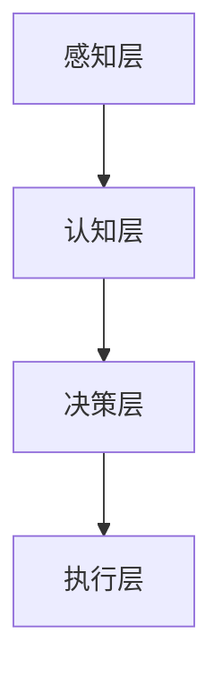
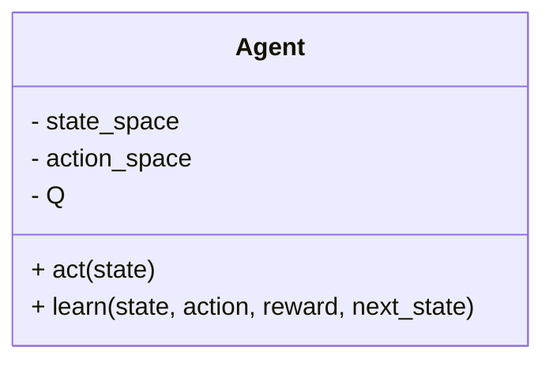
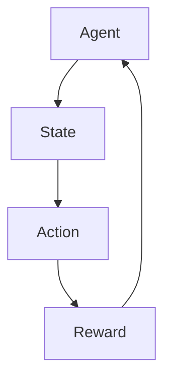
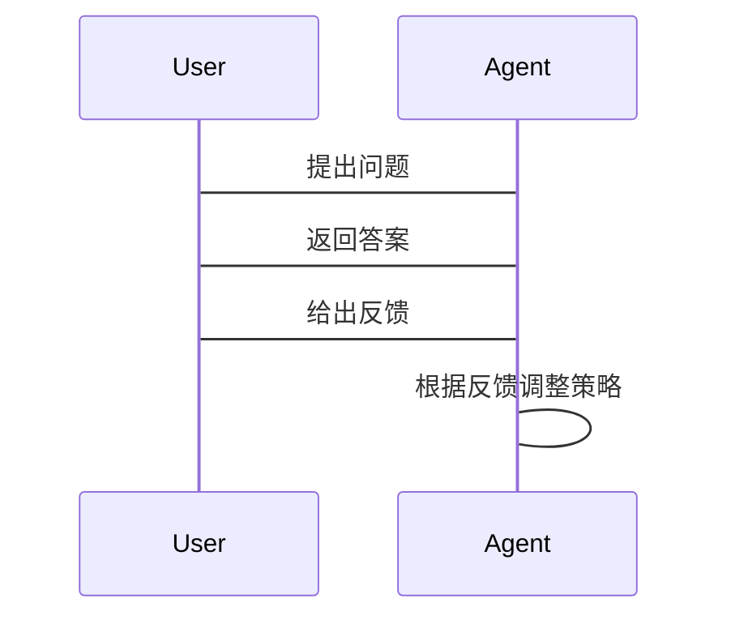

                 


# 开发AI Agent的元认知与自我评估能力

> 关键词：AI Agent，元认知，自我评估，自适应学习，系统架构

> 摘要：本文探讨了AI Agent的元认知与自我评估能力的开发，从理论基础到算法实现，再到系统设计和项目实战，全面分析了如何构建具备自我反思和改进能力的AI Agent。

---

## 第1章: AI Agent与元认知概述

### 1.1 AI Agent的基本概念

#### 1.1.1 AI Agent的定义与分类
AI Agent（人工智能代理）是指能够感知环境并采取行动以实现目标的智能实体。AI Agent可以分为以下几类：
- **简单反射型Agent**：基于当前感知直接行动，不涉及复杂推理。
- **基于模型的反射型Agent**：维护环境模型，能够基于模型进行推理和规划。
- **目标驱动型Agent**：以特定目标为导向，主动采取行动。
- **效用驱动型Agent**：通过最大化效用函数来优化决策。

#### 1.1.2 元认知的基本概念
元认知（元认知，Metacognition）是指对自身认知过程的认知和调控。元认知包括以下两个主要方面：
- **元认知知识**：关于认知过程、策略和任务的知识。
- **元认知调控**：对认知过程的监控和调节。

#### 1.1.3 元认知在AI Agent中的作用
元认知在AI Agent中的作用主要体现在：
- **自我监控**：实时监控自身的认知过程。
- **策略选择**：根据任务特点选择合适的认知策略。
- **自我调节**：动态调整认知过程以优化表现。

### 1.2 AI Agent的自我评估能力

#### 1.2.1 自我评估的定义与特点
自我评估是指AI Agent对其自身的认知过程、行为结果和环境状态进行分析和评价的能力。其特点包括：
- **主动性**：AI Agent主动进行自我评估，而非被动接收外部评价。
- **动态性**：自我评估是一个动态过程，随着环境变化而调整。
- **适应性**：根据自我评估结果，动态优化自身行为。

#### 1.2.2 自我评估与元认知的关系
自我评估是元认知的重要组成部分，元认知为自我评估提供理论基础和方法论支持，而自我评估则是元认知能力的具体体现。

#### 1.2.3 自我评估能力在AI Agent中的应用
自我评估能力在AI Agent中的应用主要体现在：
- **行为优化**：通过自我评估发现行为中的不足，优化后续行动。
- **策略调整**：根据自我评估结果，动态调整认知策略。
- **性能提升**：通过持续自我评估和改进，提升整体性能。

### 1.3 本章小结
本章从AI Agent的基本概念出发，介绍了元认知的基本理论及其在AI Agent中的作用，最后探讨了自我评估能力的定义、特点及其在AI Agent中的应用。

---

## 第2章: 元认知与自我评估的理论基础

### 2.1 元认知理论概述

#### 2.1.1 元认知的层次结构
元认知的层次结构包括：
- **知识层**：关于认知过程、策略和任务的知识。
- **调控层**：对认知过程的监控和调节。
- **评估层**：对认知过程和结果的评估。

#### 2.1.2 元认知的核心功能
元认知的核心功能包括：
- **监控功能**：监控认知过程的执行情况。
- **调节功能**：根据监控结果调节认知过程。
- **评估功能**：评估认知过程和结果的有效性。

#### 2.1.3 元认知在认知科学中的地位
元认知是认知科学的重要组成部分，是理解人类认知过程的关键理论之一。

### 2.2 自我评估的理论模型

#### 2.2.1 自我评估的基本模型
自我评估的基本模型包括：
- **输入层**：感知环境信息。
- **评估层**：对输入信息进行分析和评估。
- **输出层**：根据评估结果采取行动或调整策略。

#### 2.2.2 不同理论模型的对比分析
不同的自我评估理论模型在以下方面存在差异：
- **评估标准**：不同模型采用不同的评估标准。
- **评估方法**：不同模型采用不同的评估方法。
- **评估结果的应用**：不同模型对评估结果的应用方式不同。

#### 2.2.3 自我评估与元认知的关系
自我评估是元认知的重要组成部分，元认知为自我评估提供理论基础和方法论支持。

### 2.3 AI Agent中的元认知与自我评估

#### 2.3.1 元认知在AI Agent中的实现
元认知在AI Agent中的实现包括：
- **环境模型**：建立环境模型，帮助AI Agent理解环境。
- **认知策略**：制定认知策略，指导AI Agent的行为。
- **监控机制**：实时监控认知过程，发现异常情况。

#### 2.3.2 自我评估能力的构建
自我评估能力的构建包括：
- **数据采集**：采集行为结果和环境反馈。
- **评估分析**：分析数据，评估行为效果。
- **结果应用**：根据评估结果调整行为策略。

#### 2.3.3 元认知与自我评估的结合
元认知与自我评估的结合体现在：
- **协同作用**：元认知为自我评估提供理论支持，自我评估为元认知提供实践依据。
- **动态调整**：通过元认知调控，动态调整自我评估的过程和方法。

### 2.4 本章小结
本章介绍了元认知的理论基础，分析了自我评估的理论模型，并探讨了元认知与自我评估在AI Agent中的结合。

---

## 第3章: 基于反馈的自适应学习算法

### 3.1 反馈机制在AI Agent中的作用

#### 3.1.1 反馈的定义与分类
反馈是指系统根据输出结果与预期目标的差异，调整自身行为的过程。反馈可以分为：
- **正向反馈**：增强系统行为。
- **负向反馈**：减弱系统行为。
- **混合反馈**：同时包含正向和负向成分。

#### 3.1.2 反馈在学习中的作用
反馈在学习中的作用包括：
- **指导作用**：指导学习方向。
- **强化作用**：强化正确行为。
- **纠正作用**：纠正错误行为。

#### 3.1.3 反馈在元认知中的应用
反馈在元认知中的应用包括：
- **元认知监控**：通过反馈监控认知过程。
- **元认知调节**：根据反馈调节认知过程。

### 3.2 自适应学习算法的原理

#### 3.2.1 自适应学习的基本概念
自适应学习是指系统根据反馈动态调整学习策略的过程。自适应学习的核心在于根据反馈不断优化学习过程。

#### 3.2.2 自适应学习的核心算法
自适应学习的核心算法包括：
- **强化学习算法**：通过奖励机制优化行为策略。
- **基于模型的算法**：基于环境模型进行决策优化。
- **元学习算法**：通过学习如何学习来优化学习过程。

#### 3.2.3 算法的数学模型与公式
强化学习算法的数学模型可以用以下公式表示：
$$
Q(s, a) = Q(s, a) + \alpha (r + \gamma \max Q(s', a') - Q(s, a))
$$
其中，\( Q(s, a) \) 表示状态-动作值函数，\( \alpha \) 表示学习率，\( r \) 表示奖励，\( \gamma \) 表示折扣因子，\( Q(s', a') \) 表示下一状态的最大值函数。

### 3.3 算法实现与优化

#### 3.3.1 算法实现的步骤
自适应学习算法的实现步骤包括：
1. 初始化参数：包括学习率、折扣因子等。
2. 状态感知：感知当前环境状态。
3. 行动选择：根据当前状态选择动作。
4. 反馈接收：接收环境反馈，包括奖励或惩罚。
5. 价值函数更新：根据反馈更新价值函数。
6. 策略调整：根据价值函数调整策略。

#### 3.3.2 算法优化的策略
算法优化的策略包括：
- **参数调整**：动态调整学习率和折扣因子。
- **模型优化**：优化环境模型的精度和效率。
- **策略改进**：采用更先进的策略搜索方法。

#### 3.3.3 算法实现的代码示例
以下是一个强化学习算法的Python代码示例：
```python
class Agent:
    def __init__(self, state_space, action_space):
        self.state_space = state_space
        self.action_space = action_space
        self.Q = { (s, a): 0 for s in state_space for a in action_space }
    
    def act(self, state):
        return max(self.Q[(state, a)] for a in self.action_space), action
    
    def learn(self, state, action, reward, next_state):
        current_Q = self.Q[(state, action)]
        next_max_Q = max(self.Q[(next_state, a)] for a in self.action_space)
        self.Q[(state, action)] = current_Q + alpha * (reward + gamma * next_max_Q - current_Q)
```

### 3.4 本章小结
本章介绍了反馈机制在AI Agent中的作用，详细讲解了自适应学习算法的原理和实现，并通过代码示例展示了算法的具体实现过程。

---

## 第4章: 元认知与自我评估的系统架构设计

### 4.1 系统设计概述

#### 4.1.1 系统目标与范围
系统目标是开发一个具备元认知和自我评估能力的AI Agent，系统范围包括元认知模块、自我评估模块和反馈处理模块。

#### 4.1.2 系统功能模块划分
系统功能模块包括：
- **元认知模块**：负责认知过程的监控和调节。
- **自我评估模块**：负责行为结果的分析和评估。
- **反馈处理模块**：负责接收和处理环境反馈。

#### 4.1.3 系统架构的选择
系统架构选择分层架构，包括感知层、认知层和决策层。

### 4.2 系统功能设计

#### 4.2.1 元认知模块设计
元认知模块的功能包括：
- **环境感知**：感知环境状态。
- **认知监控**：监控认知过程。
- **策略选择**：根据任务特点选择认知策略。

#### 4.2.2 自我评估模块设计
自我评估模块的功能包括：
- **行为分析**：分析行为结果。
- **评估分析**：评估行为效果。
- **结果应用**：根据评估结果调整行为策略。

#### 4.2.3 反馈处理模块设计
反馈处理模块的功能包括：
- **反馈接收**：接收环境反馈。
- **反馈分析**：分析反馈信息。
- **反馈应用**：根据反馈信息优化系统行为。

### 4.3 系统架构设计

#### 4.3.1 系统架构图
系统架构图可以用以下Mermaid图表示：


#### 4.3.2 模块之间的关系
模块之间的关系包括：
- **感知层**与**认知层**：感知层向认知层提供环境信息。
- **认知层**与**决策层**：认知层向决策层提供决策依据。
- **决策层**与**执行层**：决策层向执行层发出行动指令。

### 4.4 本章小结
本章从系统设计的角度出发，介绍了元认知与自我评估系统的功能模块划分和系统架构设计。

---

## 第5章: 项目实战——开发具备自我评估能力的AI Agent

### 5.1 项目介绍

#### 5.1.1 项目背景
本项目旨在开发一个具备元认知和自我评估能力的AI Agent，用于智能客服领域。

#### 5.1.2 项目目标
项目的最终目标是实现一个能够自我监控、自我评估和自我优化的智能客服AI Agent。

### 5.2 系统功能设计

#### 5.2.1 领域模型设计
领域模型可以用以下Mermaid图表示：


#### 5.2.2 系统架构设计
系统架构设计可以用以下Mermaid图表示：


#### 5.2.3 系统接口设计
系统接口设计包括：
- **输入接口**：接收用户请求。
- **输出接口**：输出客服响应。
- **反馈接口**：接收用户反馈。

### 5.3 系统交互设计

#### 5.3.1 系统交互流程
系统交互流程可以用以下Mermaid图表示：


#### 5.3.2 交互过程中的元认知与自我评估
在交互过程中，元认知用于监控认知过程，自我评估用于分析行为结果。

### 5.4 项目实现

#### 5.4.1 环境配置
环境配置包括：
- **安装Python**：确保Python环境已安装。
- **安装相关库**：安装必要的Python库，如numpy、pandas等。
- **配置开发环境**：配置IDE和开发工具。

#### 5.4.2 核心代码实现
核心代码实现包括：
```python
class Agent:
    def __init__(self, state_space, action_space):
        self.state_space = state_space
        self.action_space = action_space
        self.Q = { (s, a): 0 for s in state_space for a in action_space }
    
    def act(self, state):
        max_q = max(self.Q[(state, a)] for a in self.action_space)
        actions = [a for a in self.action_space if self.Q[(state, a)] == max_q]
        return random.choice(actions)
    
    def learn(self, state, action, reward, next_state):
        current_Q = self.Q[(state, action)]
        next_max_Q = max(self.Q[(next_state, a)] for a in self.action_space)
        self.Q[(state, action)] = current_Q + alpha * (reward + gamma * next_max_Q - current_Q)
```

#### 5.4.3 项目总结
项目总结包括：
- **实现功能**：实现了具备元认知和自我评估能力的AI Agent。
- **遇到的挑战**：在实现过程中遇到了反馈机制和策略调整的难点。
- **解决方法**：通过不断试验和优化，最终实现了预期功能。

### 5.5 本章小结
本章通过一个具体的项目案例，详细讲解了如何开发具备自我评估能力的AI Agent，包括项目设计、系统架构和代码实现。

---

## 第6章: 最佳实践与未来展望

### 6.1 最佳实践

#### 6.1.1 系统设计
系统设计的建议包括：
- **模块化设计**：采用模块化设计，便于维护和扩展。
- **分层架构**：采用分层架构，明确各层功能。
- **可扩展性**：确保系统具有良好的可扩展性。

#### 6.1.2 算法实现
算法实现的建议包括：
- **选择合适的算法**：根据具体场景选择合适的算法。
- **动态调整参数**：动态调整学习率和折扣因子。
- **优化算法性能**：通过优化算法性能提升系统效率。

#### 6.1.3 系统测试
系统测试的建议包括：
- **单元测试**：对各个模块进行单元测试。
- **集成测试**：对系统整体进行集成测试。
- **性能测试**：测试系统在高负载下的表现。

### 6.2 未来展望

#### 6.2.1 元认知与自我评估的结合
未来可以在以下几个方面进一步研究元认知与自我评估的结合：
- **更复杂的任务**：研究在更复杂任务中的应用。
- **多智能体系统**：研究在多智能体系统中的应用。
- **动态环境**：研究在动态环境中的适应能力。

#### 6.2.2 自适应学习算法的优化
未来可以在以下几个方面进一步优化自适应学习算法：
- **更高效的学习方法**：研究更高效的学习方法。
- **更智能的反馈机制**：研究更智能的反馈机制。
- **更强大的模型**：研究更强大的模型，如深度学习模型。

### 6.3 本章小结
本章总结了开发AI Agent的元认知与自我评估能力的最佳实践，并展望了未来的研究方向。

---

## 附录: 开发工具与资源列表

### 附录A: 开发工具
- **Python**：编程语言。
- **numpy**：数学计算库。
- **pandas**：数据分析库。
- **matplotlib**：数据可视化库。

### 附录B: 资源列表
- **书籍**：
  - 《强化学习（Deep Learning Book）》。
  - 《机器学习实战》。
- **在线资源**：
  - [Coursera](https://www.coursera.org)：提供机器学习课程。
  - [Udemy](https://www.udemy.com)：提供AI相关课程。

---

## 作者：AI天才研究院/AI Genius Institute & 禅与计算机程序设计艺术 /Zen And The Art of Computer Programming

---

### 总结
本文系统地探讨了开发AI Agent的元认知与自我评估能力，从理论基础到算法实现，再到系统设计和项目实战，全面分析了如何构建具备自我反思和改进能力的AI Agent。通过本文的分析和讲解，读者可以深入了解AI Agent的元认知与自我评估能力的核心概念和实现方法。

