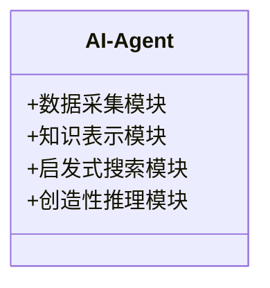
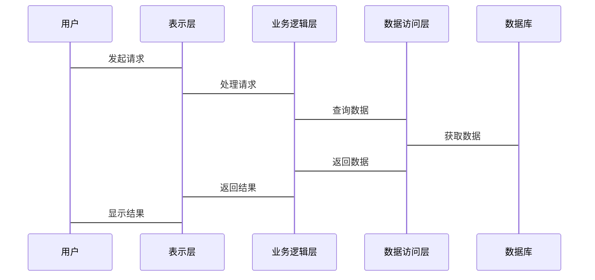

                 


# 开发AI Agent的创造性问题解决能力

> 关键词：AI Agent，创造性思维，问题解决能力，算法原理，系统架构设计

> 摘要：本文深入探讨了AI Agent在创造性问题解决能力方面的开发与实现。首先介绍了AI Agent的基本概念与背景，详细分析了创造性思维机制，接着从算法原理与实现、系统分析与架构设计、项目实战等多个维度进行了全面解析。通过具体案例分析和代码实现，展示了AI Agent在实际问题中的应用效果，并总结了开发过程中需要注意的关键点和最佳实践。

---

## 第1章: AI Agent的基本概念与背景

### 1.1 AI Agent的定义与特点

#### 1.1.1 AI Agent的定义
AI Agent（人工智能代理）是一种智能实体，能够感知环境、自主决策并执行任务。与传统程序不同，AI Agent具有主动性、目标导向性和适应性，能够在动态环境中完成复杂任务。

#### 1.1.2 AI Agent的核心特点
- **自主性**：AI Agent能够自主决策，无需外部干预。
- **反应性**：能够实时感知环境变化并做出响应。
- **目标导向性**：基于目标驱动行为，优先完成关键任务。
- **学习能力**：通过经验或数据不断优化性能。

#### 1.1.3 AI Agent与传统AI的区别
| 特性                | AI Agent                     | 传统AI                      |
|---------------------|-----------------------------|-----------------------------|
| 主动性               | 高                          | 低                          |
| 适应性               | 强                          | 弱                          |
| 目标驱动             | 是                         | 否                          |
| 学习能力             | 强                          | 弱                          |

### 1.2 创造性问题解决能力的背景

#### 1.2.1 问题背景介绍
在复杂问题解决中，AI Agent需要结合创造力，才能在未知环境中找到最优解。创造性问题解决能力是AI Agent实现高度自治和智能的关键。

#### 1.2.2 问题描述与目标
创造性问题解决能力的核心目标是使AI Agent能够：
1. 理解问题本质；
2. 发现新的解决方案；
3. 评估并优化方案。

#### 1.2.3 创造性问题解决的边界与外延
创造性问题解决的边界包括：
- 问题的复杂性：简单问题无需创造力，复杂问题需要。
- 解决方案的创新性：解决方案是否新颖。
- 环境的动态性：动态环境对创造性要求更高。

外延包括：
- 知识的综合运用。
- 多目标优化。
- 跨领域问题解决。

#### 1.2.4 核心概念结构与组成要素
AI Agent创造性问题解决的核心要素包括：
- 知识表示。
- 启发式搜索。
- 创造性推理。

---

## 第2章: AI Agent的创造性思维机制

### 2.1 创造性思维的定义与原理

#### 2.1.1 创造性思维的定义
创造性思维是通过联想、想象、推理等方式，产生新的解决方案的过程。

#### 2.1.2 创造性思维的原理
创造性思维的关键在于：
1. 知识的关联性。
2. 启发式搜索。
3. 解决方案的评估与优化。

#### 2.1.3 创造性思维与问题解决的关系
创造性思维是问题解决的核心驱动力，通过创造性思维，AI Agent能够突破常规，找到更优解。

### 2.2 AI Agent的创造性思维模型

#### 2.2.1 知识表示与关联
知识表示是创造性思维的基础。常用的表示方法包括：
- **语义网络**：通过节点和边表示概念及其关系。
- **知识图谱**：通过结构化数据表示知识。

#### 2.2.2 启发式搜索与优化
启发式搜索通过评估函数（如曼哈顿距离）找到最优路径。例如：
- A*算法：结合启发式函数和优先队列的搜索算法。

#### 2.2.3 创造性推理与验证
创造性推理通过组合现有知识，生成新的解决方案。验证过程包括：
- 解决方案的可行性。
- 解决方案的创新性。

---

## 第3章: AI Agent的算法原理与实现

### 3.1 创造性问题解决的算法框架

#### 3.1.1 算法核心流程
1. **问题分析**：理解问题并提取关键特征。
2. **知识表示**：构建问题相关的知识图谱。
3. **启发式搜索**：生成可能的解决方案。
4. **创造性推理**：优化并验证解决方案。

#### 3.1.2 算法输入输出定义
- **输入**：问题描述、知识库。
- **输出**：创新解决方案。

#### 3.1.3 算法的数学模型
问题解决可以表示为一个优化问题：
$$ \text{minimize } f(x) $$
其中，\( f(x) \)是目标函数，\( x \)是解决方案。

### 3.2 算法实现细节

#### 3.2.1 知识图谱构建
知识图谱构建过程：
1. 数据收集。
2. 数据清洗。
3. 知识关联。

例如，使用图嵌入算法（如Word2Vec）构建知识图谱。

#### 3.2.2 启发式搜索策略
A*算法流程：
1. 初始化优先队列。
2. 取出队列中具有最小评估函数的节点。
3. 扩展节点，生成子节点。
4. 重复直到找到目标。

#### 3.2.3 创造性推理模型
推理模型基于逻辑推理和概率推理，例如：
- 逻辑推理：通过规则生成解决方案。
- 概率推理：通过贝叶斯网络评估解决方案的概率。

---

## 第4章: 系统分析与架构设计

### 4.1 系统功能需求分析

#### 4.1.1 问题场景介绍
以解决城市交通拥堵问题为例，AI Agent需要：
- 收集交通数据。
- 分析拥堵原因。
- 提出解决方案。

#### 4.1.2 系统功能模块划分
- 数据采集模块。
- 知识表示模块。
- 启发式搜索模块。
- 创造性推理模块。

#### 4.1.3 系统功能设计图（Mermaid类图）


### 4.2 系统架构设计

#### 4.2.1 系统架构概述
系统采用分层架构：
- 表示层：用户界面。
- 业务逻辑层：实现核心功能。
- 数据访问层：与数据库交互。

#### 4.2.2 系统架构图（Mermaid架构图）


#### 4.2.3 关键模块交互设计（Mermaid序列图）


---

## 第5章: 项目实战与代码实现

### 5.1 环境搭建与配置

#### 5.1.1 开发环境安装
- 安装Python 3.8以上版本。
- 安装Jupyter Notebook。

#### 5.1.2 依赖库安装与配置
安装以下库：
```bash
pip install numpy
pip install networkx
pip install matplotlib
```

### 5.2 核心算法实现

#### 5.2.1 知识表示与关联代码
```python
import networkx as nx

G = nx.DiGraph()
G.add_node("A")
G.add_node("B")
G.add_edge("A", "B")
```

#### 5.2.2 启发式搜索算法代码
```python
import heapq

def a_star_search(graph, start, goal):
    open_set = set([start])
    came_from = {}
    g_score = {node: float('inf') for node in graph.nodes}
    g_score[start] = 0
    f_score = {node: float('inf') for node in graph.nodes}
    f_score[start] = heuristic(start, goal)
    
    while open_set:
        current = heapq.heappop(open_set)
        if current == goal:
            return reconstruct_path(came_from, current)
        neighbors = graph.neighbors(current)
        for neighbor in neighbors:
            tentative_g_score = g_score[current] + edge_cost(current, neighbor)
            if tentative_g_score < g_score[neighbor]:
                came_from[neighbor] = current
                g_score[neighbor] = tentative_g_score
                f_score[neighbor] = g_score[neighbor] + heuristic(neighbor, goal)
                heapq.heappush(open_set, neighbor)
    return None

def heuristic(node, goal):
    return 1
```

#### 5.2.3 创造性推理模型代码
```python
import itertools

def generate_solutions(components):
    for combination in itertools.permutations(components):
        yield combination
```

### 5.3 应用案例分析

#### 5.3.1 案例背景介绍
以城市交通优化为例，AI Agent需要分析交通数据，提出解决方案。

#### 5.3.2 系统实现与代码解读
- 数据采集模块：从交通传感器获取实时数据。
- 知识表示模块：构建交通网络模型。
- 启发式搜索模块：寻找最优路径。
- 创造性推理模块：提出交通优化方案。

#### 5.3.3 案例分析与结果展示
AI Agent提出以下优化方案：
1. 调整交通信号灯周期。
2. 优化公交车路线。
3. 建议错峰出行。

---

## 第6章: 最佳实践与注意事项

### 6.1 开发总结

#### 6.1.1 小结
AI Agent的创造性问题解决能力是实现智能系统的关键。通过知识表示、启发式搜索和创造性推理，AI Agent能够解决复杂问题。

#### 6.1.2 注意事项
- 确保知识表示的准确性。
- 优化启发式函数的性能。
- 验证解决方案的可行性。

#### 6.1.3 拓展阅读
建议阅读《Artificial Intelligence: A Modern Approach》和《Creative Problem Solving》。

---

## 作者

作者：AI天才研究院/AI Genius Institute & 禅与计算机程序设计艺术 /Zen And The Art of Computer Programming

---

这篇文章从AI Agent的基本概念到实际应用，详细阐述了创造性问题解决能力的开发与实现。通过理论分析、算法实现和案例解读，为读者提供了全面的视角。希望本文能够为AI Agent的开发提供有价值的参考和启发。

