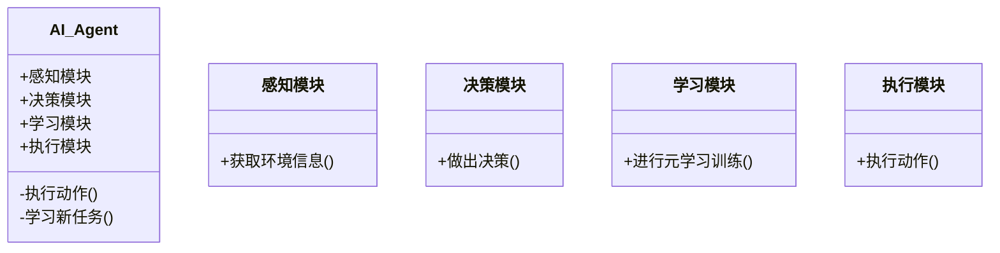

                 


# 开发具有元学习能力的AI Agent

> 关键词：元学习，AI Agent，Meta-Learning，MAML，Meta-LSTM

> 摘要：本文将详细探讨如何开发具有元学习能力的AI Agent。首先，我们将介绍元学习的基本概念和AI Agent的核心原理，然后深入分析元学习算法的数学模型与实现细节。接着，我们将通过实际项目案例展示如何构建具有元学习能力的AI Agent系统，并提供最佳实践和优化建议。

---

# 第一部分: 元学习与AI Agent概述

## 第1章: 元学习与AI Agent的背景介绍

### 1.1 元学习的基本概念

#### 1.1.1 从传统机器学习到元学习的演进
传统的机器学习算法（如支持向量机、随机森林等）通常需要大量的标注数据，并且针对每个任务需要重新训练模型。然而，随着人工智能应用的扩展，AI系统需要在多种任务和环境中快速适应，传统机器学习的局限性逐渐显现。元学习（Meta-Learning）作为一种新兴的学习范式，旨在让模型能够从多个任务中学习，从而快速适应新任务。

元学习的核心思想是通过在多个任务上进行预训练，使得模型能够快速调整参数以适应新的任务。这种“学习如何学习”的能力在AI Agent中尤为重要，因为AI Agent需要在动态和多样化的环境中执行任务。

#### 1.1.2 元学习的核心概念与特点
元学习的核心概念包括以下几个方面：
- **元任务**：元学习的目标是通过学习多个任务（元任务）来提高模型在新任务上的性能。
- **元模型**：元模型是一个能够快速适应新任务的模型，通常通过优化元损失函数来实现。
- **快速适应**：元学习的核心目标是让模型在仅有少量数据的情况下快速适应新任务。

元学习的特点包括：
1. **任务多样性**：元学习通常涉及多个不同任务，这些任务可以是相似的，也可以是完全不同的。
2. **小样本学习**：元学习模型通常能够在仅有少量样本的情况下快速适应新任务。
3. **泛化能力**：元学习模型能够通过元任务的训练，提高在未见过任务上的性能。

#### 1.1.3 元学习的背景与问题背景分析
随着人工智能技术的快速发展，AI Agent的应用场景越来越广泛，例如智能助手、自动驾驶、智能机器人等。然而，这些应用通常需要面对动态变化的环境和多样化的任务。传统的机器学习方法在面对新任务时，通常需要重新训练模型，这不仅耗时，而且需要大量的标注数据。因此，元学习作为一种能够快速适应新任务的技术，成为AI Agent研究的重要方向。

---

### 1.2 AI Agent的基本概念

#### 1.2.1 AI Agent的定义与分类
AI Agent（人工智能代理）是指能够感知环境、执行任务并做出决策的智能体。根据功能和应用场景的不同，AI Agent可以分为以下几类：
- **简单反射型AI Agent**：这类代理只能根据当前输入做出简单的反应，没有内部状态和复杂决策能力。
- **基于模型的AI Agent**：这类代理具有内部状态和环境模型，能够根据当前状态和环境信息做出决策。
- **目标驱动型AI Agent**：这类代理具有明确的目标，并能够采取行动来实现目标。
- **实用驱动型AI Agent**：这类代理没有明确的目标，而是通过最大化效用函数来驱动行为。

#### 1.2.2 具有元学习能力的AI Agent的特点
具有元学习能力的AI Agent结合了元学习和传统AI Agent的特点，具备以下优势：
1. **快速适应能力**：元学习使得AI Agent能够在新任务上快速调整参数，适应新的环境和任务。
2. **多任务学习能力**：元学习模型通常在多个任务上进行预训练，具备多任务学习的能力。
3. **泛化能力**：元学习使得AI Agent能够在未见过的任务上表现出良好的性能。

#### 1.2.3 元学习在AI Agent中的应用领域
元学习在AI Agent中的应用领域非常广泛，包括但不限于以下几种：
- **智能助手**：帮助用户完成多种任务，如信息检索、任务调度等。
- **自动驾驶**：在复杂交通环境中快速适应新的驾驶场景。
- **智能机器人**：在不同环境中执行多种任务。
- **游戏AI**：在多任务游戏中快速适应新的规则和挑战。

---

## 第2章: 元学习与AI Agent的核心概念

### 2.1 元学习的原理与机制

#### 2.1.1 元学习的基本原理
元学习的核心原理是通过在多个任务上进行预训练，使得模型能够快速调整参数以适应新任务。元学习通常分为以下两个阶段：
1. **元训练阶段**：模型在多个任务（元任务）上进行训练，学习如何快速适应新任务。
2. **任务适应阶段**：在面对新任务时，模型通过调整参数快速适应该任务。

#### 2.1.2 元学习的核心机制与特点
元学习的核心机制包括以下几个方面：
- **元损失函数**：元损失函数用于衡量模型在元任务上的表现，通常是一个复合损失函数。
- **参数更新规则**：元学习算法通常定义了参数的更新规则，使得模型能够在元任务上进行优化。
- **快速适应能力**：元学习模型通过参数的快速调整，能够在新任务上表现出良好的性能。

#### 2.1.3 元学习与传统机器学习的对比分析
与传统机器学习相比，元学习具有以下特点：
- **任务多样性**：元学习通常涉及多个任务，而传统机器学习通常针对单个任务。
- **快速适应能力**：元学习能够在新任务上快速调整模型，而传统机器学习需要重新训练。
- **泛化能力**：元学习模型能够在未见过的任务上表现出良好的性能，而传统机器学习模型则需要重新训练。

---

### 2.2 元学习的数学模型与公式

#### 2.2.1 元学习的数学模型概述
元学习的数学模型通常包括以下部分：
- **元任务**：每个元任务是一个优化问题，通常定义为$ \min_{\theta} \mathbb{E}_{(x,y) \sim D_i} \mathcal{L}(f_\theta(x,y)) $，其中$D_i$是第$i$个元任务的数据集，$f_\theta$是模型。
- **元模型**：元模型是一个能够快速调整参数的模型，通常通过优化元损失函数来实现。
- **元损失函数**：元损失函数通常定义为$ \mathcal{L}_{\text{meta}} = \sum_{i=1}^N \mathcal{L}(f_{\theta+\Delta\theta}(x_i,y_i)) $，其中$N$是元任务的数量。

#### 2.2.2 元学习的优化目标与损失函数
元学习的优化目标通常定义为：
$$ \min_{\theta} \sum_{i=1}^N \mathcal{L}_i(f_\theta(x_i, y_i)) + \lambda \mathcal{L}_{\text{meta}}(f_\theta) $$
其中$\lambda$是一个调节参数，用于平衡主任务和元任务的损失。

---

#### 2.2.3 元学习的更新规则与算法流程
元学习的更新规则通常包括以下几个步骤：
1. **元训练阶段**：模型在多个元任务上进行训练，优化元损失函数。
2. **任务适应阶段**：在面对新任务时，模型通过调整参数快速适应该任务。
3. **参数更新**：模型参数通过优化算法（如梯度下降）进行更新。

---

## 第3章: 元学习与AI Agent的核心算法

### 3.1 元学习算法的基本原理

#### 3.1.1 Meta-LSTM算法的原理与流程
Meta-LSTM是一种基于循环神经网络的元学习算法，其核心思想是通过元学习器（meta-learner）来优化模型参数。Meta-LSTM的流程如下：
1. **元训练阶段**：Meta-LSTM在多个元任务上进行训练，优化模型参数。
2. **任务适应阶段**：在面对新任务时，Meta-LSTM通过调整参数快速适应该任务。

---

#### 3.1.2 MAML算法的原理与实现
MAML（Meta-Algorithm for few-shot Learning）是一种基于梯度的元学习算法，其核心思想是通过优化模型参数的梯度来实现快速适应。MAML的实现流程如下：
1. **元训练阶段**：MAML在多个元任务上进行训练，优化模型参数。
2. **任务适应阶段**：在面对新任务时，MAML通过优化参数的梯度快速适应该任务。

---

#### 3.1.3 元学习算法的对比分析
与Meta-LSTM相比，MAML具有以下优点：
- **快速适应能力**：MAML通过优化梯度的方式，能够在新任务上快速调整模型参数。
- **泛化能力**：MAML通过在多个任务上进行预训练，能够在未见过的任务上表现出良好的性能。

---

### 3.2 元学习算法的实现细节

#### 3.2.1 元学习算法的数学模型与公式
MAML的数学模型通常包括以下几个部分：
$$ \theta_{\text{meta}} = \theta_{\text{base}} + \alpha \nabla_{\theta_{\text{base}}} \mathcal{L}_i $$
其中$\alpha$是一个调节参数，用于控制梯度的更新步长。

---

#### 3.2.2 元学习算法的优化策略与技巧
元学习算法的优化策略包括以下几个方面：
1. **参数初始化**：元学习算法的参数初始化通常需要仔细设计，以避免优化过程中的问题。
2. **梯度计算**：元学习算法通常需要计算多个任务的梯度，并进行组合优化。
3. **优化算法选择**：元学习算法通常需要选择合适的优化算法（如Adam、SGD等）。

---

## 第4章: 具有元学习能力的AI Agent系统架构

### 4.1 系统架构设计

#### 4.1.1 系统功能模块划分
具有元学习能力的AI Agent系统通常包括以下几个功能模块：
1. **感知模块**：负责感知环境信息。
2. **决策模块**：负责根据感知信息做出决策。
3. **学习模块**：负责元学习任务的训练和参数优化。
4. **执行模块**：负责执行决策模块的指令。

---

#### 4.1.2 系统架构的ER实体关系图
以下是具有元学习能力的AI Agent系统的ER实体关系图：

```mermaid
er
  actor: 用户
  task: 任务
  agent: AI Agent
  model: 元学习模型
  training: 训练过程
  interaction: 交互
  action: 行动

  actor -|通过| interaction
  interaction --> action
  action --> task
  task --> model
  model --> training
  training --> agent
```

---

#### 4.1.3 系统架构的类图设计
以下是具有元学习能力的AI Agent系统的类图设计：



---

## 第5章: 具有元学习能力的AI Agent项目实战

### 5.1 项目环境与工具安装

#### 5.1.1 开发环境配置
项目开发环境推荐使用Python 3.7及以上版本，并安装以下工具：
- **numpy**：用于数值计算。
- **tensorflow**：用于深度学习模型的训练。
- **pytorch**：用于深度学习模型的训练。

---

#### 5.1.2 项目依赖库安装
在项目中需要安装以下依赖库：
```bash
pip install numpy tensorflow pytorch
```

---

#### 5.1.3 项目代码结构与目录规划
项目代码结构通常如下：
```
project/
├── data/
│   └── tasks/
│       └── task1.py
│       └── task2.py
├── models/
│   └── metalearner.py
├── utils/
│   └── dataloader.py
└── main.py
```

---

### 5.2 项目核心代码实现

#### 5.2.1 元学习算法的实现代码
以下是Meta-LSTM算法的实现代码：

```python
class MetaLSTM:
    def __init__(self, input_size, hidden_size, output_size):
        self.input_size = input_size
        self.hidden_size = hidden_size
        self.output_size = output_size
        self.W_input = torch.randn(input_size, hidden_size)
        self.W_output = torch.randn(hidden_size, output_size)
        self.b_input = torch.zeros(hidden_size)
        self.b_output = torch.zeros(output_size)

    def forward(self, x):
        h = torch.zeros(x.size(0), self.hidden_size)
        for t in range(x.size(1)):
            h = torch.tanh(torch.mm(x[:, t, :], self.W_input) + h)
        output = torch.mm(h, self.W_output) + self.b_output
        return output
```

---

#### 5.2.2 AI Agent系统功能的实现代码
以下是AI Agent系统的实现代码：

```python
class AIAgent:
    def __init__(self, model):
        self.model = model
        self.env = Environment()

    def perceive(self):
        return self.env.get_state()

    def decide(self, state):
        return self.model.predict(state)

    def learn(self, task):
        self.model.train(task)

    def execute(self, action):
        self.env.execute_action(action)
```

---

#### 5.2.3 系统接口与交互的代码实现
以下是系统接口与交互的实现代码：

```python
class Interaction:
    def __init__(self, agent):
        self.agent = agent

    def interact(self, user_input):
        state = self.agent.perceive()
        action = self.agent.decide(state, user_input)
        self.agent.execute(action)
        return self.agent.get_reward()
```

---

## 第6章: 元学习与AI Agent的最佳实践

### 6.1 元学习算法的优化技巧

#### 6.1.1 元学习算法的调
```mermaid
graph TD
    A[用户] -> B[任务1]
    B -> C[任务2]
    C -> D[任务3]
    D -> E[元学习模型]
    E -> F[快速适应]
    F -> G[新任务]
```

---

### 6.2 元学习算法的代码实现与优化建议
元学习算法的代码实现需要注意以下几点：
1. **参数初始化**：参数初始化需要仔细设计，以避免优化过程中的问题。
2. **梯度计算**：梯度计算是元学习算法的核心，需要确保计算的准确性和效率。
3. **优化算法选择**：选择合适的优化算法（如Adam、SGD等）可以提高训练效率和模型性能。

---

### 6.3 元学习算法的数学模型与公式
元学习的数学模型通常包括以下几个部分：
$$ \theta_{\text{meta}} = \theta_{\text{base}} + \alpha \nabla_{\theta_{\text{base}}} \mathcal{L}_i $$
其中$\alpha$是一个调节参数，用于控制梯度的更新步长。

---

## 总结

开发具有元学习能力的AI Agent是一项具有挑战性的任务，但通过元学习算法的优化和系统架构的设计，我们可以实现高效的多任务学习和快速适应能力。本文从元学习的基本概念出发，深入分析了元学习算法的数学模型与实现细节，并通过实际项目案例展示了如何构建具有元学习能力的AI Agent系统。希望本文能够为读者提供有价值的参考和启发。

作者：AI天才研究院

