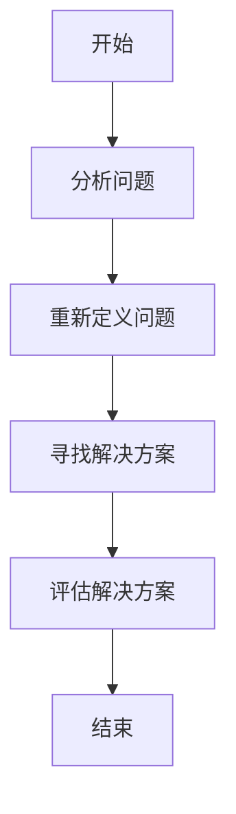
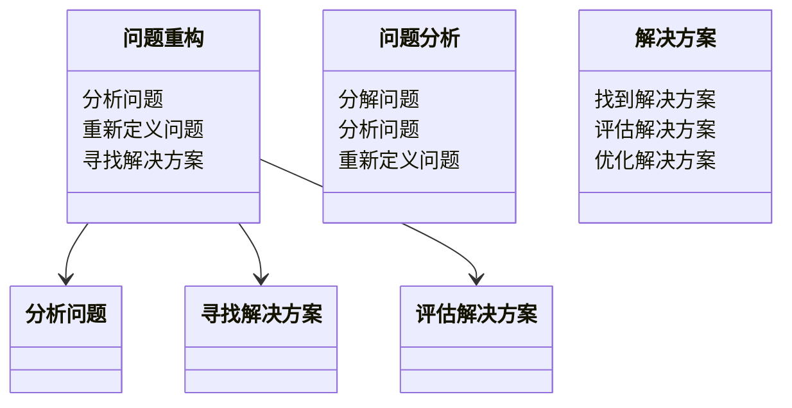
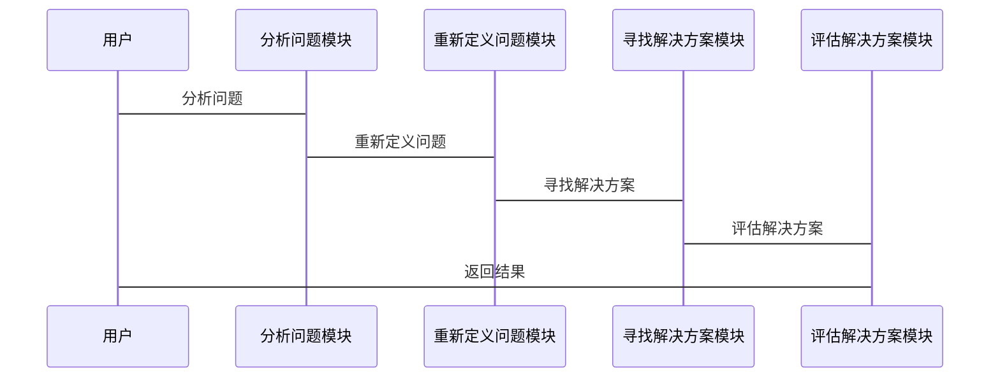

                 


# 开发具有创造性问题重构能力的AI Agent

## 关键词
创造性问题重构, AI Agent, 算法原理, 系统架构, 项目实战

## 摘要
本文深入探讨了开发具有创造性问题重构能力的AI Agent的关键技术，从背景介绍到系统架构设计，再到项目实战，全面解析了如何赋予AI Agent重新定义和解决复杂问题的能力。通过详细的算法原理、系统架构设计和实际案例分析，本文为读者提供了从理论到实践的完整指南。

---

## 第一部分: 开发具有创造性问题重构能力的AI Agent背景介绍

### 第1章: 创造性问题重构的背景与问题描述

#### 1.1 问题背景
AI Agent在现代人工智能系统中扮演着越来越重要的角色。然而，随着问题复杂性的增加，传统的基于规则的AI Agent难以应对动态变化和不确定性。创造性问题重构作为一种新兴的技术，为AI Agent提供了重新定义和解决复杂问题的能力。

#### 1.1.1 当前AI Agent的发展现状
- 基于规则的AI Agent：依赖预定义规则，难以处理复杂问题。
- 基于机器学习的AI Agent：通过数据训练，但缺乏灵活性。
- 基于强化学习的AI Agent：通过试错优化，但缺乏问题重构能力。

#### 1.1.2 创造性问题重构的必要性
- 应对动态变化：问题重构允许AI Agent根据环境变化调整目标。
- 提高灵活性：通过重新定义问题，AI Agent可以更好地适应复杂场景。
- 增强创新性：创造性问题重构能够激发AI Agent的创新能力。

#### 1.1.3 问题重构在AI Agent中的作用
- 重新定义问题：将复杂问题分解为更简单的子问题。
- 寻找新的解决方案：通过问题重构，AI Agent可以找到更优的解决方案。
- 提高问题解决效率：通过重新定义问题，AI Agent可以更高效地解决问题。

#### 1.2 问题描述
创造性问题重构是指AI Agent能够主动重新定义问题，将其转化为更容易解决的形式。这一过程需要结合领域知识和算法能力，确保问题重构的准确性和有效性。

#### 1.2.1 创造性问题重构的定义
- 创造性问题重构：AI Agent通过分析问题的上下文，重新定义问题，以找到更优的解决方案。
- 核心要素：领域知识、问题分析能力、重构算法。

#### 1.2.2 问题重构的核心要素
- 领域知识：AI Agent需要了解问题所属的领域，以便正确地重新定义问题。
- 问题分析能力：AI Agent需要能够识别问题的关键要素，并分析其之间的关系。
- 重构算法：AI Agent需要使用适当的算法来重新定义问题。

#### 1.2.3 问题重构的边界与外延
- 边界：问题重构仅限于重新定义问题，不涉及实际解决问题的步骤。
- 外延：问题重构可以应用于各种领域，如优化问题、决策问题、规划问题等。

---

### 第2章: 创造性问题重构的核心概念与联系

#### 2.1 核心概念原理
创造性问题重构的核心在于将问题转化为更易于解决的形式。这需要结合领域知识和算法能力，确保问题重构的准确性和有效性。

#### 2.1.1 创造性问题重构的原理
- 分解与重构：将复杂问题分解为更简单的子问题，并重新定义这些子问题。
- 跨领域应用：创造性问题重构可以在多个领域中应用，如优化问题、决策问题、规划问题等。
- 结果评估：通过评估重构后的问题，确保其与原始问题的一致性。

#### 2.1.2 问题重构与AI Agent的结合
- AI Agent通过问题重构，可以更好地适应复杂环境。
- 问题重构可以提高AI Agent的灵活性和创新能力。
- 通过问题重构，AI Agent可以找到更优的解决方案。

#### 2.1.3 核心概念的数学模型
- 数学模型：问题重构的过程可以用数学模型表示，例如：
  $$ \text{原始问题} \rightarrow \text{重构问题} \rightarrow \text{解决方案} $$
- 模型评估：通过数学模型，可以评估问题重构的有效性。

#### 2.2 属性特征对比表
| 特征 | 创造性问题重构 | 传统问题解决 |
|------|----------------|---------------|
| 灵活性 | 高             | 低             |
| 创新性 | 高             | 中             |
| 复杂性 | 中             | 高             |
| 适应性 | 高             | 低             |

#### 2.2.1 创造性问题重构的属性特征
- 高灵活性：能够根据环境变化调整问题定义。
- 高创新性：能够找到新的解决方案。
- 中等复杂性：问题重构过程相对简单。

#### 2.2.2 对比分析表格
通过对比分析表格，可以看出创造性问题重构在灵活性和创新性方面具有显著优势，但在复杂性方面略逊于传统问题解决方法。

#### 2.2.3 特征之间的关系
- 创造性问题重构的灵活性和创新性相互促进，共同提高问题解决能力。
- 高灵活性和中等复杂性使得创造性问题重构适用于多种应用场景。

#### 2.3 ER实体关系图
- 实体关系图展示了问题重构过程中的关键实体及其关系。
- 通过Mermaid图，可以清晰地理解问题重构的流程和各实体之间的关系。

#### 2.3.1 实体关系图的绘制
```mermaid
erd
  entity 创造性问题重构 {
    分解问题
    重新定义问题
    寻找解决方案
  }
  entity 问题分析 {
    分解问题
    分析问题
    重新定义问题
  }
  entity 解决方案 {
    找到解决方案
    评估解决方案
    优化解决方案
  }
  创造性问题重构 --> 分析问题
  创造性问题重构 --> 寻找解决方案
  创造性问题重构 --> 评估解决方案
```

#### 2.3.2 实体关系图的解释
- 创造性问题重构需要结合问题分析和解决方案寻找，确保问题重构的准确性和有效性。
- 实体关系图展示了问题重构过程中各实体之间的相互作用和依赖关系。

#### 2.3.3 实体关系图的应用
- 通过实体关系图，可以更好地理解问题重构的流程和关键步骤。
- 实体关系图可以帮助设计更高效的系统架构和算法。

---

## 第二部分: 创造性问题重构的算法原理

### 第3章: 创造性问题重构的算法原理

#### 3.1 算法原理概述
创造性问题重构的算法原理是通过分析问题的上下文，重新定义问题，以找到更优的解决方案。这一过程需要结合领域知识和算法能力，确保问题重构的准确性和有效性。

#### 3.1.1 算法的基本原理
- 分析问题：AI Agent需要分析原始问题，识别其关键要素。
- 重新定义问题：根据问题分析结果，重新定义问题，使其更易于解决。
- 寻找解决方案：通过重新定义的问题，寻找更优的解决方案。

#### 3.1.2 算法的核心步骤
1. 分析问题：AI Agent需要分析原始问题，识别其关键要素。
2. 重新定义问题：根据问题分析结果，重新定义问题。
3. 寻找解决方案：通过重新定义的问题，寻找更优的解决方案。
4. 评估解决方案：评估重构后的问题和解决方案的有效性。

#### 3.1.3 算法的数学模型
- 数学模型：问题重构的过程可以用数学模型表示，例如：
  $$ \text{原始问题} \rightarrow \text{重构问题} \rightarrow \text{解决方案} $$
- 模型评估：通过数学模型，可以评估问题重构的有效性。

#### 3.2 算法流程图
通过Mermaid流程图，可以清晰地展示算法的核心步骤和流程。

#### 3.2.1 算法流程图的绘制


#### 3.2.2 算法流程图的详细说明
- 开始：算法开始执行。
- 分析问题：AI Agent需要分析原始问题，识别其关键要素。
- 重新定义问题：根据问题分析结果，重新定义问题。
- 寻找解决方案：通过重新定义的问题，寻找更优的解决方案。
- 评估解决方案：评估重构后的问题和解决方案的有效性。
- 结束：算法结束执行。

#### 3.2.3 算法流程图的应用
- 通过流程图，可以更好地理解算法的核心步骤和流程。
- 流程图可以帮助设计更高效的系统架构和算法。

#### 3.3 算法的Python实现
- 核心代码实现：以下是算法的核心代码实现。
- 代码解读与分析：以下是对代码的解读和分析。

#### 3.3.1 环境安装与配置
- Python版本：Python 3.8及以上版本。
- 第三方库：需要安装必要的第三方库，例如numpy、scipy等。

#### 3.3.2 核心代码实现
```python
def analyze_problem(problem):
    # 分析问题，返回问题的关键要素
    pass

def redefine_problem(original_problem, key_factors):
    # 根据关键要素，重新定义问题
    pass

def find_solution(redefined_problem):
    # 根据重构后的问题，寻找解决方案
    pass

def evaluate_solution(solution):
    # 评估解决方案的有效性
    pass
```

#### 3.3.3 代码解读与分析
- `analyze_problem`：分析问题，识别其关键要素。
- `redefine_problem`：根据关键要素，重新定义问题。
- `find_solution`：根据重构后的问题，寻找解决方案。
- `evaluate_solution`：评估解决方案的有效性。

#### 3.4 数学模型与公式
- 数学模型：问题重构的过程可以用数学模型表示，例如：
  $$ \text{原始问题} \rightarrow \text{重构问题} \rightarrow \text{解决方案} $$
- 模型评估：通过数学模型，可以评估问题重构的有效性。

#### 3.4.1 算法的数学表达式
- 算法的数学表达式可以表示为：
  $$ P_{\text{original}} \rightarrow P_{\text{redefined}} \rightarrow S $$

#### 3.4.2 示例
- 示例1：原始问题：如何优化供应链管理？
- 重新定义问题：如何通过引入自动化技术优化供应链管理？
- 解决方案：引入自动化技术，优化供应链管理。

---

### 第4章: 数学模型与公式

#### 4.1 数学模型概述
创造性问题重构的数学模型可以用以下公式表示：
$$ \text{原始问题} \rightarrow \text{重构问题} \rightarrow \text{解决方案} $$

#### 4.2 算法的数学表达式
- 算法的数学表达式可以表示为：
  $$ P_{\text{original}} \rightarrow P_{\text{redefined}} \rightarrow S $$

#### 4.3 示例
- 示例1：原始问题：如何优化供应链管理？
- 重新定义问题：如何通过引入自动化技术优化供应链管理？
- 解决方案：引入自动化技术，优化供应链管理。

---

## 第三部分: 系统分析与架构设计方案

### 第5章: 问题场景介绍

#### 5.1 问题场景描述
- 问题场景：一个AI Agent需要解决一个复杂的问题，例如优化供应链管理。
- 问题分析：AI Agent需要分析问题，识别其关键要素。
- 问题重构：AI Agent需要根据问题分析结果，重新定义问题。

#### 5.2 项目介绍
- 项目名称：开发具有创造性问题重构能力的AI Agent。
- 项目目标：赋予AI Agent重新定义和解决复杂问题的能力。
- 项目范围：涵盖问题分析、问题重构、解决方案寻找等多个方面。

### 第6章: 系统功能设计

#### 6.1 领域模型设计
- 领域模型类图：通过Mermaid图展示领域模型的类及其关系。

#### 6.1.1 领域模型类图的绘制


#### 6.1.2 领域模型类图的解释
- 领域模型类图展示了问题重构过程中的关键类及其关系。
- 问题重构需要结合问题分析和解决方案寻找，确保问题重构的准确性和有效性。

#### 6.1.3 领域模型类图的应用
- 通过领域模型类图，可以更好地理解问题重构的流程和关键步骤。
- 领域模型类图可以帮助设计更高效的系统架构和算法。

#### 6.2 系统架构设计
- 系统架构图：通过Mermaid图展示系统的整体架构。
- 系统架构设计的详细说明。

#### 6.2.1 系统架构图的绘制


#### 6.2.2 系统架构图的解释
- 系统架构图展示了问题重构过程中的关键步骤和流程。
- 通过系统架构图，可以更好地理解问题重构的流程和关键步骤。

#### 6.2.3 系统架构图的应用
- 通过系统架构图，可以更好地理解问题重构的流程和关键步骤。
- 系统架构图可以帮助设计更高效的系统架构和算法。

#### 6.3 接口设计
- 接口设计：系统需要定义清晰的接口，确保各模块之间的通信和协作。

#### 6.3.1 接口设计的详细说明
- 接口设计需要考虑系统的可扩展性和可维护性。
- 接口设计需要确保各模块之间的通信和协作。

#### 6.3.2 接口设计的应用
- 通过接口设计，可以确保系统各模块之间的通信和协作。
- 接口设计可以帮助系统更好地适应变化和扩展。

#### 6.4 交互序列图
- 交互序列图：通过Mermaid图展示系统各模块之间的交互流程。

#### 6.4.1 交互序列图的绘制


#### 6.4.2 交互序列图的解释
- 交互序列图展示了系统各模块之间的交互流程。
- 通过交互序列图，可以更好地理解系统各模块之间的协作关系。

#### 6.4.3 交互序列图的应用
- 通过交互序列图，可以更好地理解系统各模块之间的协作关系。
- 交互序列图可以帮助设计更高效的系统架构和算法。

---

## 第四部分: 项目实战

### 第7章: 环境安装与配置

#### 7.1 环境安装
- Python版本：Python 3.8及以上版本。
- 第三方库：需要安装必要的第三方库，例如numpy、scipy等。

#### 7.2 系统核心实现源代码
- 核心代码实现：以下是系统核心实现的源代码。

#### 7.2.1 核心代码实现
```python
def analyze_problem(problem):
    # 分析问题，返回问题的关键要素
    pass

def redefine_problem(original_problem, key_factors):
    # 根据关键要素，重新定义问题
    pass

def find_solution(redefined_problem):
    # 根据重构后的问题，寻找解决方案
    pass

def evaluate_solution(solution):
    # 评估解决方案的有效性
    pass
```

#### 7.2.2 代码解读与分析
- `analyze_problem`：分析问题，识别其关键要素。
- `redefine_problem`：根据关键要素，重新定义问题。
- `find_solution`：根据重构后的问题，寻找解决方案。
- `evaluate_solution`：评估解决方案的有效性。

#### 7.3 代码应用解读与分析
- 代码应用解读：以下是对代码的解读和分析。
- 代码应用分析：以下是对代码的分析和优化建议。

#### 7.4 项目小结
- 项目小结：总结项目的实施过程和取得的成果。

---

## 第五部分: 最佳实践

### 第8章: 最佳实践、小结、注意事项、拓展阅读

#### 8.1 最佳实践
- 系统设计：系统设计需要考虑可扩展性和可维护性。
- 代码实现：代码实现需要考虑可读性和可维护性。
- 测试与优化：需要进行充分的测试和优化，确保系统的稳定性和高效性。

#### 8.2 小结
- 本文通过详细的算法原理、系统架构设计和实际案例分析，为读者提供了从理论到实践的完整指南。
- 通过本文的指导，读者可以更好地理解和应用创造性问题重构技术。

#### 8.3 注意事项
- 系统设计：系统设计需要考虑可扩展性和可维护性。
- 代码实现：代码实现需要考虑可读性和可维护性。
- 测试与优化：需要进行充分的测试和优化，确保系统的稳定性和高效性。

#### 8.4 拓展阅读
- 推荐阅读相关领域的书籍和论文，进一步深入学习创造性问题重构技术。
- 关注最新的研究进展和技术动态，保持对领域的了解和掌握。

---

## 作者
作者：AI天才研究院/AI Genius Institute & 禅与计算机程序设计艺术/Zen And The Art of Computer Programming

