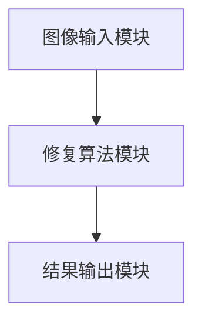
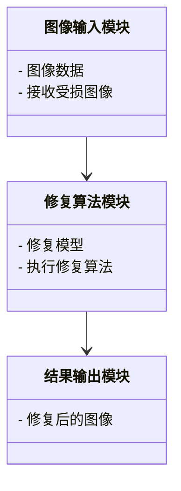
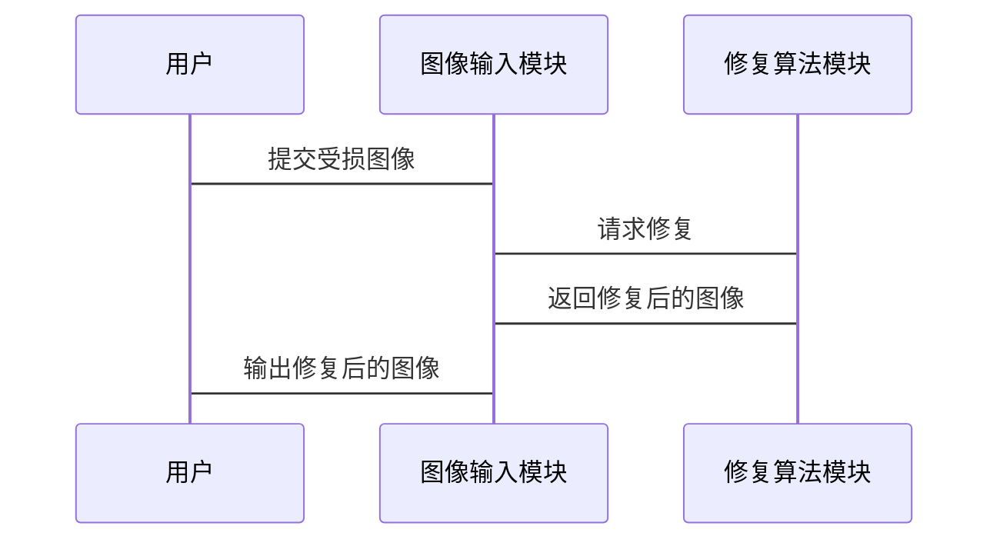

                 


# 开发具有图像修复能力的AI Agent

> 关键词：图像修复，AI Agent，深度学习，图像处理，计算机视觉，人工智能

> 摘要：本文详细探讨了如何开发具有图像修复能力的AI Agent。从图像修复的基本概念到AI Agent的修复机制，再到具体的算法实现和系统架构设计，本文系统地分析了开发过程中的关键技术和实际应用。通过理论分析和实践案例相结合的方式，本文为读者提供了从理论到实践的全面指导。

---

## 第一部分：图像修复与AI Agent的背景介绍

### 第1章：图像修复的定义与问题背景

#### 1.1 图像修复的定义
图像修复是指通过技术手段对受损或不完整的图像进行恢复和重建，使其接近原始状态的过程。常见的图像修复场景包括去除噪声、填补缺失区域、修复损坏的图像数据等。

#### 1.2 图像修复的常见应用场景
- **医学图像处理**：修复CT、MRI等医学图像中的噪声或损坏区域，辅助医生进行更准确的诊断。
- **图像编辑与修复**：修复老旧照片、修复视频中的损坏部分。
- **计算机视觉应用**：在目标检测、图像识别等任务中，修复图像以提高算法的准确性。

#### 1.3 图像修复的技术挑战与解决方案
- **技术挑战**：
  - **噪声干扰**：图像中存在多种噪声，如高斯噪声、椒盐噪声等，影响图像质量。
  - **缺失区域恢复**：图像中缺失的部分需要通过已有的信息进行推测和重建。
  - **计算复杂度**：高分辨率图像的修复需要大量的计算资源。
- **解决方案**：
  - 使用深度学习模型进行图像修复，如基于卷积神经网络（CNN）的修复方法。
  - 结合图像的上下文信息，利用插值和超分辨率重建技术。

### 第2章：AI Agent的基本概念
#### 2.1 AI Agent的定义与特点
AI Agent是一种智能体，能够在特定环境中感知、理解和执行任务，以实现预定目标。AI Agent具有以下特点：
- **自主性**：能够自主决策和行动。
- **反应性**：能够根据环境反馈实时调整行为。
- **学习能力**：能够通过经验改进自身的性能。

#### 2.2 AI Agent的核心功能与能力
- **感知能力**：通过传感器或数据输入，获取环境信息。
- **决策能力**：基于感知信息，选择最优行动方案。
- **执行能力**：根据决策结果，执行具体的操作。

#### 2.3 AI Agent与传统图像修复工具的区别
- **智能化**：AI Agent能够自主学习和优化修复策略，而传统工具需要人工干预。
- **适应性**：AI Agent能够根据图像内容动态调整修复算法，而传统工具通常采用固定的修复方法。

### 第3章：AI Agent与图像修复的结合
#### 3.1 图像修复的智能化需求
传统的图像修复技术依赖于人工操作和固定的算法，难以应对复杂的修复场景。AI Agent的引入，为图像修复提供了智能化的解决方案。

#### 3.2 AI Agent的修复能力
- **智能化修复**：AI Agent能够根据图像内容自动选择合适的修复算法。
- **自适应修复**：AI Agent能够根据修复效果动态调整修复策略。

#### 3.3 AI Agent在图像修复中的角色定位
AI Agent在图像修复中扮演着多重角色，既是修复算法的设计者，又是修复过程的执行者。它能够根据图像的质量和损坏程度，选择最优的修复方案。

---

## 第二部分：图像修复与AI Agent的核心概念

### 第4章：图像修复的核心算法原理

#### 4.1 基于深度学习的修复算法
##### 4.1.1 深度学习在图像修复中的应用
深度学习，尤其是卷积神经网络（CNN），在图像修复中表现出色。常用的深度学习模型包括：
- **全连接网络（FCN）**：用于图像的端到端修复。
- **残差网络（ResNet）**：通过残差块结构，增强网络的表达能力。
- **生成对抗网络（GAN）**：通过生成器和判别器的对抗训练，提高图像修复质量。

##### 4.1.2 常用修复算法的对比分析
| 算法名称       | 优缺点                           | 适用场景                     |
|----------------|----------------------------------|------------------------------|
| 基于插值的修复  | 实现简单，修复效果有限           | 适用于低分辨率图像修复       |
| 基于CNN的修复   | 效果较好，但需要大量训练数据     | 适用于高分辨率图像修复       |
| 基于GAN的修复   | 效果更逼真，但训练时间较长       | 适用于高精度图像修复         |

##### 4.1.3 深度学习模型的训练与优化
- **模型训练**：使用受损图像和对应的修复图像作为输入和输出，训练模型学习修复的映射关系。
- **模型优化**：通过调整学习率、批量大小等超参数，优化模型的性能。

#### 4.2 AI Agent的修复机制
##### 4.2.1 基于强化学习的修复策略
强化学习（Reinforcement Learning）是一种通过奖励机制训练智能体的方法。在图像修复中，AI Agent可以通过强化学习，学习最优的修复策略。

##### 4.2.2 多模态数据融合的修复方法
AI Agent可以结合图像的多模态数据，如颜色、纹理、深度信息等，进行更精准的图像修复。

---

## 第三部分：图像修复与AI Agent的系统架构设计

### 第5章：AI Agent的修复能力与系统架构

#### 5.1 系统架构设计
- **功能模块**：
  - **图像输入模块**：接收受损图像数据。
  - **修复算法模块**：选择并执行最优的修复算法。
  - **结果输出模块**：输出修复后的图像数据。

- **系统架构图**


#### 5.2 系统功能设计
- **领域模型设计**：使用类图描述系统中各个功能模块之间的关系。



#### 5.3 系统交互设计
- **交互流程图**


---

## 第四部分：项目实战

### 第6章：项目实战

#### 6.1 环境配置
- **安装Python环境**：推荐使用Anaconda或virtualenv。
- **安装深度学习库**：如TensorFlow、Keras、PyTorch等。
- **安装图像处理库**：如OpenCV、Pillow等。

#### 6.2 核心代码实现
##### 6.2.1 基于CNN的图像修复代码示例
```python
import tensorflow as tf
from tensorflow.keras import layers

def create_model(input_shape):
    model = tf.keras.Sequential()
    model.add(layers.Conv2D(64, (3, 3), padding='same', activation='relu', input_shape=input_shape))
    model.add(layers.Conv2D(128, (3, 3), padding='same', activation='relu'))
    model.add(layers.Conv2DTranspose(64, (3, 3), padding='same', activation='relu'))
    model.add(layers.Conv2DTranspose(3, (3, 3), padding='same', activation='tanh'))
    return model

model = create_model((256, 256, 3))
model.compile(optimizer='adam', loss='mse')
model.summary()
```

##### 6.2.2 修复算法的实现
```python
import numpy as np
from tensorflow.keras.preprocessing.image import load_img, img_to_array

def load_image(path):
    img = load_img(path)
    img_array = img_to_array(img)
    img_array = img_array.astype('float32') / 255.0
    return img_array

def restore_image(model, input_image):
    restored_image = model.predict(input_image)
    restored_image = restored_image * 255.0
    restored_image = restored_image.astype('uint8')
    return restored_image

input_image = load_image('input_image.jpg')
restored_image = restore_image(model, input_image)
```

#### 6.3 案例分析与实际应用
- **案例分析**：修复一张老旧照片，去除噪声和损坏部分。
- **实际应用**：在医疗图像处理中，修复CT图像中的噪声，提高诊断准确性。

---

## 第五部分：总结与展望

### 第7章：总结与展望

#### 7.1 项目小结
本文详细探讨了开发具有图像修复能力的AI Agent的全过程，从背景介绍到系统架构设计，再到项目实战，为读者提供了全面的指导。

#### 7.2 开发过程中的注意事项
- **数据质量**：修复效果很大程度上依赖于训练数据的质量和多样性。
- **模型优化**：需要不断调整模型结构和超参数，以提高修复效果。

#### 7.3 未来展望
随着深度学习技术的不断发展，图像修复技术将更加智能化和高效化。未来，AI Agent将在图像修复领域发挥更大的作用，帮助人类解决更多的图像处理问题。

---

作者：AI天才研究院/AI Genius Institute & 禅与计算机程序设计艺术 /Zen And The Art of Computer Programming

