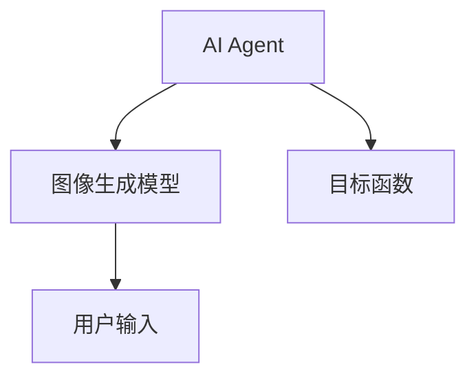
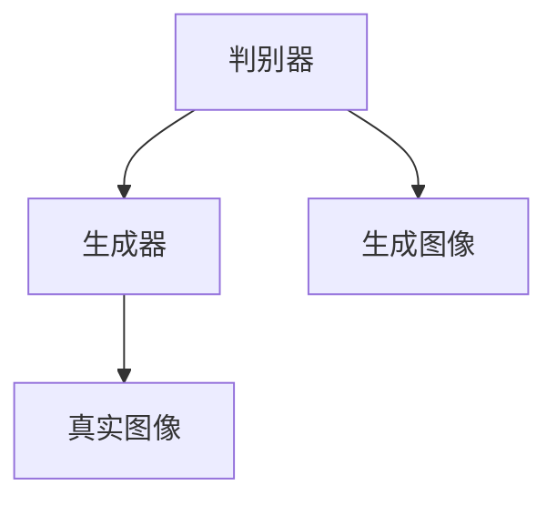
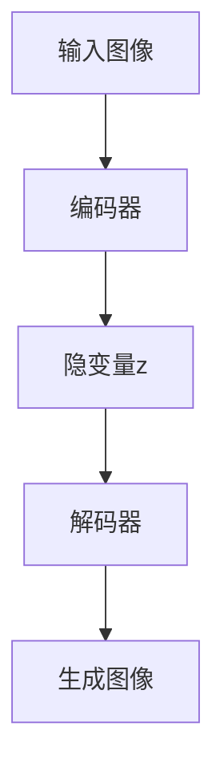
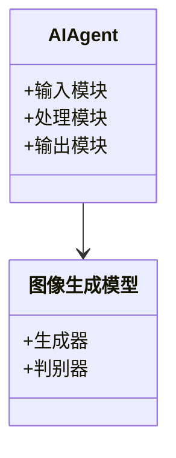

                 


# 开发具有图像生成能力的AI Agent

## 关键词：
AI Agent, 图像生成, 生成对抗网络, 变分自编码器, 机器学习, 深度学习

## 摘要：
本文将详细探讨如何开发具有图像生成能力的AI Agent。文章从AI Agent和图像生成技术的基本概念入手，逐步深入分析其核心原理和算法实现。通过结合生成对抗网络（GAN）和变分自编码器（VAE）等深度学习技术，阐述AI Agent在图像生成任务中的应用场景和实现方法。同时，本文提供了一个基于Stable Diffusion的实际案例，展示了如何将理论应用于实践。文章还讨论了系统架构设计、项目实现细节以及最佳实践，帮助读者全面理解并掌握开发具有图像生成能力的AI Agent所需的知识和技能。

---

## 第一部分: AI Agent与图像生成技术基础

### 第1章: 背景介绍

#### 1.1 AI Agent的基本概念
- **AI Agent**：AI Agent是指具有智能决策和执行能力的实体，能够根据环境信息做出决策并执行动作。
- **图像生成技术**：图像生成技术是通过算法生成图像的过程，常见的技术包括GAN、VAE、Diffusion等。
- **结合AI Agent与图像生成**：AI Agent可以通过图像生成技术生成图像，用于实现特定任务，例如图像编辑、图像修复、图像生成等。

#### 1.2 图像生成技术的发展历程
- 早期的图像生成方法：基于规则的图像生成。
- 基于深度学习的图像生成：从CNN到GAN的演变。
- 当前主流的图像生成技术：GAN、VAE、Diffusion模型。

#### 1.3 AI Agent与图像生成的结合
- AI Agent通过图像生成技术，可以实现自动化图像生成任务。
- 图像生成技术为AI Agent提供了丰富的视觉信息，增强其感知能力。

---

### 第2章: 核心概念与联系

#### 2.1 AI Agent的核心原理
- **状态感知**：AI Agent通过传感器或输入数据感知环境状态。
- **决策机制**：AI Agent基于感知的状态，选择合适的动作。
- **动作执行**：AI Agent执行决策动作，并输出结果。

#### 2.2 图像生成的数学模型
- **生成对抗网络（GAN）**：GAN由生成器和判别器组成，通过对抗训练生成图像。
- **变分自编码器（VAE）**：VAE通过编码器和解码器实现图像生成，基于概率建模。
- **Diffusion模型**：Diffusion模型通过逐步生成图像，具有高质量生成能力。

#### 2.3 实体关系图


---

## 第二部分: 图像生成算法原理

### 第3章: GAN算法原理

#### 3.1 GAN算法流程


#### 3.2 GAN的损失函数
$$ \mathcal{L}_{\text{GAN}} = \mathcal{L}_{\text{D}} + \mathcal{L}_{\text{G}} $$
其中：
$$ \mathcal{L}_{\text{D}} = -\mathbb{E}_{x \sim p_{\text{data}}(x)}[\log D(x)] - \mathbb{E}_{z \sim p_z(z)}[\log(1 - D(G(z)))] $$
$$ \mathcal{L}_{\text{G}} = -\mathbb{E}_{z \sim p_z(z)}[\log D(G(z))] $$

#### 3.3 GAN的优缺点
- **优点**：生成图像质量高，多样性好。
- **缺点**：训练不稳定，模式崩溃。

### 第4章: VAE算法原理

#### 4.1 VAE算法流程


#### 4.2 VAE的概率建模
$$ p(x) = \int p(x|z) p(z) dz $$
其中：
$$ p(z) = \mathcal{N}(z; 0, I) $$
$$ p(x|z) = \mathcal{N}(x; \mu(z), \sigma(z)) $$

#### 4.3 VAE的优缺点
- **优点**：生成图像质量稳定，训练过程较稳定。
- **缺点**：生成图像多样性较低。

---

## 第三部分: 系统分析与架构设计

### 第5章: 系统结构分析

#### 5.1 AI Agent的系统结构
- **输入模块**：接收用户的输入或环境信息。
- **处理模块**：AI Agent的核心算法，负责生成图像。
- **输出模块**：输出生成的图像或结果。

#### 5.2 系统功能设计
- **图像生成功能**：AI Agent根据输入生成图像。
- **图像编辑功能**：AI Agent对生成的图像进行编辑。
- **图像修复功能**：AI Agent修复低质量图像。

### 第6章: 系统架构设计

#### 6.1 领域模型


#### 6.2 系统架构图


#### 6.3 接口设计
- **输入接口**：接收用户的输入或环境信息。
- **输出接口**：输出生成的图像或结果。

---

## 第四部分: 项目实战

### 第7章: 项目实现

#### 7.1 环境配置
- **安装依赖**：Python 3.8+, PyTorch 1.9+, Stable Diffusion模型。

#### 7.2 核心代码实现
```python
import torch
import torch.nn as nn
import torch.optim as optim

class Generator(nn.Module):
    def __init__(self, latent_dim=100):
        super(Generator, self).__init__()
        self.latent_dim = latent_dim
        self.layers = nn.Sequential(
            nn.ConvTranspose2d(latent_dim, 512, 4, 2, 1),
            nn.BatchNorm2d(512),
            nn.ReLU(),
            nn.ConvTranspose2d(512, 256, 4, 2, 1),
            nn.BatchNorm2d(256),
            nn.ReLU(),
            nn.ConvTranspose2d(256, 128, 4, 2, 1),
            nn.BatchNorm2d(128),
            nn.ReLU(),
            nn.ConvTranspose2d(128, 3, 4, 2, 1),
            nn.Tanh()
        )

    def forward(self, z):
        batch_size = z.size(0)
        z = z.view(batch_size, self.latent_dim, 1, 1)
        return self.layers(z)

class Discriminator(nn.Module):
    def __init__(self):
        super(Discriminator, self).__init__()
        self.layers = nn.Sequential(
            nn.Conv2d(3, 64, 4, 2, 1),
            nn.LeakyReLU(0.2),
            nn.Conv2d(64, 128, 4, 2, 1),
            nn.LeakyReLU(0.2),
            nn.Conv2d(128, 256, 4, 2, 1),
            nn.LeakyReLU(0.2),
            nn.Conv2d(256, 512, 4, 2, 1),
            nn.LeakyReLU(0.2),
            nn.Conv2d(512, 1, 4, 2, 1)
        )

    def forward(self, x):
        return self.layers(x)
```

#### 7.3 代码实现解读
- **生成器**：通过转置卷积层生成图像，使用BN和ReLU激活函数。
- **判别器**：通过卷积层和LeakyReLU激活函数进行判别。

#### 7.4 应用案例分析
- **案例1**：生成一张风景图像。
- **案例2**：生成一张人物图像。

#### 7.5 项目小结
- **总结**：通过实践，掌握了GAN的实现方法，理解了AI Agent与图像生成的结合。

---

## 第五部分: 最佳实践与小结

### 第8章: 最佳实践

#### 8.1 代码实现注意事项
- **训练稳定**：选择合适的超参数，如学习率、批量大小。
- **模型优化**：使用早停、归一化等技术优化训练过程。

#### 8.2 系统设计建议
- **模块化设计**：将AI Agent和图像生成模型分离设计。
- **接口设计**：设计清晰的输入输出接口。

#### 8.3 拓展阅读
- GAN的改进方法：WGAN、WGAN-GP、StyleGAN。
- Diffusion模型：DDPM、DDIM。

### 第9章: 小结与展望

#### 9.1 小结
- 本文详细介绍了AI Agent与图像生成技术的基本概念、核心原理和实现方法。
- 提供了一个基于GAN的图像生成案例，展示了AI Agent在图像生成任务中的应用。

#### 9.2 展望
- 结合Diffusion模型，实现更高质量的图像生成。
- 研究AI Agent与其他图像生成技术的结合，如图像编辑、图像修复等。

---

## 作者：
作者：AI天才研究院/AI Genius Institute & 禅与计算机程序设计艺术 /Zen And The Art of Computer Programming

