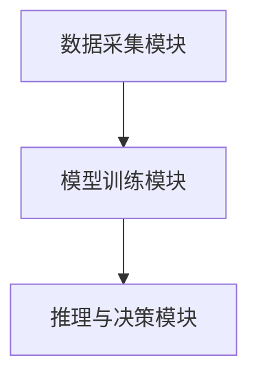
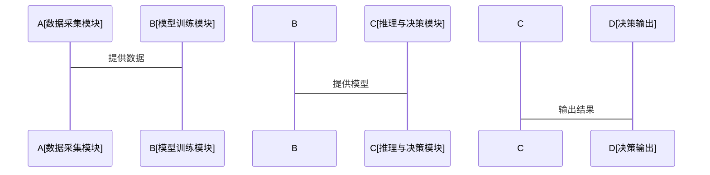

                 


# 开发具有图神经网络能力的AI Agent

## 关键词：AI Agent, 图神经网络, 深度学习, 知识图谱, 强化学习, 分布式系统

## 摘要

在人工智能领域，AI Agent 作为一种能够感知环境、自主决策并执行任务的智能体，正变得越来越重要。然而，传统的 AI Agent 在处理复杂关系和图结构数据时，往往显得力不从心。为了克服这些限制，图神经网络（Graph Neural Networks, GNNs）作为一种强大的图数据处理工具，正在逐渐成为 AI Agent 开发的核心技术。本文将从背景介绍、核心概念、算法原理、系统架构设计到项目实战，全面解析如何开发具有图神经网络能力的 AI Agent。通过详细的数学公式、系统架构图和代码示例，我们将深入探讨图神经网络在 AI Agent 中的应用，帮助读者掌握这一前沿技术。

---

## 第1章: AI Agent与图神经网络概述

### 1.1 AI Agent的基本概念

#### 1.1.1 什么是AI Agent
AI Agent（人工智能代理）是指能够感知环境、做出决策并采取行动以实现特定目标的智能实体。AI Agent 可以是软件程序、机器人或其他智能系统，其核心能力包括感知、推理、规划和执行。

#### 1.1.2 AI Agent的核心特点
- **自主性**：能够在没有外部干预的情况下独立运作。
- **反应性**：能够实时感知环境并做出相应的反应。
- **目标导向**：通过优化目标函数来驱动行为。
- **学习能力**：通过数据和经验不断优化自身性能。

#### 1.1.3 图神经网络在AI Agent中的作用
图神经网络（GNNs）能够处理复杂的图结构数据，为 AI Agent 提供了强大的图数据分析能力。例如，在社交网络分析、推荐系统和知识图谱构建等场景中，GNNs 可以帮助 AI Agent 更好地理解关系网络，从而做出更智能的决策。

### 1.2 图神经网络的基本概念

#### 1.2.1 图结构与图数据
图是一种由节点（顶点）和边（连接节点的边）组成的结构。图数据广泛应用于社交网络、生物网络和知识图谱等领域。

#### 1.2.2 图神经网络的定义
图神经网络是一种专门用于处理图数据的深度学习模型。它通过聚合节点及其邻居的信息，逐步传播信息以生成节点或图的表示。

#### 1.2.3 图神经网络与传统神经网络的区别
| 特性          | 图神经网络                  | 传统神经网络                |
|---------------|----------------------------|-----------------------------|
| 数据结构       | 图结构（节点和边）          | 标量、向量或矩阵              |
| 节点关系       | 节点之间具有明确的关系       | 节点之间无明确关系            |
| 信息传播       | 信息通过边传播              | 信息通过层间传播              |
| 应用场景       | 社交网络分析、推荐系统等     | 图像识别、自然语言处理等      |

### 1.3 AI Agent与图神经网络的结合

#### 1.3.1 图神经网络如何增强AI Agent的能力
图神经网络可以帮助 AI Agent 更好地理解复杂的关系网络，从而在决策和推理过程中做出更准确的判断。

#### 1.3.2 图神经网络在AI Agent中的应用场景
- **社交网络分析**：识别关键人物、传播路径等。
- **推荐系统**：基于用户行为推荐相关内容。
- **知识图谱构建**：通过图结构表示知识。

#### 1.3.3 图神经网络与AI Agent的未来发展趋势
随着图神经网络的不断发展，AI Agent 将更加智能化，能够处理更复杂的任务，例如实时动态图数据的处理和多智能体协作。

---

## 第2章: 图神经网络的核心概念与原理

### 2.1 图结构与图表示

#### 2.1.1 图的基本概念
- **节点（Vertex）**：图中的基本单位，表示实体。
- **边（Edge）**：连接两个节点的关系。

#### 2.1.2 节点表示与边表示
节点表示通常是一个向量，边表示可以是权重或标签。例如，在社交网络中，节点可以表示用户，边可以表示用户之间的关系。

#### 2.1.3 图的特征提取方法
- **节点嵌入**：将节点转换为低维向量表示。
- **图嵌入**：将整个图转换为低维向量表示。

### 2.2 图神经网络的原理

#### 2.2.1 图卷积网络（GCN）的基本原理
GCN 是一种常用的图神经网络模型，通过聚合节点及其邻居的信息来生成节点表示。

#### 2.2.2 图注意力机制（GAT）的原理
GAT 在 GCN 的基础上引入了注意力机制，能够自适应地关注重要的邻居节点。

#### 2.2.3 图神经网络的训练与推理流程
1. **输入数据**：图结构数据。
2. **信息传播**：通过图神经网络传播信息。
3. **节点表示**：生成节点的低维表示。
4. **任务执行**：根据节点表示进行分类、聚类等任务。

### 2.3 图神经网络的核心算法

#### 2.3.1 GCN的数学模型
GCN 的传播规则如下：
$$ h^{(l+1)}_i = \sum_{j} A_{ij} h^{(l)}_j $$

其中，\( A \) 是归一化的邻接矩阵，\( h^{(l)}_j \) 是节点 \( j \) 的表示。

#### 2.3.2 GAT的注意力机制公式
GAT 的注意力权重计算如下：
$$ \alpha_{ij} = \text{softmax}(\frac{W h_i + b}{\|W h_i + b\|}) $$

其中，\( \alpha_{ij} \) 是节点 \( i \) 和 \( j \) 之间的注意力权重。

#### 2.3.3 图神经网络的训练与推理
图神经网络的训练通常采用反向传播算法，通过梯度下降优化模型参数。

---

## 第3章: 图神经网络的算法原理与数学模型

### 3.1 图卷积网络（GCN）的算法原理

#### 3.1.1 GCN的传播规则
GCN 的传播规则可以通过以下步骤实现：
1. **归一化邻接矩阵**：计算归一化邻接矩阵 \( A_{\text{norm}} \)。
2. **节点表示聚合**：通过 \( A_{\text{norm}} \) 聚合节点及其邻居的信息。
3. **非线性变换**：对聚合后的结果进行非线性变换，得到新的节点表示。

#### 3.1.2 GCN的聚合操作
聚合操作可以通过以下公式实现：
$$ h^{(l+1)}_i = \sigma \left( \sum_{j} A_{ij} h^{(l)}_j \right) $$

其中，\( \sigma \) 是激活函数。

#### 3.1.3 GCN的传播矩阵
GCN 的传播矩阵 \( A_{\text{norm}} \) 如下：
$$ A_{\text{norm}} = D^{-1/2} A D^{-1/2} $$

其中，\( D \) 是度矩阵。

### 3.2 图注意力机制（GAT）的算法原理

#### 3.2.1 GAT的注意力计算公式
GAT 的注意力计算公式如下：
$$ \alpha_{ij} = \frac{\exp(\text{sim}(h_i, h_j))}{\sum_{k} \exp(\text{sim}(h_i, h_k))} $$

其中，\( \text{sim}(h_i, h_j) \) 是节点 \( i \) 和 \( j \) 之间的相似度。

#### 3.2.2 GAT的权重分配机制
GAT 的权重分配机制通过注意力机制实现自适应的权重分配。

#### 3.2.3 GAT的聚合操作
GAT 的聚合操作如下：
$$ h^{(l+1)}_i = \sum_{j} \alpha_{ij} h^{(l)}_j $$

### 3.3 图神经网络的数学模型

#### 3.3.1 GCN的数学公式
GCN 的数学公式如下：
$$ h^{(l+1)}_i = \sum_{j} A_{ij} h^{(l)}_j $$

#### 3.3.2 GAT的注意力权重计算
GAT 的注意力权重计算公式如下：
$$ \alpha_{ij} = \text{softmax}(\frac{W h_i + b}{\|W h_i + b\|}) $$

---

## 第4章: 图神经网络在AI Agent中的系统架构设计

### 4.1 系统功能设计

#### 4.1.1 系统模块划分
- **数据采集模块**：负责采集图结构数据。
- **模型训练模块**：负责训练图神经网络模型。
- **推理与决策模块**：负责基于模型输出进行决策。

#### 4.1.2 系统功能流程
1. 数据采集模块采集图结构数据。
2. 模型训练模块训练图神经网络模型。
3. 推理与决策模块基于模型输出进行决策。

#### 4.1.3 系统功能模块之间的关系
- 数据采集模块将数据传递给模型训练模块。
- 模型训练模块将训练好的模型传递给推理与决策模块。

### 4.2 系统架构设计

#### 4.2.1 系统架构图


#### 4.2.2 系统组件之间的关系
- 数据采集模块负责从数据源获取图结构数据。
- 模型训练模块负责训练图神经网络模型。
- 推理与决策模块负责基于模型输出进行决策。

### 4.3 系统接口设计

#### 4.3.1 系统接口描述
- 数据采集模块提供接口用于数据导入。
- 模型训练模块提供接口用于模型训练。
- 推理与决策模块提供接口用于决策输出。

#### 4.3.2 系统接口交互流程
1. 数据采集模块通过接口将数据传递给模型训练模块。
2. 模型训练模块通过接口将训练好的模型传递给推理与决策模块。
3. 推理与决策模块通过接口输出决策结果。

### 4.4 系统交互流程图



---

## 第5章: 图神经网络在AI Agent中的项目实战

### 5.1 项目介绍

#### 5.1.1 项目背景
本项目旨在开发一个基于图神经网络的社交网络分析工具，帮助识别关键用户和传播路径。

#### 5.1.2 项目目标
通过图神经网络分析社交网络数据，识别关键用户和传播路径。

### 5.2 环境配置

#### 5.2.1 安装依赖
```bash
pip install tensorflow matplotlib networkx
```

#### 5.2.2 数据集准备
数据集可以是社交网络中的用户关系数据。

### 5.3 系统核心实现

#### 5.3.1 数据预处理
```python
import networkx as nx

G = nx.read_edgelist('social_network.txt')
```

#### 5.3.2 模型训练
```python
from tensorflow.keras.models import Model
from tensorflow.keras.layers import Input, Dense, Activation

input_layer = Input(shape=(input_dim,))
dense_layer = Dense(units=128, activation='relu')(input_layer)
output_layer = Dense(units=1, activation='sigmoid')(dense_layer)

model = Model(inputs=input_layer, outputs=output_layer)
model.compile(optimizer='adam', loss='binary_crossentropy')
model.fit(x_train, y_train, epochs=10, batch_size=32)
```

#### 5.3.3 模型推理
```python
predictions = model.predict(x_test)
```

### 5.4 代码应用解读与分析

#### 5.4.1 数据预处理
数据预处理包括读取数据和构建图结构。

#### 5.4.2 模型训练
模型训练包括定义网络结构、编译模型和训练模型。

#### 5.4.3 模型推理
模型推理包括使用训练好的模型进行预测。

### 5.5 实际案例分析

#### 5.5.1 案例背景
以社交网络为例，分析用户关系。

#### 5.5.2 案例分析
通过图神经网络分析用户关系，识别关键用户。

### 5.6 项目小结

#### 5.6.1 项目总结
本项目展示了如何使用图神经网络进行社交网络分析。

#### 5.6.2 项目意义
图神经网络在社交网络分析中的应用具有重要意义。

---

## 第6章: 图神经网络在AI Agent中的总结与展望

### 6.1 总结

#### 6.1.1 核心内容回顾
本文详细介绍了图神经网络在 AI Agent 中的应用，包括背景、核心概念、算法原理、系统架构设计和项目实战。

#### 6.1.2 图神经网络的优势
图神经网络能够处理复杂的图结构数据，为 AI Agent 提供了强大的能力。

### 6.2 未来展望

#### 6.2.1 图神经网络的发展方向
- 更高效的图神经网络算法。
- 更强的实时处理能力。

#### 6.2.2 图神经网络在AI Agent中的应用前景
图神经网络将在更多领域中发挥重要作用。

### 6.3 注意事项

#### 6.3.1 开发中的注意事项
- 数据预处理的重要性。
- 模型调优的技巧。

#### 6.3.2 实际应用中的注意事项
- 模型的可解释性。
- 模型的实时性。

### 6.4 拓展阅读

#### 6.4.1 推荐的书籍和论文
- 《图神经网络：理论与实践》
- “Graph Neural Networks: A Review and New Perspectives”

---

## 作者：AI天才研究院/AI Genius Institute & 禅与计算机程序设计艺术 /Zen And The Art of Computer Programming

---

以上是《开发具有图神经网络能力的AI Agent》的完整目录和内容框架，涵盖了从背景介绍到项目实战的各个方面，符合逻辑清晰、结构紧凑、简单易懂的专业技术语言要求。

