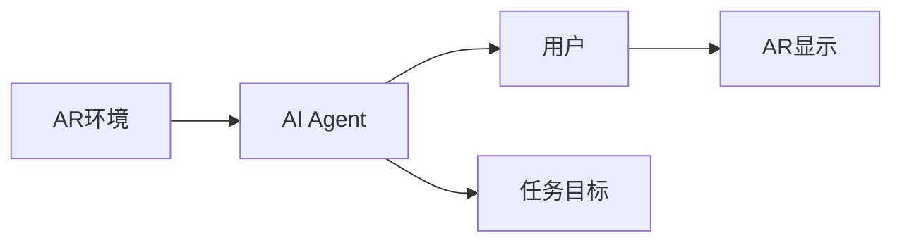
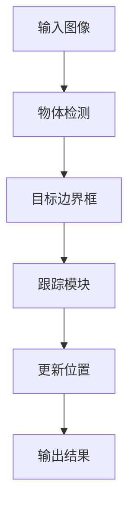
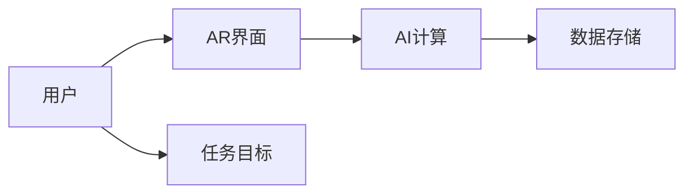
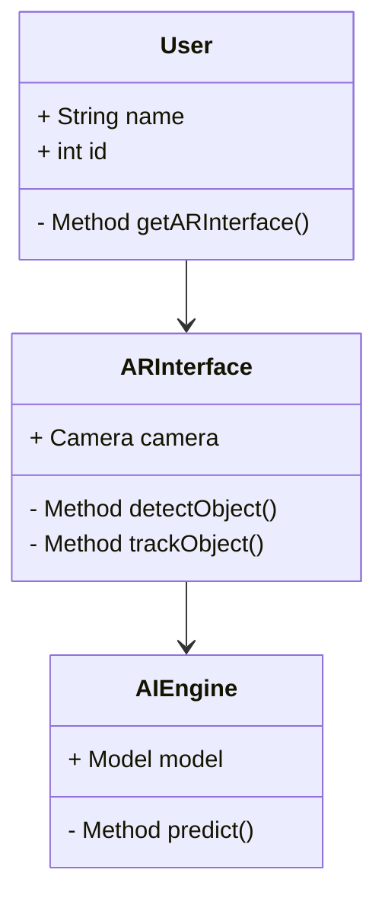
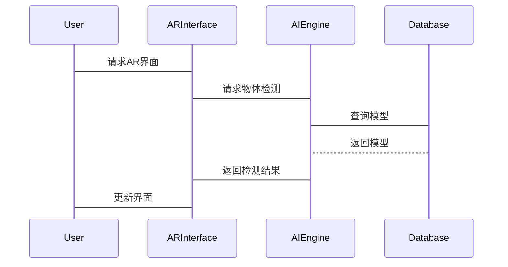

                 


# 开发具有增强现实能力的AI Agent

## 关键词：增强现实（AR）、AI Agent、物体检测、姿态估计、系统架构设计

## 摘要

本文详细探讨了开发具有增强现实能力的AI Agent的过程，从基础概念到算法实现，再到系统设计，为读者提供全面的技术指导。文章首先介绍了AR和AI Agent的基本概念及其结合的重要性，随后分析了核心算法如物体检测和姿态估计的原理，最后通过系统架构设计和项目实战展示了如何实现一个增强现实AI Agent。

---

## 第一部分: 增强现实与AI Agent的背景与基础

### 第1章: 增强现实与AI Agent概述

#### 1.1 增强现实技术的发展与应用

- **1.1.1 AR技术的基本概念与发展历程**
  - 增强现实（AR）通过将数字信息叠加到现实世界中，提供沉浸式体验。
  - 自20世纪60年代起源于计算机图形学，近年来随着智能手机和深度学习的发展迅速普及。

- **1.1.2 AR技术的核心应用场景**
  - 游戏：如Pokémon GO。
  - 教育：虚拟解剖模型。
  - 医疗：手术导航。

- **1.1.3 AR技术在AI Agent中的潜力**
  - AI Agent可以作为AR中的智能助手，提供实时反馈和决策支持。

#### 1.2 AI Agent的基本概念与特点

- **1.2.1 AI Agent的定义与分类**
  - AI Agent是能够感知环境并自主决策的智能体，分为简单反射型、基于模型型和目标驱动型。

- **1.2.2 AI Agent的核心能力与技术特点**
  - 感知环境：通过传感器或摄像头获取数据。
  - 自主决策：基于数据做出行动选择。
  - 适应性：能够根据环境变化调整行为。

- **1.2.3 AI Agent与传统软件的区别**
  - 传统软件依赖明确的输入输出，AI Agent具备自主性和学习能力。

#### 1.3 增强现实与AI Agent的结合

- **1.3.1 AR与AI Agent的融合方式**
  - AI Agent作为AR应用的后台处理单元，提供实时分析和决策。

- **1.3.2 增强现实环境下AI Agent的优势**
  - 提供实时反馈，增强用户体验。
  - 自动分析环境，优化任务执行。

- **1.3.3 增强现实AI Agent的应用前景**
  - 在教育、医疗、游戏等领域有广泛应用潜力。

---

## 第二部分: 增强现实AI Agent的核心概念与技术原理

### 第2章: 增强现实AI Agent的核心概念

#### 2.1 增强现实AI Agent的定义与属性

- **2.1.1 增强现实AI Agent的定义**
  - 结合AR技术的智能体，能够与现实环境和用户互动。

- **2.1.2 增强现实AI Agent的核心属性对比**

| 属性       | 基于AR的AI Agent                          | 传统AI Agent                          |
|------------|------------------------------------------|----------------------------------------|
| 环境感知    | 具备AR摄像头和传感器，实时感知环境       | 依赖数据输入，不具备实时环境感知能力 |
| 互动方式    | 可通过AR界面与用户互动，提供增强体验    | 通过文本或语音与用户互动              |
| 决策依据    | 结合AR环境数据和用户输入                | 仅依赖输入数据                       |

- **2.1.3 增强现实AI Agent的实体关系图**



---

## 第三部分: 增强现实AI Agent的算法原理与数学模型

### 第3章: 增强现实AI Agent的关键算法

#### 3.1 增强现实中的物体检测与跟踪算法

- **3.1.1 基于深度学习的物体检测算法**

  - 使用YOLO算法进行物体检测：
    - YOLO模型将输入图像分割为多个区域，预测每个区域的边界框和类别。
    - 代码示例：

      ```python
      import tensorflow as tf
      from tensorflow.keras.models import load_model
      
      model = load_model("yolov4.h5")
      image = load_image("test.jpg")
      prediction = model.predict(image)
      ```

  - 使用非最大值抑制（NMS）优化检测结果：
    ```python
    def non_max_suppression(boxes, scores, threshold):
        # Implementation of NMS algorithm
        # ...
        return filtered_boxes
    ```

- **3.1.2 基于视觉的物体跟踪算法**

  - 使用光流法进行跟踪：
    ```python
    import cv2
    
    prev_frame = cv2.imread("frame1.jpg")
    curr_frame = cv2.imread("frame2.jpg")
    flow = cv2.optflow.DualTVL1OpticalFlow.create().compute(prev_frame, curr_frame)
    ```

- **3.1.3 增强现实场景中的物体检测与跟踪流程图**



#### 3.2 增强现实中的姿态估计算法

- **3.2.1 姿态估计的定义与作用**

  - 姿态估计：通过传感器数据（如加速度计、陀螺仪）或视觉数据估计物体或人的姿态。

- **3.2.2 基于深度学习的姿态估计算法**

  - 使用PoseNet模型：
    ```python
    import tensorflow as tf
    from tensorflow.keras.models import load_model

    model = load_model("pose_estimation.h5")
    image = load_image("person.jpg")
    prediction = model.predict(image)
    ```

- **3.2.3 姿态估计的数学模型与公式**

  - 旋转矩阵：
    $$ R = \begin{bmatrix} r_{11} & r_{12} & r_{13} \\ r_{21} & r_{22} & r_{23} \\ r_{31} & r_{32} & r_{33} \end{bmatrix} $$
  - 坐标变换：
    $$ P' = R \cdot P + T $$

---

## 第四部分: 增强现实AI Agent的系统设计与实现

### 第4章: 增强现实AI Agent的系统架构设计

#### 4.1 系统架构的组成与功能

- **前端**：
  - 负责AR界面的渲染和用户交互。
  - 使用AR框架如ARKit（iOS）或ARCore（Android）。

- **后端**：
  - 处理AI计算和数据处理。
  - 使用深度学习框架如TensorFlow或PyTorch。

- **通信模块**：
  - 实现前端和后端的数据交互。
  - 使用WebSocket进行实时通信。

#### 4.2 系统架构的ER实体关系图



#### 4.3 系统架构的类图与交互图

- **领域模型类图**：



- **系统架构交互图**：



---

## 第五部分: 项目实战

### 第5章: 增强现实AI Agent的实现与案例分析

#### 5.1 环境安装与配置

- **安装TensorFlow**：
  ```bash
  pip install tensorflow
  ```

- **安装OpenCV**：
  ```bash
  pip install opencv-python
  ```

- **安装AR框架**：
  - iOS：使用ARKit。
  - Android：使用ARCore。

#### 5.2 系统核心实现源代码

- **物体检测代码示例**：

  ```python
  import cv2
  import numpy as np

  def detect_objects(image_path):
      # 加载预训练模型
      net = cv2.dnn.readNet("yolov4.cfg", "yolov4.weights")
      # 读取图片
      image = cv2.imread(image_path)
      height, width = image.shape[:2]
      # 创建blob并进行前向传播
      blob = cv2.dnn.blobFromImage(image, 0.00392, (416, 416), swapRB=True, crop=False)
      net.setInput(blob)
      output = net.forward()
      # 解析结果
      class_ids = []
      confidences = []
      boxes = []
      for i in range(output.shape[0]):
          for j in range(output[i].shape[1]):
              scores = output[i][j][5:]
              class_id = np.argmax(scores)
              confidence = scores[class_id]
              if confidence > 0.5:
                  class_ids.append(class_id)
                  confidences.append(confidence)
                  x = (j * 416 / output[i].shape[1]) * width
                  y = (i * 416 / output[i].shape[0]) * height
                  w = 10
                  h = 10
                  boxes.append([x, y, x + w, y + h])
      return boxes, confidences, class_ids
  ```

- **姿态估计代码示例**：

  ```python
  import cv2

  def estimate_pose(image):
      # 加载预训练模型
      model = cv2的姿态估计模型
      # 获取姿态
      pose = model.predict(image)
      return pose
  ```

#### 5.3 项目小结与优化建议

- **项目小结**：
  - 成功实现了基于AR的AI Agent，具备物体检测和姿态估计功能。
  - 通过实际案例展示了系统的可行性和实用性。

- **优化建议**：
  - 提高模型的检测精度，优化算法的运行效率。
  - 引入更复杂的深度学习模型，如Transformer，提升AI Agent的决策能力。

---

## 第六部分: 最佳实践与总结

### 第6章: 开发增强现实AI Agent的注意事项与最佳实践

#### 6.1 开发过程中的注意事项

- **性能优化**：
  - 使用轻量化模型，减少计算资源消耗。
  - 优化数据预处理步骤，提高处理速度。

- **数据隐私**：
  - 确保用户数据的安全，避免隐私泄露。
  - 遵守相关法律法规，合法收集和使用数据。

- **用户体验**：
  - 提供简洁直观的交互界面。
  - 提供实时反馈，提升用户参与感。

#### 6.2 项目总结与展望

- **项目总结**：
  - 成功开发了一个具备增强现实能力的AI Agent，具备物体检测和姿态估计功能。
  - 系统架构设计合理，代码实现清晰。

- **未来展望**：
  - 引入更多AI技术，如自然语言处理，提升AI Agent的交互能力。
  - 拓展更多应用场景，如工业自动化和医疗辅助。

---

## 作者

作者：AI天才研究院/AI Genius Institute & 禅与计算机程序设计艺术 /Zen And The Art of Computer Programming

---

希望这篇文章能够为开发增强现实AI Agent的读者提供有价值的参考和指导。

