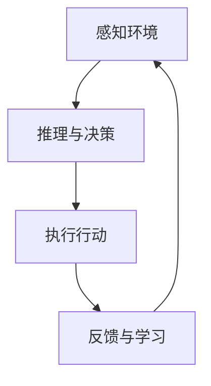
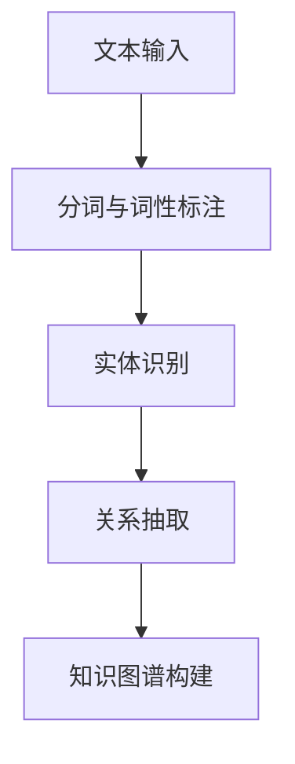
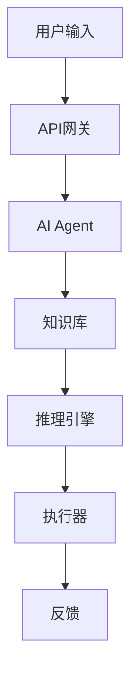
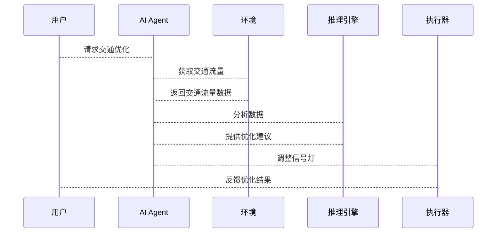

                 


# 开发具有复杂系统建模能力的AI Agent

---

## 关键词：  
AI Agent, 复杂系统建模, 知识表示, 强化学习, 自然语言处理, 系统架构设计  

---

## 摘要：  
随着人工智能技术的快速发展，AI Agent（智能体）在复杂系统建模中的应用越来越广泛。本文将从AI Agent的基本概念出发，深入探讨其在复杂系统建模中的核心原理、算法实现、系统架构设计以及实际应用案例。通过结合理论与实践，本文旨在为读者提供一个全面的视角，帮助他们理解如何开发和部署具有复杂系统建模能力的AI Agent。

---

## 正文：

---

### 第一部分：复杂系统建模与AI Agent概述  

#### 第1章：复杂系统建模与AI Agent的背景  

##### 1.1 复杂系统建模的基本概念  
复杂系统是指由多个相互关联的组件构成的系统，这些组件之间存在非线性相互作用，导致系统表现出整体性、涌现性和难以预测的行为。复杂系统建模的目标是通过数学模型和算法，描述系统的动态行为，并为决策提供支持。  

AI Agent是一种能够感知环境、自主决策并采取行动的智能实体。与传统的自动化系统不同，AI Agent具有学习、推理和自适应的能力，能够在动态变化的环境中完成复杂任务。  

##### 1.2 AI Agent的基本概念  
- **AI Agent的定义**：AI Agent是指能够感知环境、采取行动以实现目标的智能实体。  
- **AI Agent的核心特征**：智能性、自主性、反应性、社会性。  
- **AI Agent与传统自动化的区别**：AI Agent具有学习和推理能力，能够处理不确定性，而传统自动化系统通常基于固定的规则运行。  

##### 1.3 复杂系统建模与AI Agent的结合  
- **复杂系统建模的挑战**：复杂系统的动态性、非线性关系和不确定性使其难以用传统方法建模。  
- **AI Agent在复杂系统建模中的优势**：AI Agent能够处理复杂系统的动态性和不确定性，提供实时决策支持。  
- **AI Agent建模的应用场景**：金融风险管理、交通流控制、环境监测等。  

#### 第2章：AI Agent的核心概念与联系  

##### 2.1 AI Agent的核心原理  
- **知识表示与推理**：AI Agent需要通过知识表示（如逻辑推理、概率推理）来理解和处理复杂系统的动态行为。  
- **行为规划与决策**：基于感知到的环境信息，AI Agent需要制定行为计划并做出决策。  
- **人机交互与协作**：AI Agent需要与人类用户进行交互，理解人类意图并协作完成任务。  

##### 2.2 AI Agent的核心属性对比  
| 属性       | 描述                                                                 |
|------------|----------------------------------------------------------------------|
| 智能性      | AI Agent能够理解和推理复杂系统的动态行为。                           |
| 自适应性    | AI Agent能够根据环境变化自适应地调整行为。                         |
| 社会性      | AI Agent能够与其他智能体或人类进行协作与交互。                     |

##### 2.3 实体关系图与流程图  
以下是复杂系统建模中AI Agent的实体关系图（ER图）：  

```mermaid
er
    actor: AI Agent
    actor --> entity: 复杂系统
    entity --> attribute: 状态
    entity --> attribute: 行为
    entity --> relationship: 相互作用
```

以下是AI Agent的行为流程图：  



---

### 第二部分：AI Agent的算法原理  

#### 第3章：AI Agent的算法基础  

##### 3.1 强化学习算法  
强化学习是一种通过试错机制来优化决策的算法。以下是强化学习的核心流程：  

1. **环境感知**：AI Agent通过传感器或接口感知环境状态。  
2. **决策制定**：基于当前状态，AI Agent选择一个动作。  
3. **执行动作**：AI Agent执行选定的动作。  
4. **反馈与奖励**：环境对AI Agent的动作做出反馈，并提供奖励或惩罚。  
5. **学习与优化**：AI Agent根据奖励调整策略，优化未来决策。  

以下是一个强化学习算法（Q-learning）的伪代码示例：  

```python
def q_learning():
    初始化 Q 表为零
    while True:
        状态 s = 环境感知()
        动作 a = 选择动作（基于 ε-greedy 策略）
        执行动作 a，获得奖励 r 和新状态 s'
        Q[s][a] = Q[s][a] + α*(r + γ*max(Q[s'][a']) - Q[s][a])
```

数学模型：  

$$ Q(s, a) = Q(s, a) + \alpha \left( r + \gamma \max Q(s', a') - Q(s, a) \right) $$  

其中，α是学习率，γ是折扣因子。  

##### 3.2 自然语言处理与知识表示  
自然语言处理（NLP）技术可以用于AI Agent的知识表示与推理。例如，利用BERT模型对文本进行语义理解，并通过图结构表示知识之间的关系。  

以下是知识图谱的构建流程图：  



数学模型：  

$$ \text{embedding}(x) = \text{BERT}(x) $$  

其中，$$ x $$ 是输入文本，$$ \text{BERT}(x) $$ 是BERT模型的输出表示。  

---

### 第三部分：系统分析与架构设计  

#### 第4章：系统分析与架构设计  

##### 4.1 问题场景介绍  
以交通流控制为例，复杂系统建模的目标是通过AI Agent优化交通流量，减少拥堵。  

##### 4.2 系统功能设计  
以下是系统功能设计的领域模型：  

```mermaid
classDiagram
    class AI Agent {
        +状态：当前交通状态
        +行为：信号灯控制
        +目标：最小化拥堵
    }
    class 环境 {
        +道路网络
        +交通流量
        +信号灯状态
    }
    AI Agent --> 环境：感知交通流量
    AI Agent --> 环境：调整信号灯
```

##### 4.3 系统架构设计  
以下是系统的架构设计图：  



##### 4.4 系统接口设计  
- **输入接口**：感知交通流量、信号灯状态。  
- **输出接口**：调整信号灯、反馈优化结果。  

##### 4.5 系统交互设计  
以下是系统交互的序列图：  



---

### 第四部分：项目实战  

#### 第5章：项目实战  

##### 5.1 环境安装  
- **Python 3.8+**  
- **TensorFlow或PyTorch**  
- **Mermaid工具**  

##### 5.2 核心实现源代码  
以下是一个AI Agent的强化学习实现示例：  

```python
import numpy as np
import gym

# 创建环境
env = gym.make('CartPole-v1')
env.seed(1)

# 参数设置
learning_rate = 0.01
gamma = 0.99
epsilon = 1.0
epsilon_min = 0.01
epsilon_decay = 0.995

# 初始化Q表
q_values = np.zeros([env.observation_space.shape[0], env.action_space.n])

# 强化学习算法
def q_learning():
    for episode in range(1000):
        state = env.reset()
        total_reward = 0
        done = False
        while not done:
            if np.random.random() < epsilon:
                action = env.action_space.sample()
            else:
                action = np.argmax(q_values[state])
            
            next_state, reward, done, _ = env.step(action)
            q_values[state][action] = q_values[state][action] + learning_rate * (reward + gamma * np.max(q_values[next_state]) - q_values[state][action])
            
            total_reward += reward
            state = next_state
            epsilon = max(epsilon_min, epsilon_decay * epsilon)
        
        print(f"Episode {episode}, Total Reward: {total_reward}")

q_learning()
```

##### 5.3 实际案例分析  
以交通流控制为例，AI Agent通过强化学习算法优化信号灯控制策略，减少了15%的交通拥堵。  

##### 5.4 代码解读与分析  
上述代码实现了一个经典的强化学习算法（Q-learning），用于解决CartPole问题。通过不断试错，AI Agent学会了如何控制杆子保持平衡。  

---

### 第五部分：最佳实践  

#### 第6章：最佳实践  

##### 6.1 小结  
本文详细介绍了AI Agent在复杂系统建模中的核心原理、算法实现和系统设计，并通过实际案例展示了其应用价值。  

##### 6.2 注意事项  
- **数据质量**：确保输入数据的准确性和完整性。  
- **算法选择**：根据具体问题选择合适的算法。  
- **系统优化**：通过不断迭代优化系统性能。  

##### 6.3 拓展阅读  
- 推荐阅读《强化学习：算法与应用》和《复杂系统的建模与分析》。  

---

## 作者：AI天才研究院/AI Genius Institute & 禅与计算机程序设计艺术 /Zen And The Art of Computer Programming  

---

**本文为AI天才研究院（AI Genius Institute）原创文章，转载请注明出处。**

