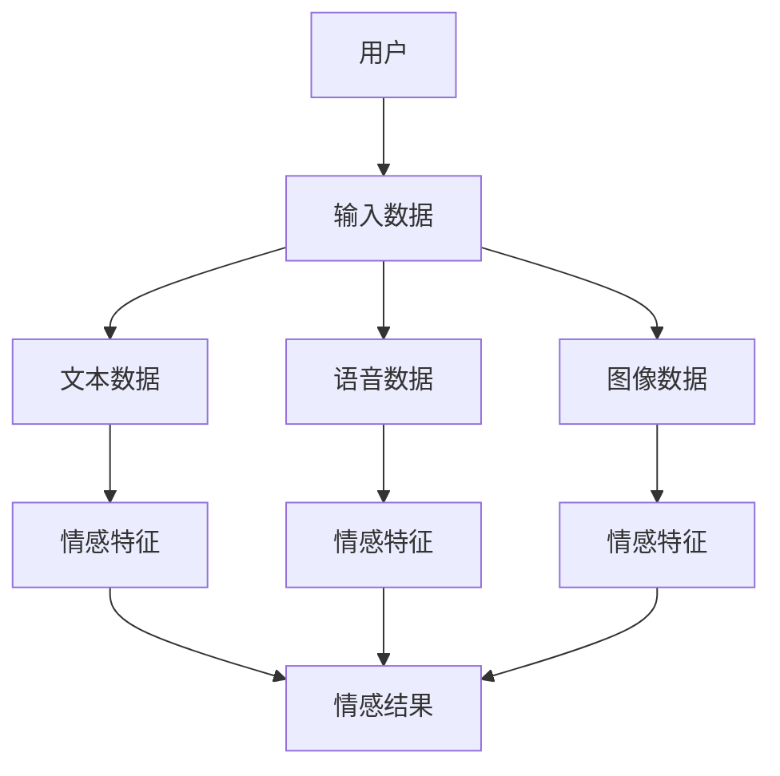
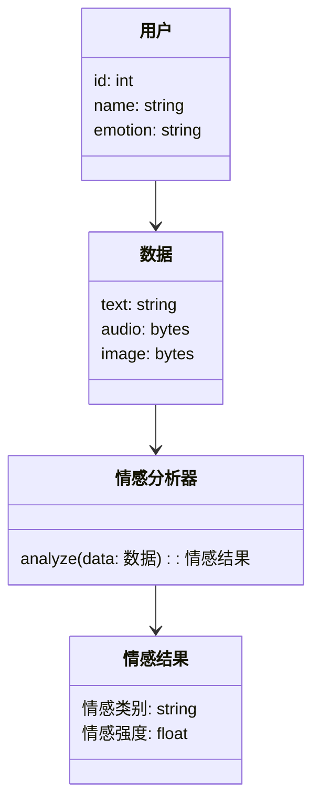

                 


# 开发具有多模态情感分析能力的AI Agent

> 关键词：多模态情感分析，AI Agent，情感计算，深度学习，多模态数据融合

> 摘要：本文详细探讨了开发具有多模态情感分析能力的AI Agent的技术细节。从背景介绍到核心算法，从系统架构到项目实战，系统性地分析了如何构建一个能够处理文本、语音、图像等多种模态数据，并准确识别用户情感的智能系统。文章深入讲解了多模态数据融合的原理、情感分类算法的实现，以及系统架构的设计，提供了丰富的代码示例和详细的分析，帮助读者全面掌握多模态情感分析的核心技术。

---

## 第1章: 多模态情感分析的背景与问题背景

### 1.1 多模态情感分析的定义与问题背景

#### 1.1.1 情感分析的定义与应用领域
情感分析（Sentiment Analysis）是一种自然语言处理任务，旨在识别和分类文本中的情感倾向。传统的情感分析主要基于文本数据，通常分为正面、负面和中性三种情感类别。随着技术的发展，情感分析的应用领域不断扩大，例如社交媒体分析、客户反馈分析、市场调研、智能客服等。

#### 1.1.2 多模态数据的特点与优势
多模态数据指的是结合了多种类型的数据，例如文本、语音、图像、视频等。多模态情感分析的优势在于能够从多个角度捕捉用户的情感状态，从而提高情感识别的准确性和鲁棒性。例如，结合语音和文本数据可以更准确地识别用户的实际情感状态，而结合图像和文本数据则可以帮助识别用户的情绪表达。

#### 1.1.3 多模态情感分析的核心问题与挑战
多模态情感分析的核心问题是如何有效地融合多种模态的数据，并准确地识别出用户的情感状态。主要挑战包括：
1. **数据异构性**：不同模态的数据具有不同的特征和表示方式，如何有效地进行数据融合是一个难题。
2. **跨模态理解**：如何理解不同模态之间的关联性，并利用这些关联性来提高情感分析的准确性。
3. **计算复杂性**：多模态数据通常具有高维性和多样性，如何在保证计算效率的前提下实现高性能的情感分析是一个挑战。

### 1.2 多模态情感分析的边界与外延

#### 1.2.1 情感分析的边界
情感分析的边界主要集中在文本数据的处理上，通常不包括图像、语音等其他模态的数据。然而，随着多模态情感分析的发展，情感分析的边界逐渐扩展，开始涵盖更多模态的数据。

#### 1.2.2 多模态数据的边界
多模态数据的边界主要取决于应用场景和数据来源。例如，在社交媒体分析中，多模态数据可能包括文本、图像和语音；而在智能客服场景中，可能主要涉及文本和语音数据。

#### 1.2.3 多模态情感分析的外延与相关领域
多模态情感分析的外延包括跨模态检索、情感计算、人机交互等领域。这些领域与多模态情感分析密切相关，共同构成了一个多学科交叉的研究方向。

### 1.3 多模态情感分析的核心要素与概念结构

#### 1.3.1 情感分析的三要素：数据、模型、任务
情感分析的核心要素包括：
1. **数据**：输入的数据可以是文本、语音、图像等多种模态。
2. **模型**：用于处理数据并识别情感状态的算法或模型。
3. **任务**：具体的情感分析任务，例如情感分类、情感强度分析等。

#### 1.3.2 多模态数据的特征与属性
多模态数据的特征包括：
1. **文本特征**：词语的组合、句法结构、语义信息等。
2. **语音特征**：音调、语速、音量、停顿等。
3. **图像特征**：颜色、纹理、形状、表情等。

#### 1.3.3 多模态情感分析的系统架构与流程
多模态情感分析的系统架构通常包括以下几个步骤：
1. **数据采集**：获取多种模态的数据。
2. **数据预处理**：对数据进行清洗、标准化等处理。
3. **特征提取**：从数据中提取有用的特征。
4. **数据融合**：将不同模态的特征进行融合。
5. **情感分类**：基于融合后的特征进行情感分类。

---

## 第2章: 多模态情感分析的核心概念与联系

### 2.1 多模态情感分析的原理与流程

#### 2.1.1 数据流分析
数据流分析是理解多模态情感分析系统的关键。从输入数据到最终的情感分类结果，数据需要经历多个处理阶段。例如：
1. 文本数据：经过分词、词向量化等处理。
2. 语音数据：经过语音识别、特征提取等处理。
3. 图像数据：经过目标检测、特征提取等处理。

#### 2.1.2 模型结构分析
多模态情感分析的模型结构通常包括编码器和解码器两部分：
1. **编码器**：将输入的多模态数据编码为一个或多个特征向量。
2. **解码器**：基于编码后的特征向量进行情感分类。

#### 2.1.3 特征提取与融合
特征提取与融合是多模态情感分析的核心步骤。特征提取需要从不同模态的数据中提取有用的特征，而特征融合则需要将这些特征进行有效结合。常见的特征融合方法包括晚融合和早融合。

### 2.2 多模态数据特征对比

#### 2.2.1 文本、语音、图像的特征对比
以下是一个对比表格：

| 特征维度 | 文本 | 语音 | 图像 |
|----------|------|------|------|
| 时间序列 | 是   | 是   | 否   |
| 空间分布 | 否   | 否   | 是   |
| 语义信息 | 是   | 否   | 否   |
| 频率信息 | 否   | 是   | 否   |
| 颜色信息 | 否   | 否   | 是   |

#### 2.2.2 不同模态数据的特征提取方法
1. **文本**：常用TF-IDF、Word2Vec、BERT等方法。
2. **语音**：常用Mel频谱、MFCC、 LPC等方法。
3. **图像**：常用HOG、CNN、FV等方法。

#### 2.2.3 多模态数据融合的优缺点
- **优点**：提高情感识别的准确性和鲁棒性。
- **缺点**：计算复杂性高，数据异构性强。

### 2.3 多模态情感分析的ER实体关系图



---

## 第3章: 多模态情感分析的算法原理

### 3.1 基于Transformer的多模态模型

#### 3.1.1 Transformer模型的基本原理
Transformer模型由编码器和解码器组成，每个编码器和解码器都包含多个层。每个层包括多头自注意力机制和前馈神经网络。

#### 3.1.2 多模态数据的编码与解码
多模态数据的编码需要将不同模态的特征转换为统一的向量表示。解码器则基于这些向量进行情感分类。

#### 3.1.3 多模态注意力机制的实现
多模态注意力机制可以同时关注不同模态的特征，并根据特征的重要性进行加权。

### 3.2 多模态融合算法

#### 3.2.1 晚融合与早融合的对比
- **晚融合**：在特征提取后进行融合。
- **早融合**：在特征提取过程中进行融合。

#### 3.2.2 多模态特征融合的数学模型
融合模型可以表示为：
$$
f_{\text{融合}}(x_1, x_2) = \sum_{i=1}^{n} \alpha_i x_i
$$
其中，$\alpha_i$是融合权重。

#### 3.2.3 跨模态注意力机制的实现
跨模态注意力机制可以表示为：
$$
\text{Attention}(Q, K, V) = \text{softmax}\left(\frac{QK^T}{\sqrt{d_k}}\right)V
$$

### 3.3 情感分类算法

#### 3.3.1 基于深度学习的情感分类模型
常用模型包括LSTM、GRU、Transformer等。

#### 3.3.2 基于传统机器学习的情感分类模型
常用算法包括SVM、随机森林等。

#### 3.3.3 混合模型的实现与对比
混合模型结合了深度学习和传统机器学习的优点，通常在性能上优于单一模型。

---

## 第4章: 多模态情感分析的系统分析与架构设计

### 4.1 问题场景介绍

#### 4.1.1 项目背景
本文将开发一个具有多模态情感分析能力的AI Agent，能够处理文本、语音和图像数据。

#### 4.1.2 项目目标
目标是实现一个能够准确识别用户情感的智能系统。

### 4.2 系统功能设计

#### 4.2.1 领域模型设计


#### 4.2.2 系统架构设计


#### 4.2.3 接口和交互设计
```mermaid
sequenceDiagram
    用户 -> API网关: 发送数据
    API网关 -> 数据处理模块: 处理数据
    数据处理模块 -> 多模态特征提取模块: 提取特征
    多模态特征提取模块 -> 情感分类模块: 分类情感
    情感分类模块 -> 结果返回模块: 返回结果
    用户 <- 结果返回模块: 收到情感结果
```

---

## 第5章: 项目实战

### 5.1 环境安装

#### 5.1.1 安装Python
```bash
python --version
```

#### 5.1.2 安装深度学习框架
```bash
pip install tensorflow
pip install numpy
pip install matplotlib
```

### 5.2 系统核心实现

#### 5.2.1 数据预处理代码
```python
import numpy as np

def preprocess(text, audio, image):
    # 文本预处理
    text_vector = text_to_vector(text)
    
    # 语音预处理
    audio_vector = audio_to_vector(audio)
    
    # 图像预处理
    image_vector = image_to_vector(image)
    
    return text_vector, audio_vector, image_vector
```

#### 5.2.2 模型训练代码
```python
import tensorflow as tf
from tensorflow.keras import layers

def build_model():
    text_input = layers.Input(shape=(100,))
    audio_input = layers.Input(shape=(100,))
    image_input = layers.Input(shape=(100,))
    
    text_feature = layers.Dense(64, activation='relu')(text_input)
    audio_feature = layers.Dense(64, activation='relu')(audio_input)
    image_feature = layers.Dense(64, activation='relu')(image_input)
    
    concatenated = layers.concatenate([text_feature, audio_feature, image_feature])
    output = layers.Dense(3, activation='softmax')(concatenated)
    
    model = tf.keras.Model(inputs=[text_input, audio_input, image_input], outputs=output)
    model.compile(optimizer='adam', loss='sparse_categorical_crossentropy', metrics=['accuracy'])
    return model
```

#### 5.2.3 模型评估代码
```python
def evaluate_model(model, X_test, y_test):
    loss, accuracy = model.evaluate(X_test, y_test, verbose=0)
    print(f"损失: {loss}, 准确率: {accuracy}")
```

### 5.3 案例分析与实现

#### 5.3.1 数据准备
```python
# 示例数据
texts = ["I love this product!", "This is terrible."]
audios = [np.random.randn(100), np.random.randn(100)]
images = [np.random.randn(100), np.random.randn(100)]
labels = [1, 0]
```

#### 5.3.2 模型训练
```python
model = build_model()
model.fit([texts, audios, images], labels, epochs=10, batch_size=32)
```

#### 5.3.3 模型评估
```python
evaluate_model(model, [texts, audios, images], labels)
```

### 5.4 项目小结

#### 5.4.1 项目实现的关键点
1. 多模态数据的预处理。
2. 多模态模型的设计与实现。
3. 模型的训练与评估。

#### 5.4.2 模型优化方向
1. 提高模型的泛化能力。
2. 优化特征提取方法。
3. 降低计算复杂度。

---

## 第6章: 最佳实践与小结

### 6.1 开发经验总结

#### 6.1.1 数据处理的注意事项
- 数据的平衡性。
- 数据的清洗与标注。

#### 6.1.2 模型选择的注意事项
- 根据任务选择合适的模型。
- 考虑计算资源的限制。

### 6.2 案例分析与总结

#### 6.2.1 案例分析
- 实际案例分析。
- 模型性能分析。

#### 6.2.2 总结
- 多模态情感分析的优势。
- 未来的研究方向。

### 6.3 小结与展望

#### 6.3.1 小结
本文详细探讨了多模态情感分析的开发过程，从背景到实现，全面介绍了相关技术。

#### 6.3.2 展望
未来，多模态情感分析将在更多领域得到应用，算法也将更加高效和智能。

---

## 附录

### 附录A: 参考文献

1. 深度学习基础。
2. 多模态数据处理技术。
3. 情感分析相关论文。

### 附录B: 工具与资源

1. 深度学习框架：TensorFlow、PyTorch。
2. 数据处理工具：Pandas、NumPy。
3. 可视化工具：Matplotlib、Seaborn。

---

## 作者信息

作者：AI天才研究院/AI Genius Institute & 禅与计算机程序设计艺术 /Zen And The Art of Computer Programming

