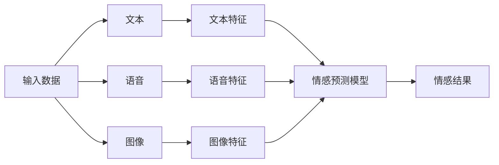
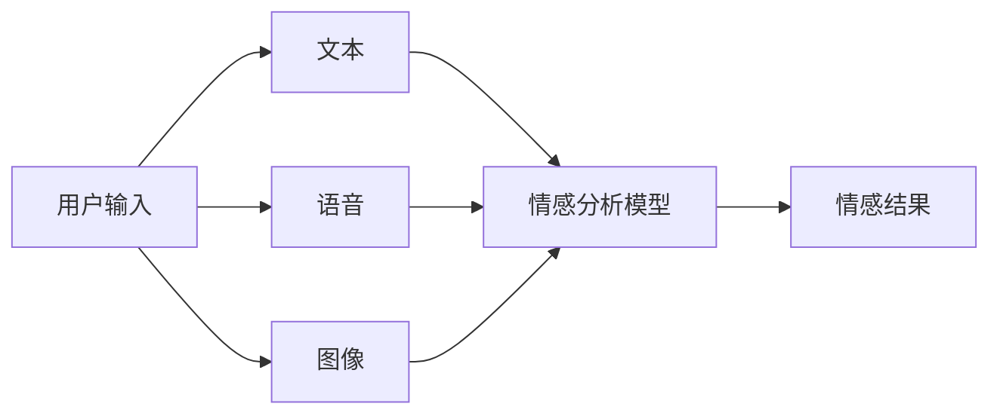
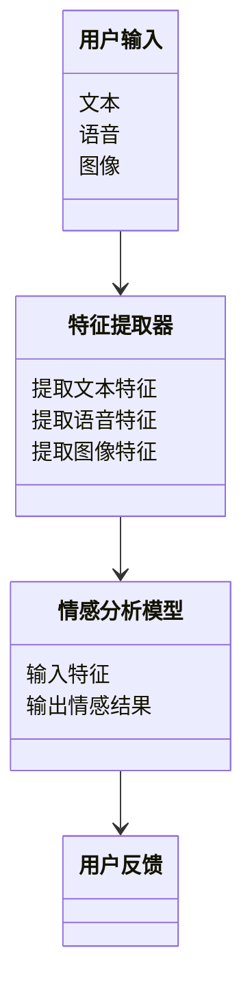
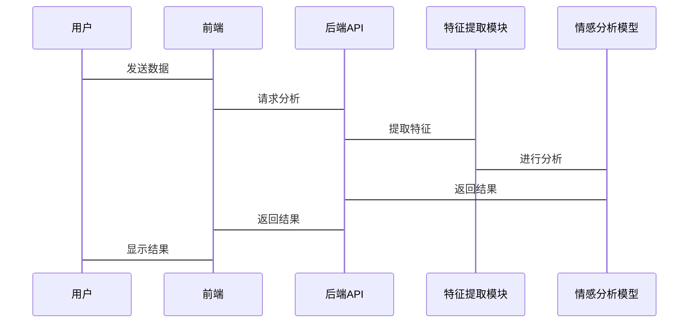

                 


```markdown
# 开发具有多模态情感分析能力的AI Agent

## 关键词：多模态情感分析、AI Agent、自然语言处理、深度学习、语音处理、图像处理

## 摘要：本文详细探讨了开发具有多模态情感分析能力的AI Agent的全过程，包括背景介绍、核心概念、算法原理、系统架构设计、项目实战及最佳实践。通过多模态数据的融合与分析，提升情感分析的准确性和鲁棒性，为AI Agent的实际应用提供理论支持和技术指导。

---

## 第1章: 多模态情感分析的背景与挑战

### 1.1 情感分析的定义与应用
#### 1.1.1 情感分析的基本概念
情感分析是自然语言处理（NLP）中的一个重要任务，旨在判断一段文本所表达的情感倾向，例如正面、负面或中性。传统的情感分析主要基于文本数据，但随着技术的发展，结合语音、图像等多模态数据的情感分析逐渐成为研究热点。

#### 1.1.2 情感分析的典型应用场景
- **社交媒体分析**：分析用户评论的情感倾向，帮助企业了解产品口碑。
- **客服系统优化**：通过分析客户语音或文本，自动判断客户情绪，提供更优质的服务。
- **影视作品评价**：结合观众的评论、语音和面部表情，全面分析观众的情感反馈。

#### 1.1.3 多模态情感分析的引入
传统的情感分析仅依赖单一模态的数据（如文本），存在信息提取不全面的问题。引入多模态数据（如语音、图像）后，能够更准确地捕捉用户的情感状态，提升分析的准确性和鲁棒性。

### 1.2 多模态数据的特点与优势
#### 1.2.1 多模态数据的定义
多模态数据是指结合了多种数据形式（如文本、语音、图像）来描述同一事物的数据。通过多模态数据的融合，可以更全面地理解用户的情感状态。

#### 1.2.2 文本、语音、图像等多模态数据的特征对比
| 数据类型 | 特征               | 优点                     |
|----------|--------------------|--------------------------|
| 文本     | 易获取，信息丰富    | 直接反映用户意图           |
| 语音     | 蕴含情感特征        | 更直接反映情感状态         |
| 图像     | 能反映视觉情绪      | 适合分析面部表情          |

#### 1.2.3 多模态数据在情感分析中的优势
- **信息互补性**：不同模态的数据可以相互补充，提升分析的准确性。
- **鲁棒性增强**：单一模态数据的局限性可以通过其他模态数据弥补。
- **用户体验优化**：结合多模态数据后，AI Agent可以更准确地理解用户需求，提供更个性化的服务。

### 1.3 当前情感分析的挑战
#### 1.3.1 单一模态分析的局限性
- 文本分析难以捕捉用户的实时情感变化。
- 语音分析受环境噪声影响较大。
- 图像分析需要高精度的面部识别技术。

#### 1.3.2 多模态数据融合的难点
- 数据异构性：不同模态的数据格式和特征维度差异大。
- 数据同步性：多模态数据需要在时间上对齐，才能有效融合。
- 计算复杂度：多模态数据的处理需要更高的计算资源。

#### 1.3.3 实际应用中的技术挑战
- 数据采集和标注成本高。
- 多模态模型的训练需要大量标注数据。
- 模型的泛化能力不足，难以应对不同场景下的情感分析需求。

---

## 第2章: 多模态情感分析的核心概念与联系

### 2.1 多模态情感分析的原理
#### 2.1.1 多模态数据的融合方式
多模态数据的融合方式可以分为两类：
1. **早期融合**：在特征提取阶段将不同模态的数据进行融合。
2. **晚期融合**：在特征提取后，分别处理每个模态的数据，最后将结果进行融合。

#### 2.1.2 情感分析的基本流程
1. 数据采集与预处理
2. 特征提取
3. 模型训练与融合
4. 情感预测与结果输出

#### 2.1.3 多模态情感分析的框架


### 2.2 多模态情感分析与传统情感分析的对比
#### 2.2.1 数据输入方式的对比
| 对比维度       | 传统情感分析          | 多模态情感分析           |
|----------------|-----------------------|--------------------------|
| 数据来源       | 文本                  | 文本、语音、图像          |
| 数据量         | 较小                  | 较大                    |
| 模型复杂度     | 较低                  | 较高                    |

#### 2.2.2 模型复杂度的对比
传统情感分析模型通常基于词袋模型或词嵌入技术，而多模态情感分析模型需要整合多种模态的特征，模型复杂度显著增加。

#### 2.2.3 性能指标的对比
| 性能指标       | 传统情感分析          | 多模态情感分析           |
|----------------|-----------------------|--------------------------|
| 准确率         | 中等                  | 更高                    |
| 召回率         | 中等                  | 更高                    |
| F1分数         | 中等                  | 更高                    |

### 2.3 多模态情感分析的实体关系图


---

## 第3章: 多模态情感分析算法原理

### 3.1 多模态融合算法概述
#### 3.1.1 多模态数据的预处理
- 文本预处理：分词、去停用词、词向量化。
- 语音预处理：降噪、特征提取（如MFCC）。
- 图像预处理：人脸检测、表情识别。

#### 3.1.2 多模态特征提取方法
- 文本：词嵌入（如Word2Vec、BERT）。
- 语音：提取Mel频率倒谱系数（MFCC）。
- 图像：使用CNN提取面部表情特征。

#### 3.1.3 多模态数据融合策略
1. **特征级融合**：将不同模态的特征向量拼接起来。
2. **决策级融合**：分别对每个模态进行分类，最后将结果进行融合。

### 3.2 多模态情感分析的数学模型
#### 3.2.1 情感分析的损失函数
$$ L = -\sum_{i=1}^{n} y_i \log p(y_i) + (1 - y_i) \log (1 - p(y_i)) $$

其中，\( y_i \) 是真实标签，\( p(y_i) \) 是模型预测的概率。

#### 3.2.2 模型流程图


#### 3.2.3 模型实现代码
```python
import torch
import torch.nn as nn

class MultiModalClassifier(nn.Module):
    def __init__(self, input_size, hidden_size, output_size):
        super(MultiModalClassifier, self).__init__()
        self.fc1 = nn.Linear(input_size, hidden_size)
        self.fc2 = nn.Linear(hidden_size, output_size)
        self.relu = nn.ReLU()
        self.dropout = nn.Dropout(0.5)

    def forward(self, x):
        out = self.fc1(x)
        out = self.relu(out)
        out = self.dropout(out)
        out = self.fc2(out)
        return out

# 使用示例
input_size = 100  # 特征维度
hidden_size = 50   # 隐藏层维度
output_size = 3    # 情感类别数：0-负面，1-中性，2-正面

model = MultiModalClassifier(input_size, hidden_size, output_size)
criterion = nn.CrossEntropyLoss()
optimizer = torch.optim.Adam(model.parameters(), lr=0.001)
```

---

## 第4章: 系统分析与架构设计

### 4.1 项目场景介绍
开发一个多模态情感分析AI Agent，用于分析用户的文本、语音和图像数据，判断其情感倾向，并提供相应的反馈。

### 4.2 系统功能设计（领域模型）


### 4.3 系统架构设计


### 4.4 系统接口设计
- **输入接口**：接收文本、语音和图像数据。
- **输出接口**：返回情感分析结果。

### 4.5 系统交互流程


---

## 第5章: 项目实战

### 5.1 环境安装
- 安装Python和必要的库（如TensorFlow、PyTorch、OpenCV）。
- 安装语音处理库（如 librosa）和图像处理库（如 PIL、dlib）。

### 5.2 系统核心实现
#### 5.2.1 特征提取代码
```python
import librosa
import cv2
import torch

def extract_text_features(text):
    # 使用BERT模型提取文本特征
    pass

def extract_audio_features(audio_path):
    audio, sr = librosa.load(audio_path, sr=16000)
    mfccs = librosa.feature.mfcc(y=audio, sr=sr, n_mfcc=13)
    return mfccs.T

def extract_image_features(image_path):
    img = cv2.imread(image_path)
    gray = cv2.cvtColor(img, cv2.COLOR_BGR2GRAY)
    face_cascade = cv2.CascadeClassifier('haarcascade_frontalface_default.xml')
    faces = face_cascade.detectMultiScale(gray, 1.3, 5)
    if len(faces) == 0:
        return None
    (x, y, w, h) = faces[0]
    face_img = gray[y:y+h, x:x+w]
    face_img = cv2.resize(face_img, (100, 100))
    return face_img.flatten()
```

#### 5.2.2 模型训练代码
```python
import torch
import torch.nn as nn
import torch.optim as optim

class MultiModalModel(nn.Module):
    def __init__(self, text_features, audio_features, image_features):
        super(MultiModalModel, self).__init__()
        self.text_layer = nn.Linear(text_features, 64)
        self.audio_layer = nn.Linear(audio_features, 64)
        self.image_layer = nn.Linear(image_features, 64)
        self.fc = nn.Linear(192, 3)  # 输出3类：负面、中性、正面
        self.relu = nn.ReLU()

    def forward(self, text, audio, image):
        text_out = self.text_layer(text)
        audio_out = self.audio_layer(audio)
        image_out = self.image_layer(image)
        features = torch.cat([text_out, audio_out, image_out], dim=1)
        out = self.fc(features)
        out = self.relu(out)
        return out

# 初始化模型
text_features = 768  # 假设文本特征维度为768（如BERT的输出）
audio_features = 13   # MFCC特征维度
image_features = 100  # 假设图像特征维度为100

model = MultiModalModel(text_features, audio_features, image_features)
criterion = nn.CrossEntropyLoss()
optimizer = optim.Adam(model.parameters(), lr=0.001)
```

#### 5.2.3 案例分析
假设我们有一个用户输入，包括文本评论、语音录音和面部表情图像。通过上述代码提取特征后，输入模型进行情感分析，最终得到情感结果。

---

## 第6章: 最佳实践

### 6.1 小结
多模态情感分析通过结合文本、语音和图像等多种数据，能够更全面地捕捉用户情感，提升分析的准确性和鲁棒性。

### 6.2 注意事项
- 数据标注需要准确，尤其是多模态数据的同步性。
- 模型训练需要大量数据，避免过拟合。
- 优化模型性能，降低计算复杂度。

### 6.3 拓展阅读
- [多模态学习综述](#)
- [深度学习在情感分析中的应用](#)
- [语音信号处理技术](#)

---

## 参考文献
1. 潘杰, 李航. 《自然语言处理入门》. 清华大学出版社, 2018.
2. LeCun, Y., Bengio, Y., & Hinton, G. (2015). Deep learning.nature, 521(7552), 436.
3. 余露. 基于深度学习的多模态情感分析研究. 计算机科学, 2020.

---

## 作者：AI天才研究院 & 禅与计算机程序设计艺术
```

