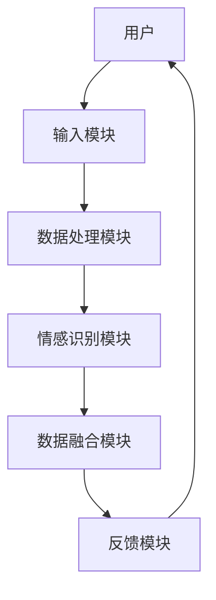
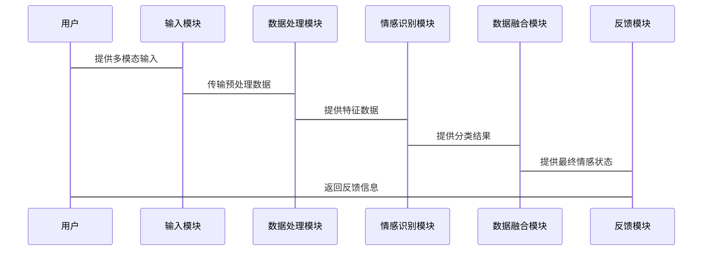

                 


```markdown
# 开发具有多模态情感识别能力的AI Agent

## 关键词：多模态情感识别，AI Agent，机器学习，深度学习，数据融合，情感计算

## 摘要：  
本文将详细介绍如何开发具有多模态情感识别能力的AI Agent。首先，我们将探讨多模态情感识别的背景、定义及其重要性。然后，我们将深入分析多模态数据处理的核心原理，包括文本、语音和图像等多种数据源的融合方法。接着，我们将介绍主流的情感识别算法及其数学模型，包括基于Transformer和CNN的模型。随后，我们将从系统架构设计的角度，详细讲解AI Agent的整体架构、功能模块及其交互流程。最后，我们将通过实际案例展示如何实现一个多模态情感识别系统，并总结开发过程中的一些关键点和未来发展方向。

---

## 第一部分: 多模态情感识别AI Agent的背景与核心概念

### 第1章: 多模态情感识别的背景与问题描述

#### 1.1 多模态情感识别的定义与背景
##### 1.1.1 情感识别的定义与应用领域
情感识别是通过分析人类的情感表达（如语音、文本、面部表情等）来判断其情感状态的过程。它广泛应用于智能客服、心理健康监测、教育辅助等领域。

##### 1.1.2 多模态数据的定义与特点
多模态数据是指结合了多种数据形式（如文本、语音、图像等）来描述同一事物的信息。多模态数据的特点包括互补性、冗余性和多样性。

##### 1.1.3 多模态情感识别的必要性与优势
单一模态情感识别在某些场景下存在局限性，例如语音识别可能受环境噪声影响，文本识别可能无法捕捉到语调信息。多模态情感识别通过结合多种数据源，可以提高识别的准确性和鲁棒性。

#### 1.2 多模态情感识别的问题描述
##### 1.2.1 情感识别的挑战与局限性
- 数据采集难度大：多模态数据的采集需要多种传感器，且数据格式多样。
- 数据融合复杂：如何有效地将不同模态的数据融合是关键问题。
- 模态间信息差异大：不同模态的数据在时间和空间上可能存在不一致。

##### 1.2.2 多模态数据融合的难点
- 数据异构性：不同模态的数据具有不同的特征空间和表示方式。
- 数据冗余性：某些信息可能在多个模态中重复出现，如何去除冗余是难点。
- 数据相关性：不同模态的数据可能存在相关性，如何建模这种相关性是关键。

##### 1.2.3 多模态情感识别的边界与外延
多模态情感识别的边界在于如何确定哪些模态的数据对情感识别是有用的，外延则包括如何将多模态数据应用于更广泛的情感计算任务。

---

### 第2章: 多模态情感识别的核心概念与联系

#### 2.1 多模态数据处理的核心原理
##### 2.1.1 多模态数据的采集与预处理
- 数据采集：包括文本、语音、图像等多种数据的采集。
- 数据预处理：对采集到的数据进行清洗、归一化等处理。

##### 2.1.2 多模态数据的特征提取方法
- 文本特征提取：如词袋模型、TF-IDF、Word2Vec等。
- 语音特征提取：如梅尔频谱、MFCC（Mel-Frequency Cepstral Coefficients）等。
- 图像特征提取：如HOG（Histogram of Oriented Gradients）、CNN特征等。

##### 2.1.3 多模态数据的融合策略
- 晚期融合：在特征层或决策层进行融合。
- 早期融合：在特征提取过程中进行融合。

#### 2.2 情感识别模型的核心原理
##### 2.2.1 基于文本的情感识别
- 传统方法：如支持向量机（SVM）、朴素贝叶斯（Naive Bayes）。
- 深度学习方法：如LSTM、Transformer模型。

##### 2.2.2 基于语音的情感识别
- 语音特征提取：如MFCC、谱质等。
- 模型：如GMM（高斯混合模型）、DNN（深度神经网络）。

##### 2.2.3 基于图像的情感识别
- 面部表情识别：如使用CNN提取面部特征。
- 手势识别：如使用骨架检测技术。

#### 2.3 多模态情感识别的融合方法
##### 2.3.1 晚期融合与早期融合的对比
- 晚期融合：在决策层进行融合，如将不同模态的分类结果进行加权投票。
- 早期融合：在特征层进行融合，如将不同模态的特征向量进行拼接或融合。

##### 2.3.2 基于注意力机制的融合方法
- 使用自注意力机制对不同模态的数据进行加权。
- 通过交叉注意力机制实现模态间的相互增强。

##### 2.3.3 基于图神经网络的融合方法
- 使用图神经网络对不同模态的数据进行建模，捕捉模态间的关联关系。

---

### 第3章: 多模态情感识别的数学模型与算法原理

#### 3.1 情感识别的数学模型
##### 3.1.1 基于传统机器学习的情感识别模型
- 朴素贝叶斯模型：通过计算条件概率进行分类。
- SVM模型：通过构建超平面进行分类。

##### 3.1.2 基于深度学习的情感识别模型
- LSTM模型：通过循环神经网络处理序列数据。
- Transformer模型：通过自注意力机制处理长序列数据。

##### 3.1.3 基于Transformer的多模态情感识别模型
- 使用多模态Transformer模型对不同模态的数据进行联合建模。
- 使用交叉注意力机制实现模态间的交互。

#### 3.2 多模态数据融合的算法原理
##### 3.2.1 基于特征融合的多模态情感识别算法
- 将不同模态的特征向量进行拼接或加权求和。
- 使用PCA（主成分分析）对特征进行降维。

##### 3.2.2 基于决策融合的多模态情感识别算法
- 将不同模态的分类结果进行加权投票。
- 使用融合规则（如逻辑回归）对分类结果进行融合。

##### 3.2.3 基于自注意力机制的多模态融合算法
- 使用自注意力机制对不同模态的数据进行加权。
- 通过交叉注意力机制实现模态间的相互增强。

#### 3.3 情感识别的数学公式与模型解释
##### 3.3.1 情感识别的损失函数
$$ \text{损失函数} = -\frac{1}{N}\sum_{i=1}^{N}\sum_{c=1}^{C} y_{i,c}\log(p_{i,c}) $$
其中，\( y_{i,c} \) 是标签，\( p_{i,c} \) 是预测概率。

##### 3.3.2 多模态融合的权重计算公式
$$ w_c = \frac{\exp(\alpha x_c)}{\sum_{j=1}^{M}\exp(\alpha x_j)} $$
其中，\( x_c \) 是第 \( c \) 个模态的特征，\( \alpha \) 是调节参数。

##### 3.3.3 基于Transformer的注意力机制公式
$$ \text{注意力权重} = \frac{\exp(\text{Query} \cdot \text{Key})}{\sum_{j=1}^{N}\exp(\text{Query} \cdot \text{Key}_j)} $$
其中，Query和Key是Transformer模型中的查询和键向量。

---

## 第二部分: 多模态情感识别AI Agent的系统分析与架构设计

### 第4章: 多模态情感识别AI Agent的系统分析

#### 4.1 问题场景介绍
- 本项目旨在开发一个多模态情感识别AI Agent，能够通过文本、语音和图像等多种模态的数据，准确识别用户的情感状态，并提供相应的反馈。

#### 4.2 系统功能设计
##### 4.2.1 用户输入模块
- 文本输入：支持用户通过文本输入情感信息。
- 语音输入：支持用户通过语音输入情感信息。
- 图像输入：支持用户通过图像输入情感信息。

##### 4.2.2 数据处理模块
- 文本预处理：对输入的文本进行分词、去停用词等处理。
- 语音预处理：对输入的语音进行降噪、特征提取等处理。
- 图像预处理：对输入的图像进行增强、特征提取等处理。

##### 4.2.3 情感识别模块
- 文本情感识别：使用深度学习模型对文本进行情感分类。
- 语音情感识别：使用语音特征提取和分类模型对语音进行情感分类。
- 图像情感识别：使用图像特征提取和分类模型对面部表情进行识别。

##### 4.2.4 数据融合模块
- 对文本、语音和图像的情感识别结果进行融合，输出最终的情感状态。

##### 4.2.5 反馈模块
- 根据识别到的情感状态，生成相应的反馈信息并返回给用户。

#### 4.3 系统架构设计
##### 4.3.1 系统架构图


##### 4.3.2 系统交互流程


#### 4.4 系统接口设计
- 输入接口：支持文本、语音和图像的输入。
- 输出接口：支持情感状态的反馈输出。
- 交互接口：支持用户与AI Agent的实时交互。

---

### 第5章: 多模态情感识别AI Agent的实现与案例分析

#### 5.1 项目实战
##### 5.1.1 环境搭建
- 安装必要的库：如TensorFlow、PyTorch、OpenCV等。
- 配置硬件：如GPU加速。

##### 5.1.2 系统核心实现
###### 5.1.2.1 文本情感识别实现
```python
import tensorflow as tf
from tensorflow.keras import layers

model = tf.keras.Sequential([
    layers.Embedding(input_dim=10000, output_dim=16),
    layers.LSTM(64, return_sequences=True),
    layers.Dense(2, activation='softmax')
])
model.compile(optimizer='adam', loss='sparse_categorical_crossentropy', metrics=['accuracy'])
```

###### 5.1.2.2 语音情感识别实现
```python
import librosa

def extract_features(y, sr):
    mfccs = librosa.feature.mfcc(y=y, sr=sr, n_mfcc=13)
    return mfccs.T
```

###### 5.1.2.3 图像情感识别实现
```python
import cv2
import tensorflow as tf

def preprocess_image(image_path):
    img = cv2.imread(image_path)
    img = cv2.resize(img, (224, 224))
    img = img / 255.0
    return img
```

##### 5.1.3 案例分析
- 案例1：识别用户通过文本输入的情感状态。
- 案例2：识别用户通过语音输入的情感状态。
- 案例3：识别用户通过图像输入的情感状态。

##### 5.1.4 项目总结
- 通过多模态数据融合，可以显著提高情感识别的准确率。
- 需要注意不同模态数据的采集和预处理问题。
- 未来可以进一步优化模型结构，引入更先进的深度学习技术。

---

### 第6章: 最佳实践与总结

#### 6.1 最佳实践
##### 6.1.1 数据采集
- 确保数据的多样性和代表性。
- 处理数据的异构性和冗余性。

##### 6.1.2 模型选择
- 根据任务需求选择合适的模型。
- 结合多模态数据的特点选择合适的融合方法。

##### 6.1.3 系统优化
- 优化模型的训练效率。
- 提高系统的实时性和响应速度。

#### 6.2 总结
- 多模态情感识别AI Agent的开发需要结合多种数据源，通过有效的数据融合方法，提高情感识别的准确性和鲁棒性。
- 未来的研究方向包括更先进的模型结构和更高效的数据处理方法。

---

## 作者：AI天才研究院/AI Genius Institute & 禅与计算机程序设计艺术 /Zen And The Art of Computer Programming
```

