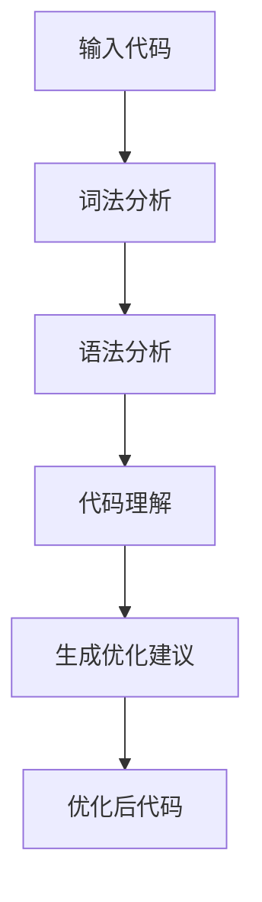
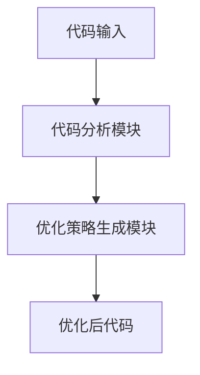
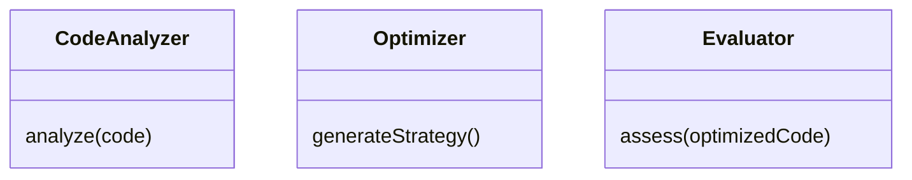
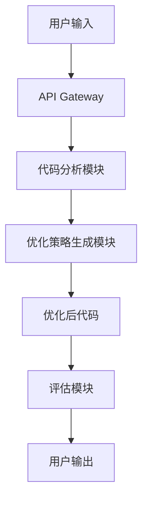
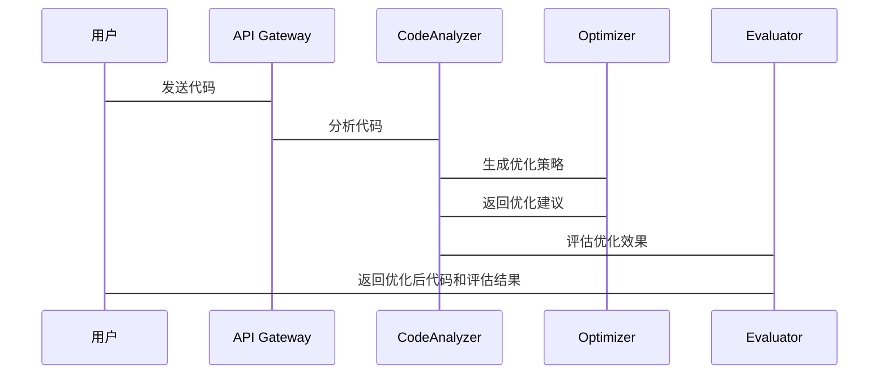

                 


# 开发具有多语言代码优化能力的AI Agent

> 关键词：AI Agent，多语言代码优化，深度学习，代码分析，优化算法，系统架构

> 摘要：随着软件开发的复杂性不断提高，多语言代码优化变得越来越重要。本文将详细介绍如何开发一个具有多语言代码优化能力的AI Agent，涵盖从背景介绍到系统架构设计的各个方面，包括核心概念、算法原理、系统架构、项目实战和最佳实践。

---

# 第一部分: AI Agent与多语言代码优化概述

## 第1章: AI Agent与多语言代码优化的背景与概念

### 1.1 AI Agent的基本概念

#### 1.1.1 AI Agent的定义与特点
- **定义**：AI Agent（人工智能代理）是指能够感知环境、自主决策并执行任务的智能实体。
- **特点**：
  - **自主性**：无需外部干预，自主完成任务。
  - **反应性**：能够实时感知环境并做出反应。
  - **目标导向**：具有明确的目标，优化行为以达到目标。

#### 1.1.2 多语言代码优化的必要性
- **背景**：现代软件开发中，项目可能涉及多种编程语言，如Python、Java、C++等，优化代码需要兼顾不同语言的特点。
- **挑战**：不同语言的语法、语义和优化规则差异大，传统优化工具难以覆盖多种语言。

#### 1.1.3 AI Agent在代码优化中的作用
- **自动化**：AI Agent可以自动分析代码并提出优化建议。
- **智能化**：通过深度学习等技术，AI Agent能够理解代码语义，提出更精准的优化方案。

### 1.2 多语言代码优化的背景与挑战

#### 1.2.1 多语言开发的现状
- **现状**：现代项目常采用多种编程语言，以满足不同的需求和场景。
- **挑战**：不同语言的优化规则不同，传统的单语言优化工具难以扩展到多语言。

#### 1.2.2 代码优化的痛点与难点
- **痛点**：优化代码需要人工干预，耗时且容易出错。
- **难点**：不同语言的语法和语义差异，增加了优化的复杂性。

#### 1.2.3 AI技术在代码优化中的应用前景
- **前景**：AI技术可以帮助解决多语言代码优化中的复杂问题，提高开发效率和代码质量。

---

# 第二部分: AI Agent的核心概念与技术原理

## 第2章: AI Agent的设计与实现原理

### 2.1 AI Agent的核心设计原则

#### 2.1.1 模块化设计
- **模块化设计**：将AI Agent分解为多个功能模块，如代码分析模块、优化策略生成模块等。
- **优势**：便于维护和扩展。

#### 2.1.2 可扩展性设计
- **可扩展性**：设计时考虑未来可能的扩展需求，如支持更多编程语言。
- **实现**：通过插件机制或模块化接口实现。

#### 2.1.3 高效性与准确性平衡
- **高效性**：优化算法需要高效执行，减少计算时间。
- **准确性**：优化建议需要准确无误，避免引入新问题。

### 2.2 多语言代码优化的策略与方法

#### 2.2.1 基于规则的优化策略
- **规则库**：预定义优化规则，如消除无用变量、合并重复代码。
- **优点**：简单易实现，适用于规则明确的场景。
- **缺点**：难以处理复杂语义问题。

#### 2.2.2 基于模式识别的优化方法
- **模式识别**：通过模式匹配识别代码中的优化机会。
- **实现**：使用正则表达式或语法树匹配特定模式。
- **优点**：能够处理复杂语法结构。

#### 2.2.3 基于上下文理解的优化技术
- **上下文理解**：通过上下文分析代码语义，提出更精准的优化建议。
- **技术**：利用自然语言处理技术分析代码注释和变量命名。
- **优点**：优化建议更贴合实际需求。

### 2.3 AI Agent的优化任务分解

#### 2.3.1 代码分析与理解
- **词法分析**：将代码分解为词法单元。
- **语法分析**：分析代码的语法结构。
- **语义分析**：理解代码的语义和意图。

#### 2.3.2 优化建议生成
- **基于规则的建议生成**：根据预定义规则生成优化建议。
- **基于学习的建议生成**：利用机器学习模型生成优化建议。
- **混合方法**：结合规则和学习方法生成优化建议。

#### 2.3.3 优化效果评估
- **评估指标**：代码执行时间、资源消耗、代码复杂度等。
- **评估方法**：对比优化前后的代码，量化优化效果。

### 2.4 本章小结
本章介绍了AI Agent的核心设计原则和多语言代码优化的策略与方法，强调了高效性与准确性平衡的重要性。

---

# 第三部分: AI Agent的算法与数学模型

## 第3章: 多语言代码优化的算法原理

### 3.1 基于深度学习的代码分析算法

#### 3.1.1 Transformer模型在代码分析中的应用
- **Transformer模型**：广泛应用于自然语言处理，具有强大的序列建模能力。
- **代码分析**：通过将代码转换为序列，利用Transformer模型进行分析。

#### 3.1.2 编码器-解码器结构
- **编码器**：将代码输入转换为上下文向量。
- **解码器**：根据上下文生成优化后的代码。
- **实现**：使用开源框架如TensorFlow或PyTorch实现。

#### 3.1.3 注意力机制在代码优化中的应用
- **注意力机制**：在代码分析中，注意力机制可以识别关键代码片段。
- **优势**：能够聚焦于重要的代码部分，提高优化准确性。

### 3.2 优化算法的数学模型

#### 3.2.1 基于梯度下降的优化算法
- **梯度下降**：优化算法中常用的方法。
- **数学模型**：
  $$ \text{更新参数} = \theta - \eta \cdot \nabla J(\theta) $$
  其中，$\theta$是参数，$\eta$是学习率，$\nabla J(\theta)$是目标函数的梯度。

#### 3.2.2 基于强化学习的优化模型
- **强化学习**：通过奖励机制训练优化策略。
- **数学模型**：
  $$ R(s, a) = r_1 + r_2 + \cdots + r_n $$
  其中，$R$是奖励函数，$s$是状态，$a$是动作。

#### 3.2.3 混合优化模型
- **混合模型**：结合规则和学习方法的优化模型。
- **优势**：能够同时利用规则和数据驱动的优势。

### 3.3 算法实现的mermaid流程图


### 3.4 数学公式与详细讲解
#### 3.4.1 梯度下降公式
$$ \text{更新参数} = \theta - \eta \cdot \nabla J(\theta) $$
- $\theta$：模型参数。
- $\eta$：学习率，控制更新步长。
- $\nabla J(\theta)$：目标函数$J$对$\theta$的梯度。

#### 3.4.2 强化学习奖励函数
$$ R(s, a) = r_1 + r_2 + \cdots + r_n $$
- $R$：奖励函数。
- $s$：当前状态。
- $a$：执行的动作。
- $r_i$：每一步的奖励值。

### 3.5 本章小结
本章详细讲解了基于深度学习的代码分析算法和优化算法的数学模型，重点介绍了Transformer模型和强化学习在代码优化中的应用。

---

# 第四部分: AI Agent的系统架构与设计

## 第4章: 多语言代码优化系统的架构设计

### 4.1 系统模块划分

#### 4.1.1 代码分析模块
- **功能**：对输入代码进行词法、语法和语义分析。
- **实现**：使用ANTLR等工具生成解析器。

#### 4.1.2 优化策略生成模块
- **功能**：根据分析结果生成优化策略。
- **实现**：结合规则库和机器学习模型生成优化建议。

#### 4.1.3 优化效果评估模块
- **功能**：评估优化后的代码效果。
- **实现**：对比优化前后的代码性能指标。

### 4.2 系统组件交互关系


### 4.3 系统功能设计

#### 4.3.1 领域模型设计


#### 4.3.2 系统架构设计


### 4.4 系统接口设计
- **输入接口**：接收多语言代码输入。
- **输出接口**：输出优化后的代码和评估结果。

### 4.5 系统交互mermaid序列图


### 4.6 本章小结
本章详细介绍了多语言代码优化系统的架构设计，包括模块划分、组件交互和系统架构图。

---

# 第五部分: 项目实战与优化

## 第5章: 多语言代码优化项目实战

### 5.1 环境配置

#### 5.1.1 安装依赖
- **Python**：3.8+
- **TensorFlow**：2.5+
- **ANTLR**：1.5+

#### 5.1.2 安装命令
```bash
pip install tensorflow antlr4
```

### 5.2 核心实现

#### 5.2.1 代码分析模块实现
```python
def analyze_code(code):
    # 词法分析
    lexer = Lexer(code)
    tokens = lexer.tokenize()
    # 语法分析
    parser = Parser(tokens)
    ast = parser.parse()
    return ast
```

#### 5.2.2 优化策略生成模块实现
```python
def generate_strategy(ast):
    # 基于规则的优化
    rules = [
        ('消除无用变量', optimize_remove_useless_vars),
        ('合并重复代码', optimize_merge_redundant_code),
    ]
    optimized_ast = ast
    for rule_name, rule in rules:
        optimized_ast = rule(optimized_ast)
    return optimized_ast
```

#### 5.2.3 优化效果评估模块实现
```python
def assess(optimized_code, original_code):
    # 评估指标：执行时间、资源消耗
    metrics = {}
    # 执行优化后代码
    run_optimized = execute(optimized_code)
    # 执行原始代码
    run_original = execute(original_code)
    metrics['execution_time'] = run_optimized['time'] / run_original['time']
    metrics['memory_usage'] = run_optimized['memory'] / run_original['memory']
    return metrics
```

### 5.3 代码应用解读与分析

#### 5.3.1 案例分析
- **案例1**：优化Python代码中的循环嵌套。
- **案例2**：优化Java中的对象创建。

#### 5.3.2 优化前后对比
- **代码复杂度**：优化后代码复杂度降低。
- **执行效率**：优化后代码执行时间减少。

### 5.4 项目小结
本章通过实际项目展示了多语言代码优化的具体实现，包括环境配置、代码分析、优化策略生成和效果评估。

---

# 第六部分: 最佳实践与总结

## 第6章: 最佳实践与总结

### 6.1 最佳实践 tips
1. **模块化设计**：确保系统模块化，便于维护和扩展。
2. **混合优化策略**：结合规则和学习方法，提高优化效果。
3. **性能优化**：优化算法效率，减少计算时间。
4. **持续学习**：利用反馈机制，不断优化模型。

### 6.2 总结
本文详细介绍了开发具有多语言代码优化能力的AI Agent的各个方面，包括核心概念、算法原理、系统架构和项目实战。通过本文的学习，读者可以掌握AI Agent在多语言代码优化中的应用方法。

### 6.3 注意事项
- **数据质量**：优化算法依赖高质量的训练数据。
- **模型可解释性**：确保优化建议可解释，便于调试和优化。

### 6.4 拓展阅读
- **推荐书籍**：《深度学习实战》、《自然语言处理入门》。
- **推荐论文**：相关领域的最新研究论文。

---

# 作者

作者：AI天才研究院/AI Genius Institute & 禅与计算机程序设计艺术 /Zen And The Art of Computer Programming

