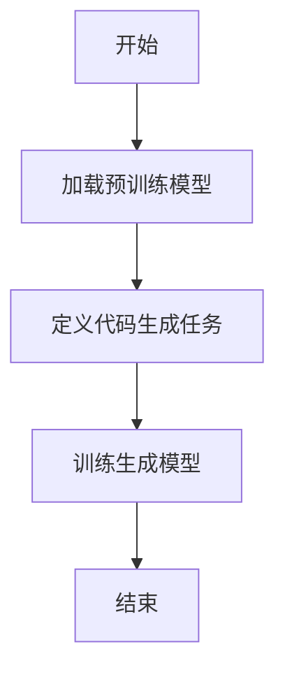
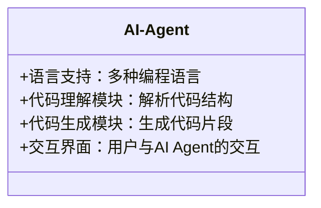
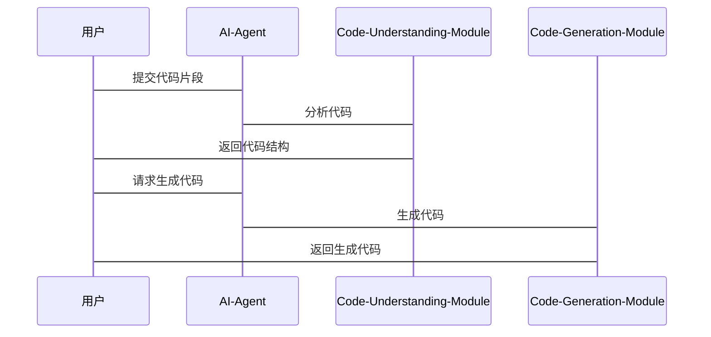

                 


# 开发具有多语言代码理解与生成能力的AI Agent

> 关键词：AI Agent，多语言代码理解，代码生成，自然语言处理，机器学习，软件工程

> 摘要：本文详细探讨了开发具有多语言代码理解与生成能力的AI Agent的技术挑战、解决方案和实现方法。文章从背景介绍、核心概念、算法原理、系统架构设计、项目实战等多个维度展开，深入分析了AI Agent在代码理解与生成中的应用，结合具体案例和数学模型，为读者提供了全面的技术指导。

---

# 第1章: AI Agent与多语言代码理解概述

## 1.1 AI Agent的基本概念

### 1.1.1 AI Agent的定义
AI Agent（人工智能代理）是指能够感知环境、执行任务并做出决策的智能实体。它可以是一个软件程序，也可以是一个硬件设备，其核心目标是通过与环境交互来实现特定目标。在软件开发领域，AI Agent通常用于辅助开发人员完成代码分析、生成、优化等任务。

### 1.1.2 多语言代码理解的必要性
现代软件开发中，项目往往涉及多种编程语言，如Python、Java、C++等。AI Agent需要能够理解并处理多种语言的代码，以提供跨语言的支持和服务。例如，一个AI Agent可能需要理解Python代码的结构，并将其转换为Java代码。

### 1.1.3 AI Agent在软件开发中的应用场景
AI Agent在软件开发中的应用场景广泛，包括代码生成、错误检测、代码重构、性能优化等。例如，AI Agent可以帮助开发人员自动生成函数实现，或者检测代码中的潜在错误。

## 1.2 多语言代码理解的核心问题

### 1.2.1 代码结构的复杂性
不同编程语言的语法和语义差异较大，导致代码结构的复杂性。例如，Python的动态类型与Java的静态类型差异显著，AI Agent需要能够处理这些差异。

### 1.2.2 不同编程语言的特点与差异
每种编程语言都有其独特的特点和语法结构。例如，C++支持模板和指针，而Python支持动态类型和简洁的语法。AI Agent需要理解这些特点，才能准确地进行代码分析和生成。

### 1.2.3 跨语言代码理解的挑战
跨语言代码理解的挑战主要体现在如何统一不同语言的代码表示，以及如何在不同语言之间建立语义映射。这需要AI Agent具备强大的跨语言语义分析能力。

---

## 1.3 本章小结
本章介绍了AI Agent的基本概念，强调了多语言代码理解的重要性，并分析了跨语言代码理解的核心问题和挑战。下一章将从数学模型和算法的角度，详细探讨多语言代码理解的实现方法。

---

# 第2章: 多语言代码理解的数学模型

## 2.1 代码表示的向量化方法

### 2.1.1 词嵌入与代码片段表示
词嵌入是一种将词语表示为低维向量的方法，常用于自然语言处理。在代码理解中，我们可以将代码片段（如函数、语句）表示为向量，以便进行后续处理。

### 2.1.2 基于上下文的代码向量化模型
上下文是代码理解的重要因素。例如，函数调用的上下文包括调用栈、变量作用域等。基于上下文的代码向量化模型需要考虑这些因素，以生成更准确的代码表示。

### 2.1.3 跨语言代码表示的统一性
为了实现跨语言代码理解，我们需要将不同语言的代码表示统一到一个共同的向量空间中。这可以通过跨语言预训练模型来实现。

## 2.2 代码生成的数学模型

### 2.2.1 基于生成模型的代码生成
生成模型（如GPT）可以用于代码生成。通过训练大量代码数据，生成模型可以学习代码的语法和语义，从而生成新的代码片段。

### 2.2.2 基于概率分布的语言模型
语言模型通过概率分布来预测下一个字符或语句。在代码生成中，我们需要调整语言模型的参数，以适应代码的特殊语法结构。

### 2.2.3 跨语言代码生成的挑战
跨语言代码生成需要考虑目标语言的语法和语义。例如，将Python代码生成为Java代码时，需要处理类型系统和语法结构的差异。

---

## 2.3 算法原理的数学公式

### 2.3.1 代码表示的向量化公式
代码片段的向量表示可以通过词嵌入模型生成，例如：

$$ E(word) = \sum_{i=1}^{n} w_i \cdot e_i $$

其中，$w_i$ 是词的权重，$e_i$ 是词的嵌入向量。

### 2.3.2 代码生成的概率模型
代码生成的概率模型可以表示为：

$$ P(code) = \prod_{i=1}^{n} P(word_i | context) $$

其中，$context$ 是代码生成的上下文。

---

## 2.4 本章小结
本章从数学模型的角度，探讨了代码表示和生成的方法。通过词嵌入和概率模型，我们可以实现代码的向量化表示和生成。下一章将从算法实现的角度，深入探讨多语言代码生成的实现细节。

---

# 第3章: 跨语言代码生成的算法实现

## 3.1 基于预训练模型的代码生成

### 3.1.1 预训练模型的结构与特点
预训练模型（如BERT、GPT）具有强大的语义理解和生成能力。通过预训练，模型可以学习代码的语法和语义。

### 3.1.2 代码生成的微调策略
为了提高代码生成的准确性，我们需要对预训练模型进行微调。微调的目标是使模型适应代码生成的任务。

### 3.1.3 跨语言模型的适应性调整
跨语言模型需要在不同语言之间进行调整。例如，可以通过多语言预训练模型来实现跨语言生成。

## 3.2 基于生成对抗网络的代码生成

### 3.2.1 GAN的基本原理
生成对抗网络（GAN）由生成器和判别器组成。生成器负责生成代码片段，判别器负责判断生成的代码是否真实。

### 3.2.2 在代码生成中的应用
GAN可以用于生成高质量的代码。生成器通过不断优化生成的代码，以欺骗判别器。

### 3.2.3 跨语言生成的改进方法
为了实现跨语言生成，可以通过多语言预训练模型来初始化生成器和判别器的参数。

---

## 3.3 算法实现的流程图



---

## 3.4 本章小结
本章详细探讨了代码生成的算法实现，包括基于预训练模型和生成对抗网络的方法。通过这些方法，我们可以实现跨语言代码生成。下一章将从系统架构设计的角度，探讨AI Agent的整体实现方案。

---

# 第4章: 系统架构设计与实现

## 4.1 项目背景与目标

### 4.1.1 项目背景
本项目的目标是开发一个具有多语言代码理解与生成能力的AI Agent，能够帮助开发人员完成代码分析、生成和优化任务。

### 4.1.2 项目目标
- 实现多语言代码理解功能。
- 实现代码生成功能。
- 提供用户友好的交互界面。

---

## 4.2 系统功能设计

### 4.2.1 领域模型


---

## 4.3 系统架构设计


---

## 4.4 接口设计

### 4.4.1 API接口
AI Agent提供以下API接口：
- `analyze_code(code: str, language: str) -> dict`
- `generate_code(spec: dict, language: str) -> str`

---

## 4.5 交互设计



---

## 4.6 本章小结
本章从系统架构设计的角度，详细探讨了AI Agent的整体实现方案。通过领域模型和架构图，我们可以清晰地了解系统的结构和功能模块。下一章将通过一个具体案例，展示AI Agent的实现过程。

---

# 第5章: 项目实战——一个多语言代码生成器

## 5.1 环境安装

### 5.1.1 安装Python
```bash
python --version
pip install --upgrade pip
```

### 5.1.2 安装机器学习库
```bash
pip install numpy pandas scikit-learn
```

---

## 5.2 核心代码实现

### 5.2.1 代码理解模块
```python
def parse_code(code: str, language: str) -> dict:
    # 根据语言选择解析器
    if language == 'python':
        return parse_python(code)
    elif language == 'java':
        return parse_java(code)
    else:
        raise ValueError("Unsupported language")
```

### 5.2.2 代码生成模块
```python
def generate_code(spec: dict, language: str) -> str:
    # 根据语言生成代码
    if language == 'python':
        return generate_python(spec)
    elif language == 'java':
        return generate_java(spec)
    else:
        raise ValueError("Unsupported language")
```

---

## 5.3 案例分析

### 5.3.1 输入代码片段
```python
def add(a, b):
    return a + b
```

### 5.3.2 分析结果
```json
{
    "function_name": "add",
    "parameters": ["a", "b"],
    "return_type": "int",
    "body": "return a + b;"
}
```

### 5.3.3 生成Java代码
```java
public int add(int a, int b) {
    return a + b;
}
```

---

## 5.4 项目总结
本章通过一个具体案例，展示了AI Agent的实现过程。通过代码理解模块和生成模块，我们可以实现多语言代码的分析和生成。下一章将总结开发过程中的一些经验和最佳实践。

---

# 第6章: 高级应用与未来趋势

## 6.1 高级应用

### 6.1.1 代码优化
AI Agent可以通过分析代码结构，提出优化建议，例如性能优化、代码重构等。

### 6.1.2 代码测试
AI Agent可以自动生成测试用例，帮助开发人员进行代码测试。

### 6.1.3 跨语言迁移
AI Agent可以将一种语言的代码迁移到另一种语言，例如将Python代码迁移到Java。

---

## 6.2 未来趋势

### 6.2.1 多模态代码理解
未来的AI Agent将具备多模态理解能力，能够同时处理代码、文档和注释等信息。

### 6.2.2 更强的代码生成能力
随着模型的改进，AI Agent的代码生成能力将越来越接近人类水平。

### 6.2.3 跨语言协作
AI Agent将支持更多的编程语言，并实现更高效的跨语言协作。

---

## 6.3 本章小结
本章探讨了AI Agent的高级应用和未来发展趋势。随着技术的进步，AI Agent将在软件开发中发挥越来越重要的作用。

---

# 第7章: 最佳实践与注意事项

## 7.1 最佳实践

### 7.1.1 模型训练
- 使用高质量的代码数据进行训练。
- 定期更新模型，以适应新的编程语言和语法。

### 7.1.2 系统设计
- 模块化设计，便于扩展和维护。
- 提供良好的交互界面，提高用户体验。

---

## 7.2 注意事项

### 7.2.1 模型的泛化能力
AI Agent需要具备良好的泛化能力，能够处理未见过的代码和语言。

### 7.2.2 安全性
AI Agent需要确保生成的代码符合安全规范，避免潜在的安全漏洞。

---

## 7.3 本章小结
本章总结了开发AI Agent时的最佳实践和注意事项，帮助读者在实际开发中避免常见问题。

---

# 第8章: 总结与展望

## 8.1 总结
本文详细探讨了开发具有多语言代码理解与生成能力的AI Agent的技术挑战和解决方案。通过数学模型、算法实现和系统架构设计，我们展示了AI Agent的实现过程。

## 8.2 展望
未来，随着AI技术的进步，AI Agent将在软件开发中发挥更重要的作用。我们需要不断优化模型，提高代码理解与生成的准确性。

---

# 作者：AI天才研究院/AI Genius Institute & 禅与计算机程序设计艺术 /Zen And The Art of Computer Programming

---

以上是关于《开发具有多语言代码理解与生成能力的AI Agent》的技术博客文章的完整目录和内容概述。

