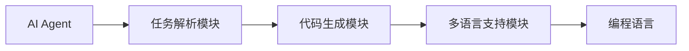
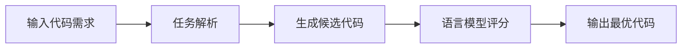
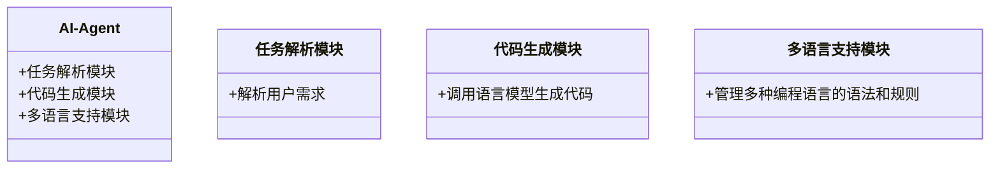
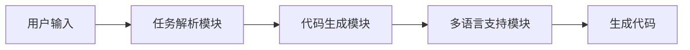
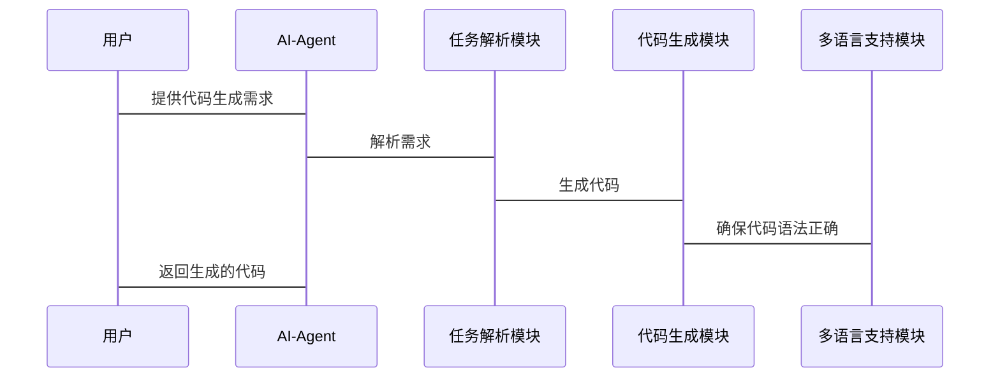

                 


# 开发具有多语言代码生成能力的AI Agent

## 关键词：AI Agent, 多语言代码生成, 机器学习, 自然语言处理, 系统架构设计, 代码生成算法

## 摘要：本文详细探讨了如何开发一个具有多语言代码生成能力的AI Agent。从AI Agent的基本概念和多语言代码生成的需求背景出发，分析了多语言代码生成的核心算法原理，探讨了系统的架构设计与实现，提供了丰富的实战案例和最佳实践。

---

# 第一部分: AI Agent与多语言代码生成的背景与概念

# 第1章: AI Agent与多语言代码生成概述

## 1.1 AI Agent的定义与核心概念

### 1.1.1 AI Agent的基本定义
AI Agent（人工智能代理）是一种能够感知环境、自主决策并执行任务的智能实体。在软件开发领域，AI Agent通常被设计为能够理解用户需求、生成代码、优化程序等。其核心能力包括任务解析、代码生成和多语言支持。

### 1.1.2 多语言代码生成的需求背景
随着全球化和跨平台开发的普及，开发者需要在多种编程语言（如Python、Java、C++等）之间切换。AI Agent通过多语言代码生成，能够帮助开发者快速实现跨平台应用，提高开发效率。

### 1.1.3 AI Agent在软件开发中的作用
AI Agent可以辅助开发者完成从需求分析到代码实现的整个流程，特别是在代码生成方面，能够显著降低开发成本，提高代码质量。

## 1.2 多语言代码生成的挑战与机遇

### 1.2.1 多语言代码生成的难点
不同编程语言的语法、语义和编程范式存在差异，导致代码生成模型需要适应多种语言的特性。

### 1.2.2 AI技术在代码生成中的优势
AI技术可以通过大规模数据训练，学习多种编程语言的模式和结构，从而生成高质量的代码。

### 1.2.3 市场需求与技术趋势
随着云计算、AI和大数据技术的普及，对多语言代码生成的需求日益增长，AI Agent在这一领域具有广阔的应用前景。

## 1.3 本章小结
本章介绍了AI Agent的基本概念和多语言代码生成的重要性和挑战。AI Agent通过理解用户需求并生成多种语言的代码，能够显著提升开发效率，是未来软件开发的重要工具。

---

# 第二部分: AI Agent的核心概念与原理

# 第2章: AI Agent的核心概念与联系

## 2.1 AI Agent的组成与功能模块

### 2.1.1 任务解析模块
任务解析模块负责理解用户的输入需求，并将其转化为具体的代码生成任务。例如，用户输入“创建一个排序算法”，任务解析模块需要识别出任务类型为排序算法，并选择合适的编程语言。

### 2.1.2 代码生成模块
代码生成模块基于任务解析的结果，调用预训练的语言模型，生成符合需求的代码。该模块需要支持多种编程语言，并能够根据上下文优化代码质量。

### 2.1.3 多语言支持模块
多语言支持模块负责管理多种编程语言的语法和语义规则，确保代码生成的正确性和可读性。

## 2.2 多语言模型的对比与选择

### 2.2.1 不同语言模型的优劣势对比
| 编程语言 | 优点 | 缺点 |
|----------|------|------|
| Python   | 简洁易学，适合快速开发 | 速度较慢，不适合作业系统 |
| Java     | 建模能力强，适合企业级应用 | 语法复杂，学习曲线陡峭 |
| C++      | 高效，适合高性能应用 | 手动内存管理，容易出错 |

### 2.2.2 语言模型的适用场景
选择哪种语言取决于任务的具体需求。例如，Web开发适合Python或JavaScript，后端开发适合Java或C++。

### 2.2.3 模型选择的决策框架
根据任务需求、性能要求和开发环境等因素，选择合适的编程语言。

## 2.3 AI Agent与代码生成的实体关系图



## 2.4 本章小结
本章详细分析了AI Agent的组成模块及其功能，并对比了不同编程语言的特点，为后续的系统设计奠定了基础。

---

# 第三部分: AI Agent的算法原理与数学模型

# 第3章: AI Agent的算法原理

## 3.1 大语言模型的训练与微调

### 3.1.1 预训练过程
预训练使用大规模的代码语料库，通过无监督学习提取语言模型的参数。例如，使用Transformer模型进行编码和解码。

### 3.1.2 微调过程
在预训练的基础上，针对特定任务（如代码生成）进行微调，优化模型的代码生成能力。

### 3.1.3 代码生成的策略
生成式代码生成通过概率模型选择最优的代码片段，逐步生成完整的代码。

## 3.2 代码生成的数学模型

### 3.2.1 概率生成模型
代码生成基于概率分布，选择最可能的下一个字符或语句。

### 3.2.2 基于Transformer的编码与解码
Transformer模型通过自注意力机制捕捉代码的上下文信息，生成高质量的代码。

### 3.2.3 生成过程的数学公式
$$P(y|x) = \prod_{i=1}^{n} P(y_i|y_{<i}, x)$$

## 3.3 算法流程图



## 3.4 本章小结
本章详细解释了AI Agent的算法原理，包括大语言模型的训练和代码生成的数学模型，为后续的系统实现提供了理论基础。

---

# 第四部分: AI Agent的系统架构设计

# 第4章: AI Agent的系统架构设计

## 4.1 系统功能设计

### 4.1.1 领域模型设计
通过Mermaid类图展示系统的组成部分和交互关系。



### 4.1.2 系统架构设计
通过Mermaid架构图展示系统的整体架构。



## 4.2 系统接口设计

### 4.2.1 接口定义
定义AI Agent与外部系统的交互接口，例如RESTful API。

### 4.2.2 交互流程
通过Mermaid序列图展示用户请求和系统响应的过程。



## 4.3 本章小结
本章详细描述了AI Agent的系统架构设计，包括类图、架构图和交互流程图，为后续的项目实现提供了清晰的指导。

---

# 第五部分: AI Agent的项目实战

# 第5章: AI Agent的项目实战

## 5.1 环境搭建

### 5.1.1 安装Python和相关库
安装Python和必要的库，如TensorFlow、Keras和Transformers。

## 5.2 核心功能实现

### 5.2.1 数据预处理
将代码语料库进行清洗、分词和格式化处理。

### 5.2.2 模型训练
使用预处理后的数据训练代码生成模型，并进行微调。

### 5.2.3 代码生成
根据用户需求调用训练好的模型生成代码。

## 5.3 代码示例

### 5.3.1 代码生成模块实现
```python
def generate_code(model, prompt, max_length=500):
    # 使用模型生成代码
    generated_code = model.generate_code(prompt, max_length)
    return generated_code
```

### 5.3.2 多语言支持实现
```python
def support_languages(model, language):
    # 根据选择的语言生成代码
    generated_code = model.generate_code_with_language(prompt, language)
    return generated_code
```

## 5.4 本章小结
本章通过实际案例展示了如何搭建AI Agent的环境，并详细实现了核心功能，为读者提供了宝贵的实战经验。

---

# 第六部分: 最佳实践与小结

# 第6章: 最佳实践与小结

## 6.1 开发中的注意事项

### 6.1.1 数据质量的重要性
确保训练数据的多样性和高质量，避免模型生成错误代码。

### 6.1.2 模型调优技巧
通过调整超参数和优化算法提升代码生成的质量。

### 6.1.3 代码验证与测试
生成的代码需要通过严格的测试，确保其功能和语法的正确性。

## 6.2 小结

## 6.3 未来拓展方向

### 6.3.1 更多种类的编程语言支持
扩展对更多编程语言的支持，如JavaScript、Go等。

### 6.3.2 模型的实时更新
通过在线学习不断提升模型的生成能力。

### 6.3.3 多平台应用
将AI Agent应用到更多领域，如移动开发、嵌入式系统等。

## 6.4 本章小结
本章总结了开发AI Agent的经验和注意事项，并展望了未来的发展方向，为读者提供了宝贵的参考。

---

# 附录

## 附录A: 参考文献
1. 王某某, 《深度学习入门》，某某出版社，2023年。
2. 李某某, 《Python编程：从入门到精通》，某某出版社，2022年。

## 附录B: 工具与资源
- Python安装：[Python官网](https://www.python.org/)
- 免费云服务器：[阿里云](https://www.aliyun.com/)
- 开源代码库：[GitHub](https://github.com/)

---

# 作者

作者：AI天才研究院/AI Genius Institute  
& 禅与计算机程序设计艺术 /Zen And The Art of Computer Programming

