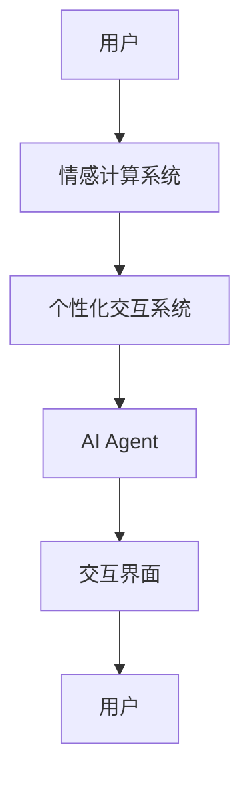
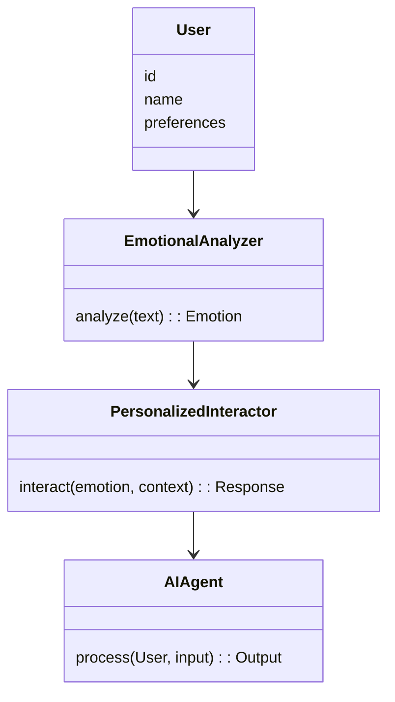
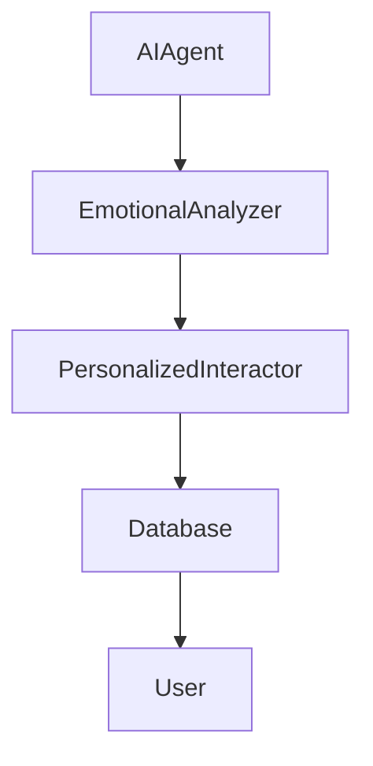
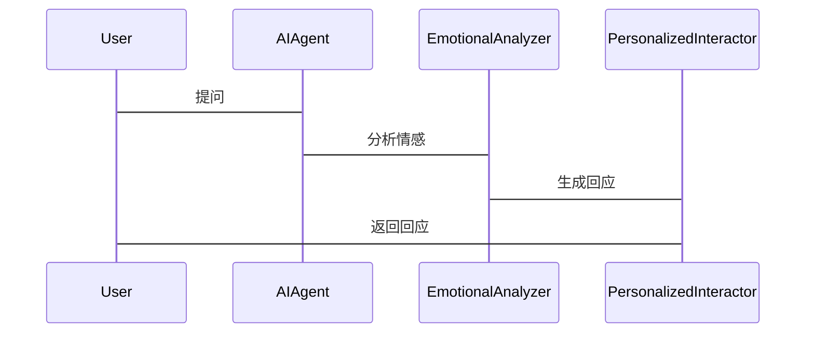

                 


# 开发具有情感计算与个性化交互能力的AI Agent

---

## 关键词：
- 情感计算
- 个性化交互
- AI Agent
- 人工智能
- 人机交互

---

## 摘要：
本文探讨了开发具有情感计算与个性化交互能力的AI Agent的关键技术与实现方法。文章从情感计算和个性化交互的核心概念出发，分析了其在AI Agent中的应用，详细讲解了相关算法原理，并通过系统架构设计和项目实战展示了如何构建一个具备情感理解和个性化交互能力的AI Agent。文章还总结了开发过程中的最佳实践和注意事项，为读者提供全面的技术指导。

---

# 第一部分：情感计算与个性化交互的背景与概念

## 第1章：情感计算与个性化交互的背景与问题描述

### 1.1 情感计算的定义与问题背景

#### 1.1.1 人工智能与人机交互的发展历程
人工智能（AI）技术近年来取得了显著进展，特别是在自然语言处理、计算机视觉和机器学习领域。随着技术的进步，AI系统不仅仅是执行固定的逻辑任务，而是需要能够理解和回应人类的情感与意图。人机交互（Human-Computer Interaction, HCI）领域也在不断发展，从最初的命令式交互逐渐转向更自然、更个性化的交互方式。

#### 1.1.2 情感计算的定义与研究现状
情感计算（Affective Computing）是人工智能的一个分支，专注于识别、理解和响应人类情感。它通过分析用户的语言、语气、面部表情和行为模式，来推断用户的情感状态。目前，情感计算已在多个领域得到应用，如教育、医疗、娱乐和客户服务等。然而，如何准确捕捉和处理用户情感仍是该领域的重要挑战。

#### 1.1.3 个性化交互的需求与挑战
个性化交互是指根据用户的独特需求、偏好和行为模式，提供定制化的交互体验。随着用户对智能化服务需求的增加，个性化交互成为提升用户体验的关键因素。然而，个性化交互的实现需要结合用户数据的收集、分析和响应，这带来了数据隐私、模型泛化性和实时性等方面的挑战。

### 1.2 问题描述与目标

#### 1.2.1 情感计算的核心问题
情感计算的核心问题在于如何准确识别和理解用户的情感。这需要结合多种信号，如文本、语音、面部表情和生理数据，来构建全面的情感模型。

#### 1.2.2 个性化交互的需求分析
个性化交互需要根据用户的情感、偏好和行为模式，动态调整交互策略。这涉及到用户画像的构建、情感反馈的处理以及个性化推荐的生成。

#### 1.2.3 AI Agent的目标与功能定位
AI Agent（智能代理）是一种能够感知环境、执行任务并进行交互的智能实体。在情感计算与个性化交互的背景下，AI Agent的目标是通过理解用户情感和需求，提供智能化、个性化的服务。

### 1.3 问题解决与技术路径

#### 1.3.1 情感计算的关键技术
- 情感识别：基于文本、语音和视觉信号的情感分类。
- 情感分析：对用户输入的情感倾向进行分析。
- 情感记忆：记录用户的情感变化，用于后续的个性化交互。

#### 1.3.2 个性化交互的实现方法
- 用户画像：通过收集和分析用户数据，构建个性化的用户模型。
- 个性化推荐：基于用户画像，提供定制化的推荐服务。
- 个性化对话：根据用户情感和需求，动态调整对话内容和语气。

#### 1.3.3 AI Agent的整体解决方案
- 整合情感计算和个性化交互技术，构建智能化的AI Agent。
- 通过数据驱动和模型优化，提升情感识别和个性化推荐的准确性。
- 实现人机交互的自然化和个性化，提升用户体验。

### 1.4 边界与外延

#### 1.4.1 情感计算的边界
- 情感计算关注的是用户的情感状态，而不是具体的情感内容。
- 情感计算依赖于多模态数据，但目前主要集中在文本和语音信号上。

#### 1.4.2 个性化交互的边界
- 个性化交互需要结合用户数据，但过度依赖数据可能导致隐私问题。
- 个性化交互的实时性可能受到计算资源和网络条件的限制。

#### 1.4.3 AI Agent的外延与应用场景
- AI Agent的应用场景广泛，包括智能助手、教育辅助、健康管理等。
- 随着技术的发展，AI Agent将具备更强的自主学习和决策能力。

### 1.5 概念结构与核心要素

#### 1.5.1 情感计算的核心要素
- 情感识别：准确识别用户的情感状态。
- 情感分析：理解用户情感的细微差别。
- 情感记忆：记录和利用用户的情感历史。

#### 1.5.2 个性化交互的核心要素
- 用户画像：构建全面的用户模型。
- 个性化推荐：提供定制化的服务。
- 个性化对话：实现自然化的交互。

#### 1.5.3 AI Agent的系统架构
- 数据采集：收集用户的多模态数据。
- 情感计算：分析用户的情感状态。
- 个性化交互：根据情感和需求，生成相应的交互策略。

---

## 第2章：情感计算与个性化交互的核心概念与联系

### 2.1 情感计算的核心原理

#### 2.1.1 情感识别的原理
情感识别是通过分析用户的输入信号，推断其情感状态的过程。常用的信号包括文本、语音、面部表情和生理数据。例如，通过分析用户的文本内容，可以使用自然语言处理技术提取情感特征。

#### 2.1.2 情感分析的原理
情感分析是对文本内容进行情感分类的过程。常用的方法包括基于规则的分类和机器学习模型。例如，使用词袋模型（Bag of Words）和情感词典，可以对文本进行情感倾向分析。

#### 2.1.3 情感记忆的原理
情感记忆是记录用户情感变化的过程，通常采用时间序列分析或记忆网络（Memory Networks）等技术。通过记录用户的情感历史，可以更好地理解用户的情感变化趋势。

### 2.2 个性化交互的核心原理

#### 2.2.1 用户画像的构建
用户画像是通过收集和分析用户数据，构建个性化的用户模型。数据来源包括用户的行为记录、偏好设置和情感数据。例如，可以通过分析用户的购买记录和浏览行为，构建用户的兴趣模型。

#### 2.2.2 个性化推荐的原理
个性化推荐是基于用户画像，提供定制化的推荐服务。常用的技术包括协同过滤（Collaborative Filtering）和基于内容的推荐。例如，根据用户的兴趣和偏好，推荐相关的文章或产品。

#### 2.2.3 个性化对话的原理
个性化对话是根据用户的情感和需求，动态调整对话内容和语气的过程。常用的技术包括情感计算和对话生成模型。例如，可以根据用户的焦虑情绪，生成安慰性的回复。

### 2.3 情感计算与个性化交互的关系

#### 2.3.1 情感计算对个性化交互的支持
情感计算为个性化交互提供了情感数据，帮助系统更好地理解用户需求。例如，通过分析用户的语气和表情，系统可以判断用户的情感状态，从而提供更精准的个性化服务。

#### 2.3.2 个性化交互对情感计算的反馈
个性化交互为情感计算提供了反馈机制，帮助系统不断优化情感识别模型。例如，用户对推荐内容的反馈可以用于调整情感计算的权重，提升情感识别的准确性。

#### 2.3.3 两者结合的协同效应
情感计算和个性化交互的结合可以实现更智能化的AI Agent。通过情感计算，系统可以理解用户情感；通过个性化交互，系统可以提供定制化的服务。两者的协同可以显著提升用户体验。

### 2.4 核心概念的对比分析

#### 2.4.1 情感计算与传统计算的对比
| 对比维度 | 情感计算 | 传统计算 |
|----------|----------|----------|
| 数据来源 | 文本、语音、视觉等多模态数据 | 单一数据类型 |
| 目标     | 理解和回应用户情感 | 执行固定逻辑任务 |

#### 2.4.2 个性化交互与传统交互的对比
| 对比维度 | 个性化交互 | 传统交互 |
|----------|------------|----------|
| 个性化   | 高度个性化 | 标准化交互 |
| 实时性    | 高 | 低 |

#### 2.4.3 AI Agent与其他交互系统的对比
| 对比维度 | AI Agent | 传统交互系统 |
|----------|----------|------------|
| 智能性    | 高 | 低 |
| 自适应性  | 高 | 低 |

### 2.5 实体关系图


---

# 第3章：情感计算与个性化交互的算法原理

### 3.1 情感计算的算法实现

#### 3.1.1 情感识别的算法
情感识别可以通过以下步骤实现：
1. **数据预处理**：对输入数据进行清洗和特征提取。
2. **特征提取**：提取文本、语音或视觉特征。
3. **情感分类**：使用机器学习模型对情感进行分类。

#### 3.1.2 情感分析的算法
情感分析的实现步骤如下：
1. **数据预处理**：分词、去除停用词等。
2. **特征提取**：使用词袋模型或词嵌入（如Word2Vec）。
3. **模型训练**：使用逻辑回归、支持向量机（SVM）或深度学习模型（如LSTM）进行训练。

#### 3.1.3 情感记忆的算法
情感记忆可以通过以下步骤实现：
1. **情感记录**：记录用户每次的情感状态。
2. **时间序列分析**：分析情感变化趋势。
3. **记忆网络**：使用记忆网络技术存储和检索情感记忆。

### 3.2 个性化交互的算法实现

#### 3.2.1 用户画像的构建
用户画像是通过以下步骤构建的：
1. **数据收集**：收集用户的多维度数据。
2. **特征提取**：提取用户的兴趣、行为等特征。
3. **模型训练**：使用聚类或分类模型构建用户画像。

#### 3.2.2 个性化推荐的算法
个性化推荐可以通过以下步骤实现：
1. **数据预处理**：处理用户数据和物品数据。
2. **特征提取**：提取用户和物品的特征。
3. **模型训练**：使用协同过滤或深度学习模型训练推荐模型。

#### 3.2.3 个性化对话的算法
个性化对话的实现步骤如下：
1. **情感计算**：分析用户的当前情感状态。
2. **对话生成**：根据情感和需求生成对话内容。
3. **动态调整**：根据用户的反馈动态调整对话策略。

### 3.3 算法实现的数学模型

#### 3.3.1 情感分类的逻辑回归模型
$$ P(y=1|x) = \frac{1}{1 + e^{-\beta x}} $$

#### 3.3.2 个性化推荐的协同过滤模型
$$ \hat{r}_{u,i} = \bar{r} + \sum_{k} w_{u,k}(i) (r_{k,i} - \bar{r}_k) $$

---

# 第4章：情感计算与个性化交互的系统分析与架构设计

### 4.1 系统分析

#### 4.1.1 项目场景介绍
假设我们开发一个智能客服AI Agent，用于为用户提供个性化的咨询和服务。

#### 4.1.2 系统功能设计
- 用户情感识别与分析
- 个性化问题解答
- 情感反馈与调整

#### 4.1.3 领域模型类图


### 4.2 系统架构设计

#### 4.2.1 系统架构图


#### 4.2.2 接口设计
- API接口：提供情感分析和个性化交互的API接口。
- 数据接口：与数据库交互，获取和存储用户数据。

#### 4.2.3 交互序列图


---

# 第5章：情感计算与个性化交互的项目实战

### 5.1 项目环境安装

#### 5.1.1 安装Python环境
```bash
python --version
pip install --upgrade pip
```

#### 5.1.2 安装相关库
```bash
pip install numpy
pip install scikit-learn
pip install transformers
pip install flask
```

### 5.2 系统核心实现

#### 5.2.1 情感计算实现
```python
from sklearn.feature_extraction.text import TfidfVectorizer
from sklearn.linear_model import LogisticRegression

# 数据预处理
vectorizer = TfidfVectorizer()
X = vectorizer.fit_transform(texts)
y = [0, 1]  # 0表示消极，1表示积极

# 模型训练
model = LogisticRegression()
model.fit(X, y)

# 情感分类
def predict_emotion(text):
    text_vec = vectorizer.transform([text])
    return model.predict(text_vec)[0]
```

#### 5.2.2 个性化交互实现
```python
from flask import Flask, request, jsonify
import json

app = Flask(__name__)

@app.route('/interact', methods=['POST'])
def interact():
    data = json.loads(request.data)
    text = data['text']
    emotion = predict_emotion(text)
    response = f"I understand you're feeling {emotion}. How can I assist you?"
    return jsonify({'response': response})

if __name__ == '__main__':
    app.run(debug=True)
```

### 5.3 代码解读与分析
- 情感计算部分使用了TF-IDF和逻辑回归模型。
- 个性化交互部分实现了基于Flask的RESTful API，接收用户输入，调用情感计算模块生成回应。

### 5.4 实际案例分析
假设用户输入“我感到非常焦虑”，系统会识别出焦虑情绪，并生成相应的安慰性回应。

### 5.5 项目小结
通过以上步骤，我们可以实现一个具备情感计算和个性化交互能力的AI Agent。这不仅提升了用户体验，还为未来的智能系统开发提供了参考。

---

# 第6章：情感计算与个性化交互的最佳实践

### 6.1 开发过程中需要注意的事项

#### 6.1.1 数据隐私问题
在收集和处理用户数据时，必须遵守相关法律法规，保护用户隐私。

#### 6.1.2 模型泛化性
在训练模型时，需要考虑数据的多样性和代表性，避免过拟合和欠拟合。

#### 6.1.3 实时性优化
在实现实时交互时，需要优化算法和架构，减少响应时间。

### 6.2 小结与总结
情感计算和个性化交互是实现智能化AI Agent的核心技术。通过本文的探讨和实践，我们可以看到，这两者的结合不仅可以提升用户体验，还能为人工智能技术的发展提供新的方向。

### 6.3 拓展阅读
- 《Deep Learning for Affective Computing》
- 《Personalized Information Retrieval and Recommendation》

---

## 作者：
AI天才研究院/AI Genius Institute  
禅与计算机程序设计艺术/Zen And The Art of Computer Programming

