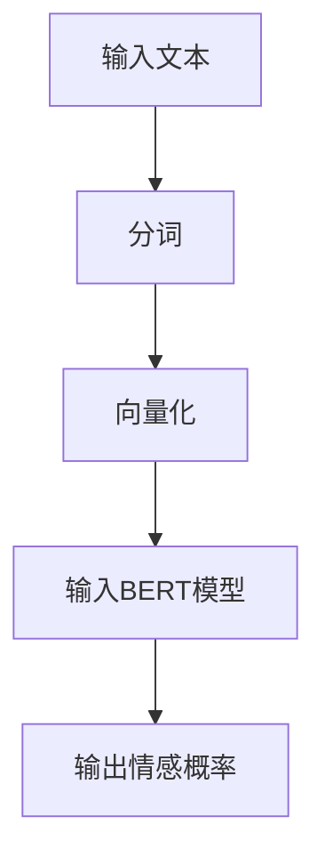
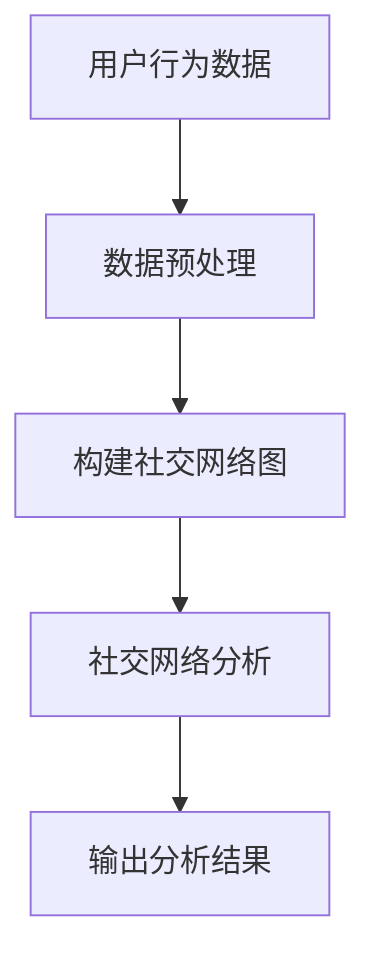

                 


# 开发具有情感计算与社交能力的AI Agent

## 关键词：情感计算、社交能力、AI Agent、深度学习、自然语言处理、人机交互、机器学习

## 摘要：  
本文系统地探讨了如何开发具有情感计算与社交能力的AI Agent。首先，介绍了情感计算和社交能力的基本概念及其在AI Agent中的重要性。接着，深入分析了情感计算的核心原理，包括情感识别、情感分析和情感生成的算法与技术。然后，详细阐述了社交能力的实现方法，包括社交网络分析、对话管理和协作能力的构建。最后，结合实际项目，展示了如何将情感计算与社交能力技术应用于AI Agent的开发中，并提出了未来的发展方向和建议。

---

# 第1章 情感计算与社交能力AI Agent概述

## 1.1 情感计算与社交能力的基本概念

### 1.1.1 情感计算的定义与核心概念
情感计算（Affective Computing）是指能够识别、理解和响应人类情感的计算技术。其核心概念包括：
1. **情感识别**：通过语音、面部表情、文本等输入数据，识别用户的情感状态。
2. **情感分析**：对文本或语音进行情感极性分析，判断情感是正面、负面还是中性。
3. **情感生成**：根据输入的情感信息，生成相应的情感表达，如语气、表情或语言风格。

### 1.1.2 社交能力在AI Agent中的作用
社交能力是指AI Agent在与人类或其他智能体交互时，能够理解、适应和协调社交行为的能力。其主要作用包括：
1. **社交网络分析**：通过分析社交网络的结构，识别关键人物和关系。
2. **对话管理**：通过自然语言处理技术，实现流畅的对话交互。
3. **协作能力**：在多人协作场景中，协调各方行动，达成共同目标。

### 1.1.3 情感计算与社交能力的关联性
情感计算与社交能力密切相关。情感计算为AI Agent提供了理解用户情感的能力，而社交能力则使其能够在复杂的社交环境中灵活应对。两者的结合能够显著提升AI Agent的智能化水平和用户体验。

---

## 1.2 AI Agent的发展背景与现状

### 1.2.1 AI Agent的定义与分类
AI Agent是指具有智能行为的实体，能够感知环境、自主决策并执行任务。根据功能和应用场景的不同，AI Agent可以分为：
1. **简单反射型Agent**：基于预设规则执行任务，适用于简单场景。
2. **基于模型的反射型Agent**：通过构建环境模型进行决策，适用于复杂场景。
3. **目标驱动型Agent**：以特定目标为导向，自主规划行动。
4. **实用驱动型Agent**：通过效用函数优化决策，追求最大效用。

### 1.2.2 情感计算在AI Agent中的应用背景
随着人机交互的普及，用户对AI Agent的情感化需求日益增长。情感计算为AI Agent赋予了理解用户情感的能力，使其能够提供更贴心的服务。例如，在智能音箱、虚拟助手等领域，情感计算能够显著提升用户体验。

### 1.2.3 当前AI Agent在社交领域的应用现状
目前，AI Agent在社交领域的应用主要集中在以下几个方面：
1. **社交媒体分析**：通过情感计算分析社交媒体上的用户情感，帮助企业进行市场调研。
2. **智能客服**：通过情感计算识别用户情绪，提供更个性化的服务。
3. **社交机器人**：用于社交网络上的自动化互动，如自动回复、内容推荐等。

---

## 1.3 本书的核心目标与内容框架

### 1.3.1 开发具有情感计算与社交能力的AI Agent的目标
本书旨在帮助读者掌握开发具有情感计算与社交能力的AI Agent的核心技术，包括情感计算算法、社交能力构建方法以及两者的结合应用。

### 1.3.2 本书的主要内容框架
本书将从理论到实践，系统地介绍情感计算与社交能力的核心概念、算法实现和系统设计。主要内容包括：
1. 情感计算的核心原理与技术。
2. 社交能力的实现方法与应用场景。
3. 情感计算与社交能力的结合与优化。
4. 实际项目中的技术实现与案例分析。

### 1.3.3 本书的读者对象与学习方法
本书适合对AI Agent、情感计算和自然语言处理感兴趣的读者，尤其是从事人工智能研发的工程师和研究人员。建议读者在阅读本书时，结合实际项目进行实践，以更好地理解和掌握相关技术。

---

## 1.4 小结
本章从情感计算与社交能力的基本概念出发，介绍了AI Agent的发展背景与现状，并明确了本书的核心目标与内容框架。接下来，我们将深入探讨情感计算的核心原理与技术。

---

# 第2章 情感计算的核心原理

## 2.1 情感计算的基本原理

### 2.1.1 情感识别的数学模型
情感识别可以通过多种方式进行，其中基于文本的情感识别是目前研究的热点。常用的情感识别模型包括：
1. **基于词袋模型（Bag-of-Words, BoW）**：通过统计文本中情感词汇的出现频率，判断情感倾向。
2. **基于词嵌入（Word Embedding）**：如Word2Vec、GloVe等，将词语映射为低维向量，捕捉词语语义信息。
3. **基于深度学习的模型**：如LSTM、BERT等，能够捕捉文本的情感信息。

以下是一个简单的基于BoW的情感识别模型示例：

$$
\text{情感极性} = \text{sign}(\sum_{i=1}^{n} w_i \cdot v_i)
$$

其中，$w_i$ 是词语$i$的权重，$v_i$ 是词语$i$的向量表示。

### 2.1.2 情感分析的算法流程
情感分析的算法流程通常包括以下步骤：
1. **数据采集**：获取包含情感信息的文本数据，如社交媒体评论。
2. **数据预处理**：去除停用词、分词、词干提取等。
3. **特征提取**：将文本数据转换为数值特征，如TF-IDF、词嵌入等。
4. **模型训练**：使用机器学习或深度学习模型进行训练，如SVM、随机森林、LSTM等。
5. **模型评估**：通过交叉验证等方法评估模型的性能。

### 2.1.3 情感计算的特征提取方法
特征提取是情感计算的关键步骤。常用的特征提取方法包括：
1. **基于统计的方法**：如词频（TF）、逆文档频率（IDF）等。
2. **基于语义的方法**：如词嵌入（Word2Vec、GloVe）。
3. **基于句法的方法**：如依存句法分析。

---

## 2.2 情感计算的关键技术

### 2.2.1 基于深度学习的情感分析模型
深度学习模型在情感分析中表现优异。常用的模型包括：
1. **LSTM（长短期记忆网络）**：适用于序列数据的情感分析。
2. **GRU（门控循环单元）**：简化了LSTM的结构，性能接近LSTM。
3. **BERT（双向Transformer）**：通过预训练的双向Transformer模型，捕捉文本的上下文信息。

以下是一个简单的BERT情感分析流程图：



### 2.2.2 情感计算中的特征工程
特征工程是情感计算的重要环节。通过合理的特征选择和处理，可以显著提升模型的性能。常用的特征工程方法包括：
1. **去除停用词**：如“的、了、是”等对情感分析无明显贡献的词语。
2. **词干提取**：将词语转换为其基本形式，如“running”转换为“run”。
3. **词袋模型**：统计词语出现的频率。

### 2.2.3 情感计算的可解释性问题
情感计算的可解释性是当前研究的热点问题。通过可解释性分析，可以更好地理解模型的决策过程，并提升用户对AI Agent的信任感。常用的可解释性方法包括：
1. **可视化技术**：如热图、词云等，展示情感相关词语。
2. **模型解剖技术**：如LIME、SHAP等，解释模型的预测结果。

---

## 2.3 情感计算的实现步骤

### 2.3.1 数据采集与预处理
数据采集是情感计算的第一步。常用的文本数据来源包括：
1. **社交媒体数据**：如Twitter、微博等平台的用户评论。
2. **电影评论数据**：如IMDB、豆瓣电影评论。
3. **客服对话数据**：如智能客服的用户对话记录。

数据预处理包括分词、去停用词、词干提取等步骤。以下是一个Python代码示例：

```python
import nltk
from nltk.corpus import stopwords

text = "This movie is so boring. I don't recommend it."
tokens = nltk.word_tokenize(text.lower())
stop_words = set(stopwords.words('english'))
filtered_tokens = [token for token in tokens if token not in stop_words]
```

### 2.3.2 模型训练与优化
模型训练是情感计算的核心环节。常用的模型包括：
1. **机器学习模型**：如SVM、随机森林。
2. **深度学习模型**：如LSTM、BERT。

以下是一个简单的SVM模型训练代码：

```python
from sklearn.svm import SVC
from sklearn.feature_extraction.text import TfidfVectorizer

vectorizer = TfidfVectorizer()
X = vectorizer.fit_transform(corpus)
y = [sentiment for sentiment in sentiments]

model = SVC(C=1.0, random_state=0)
model.fit(X, y)
```

### 2.3.3 模型部署与应用
模型部署是情感计算的最后一步。常用的部署方法包括：
1. **API接口**：将模型封装为REST API，供其他系统调用。
2. **本地部署**：将模型部署到本地服务器，提供实时情感分析服务。

---

## 2.4 小结
本章详细介绍了情感计算的核心原理与技术，包括情感识别的数学模型、情感分析的算法流程、情感计算的特征提取方法以及基于深度学习的情感分析模型。接下来，我们将探讨社交能力的核心原理与实现方法。

---

# 第3章 社交能力的核心原理

## 3.1 社交能力的基本概念

### 3.1.1 社交能力的定义与特征
社交能力是指个体在社交环境中与他人互动、协调和合作的能力。其主要特征包括：
1. **理解力**：能够理解他人的意图和情感。
2. **表达能力**：能够通过语言或非语言方式表达自己的想法和情感。
3. **适应能力**：能够根据社交环境的变化调整自己的行为。

### 3.1.2 社交能力在人机交互中的作用
在人机交互中，社交能力使得AI Agent能够更好地理解用户需求，提供更个性化的服务。例如，在智能客服中，社交能力可以帮助AI Agent更好地理解用户情绪，提供更贴心的服务。

### 3.1.3 社交能力的评估标准
社交能力的评估标准包括：
1. **准确率**：AI Agent在社交互动中的正确率。
2. **响应时间**：AI Agent的响应速度。
3. **用户体验**：用户对AI Agent的满意度。

---

## 3.2 社交能力的关键技术

### 3.2.1 基于图论的社交网络分析
社交网络分析是社交能力的重要技术。通过图论方法，可以分析社交网络的结构，识别关键人物和关系。常用的图论方法包括：
1. **节点度数分析**：计算每个节点的度数，识别关键人物。
2. **社区发现**：通过聚类算法发现社交网络中的社区结构。

以下是一个简单的社交网络分析流程图：



### 3.2.2 社交对话的生成与优化
社交对话的生成与优化是社交能力的核心技术。常用的对话生成方法包括：
1. **基于规则的对话生成**：通过预设规则生成对话内容。
2. **基于深度学习的对话生成**：如Transformer模型，通过大量数据学习对话模式。

以下是一个简单的对话生成模型代码示例：

```python
import torch
import torch.nn as nn

class ChatModel(nn.Module):
    def __init__(self, vocab_size):
        super(ChatModel, self).__init__()
        self.embedding = nn.Embedding(vocab_size, 128)
        self.lstm = nn.LSTM(128, 64, batch_first=True)
        self.fc = nn.Linear(64, vocab_size)

    def forward(self, input):
        embedded = self.embedding(input)
        output, _ = self.lstm(embedded)
        output = self.fc(output)
        return output
```

### 3.2.3 社交协作的实现机制
社交协作的实现机制是社交能力的重要组成部分。常用的协作机制包括：
1. **任务分配**：根据每个智能体的特长分配任务。
2. **信息共享**：智能体之间共享信息，提升协作效率。
3. **冲突解决**：通过协商机制解决协作中的冲突。

---

## 3.3 社交能力的实现步骤

### 3.3.1 社交数据的采集与处理
社交数据的采集与处理是社交能力的第一步。常用的社交数据来源包括：
1. **社交媒体数据**：如Twitter、Facebook等平台的数据。
2. **社交网络数据**：如LinkedIn、GitHub等平台的数据。

数据处理包括清洗、去重、格式转换等步骤。以下是一个简单的数据处理代码示例：

```python
import pandas as pd

data = pd.read_csv('social_data.csv')
data = data.drop_duplicates()
data = data.dropna()
```

### 3.3.2 社交模型的构建与训练
社交模型的构建与训练是社交能力的核心环节。常用的模型包括：
1. **社交网络分析模型**：如Louvain算法、K-means算法。
2. **对话生成模型**：如Transformer模型、LSTM模型。

以下是一个简单的社交网络分析模型代码示例：

```python
from sklearn.cluster import KMeans

data = [[1, 2], [2, 3], [3, 4], [4, 5]]
model = KMeans(n_clusters=2)
model.fit(data)
labels = model.labels_
```

### 3.3.3 社交能力的测试与优化
社交能力的测试与优化是社交能力的重要环节。常用的测试方法包括：
1. **准确率测试**：测试模型的预测准确率。
2. **响应时间测试**：测试模型的响应速度。
3. **用户体验测试**：测试用户的满意度。

---

## 3.4 小结
本章详细介绍了社交能力的核心原理与技术，包括基于图论的社交网络分析、社交对话的生成与优化以及社交协作的实现机制。接下来，我们将探讨情感计算与社交能力的结合与应用。

---

# 第4章 情感计算与社交能力的结合

## 4.1 情感计算与社交能力的协同作用

### 4.1.1 情感计算在社交交互中的应用
情感计算在社交交互中的应用包括：
1. **情感反馈**：根据用户的情感状态，调整社交互动的方式。
2. **情感推荐**：根据用户的情感偏好，推荐相关内容。

### 4.1.2 社交能力在情感反馈中的作用
社交能力在情感反馈中的作用包括：
1. **情感表达**：通过语言或非语言方式表达情感。
2. **情感适应**：根据情感反馈调整社交行为。

### 4.1.3 情感计算与社交能力的协同优化
情感计算与社交能力的协同优化可以通过以下步骤实现：
1. **情感识别**：识别用户的情感状态。
2. **社交行为调整**：根据情感状态调整社交行为。
3. **反馈优化**：根据反馈结果优化情感计算与社交能力模型。

---

## 4.2 情感计算与社交能力的融合模型

### 4.2.1 情感计算与社交能力的联合建模
情感计算与社交能力的联合建模可以通过以下步骤实现：
1. **数据融合**：将情感数据与社交数据进行融合。
2. **模型训练**：训练联合模型，同时考虑情感和社交信息。

以下是一个简单的联合建模代码示例：

```python
import torch
import torch.nn as nn

class JointModel(nn.Module):
    def __init__(self, vocab_size):
        super(JointModel, self).__init__()
        self.embedding = nn.Embedding(vocab_size, 128)
        self.lstm = nn.LSTM(128, 64, batch_first=True)
        self.fc = nn.Linear(64, 2)  # 输出两个类别：正面和负面

    def forward(self, input):
        embedded = self.embedding(input)
        output, _ = self.lstm(embedded)
        output = self.fc(output)
        return output
```

### 4.2.2 情感计算与社交能力的联合训练
情感计算与社交能力的联合训练可以通过以下步骤实现：
1. **数据准备**：准备包含情感和社交信息的训练数据。
2. **模型训练**：使用联合模型进行训练，优化情感和社交目标函数。

以下是一个简单的联合训练代码示例：

```python
criterion = nn.CrossEntropyLoss()
optimizer = torch.optim.Adam(model.parameters(), lr=0.001)

for epoch in range(num_epochs):
    for inputs, labels in dataloader:
        outputs = model(inputs)
        loss = criterion(outputs, labels)
        loss.backward()
        optimizer.step()
```

### 4.2.3 情感计算与社交能力的联合优化
情感计算与社交能力的联合优化可以通过以下步骤实现：
1. **模型评估**：评估联合模型的性能。
2. **参数调优**：通过调整模型参数优化性能。
3. **持续学习**：通过持续学习提升模型的适应能力。

---

## 4.3 情感计算与社交能力的综合应用

### 4.3.1 情感计算与社交能力在实际场景中的应用
情感计算与社交能力在实际场景中的应用包括：
1. **智能客服**：通过情感计算识别用户情绪，通过社交能力提供个性化服务。
2. **社交机器人**：通过情感计算与社交能力实现智能对话和协作。

### 4.3.2 情感计算与社交能力的综合测试与评估
情感计算与社交能力的综合测试与评估可以通过以下步骤实现：
1. **数据采集**：采集包含情感和社交信息的测试数据。
2. **模型测试**：使用测试数据评估模型的性能。
3. **结果分析**：分析测试结果，找出模型的优缺点。

### 4.3.3 情感计算与社交能力的未来发展
情感计算与社交能力的未来发展包括：
1. **技术融合**：进一步融合情感计算与社交能力的技术。
2. **应用场景扩展**：拓展情感计算与社交能力在更多领域的应用。
3. **智能化提升**：通过持续学习和优化，提升情感计算与社交能力的智能化水平。

---

## 4.4 小结
本章探讨了情感计算与社交能力的结合与应用，包括协同作用、融合模型以及综合应用。情感计算与社交能力的结合能够显著提升AI Agent的智能化水平和用户体验。

---

# 第5章 情感计算与社交能力的算法实现

## 5.1 情感计算的算法实现

### 5.1.1 情感计算的深度学习模型
情感计算的深度学习模型包括：
1. **LSTM模型**：适用于序列数据的情感分析。
2. **BERT模型**：通过预训练的双向Transformer模型，捕捉文本的上下文信息。
3. **GPT模型**：通过生成式模型生成情感化文本。

以下是一个简单的BERT情感分析代码示例：

```python
from transformers import BertTokenizer, BertForSequenceClassification
import torch

model = BertForSequenceClassification.from_pretrained('bert-base-uncased')
tokenizer = BertTokenizer.from_pretrained('bert-base-uncased')

text = "This movie is great!"
inputs = tokenizer(text, return_tensors='pt', padding=True, truncation=True)
outputs = model(**inputs)
logits = outputs.logits
```

### 5.1.2 情感计算的数学模型
情感计算的数学模型包括：
1. **线性回归模型**：用于情感分类。
2. **支持向量机（SVM）**：用于情感分类。
3. **随机森林模型**：用于情感分类。

以下是一个简单的SVM模型代码示例：

```python
from sklearn.svm import SVC
from sklearn.feature_extraction.text import TfidfVectorizer

vectorizer = TfidfVectorizer()
X = vectorizer.fit_transform(corpus)
y = [sentiment for sentiment in sentiments]

model = SVC(C=1.0, random_state=0)
model.fit(X, y)
```

### 5.1.3 情感计算的特征工程
情感计算的特征工程包括：
1. **词袋模型**：统计词语出现的频率。
2. **词嵌入模型**：如Word2Vec、GloVe。
3. **句法分析**：如依存句法分析。

以下是一个简单的词嵌入模型代码示例：

```python
from gensim.models import Word2Vec

sentences = ["This is a good book.", "This is a bad book."]
model = Word2Vec(sentences, vector_size=100, window=5, min_count=1, workers=4)
```

---

## 5.2 社交能力的算法实现

### 5.2.1 社交网络分析算法
社交网络分析算法包括：
1. **Louvain算法**：用于社区发现。
2. **K-means算法**：用于聚类分析。
3. **PageRank算法**：用于节点排序。

以下是一个简单的Louvain算法代码示例：

```python
from community import community_louvain

partition = community_louvain.detect_communities(graph)
```

### 5.2.2 社交对话生成算法
社交对话生成算法包括：
1. **基于规则的对话生成**：通过预设规则生成对话内容。
2. **基于深度学习的对话生成**：如Transformer模型、LSTM模型。

以下是一个简单的Transformer模型代码示例：

```python
import torch
import torch.nn as nn

class TransformerModel(nn.Module):
    def __init__(self, vocab_size):
        super(TransformerModel, self).__init__()
        self.embedding = nn.Embedding(vocab_size, 512)
        self.transformer = nn.TransformerEncoder(l_size=512, nhead=8, dim_feedforward=2048)
        self.fc = nn.Linear(512, vocab_size)

    def forward(self, input):
        embedded = self.embedding(input)
        output = self.transformer(embedded)
        output = self.fc(output)
        return output
```

### 5.2.3 社交协作算法
社交协作算法包括：
1. **任务分配算法**：如遗传算法、模拟退火算法。
2. **信息共享算法**：如分布式计算、区块链技术。
3. **冲突解决算法**：如协商算法、仲裁算法。

以下是一个简单的任务分配算法代码示例：

```python
import numpy as np

def task_assignment(tasks, agents):
    # 使用遗传算法进行任务分配
    pass
```

---

## 5.3 情感计算与社交能力的综合算法

### 5.3.1 综合算法的实现步骤
情感计算与社交能力的综合算法实现步骤包括：
1. **数据融合**：将情感数据与社交数据进行融合。
2. **模型训练**：训练联合模型，同时考虑情感和社交信息。
3. **模型优化**：通过参数调优和持续学习优化模型性能。

以下是一个简单的综合算法代码示例：

```python
import torch
import torch.nn as nn

class JointModel(nn.Module):
    def __init__(self, vocab_size):
        super(JointModel, self).__init__()
        self.embedding = nn.Embedding(v

