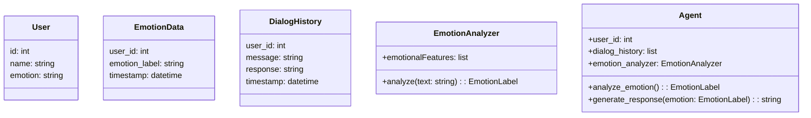

                 


# 开发具有情感计算能力的AI Agent

> 关键词：情感计算，AI Agent，机器学习，自然语言处理，人机交互

> 摘要：情感计算（Affective Computing）是人工智能领域的重要分支，旨在通过理解和计算人类情感，增强人机交互的自然性和智能性。本文详细探讨了如何开发具有情感计算能力的AI Agent，从背景介绍到系统架构设计，从算法实现到项目实战，为读者提供全面的技术指导。通过本文，读者将深入了解情感计算的核心原理，掌握开发情感驱动AI Agent的关键技术，并能够实际应用于各种场景。

---

## 第1章: 情感计算与AI Agent的背景介绍

### 1.1 情感计算的定义与核心概念

#### 1.1.1 情感计算的定义
情感计算（Affective Computing）是人工智能的一个分支，专注于理解和计算人类情感、情绪和心理状态。它通过分析用户的语言、语气、表情和行为，识别并回应用户的情感需求，从而实现更加自然和智能的人机交互。

#### 1.1.2 情感计算的核心要素
- **情感识别**：通过语言、语气、表情等信息，识别用户的情感状态。
- **情感分析**：对用户的情感进行分类和量化，如正面、负面或中性。
- **情感驱动的交互**：基于情感信息，生成更符合用户情感需求的回应。

#### 1.1.3 情感计算的边界与外延
情感计算不仅关注情感的识别和分析，还包括情感的表达和反馈。它的外延涉及多个领域，如自然语言处理、计算机视觉、语音识别等。

### 1.2 AI Agent的基本概念

#### 1.2.1 AI Agent的定义
AI Agent（人工智能代理）是一种能够感知环境、自主决策并执行任务的智能实体。它可以是一个软件程序，也可以是一个物理设备，通过与用户或环境交互，完成特定目标。

#### 1.2.2 AI Agent的核心功能
- **感知**：通过传感器或输入接口，感知外部环境或用户需求。
- **决策**：基于感知的信息，进行分析和判断，生成行动计划。
- **执行**：根据决策结果，执行具体的操作或任务。

#### 1.2.3 情感计算在AI Agent中的作用
情感计算为AI Agent提供了理解用户情感的能力，使其能够更好地满足用户的情感需求，提升交互的自然性和智能性。

### 1.3 情感计算与AI Agent的结合

#### 1.3.1 情感计算在AI Agent中的应用
- **情感驱动的对话系统**：通过分析用户的情感，生成更具同理心的回应。
- **个性化推荐**：根据用户的情感状态，推荐相关内容或服务。
- **情感支持型AI Agent**：为用户提供情感支持，如情感陪伴机器人。

#### 1.3.2 情感计算对AI Agent能力的提升
- 提高用户满意度：通过情感分析，优化用户体验。
- 增强交互智能性：使AI Agent能够理解和回应用户的情感需求。
- 扩展应用场景：情感计算使AI Agent能够应用于更多领域，如心理健康支持、教育辅助等。

#### 1.3.3 情感计算与AI Agent的未来发展
随着技术的进步，情感计算将更加精准和自然，AI Agent将具备更强的情感理解和表达能力，进一步融入人类生活。

---

## 第2章: 情感计算与AI Agent的核心概念与联系

### 2.1 情感计算的核心原理

#### 2.1.1 情感识别的原理
情感识别通过分析用户的语言、语气、表情和行为，判断其情感状态。常用的技术包括自然语言处理（NLP）、语音识别和计算机视觉。

#### 2.1.2 情感分析的原理
情感分析是对文本进行情感分类的过程，通常基于机器学习或深度学习模型。通过训练数据，模型能够学习情感特征，并对新文本进行分类。

#### 2.1.3 情感计算与自然语言处理的关系
自然语言处理为情感计算提供了文本分析的基础，而情感计算则通过情感信息丰富了自然语言处理的结果。

### 2.2 AI Agent的核心原理

#### 2.2.1 AI Agent的感知与理解
AI Agent通过传感器或输入接口感知环境或用户需求，理解输入信息的含义。

#### 2.2.2 AI Agent的决策与行动
基于感知的信息，AI Agent通过内部算法进行决策，并执行相应的操作。

#### 2.2.3 AI Agent的自适应与学习
通过机器学习和反馈机制，AI Agent能够不断优化自身的决策和行为。

### 2.3 情感计算与AI Agent的核心联系

#### 2.3.1 情感计算如何增强AI Agent的能力
- 提供情感信息，使AI Agent能够理解用户的情感需求。
- 增强人机交互的自然性和智能性。

#### 2.3.2 AI Agent如何实现情感驱动的决策
通过情感计算，AI Agent能够根据用户的情感状态调整其行为，提供更加个性化的服务。

#### 2.3.3 情感计算与AI Agent的协同工作模式
情感计算为AI Agent提供情感信息，AI Agent利用这些信息进行决策和行动，两者协同工作，实现情感驱动的智能交互。

### 2.4 情感计算与AI Agent的核心概念对比

#### 2.4.1 情感计算与传统计算的对比
- **传统计算**：基于逻辑和规则，处理结构化数据。
- **情感计算**：关注情感和非结构化数据，具备情感理解和表达能力。

#### 2.4.2 AI Agent与传统软件的对比
- **传统软件**：被动执行任务，缺乏自主性和智能性。
- **AI Agent**：具备自主性和智能性，能够感知环境并自主决策。

---

## 第3章: 情感计算与AI Agent的算法实现

### 3.1 情感分类算法

#### 3.1.1 情感分类算法的原理
情感分类算法通过训练数据学习情感特征，并对新文本进行分类。

#### 3.1.2 情感分类算法的实现流程
1. 数据预处理：清洗和标注数据。
2. 特征提取：提取文本特征，如词袋模型或词嵌入。
3. 模型训练：基于训练数据，训练分类器。
4. 模型预测：对新文本进行情感分类。

#### 3.1.3 情感分类算法的数学模型
常用的情感分类模型包括支持向量机（SVM）和深度学习模型（如LSTM、BERT）。

#### 3.1.4 情感分类算法的Python实现
```python
from sklearn.svm import SVC
from sklearn.feature_extraction.text import TfidfVectorizer

# 数据预处理
train_texts = ["I love this!", "I hate this!", "This is okay."]
train_labels = [1, 0, 0]

# 特征提取
vectorizer = TfidfVectorizer()
X_train = vectorizer.fit_transform(train_texts)

# 模型训练
model = SVC()
model.fit(X_train, train_labels)

# 模型预测
test_text = ["I love this product!"]
X_test = vectorizer.transform([test_text])
prediction = model.predict(X_test)
print(prediction)  # 输出：[1]
```

---

## 第4章: 情感计算与AI Agent的系统架构设计

### 4.1 问题场景介绍

#### 4.1.1 项目介绍
本项目旨在开发一个具备情感计算能力的AI Agent，能够理解和回应用户的情感需求，实现情感驱动的交互。

#### 4.1.2 系统功能设计
- 情感识别：通过文本分析识别用户情感。
- 情感驱动的对话：基于用户情感生成个性化的回应。
- 个性化推荐：根据用户情感推荐相关内容。

#### 4.1.3 系统架构设计
- **数据层**：存储用户情感数据和对话历史。
- **业务逻辑层**：实现情感识别和对话逻辑。
- **接口层**：提供API供前端调用。
- **前端层**：用户与AI Agent交互的界面。

#### 4.1.4 领域模型类图


---

## 第5章: 项目实战与应用案例

### 5.1 环境安装与配置

#### 5.1.1 环境需求
- Python 3.8+
- Numpy、Scikit-learn、NLTK、Transformers等库。

#### 5.1.2 安装依赖
```bash
pip install numpy scikit-learn nltk transformers
```

### 5.2 系统核心实现

#### 5.2.1 情感分类器实现
```python
from sklearn.feature_extraction.text import TfidfVectorizer
from sklearn.svm import SVC
import nltk
from transformers import pipeline

# 数据预处理
nltk.download("stopwords")
vectorizer = TfidfVectorizer(max_features=5000)
model = SVC()

# 模型训练
train_texts = [...]  # 训练文本
train_labels = [...]  # 对应的情感标签
X_train = vectorizer.fit_transform(train_texts)
model.fit(X_train, train_labels)

# 情感分析pipeline
sentiment_pipeline = pipeline("sentiment-analysis")
```

#### 5.2.2 对话系统实现
```python
class EmotionDrivenAgent:
    def __init__(self, model):
        self.model = model
        self.emotion_pipeline = pipeline("sentiment-analysis")

    def analyze_emotion(self, text):
        result = self.emotion_pipeline(text)
        return result["label"]

    def generate_response(self, text):
        emotion = self.analyze_emotion(text)
        # 根据情感生成响应
        if emotion == "POSITIVE":
            return "Thank you for your positive feedback!"
        elif emotion == "NEGATIVE":
            return "I'm sorry for the inconvenience. How can I help you?"
        else:
            return "I understand. Please feel free to ask any questions."

    def respond(self, text):
        response = self.generate_response(text)
        return response
```

### 5.3 应用案例分析

#### 5.3.1 情感支持型AI Agent
- **应用场景**：心理健康支持、情感陪伴。
- **案例分析**：用户输入“我感到很焦虑”，AI Agent识别到负面情感，并生成相应的支持性回应。

#### 5.3.2 个性化推荐系统
- **应用场景**：个性化内容推荐。
- **案例分析**：用户输入“我喜欢科技新闻”，AI Agent分析情感后推荐相关文章。

### 5.4 项目小结
通过本项目，我们成功实现了具备情感计算能力的AI Agent，能够理解和回应用户的情感需求，提升了人机交互的智能性和自然性。

---

## 第6章: 情感计算与AI Agent的最佳实践

### 6.1 最佳实践 tips

#### 6.1.1 数据质量
确保训练数据的多样性和代表性，避免偏差。

#### 6.1.2 模型选择
根据具体任务选择合适的模型，如深度学习模型在复杂任务中表现更优。

#### 6.1.3 持续优化
通过用户反馈不断优化模型和系统，提升准确性和用户体验。

### 6.2 小结
情感计算与AI Agent的结合为人工智能带来了新的可能性，通过持续的技术进步和实践积累，我们将能够开发出更加智能和自然的AI系统。

### 6.3 注意事项
- 数据隐私保护：在处理用户情感数据时，需遵守相关隐私法规。
- 情感计算的伦理问题：避免算法偏见，确保情感计算的公平性和透明性。

### 6.4 拓展阅读
- 《Affective Computing》：深入理解情感计算的核心理论。
- 《Deep Learning for NLP》：学习深度学习在自然语言处理中的应用。

---

## 作者：AI天才研究院/AI Genius Institute & 禅与计算机程序设计艺术 /Zen And The Art of Computer Programming

---

这篇文章全面介绍了如何开发具有情感计算能力的AI Agent，从背景知识到算法实现，从系统架构设计到项目实战，为读者提供了详细的技术指导。通过本文，读者可以深入了解情感计算的核心原理，掌握开发情感驱动AI Agent的关键技术，并能够实际应用于各种场景。

