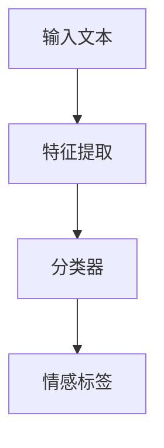
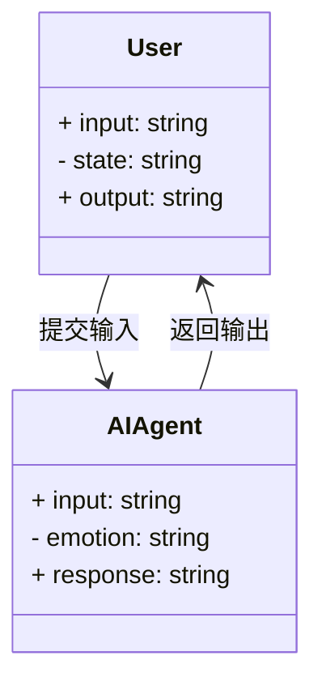
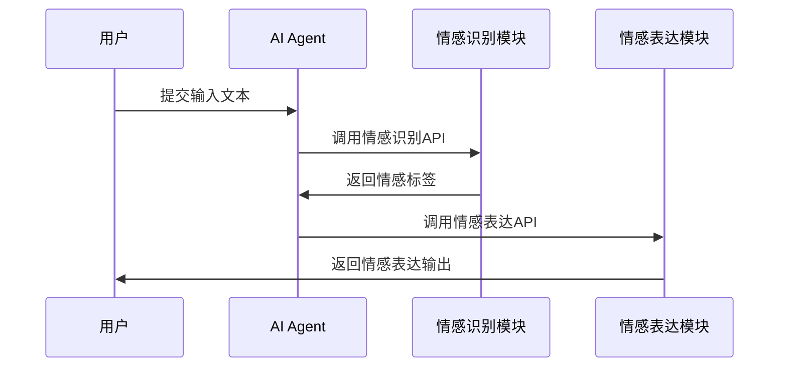

                 


```markdown
# 开发具有情感识别与表达能力的AI Agent

> 关键词：AI Agent，情感识别，情感表达，自然语言处理，机器学习，深度学习

> 摘要：本文详细探讨了开发具有情感识别与表达能力的AI Agent的关键技术，从背景到核心概念，再到算法原理、系统架构、项目实战和最佳实践，为开发者提供全面的指导。

---

## 第一章: 情感识别与表达的背景与问题描述

### 1.1 情感识别与表达的背景
- 人工智能和情感计算的发展历程
- 情感识别在AI Agent中的重要性
- 当前技术的挑战与机遇

### 1.2 情感识别与表达的核心问题
- 情感识别的基本概念
- 情感表达的核心问题
- 情感识别与表达的边界与外延

### 1.3 问题解决与技术路线
- 情感识别的主要技术路线
- 情感表达的实现方法
- 综合解决方案

---

## 第二章: 情感识别的核心概念与原理

### 2.1 情感识别的基本原理
- 基于特征的识别方法
- 基于深度学习的识别方法
- 情感识别的关键特征对比

### 2.2 情感识别的特征分析
- 文本特征分析
- 声音特征分析
- 面部表情特征分析

### 2.3 情感识别的ER实体关系图
```mermaid
er
actor: User
agent: AI Agent
emotion_feature: 情感特征
emotion_label: 情感标签
```

---

## 第三章: 情感表达的核心概念与实现

### 3.1 情感表达的基本原理
- 情感表达的生成机制
- 情感表达的多样性
- 情感表达的关键要素

### 3.2 情感表达的实现方法
- 文本生成方法
- 声音合成方法
- 面部表情生成方法

### 3.3 情感表达的特征对比
- 文本表达特征对比
- 声音表达特征对比
- 面部表情特征对比

### 3.4 情感表达的ER实体关系图
```mermaid
er
actor: User
agent: AI Agent
emotion_feature: 情感特征
emotion_output: 情感表达输出
```

---

## 第四章: 情感识别与表达的算法原理

### 4.1 情感识别的算法原理
- 基于传统机器学习的情感识别
- 基于深度学习的情感识别
- 情感识别的典型算法流程



### 4.2 情感分类的数学模型
- 传统机器学习模型（如SVM）
- 深度学习模型（如BERT）

数学公式：
- 情感分类的损失函数：$$L = -\sum_{i=1}^{n} y_i \log(p_i) + (1 - y_i) \log(1 - p_i)$$
- 预测概率计算：$$p(y|X) = \frac{\exp(w \cdot X)}{1 + \exp(w \cdot X)}$$

### 4.3 情感表达的生成算法
- 基于GPT的情感生成
- 基于TTS的情感语音合成

数学公式：
- 生成模型的损失函数：$$\mathcal{L} = \mathcal{L_{KL}} + \mathcal{L_{rec}}$$

---

## 第五章: 情感识别与表达的系统架构设计

### 5.1 系统功能设计
- 用户输入模块
- 情感识别模块
- 情感表达模块



### 5.2 系统架构设计


### 5.3 接口设计与交互


---

## 第六章: 项目实战与实现

### 6.1 环境安装与配置
- Python 3.8+
- 深度学习框架（如TensorFlow或PyTorch）
- Numpy和Pandas
- 语言模型（如BERT）

### 6.2 核心代码实现

```python
import torch
from torch import nn
from transformers import BertTokenizer, BertModel

class EmotionClassifier(nn.Module):
    def __init__(self, num_classes=8):
        super(EmotionClassifier, self).__init__()
        self.bert = BertModel.from_pretrained('bert-base-uncased')
        self.dropout = nn.Dropout(0.1)
        self.classifier = nn.Linear(768, num_classes)

    def forward(self, input_ids, attention_mask):
        outputs = self.bert(input_ids=input_ids, attention_mask=attention_mask)
        pooled_output = outputs.last_hidden_state[:, 0, :]
        pooled_output = self.dropout(pooled_output)
        return self.classifier(pooled_output)
```

### 6.3 案例分析与结果展示
- 文本输入：用户输入“我感到非常生气”
- 情感识别：模型输出标签“生气”
- 情感表达：生成响应“我理解您现在很生气，我会尽力帮助您缓解这种情绪。”

### 6.4 代码解读与分析
- 使用BERT模型进行情感分类
- 前向传播过程：文本编码、特征提取、分类预测

---

## 第七章: 最佳实践与开发经验分享

### 7.1 开发经验总结
- 数据质量的重要性
- 模型调参的技巧
- 情感表达的多样性

### 7.2 注意事项
- 数据隐私保护
- 情感识别的准确性
- 情感表达的自然性

### 7.3 拓展阅读
- 情感计算相关论文
- 最新情感识别技术
- AI Agent的未来发展方向

---

## 作者

作者：AI天才研究院 & 禅与计算机程序设计艺术
```

